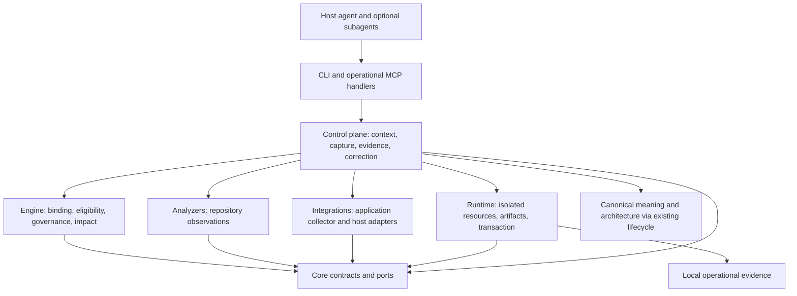

# Design: one conceptual control plane, evidence through the whole change

Proposed architecture. Read [VISION.md](VISION.md) first. This document plays the role of a shared OpenSpec-style design artifact: context, goals/non-goals, choices, alternatives, contracts, risks, migration and unresolved implementation questions. Individual proposal files contain their own design and tasks.

## Context and architectural fault lines

The accepted model already asks for isolated application evidence and explicitly says that generic browser authentication and provisioning remain unrealized. `KnowledgeValidatorRun` in `packages/control-plane/src/knowledge/validators.ts` executes a tracked, pinned repository-node validator in an isolated, read-only, network-denied process. Its small satisfied/violated/unknown protocol is useful for repository predicates; it does not establish a browser session's identity or the application state a screenshot depicts.

`RepositoryChangeLifecycleService` and `executeCompiledRepositoryChange` own the supported repository mutation/recovery route. Both restrict it to one mutation packet. `executePacketPlan` is a separate internal kernel; its existence does not supply a public multi-agent orchestration service. Its current public-adjacent caller is upgrade execution, while the default upgrade produces no candidate.

`createBuiltRunHostPort` is a weaker route: it reconstructs currentness largely from saved state plus HEAD, reports features optimistically and uses a limited parser-oriented reconciliation. This design cannot use its `completed` result as admission or completion proof. Its repair is necessary before elevating the wrapper's assurance, independently of whether host dispatch becomes a product feature.

The generated contract/schema and historical-spec checks are another seam. `PROJECTOR_SPEC` still supplies historical contract input and release traceability; runtime schemas are generated from the domain declarations. Updating prose alone cannot deliver a contract. Conversely, the historical document's self-description as authoritative does not supersede the current typed model or repository instructions.

## Goals and non-goals

Goals: bind behavioral claims to a real observed state; preserve useful work across session loss and independent agents; make disagreements actionable at the right owner; evaluate changes over time; keep every new mechanism native and removable if its cost exceeds its benefit.

Non-goals: a replacement coding host, unrestricted execution graph DSL, a hosted orchestrator, automatic policy promotion, arbitrary remote mutations, universal semantic equivalence, an LLM training system, or a mandatory new workflow database. General partial-commit multi-packet execution remains a future capability, not silently removed from historical design; this assimilation does not need it to preserve the donor value.

## Ownership and dependency direction

No new package is required. Add modules only at an existing responsibility boundary. The engine decides eligibility from values passed through ports; it never starts a browser. Integrations implement domain collection without importing control-plane internals. Runtime owns processes and files without deciding whether a requirement is met. The control plane composes the result and retains the sole accepted mutation route.

The model specifies what must hold. The collector records what happened. A pinned validator interprets observations under a declared contract. The engine checks freshness, provenance and policy. An accepted decision authorizes a new constraint. These owners must not become a circular self-confirmation loop.

## D1 -- Separate application evidence from repository validation

A run uses a concrete, versioned application adapter. Its declarative profile names setup, fixture inputs, the scenario/test controller, capability requirements, resource limits, collection, cleanup and evidence limits. It uses existing tools behind that adapter; no universal provisioning language is required.

Retain the current repository-node validator contract. An application requiring a server and browser cannot silently change `network: deny` into host network access. The strong collection lane requires a private application environment with proven process/filesystem/network boundaries. App and test browser may communicate inside that environment; neither obtains host-network access. This is an explicit new capability profile with a probe and decision, not an inference from browser-context isolation. If the platform cannot demonstrate it, report unavailable for that strong lane.

Existing host browser tools may still supply supporting observations when authorized. Label the weaker identity/isolation and independence properties. They cannot be upgraded to strong evidence by attaching a screenshot hash or an agent assertion. A manual observation does not gain a controlled-execution certificate.

The selected first workload is Psychord's existing deterministic C-major triad Recognition scenario through its web internal runtime. The selected optional execution profile uses Docker Engine Linux containers, with separate app and immutable Playwright-controller containers supervised by trusted Projector runtime. [APPLICATION-PILOT.md](APPLICATION-PILOT.md) pins the source evidence, exact scope, container/network/process separation, collector trust root and negative controls. A deterministic fixture can establish the protocol first, but cannot stand in for this application acceptance. Audio/device/learning outcomes remain outside this initial DOM/runtime-evidence claim and retain their future obligations.

Alternatives rejected: an all-purpose environment manager before one workload; running arbitrary repository commands as 'observation'; browser contexts treated as OS isolation; accepting a user-supplied artifact as an authenticated run. These approaches obscure either cost or trust.

## D2 -- Store observations once; derive claims separately

Proposed internal data responsibilities (names are design names, not implemented API promises):

| Value | Required content | Owner and persistence |
|---|---|---|
| Application run request | Scenario IDs and semantic hashes, context/binding, adapter profile/version, fixture and build inputs, resource policy, required oracle and timeout | Control plane; immutable runtime request |
| Run manifest | Run/attempt identity, actual source/build digest including dirty content, toolchain/adapter/test-controller hashes, start/end, private endpoint identity, fixture/environment identity, observed capabilities, setup/cleanup outcomes | Runtime and collector; local artifact plus authenticated manifest |
| Observation artifact | Content hash, type/size, locator, collection method, run association, redaction/retention and causal origin | Runtime artifact ownership; no raw secrets in canonical records |
| Validation result | Existing evidence lane/assurance/independence metadata plus refs to manifest/artifacts and concrete assertions | Validator output admitted by control plane |
| Eligibility result | Current/stale/unavailable, passed/failed/unknown, supported claim scope, blind spots, dependencies and reasons | Engine derivation; recomputed as needed |

Reuse `Evidence`, `ValidationResult`, `StateBinding`, `CompletionContract`, derivation inputs and artifact references. Add a narrowly typed run binding where those contracts cannot express the new responsibility; do not create a second pass/fail authority. A result has separate currentness, behavioral outcome and assurance dimensions. A valid old failure stays a historical failure after becoming stale. A new pass does not erase that earlier observation.

The collector must bind the controller bytes, actual launched application/build, configuration, fixture data, capability evidence and artifacts. The trusted host supervisor creates and inspects the actual engine objects, imports controller output over its own channel, and writes/authenticates the manifest outside both candidate containers. App code cannot write controller output, its process state, the manifest store or authentication material. Merely signing app-supplied hashes is insufficient. A timestamp, URL or HEAD commit alone is insufficient. Pin relevant loaded inputs; if a controller can read all repository content, its validity scope is correspondingly broad until a narrower access contract exists. Do not claim precise invalidation merely by listing guessed dependencies.

Eligibility uses the observed run's dependency closure, scenario/validator contracts and declared expiry/event conditions. Missing artifacts, toolchain or configuration changes, fixture changes and changed empty-query membership can all invalidate a claim. An unrelated root change can preserve it when the closed dependency evidence supports that decision. Structural equality cannot skip behavioral checks whose relevant inputs changed.

A process crash before evidence finalization leaves an interrupted run, retains bounded diagnostics, and cleans only resources authenticated as belonging to that run. Crashing after finalization may publish the existing manifest idempotently. Repeating a command cannot pretend the old live application still exists. An application run is never an undoable external business transaction.

## D3 -- Bind contributions before joining exact edits

The first delivery uses host-native agents for parallel investigation and isolated candidate preparation. It does not approve unknown future code. Each contribution carries:

- a content-derived work-contract ID, objective and expected result schema;
- the saved Projector context ID plus exact value/query bindings and disclosed unknowns;
- producer/attempt identity, actual input/result hashes and predecessor-result references;
- read/effect classification, candidate edit paths, semantic owners and unresolved conflicts;
- evidence provenance, validation claims and a complete/partial/failed result status that describes the contribution only.

Before capture these are host-owned files, with no Projector completion or mutation authority. A new contribution cannot be inserted into an immutable existing capture. The current semantic-change identity depends on the exact proposal and bound state. Therefore capture imports the frozen contribution bytes, checks their schemas/bindings and joins them into one exact proposal. Immutable evidence attachments are stored under the resulting existing lifecycle identity. A changed contribution or joined edit requires a new capture and approval; an explicit predecessor reference can preserve lineage without making the old capture mutable.

The versioned strict proposal must include a canonical contribution binding: hashes of the complete versioned envelopes (including producer/provenance, required/optional status, unresolved conditions and omissions), their work/input/result/predecessor hashes and the join-contract/result digest. That binding contributes to `proposalHash`, the existing intent/SemanticChange identity derivation, and an explicit approved-plan input-evidence digest. Store attachments alone are insufficient. Capture freezes the referenced bytes before computing these identities. Plan, approve and new apply reauthenticate every required attachment and manifest against that bound digest. Equal edits and equal repository state with different admitted evidence must produce a different capture/plan; an old approval must be unusable. Old proposal profiles retain their existing hash semantics.

Recovery follows the already authenticated approval/attempt/journal/prepared-success chain. A missing contribution artifact cannot by itself prevent safe rollback or idempotent publication of an already authenticated historical committed result. Recovery cannot fabricate missing prepared-success proof or make fresh effects while required evidence is absent. Report reduced current evidence availability separately from the historical transaction's state; revalidate restored evidence before a new apply or current completion claim.

This resolves the identity cycle: a work-contract/content identity is not a second SemanticChange identity, and there is no managed pre-proposal workflow store. The host can resume pre-capture preparation from its files and a reconciled saved context. Projector's supported continuation view begins with saved context or an actual capture, and reports which evidence is unavailable if pre-capture files were not retained.

The join checks required results, schemas, predecessor hashes, semantic ownership, write conflicts, current query/value dependencies and applicable governing meaning. It does not equate disjoint paths with independence: two files may implement one API or contradict the same scenario. Unresolved contract conflicts require one coordinator decision and recapture. A model can assist that decision; its merged prose is not the authenticated join proof.

Candidate edits are still proposed bytes. Their tests and worker success reports are supporting evidence until the combined diff is independently observed and validated through the existing lifecycle. Mutation remains serial under its writer lease. Do not route joined work through `executePacketPlan` just because it accepts packet-shaped inputs.

## D4 -- Continuation is a current view, not a completion flag

Derive a bounded continuation from the context, captures, approvals, attempts, journals, admitted contribution attachments, evidence and current observations. Show accepted meaning, usable results, invalidated inputs, incomplete/recovery-required mutation, remaining relevant obligations and the next supported action. Include total/included/omitted counts and direct expansion routes.

Recovery of a transaction precedes new mutation. A host restart, agent label or fresh model does not reset authority. A recorded 'done' flag cannot remove a requirement. Stale pre-capture reasoning calls for renewed inspection; committed-but-unpublished mutation calls for idempotent publication; a behavioral failure calls for correction. They are different states.

Sequential operation is the default. Parallelize only materially independent preparation with an explicit join; cap retries and resource use. The host can choose role names and models. No obligatory analyst/critic/reviewer roster is compiled into product behavior.

## D5 -- Correct the owner implicated by evidence

Extend existing Planning Surprises, concerns, completion questions and repair routes with failure evidence references. A derived diagnosis states the discrepancy, affected accepted obligation, causal hypothesis, alternative explanations, discriminating check and candidate correction owner. Hypotheses remain inferred.

Examples of different owners:

| Observed discrepancy | Candidate cause | Appropriate next action |
|---|---|---|
| Cancellation fails only after retries | Missing transition behavior or contract change | Exercise both cases; revise implementation or accepted meaning as justified |
| Browser check never reaches application | Setup/capability failure | Fix adapter/environment; keep behavior unknown |
| Two agents choose incompatible payloads | Missing shared contract or stale contribution | Resolve contract, refresh affected contributions, recapture |
| Repeated fixes copy one workaround | Faulty tool/API usage, template or abstraction | Inspect producer, compare conventional API, correct the producer if it is causal |
| A lens rejects another valid implementation | Overbroad scope or faulty architectural premise | Revise/retire the lens through accepted decision; preserve historical reason |

Do not make 'root cause' a mandatory grand investigation for every typo. Use the smallest discriminating check whose outcome changes the repair. Do not discard a valid patch merely because an agent produced it. Do not automatically add a regression guard: require a concrete active producer, observed recurrence, or a specific security/data-loss/release invariant, with repository-wide guards separately authorized.

A selected rule must carry scope, independent counterexamples, intentional variants, costs, causal origin and reconsideration conditions through the existing concern/decision/authority products. Shadow results measure where the proposed rule fails. Existing code frequency, copies, same-lens output and metrics cannot authorize enforcement. A repair that removes needless policy is a successful outcome.

## D6 -- Measure future utility without making measurement a new bottleneck

Use current testkit/benchmark/reporting seams. Keep live-model trials opt-in and budgeted. Register task sequence, initial repository, models/tools, budget, grading contract and perturbations before an evaluated run sees them. Hold later requirements back from the coding agent, not from the evaluator. After revealing a requirement, make both arms work from their own accumulated state.

Compare a capable ordinary agent with Projector under matched conditions. Include both task success and preservation of earlier obligations. Record setup, retries, evidence collection, model/context use, deterministic time, human review and semantic maintenance. Missing prices or labor measurements are unavailable components, never zero cost. Report counts and paired differences; repeated tasks in one repository are not independent samples.

Paired perturbations are local semantic probes, not evidence of a new model-training theory. Change a condition that should change the answer (retry failure versus deliberate cancellation) and one that should not (unrelated docs or renaming with preserved identity). Freeze grading before inspecting candidate output. A test written from the same mistaken assumption is not an independent lane.

Do not collapse correctness, evolution effort and code diagnostics into a universal 'slop score'. Treat metric versions, extraction failures, model judgements and endogenous traces explicitly. A failed later task is an outcome; its cause needs a replay/intervention or remains a hypothesis. Use ablations only for decisions that the basic comparison cannot resolve.

## Storage and migration

Accepted semantic revisions remain fine-grained canonical records, with stable IDs and retained origin. No report or spec patch in this campaign changes those records. [CANONICAL-DELTAS.md](CANONICAL-DELTAS.md) describes proposed acceptance transactions.

Operational run manifests and contribution attachments live under existing Projector runtime ownership, outside canonical snapshots. Artifact indexes are rebuildable; historical observations are not reconstructible from current code. Preserve that distinction on clone, export, deletion and expiry. Never migrate old screenshots or booleans into authenticated passes. Old lifecycle records stay readable; missing new evidence yields legacy/unavailable assurance, and existing approvals are never widened by migration.

Version added contracts and runtime readers. Test old capture reading and rejected mismatched versions. Write new attachments atomically before referencing them; refuse partial or hash-mismatched attachments. Do not regenerate old plan hashes, overwrite approval identity, or reinterpret old certificates under a stronger policy. A typed runtime-store version increment must specify when re-capture is necessary.

Historical `PROJECTOR_SPEC` receives the concrete unapplied patch in this package. It makes its authority status honest, incorporates the new behavior at its owning modules, and leaves historical delivery plans intact as history. Implementation must then update domain types, generated runtime schemas, checks and public adapters together. Generated code is not hand-edited and historical plans are not revived.

## Main risks and resolving experiments

| Risk | First discriminating experiment | Consequence if it fails |
|---|---|---|
| Collector cannot prove which build ran | Run stale build, dirty-source edit and substituted artifact trials | Keep supporting/unavailable lane; redesign collection before strong claims |
| Private browser/app boundary cannot be enforced on a supported platform | Capability probe and escape/cleanup fixture with that platform's actual processes | Platform-specific unavailable result; no host-network fallback |
| Contribution bookkeeping costs more than rereading | Two-agent contribution/join and fresh-session comparison including preparation | Simplify to context-bound attachments and manual join; do not build scheduler |
| Failure feedback creates policy debt | Correct a reproduced failure and an intentional variant; count added/removed obligations | Keep advisory route or retire the proposed rule |
| Better tests merely encode evaluator's premise | Held-out behavioral pair and independent controller review | Lower assurance and replace oracle before evaluating benefit |
| Architecture still grows despite passing current tasks | Later-change matched trajectory with semantic maintenance included | Reconsider the responsible mechanism; do not hide loss in an aggregate score |

No external technology choice or claimed economic advantage is resolved merely by this design. Selected donor mechanisms, proposed proofs and executed design checks are separated in [EVIDENCE.md](EVIDENCE.md).
