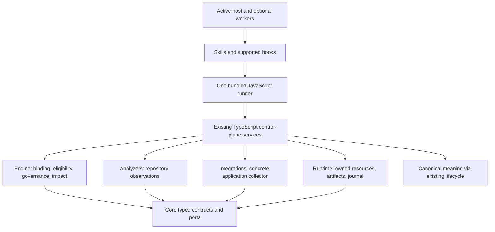

# Design: one conceptual control plane through the active host

Proposed design, revised 2026-09-10. The [wrap-up plan](../../.temp/projector-wrap-up-plan-2026-09-09.md) controls execution. This document defines the assimilation's ownership, evidence, continuation, recovery and validation choices. It is planning evidence, not canonical acceptance or a delivered capability.

## Receiving architecture and selected interface

Projector already has typed meaning, scoped context/reconciliation, executable lenses, pinned validator sources, exact change review, journals and recovery. The public repository lifecycle currently accepts one mutation packet. An exported multi-packet coordinator or model provider does not establish a working public scheduler; the actual caller/consumer matters.

Use one bundled JavaScript runner calling existing TypeScript services directly. Skills express host work and concise procedures; hooks provide supported early readiness checks; every operation also enforces readiness. Retire obsolete MCP registrations, standalone CLI delivery, wrapper chains and mandatory WSL sandbox/bridge machinery in their owning changes after moving real consumers. Preserve required data-upgrade/recovery compatibility and accepted rationale, not dead API names.

The active host owns reasoning, tool choice, optional delegation and process execution under its configured permissions. Projector retains legitimate change authority, exact approved bytes, source/state/version checks, pinned validator identity, bounded output/time, cancellation and journaled recovery. These checks establish their specific integrity properties; they do not claim process confinement.

No new package is required. The engine evaluates supplied facts without starting a browser. Runtime owns files/processes without deciding product meaning. The collector records observations; existing evidence/validation/completion consumers interpret the declared claim. Accepted architecture changes use concerns, decisions, authorities and their real consequences.

## D1 -- Concrete host-controlled application evidence

The first collector targets the actual Psychord Omega C4/save/reload/archive/replay path in [APPLICATION-PILOT.md](APPLICATION-PILOT.md). Its existing concepts supply meaning; a narrow scenario must be accepted through that repository's canonical lifecycle before implementation. Existing fake-port tests are valuable but do not establish DOM, actual storage, reload or browser input behavior.

The host prepares an identifiable source/build snapshot, freezes the built bytes by custody, starts an owned Node static server bound to loopback on an allocated port, and starts a separately pinned Playwright controller/browser process with fresh context/profile. The controller uses actual UI input. A run nonce, exact endpoint and hashes of served/loaded bytes bind the page to the snapshot. The host retains controller artifacts outside the served app tree, records source/build/tool/controller/configuration identity, and bounds output, runtime and cleanup.

This is a trusted workspace/host model. Custody means the runner retains and checks the chosen bytes; it is not an immutable mount. Separate controller process and browser state reduce accidental coupling, not same-user attack power. No protection from a malicious application/host, network denial, invisible paths, read-only mounts or descendant containment is claimed. Report capabilities that the actual host cannot support as unavailable. Do not create a Docker, replacement sandbox or platform-escape project.

A useful minimal run record ties existing evidence/artifact references to the scenario, tested snapshot, controller and observed setup/cleanup. Reuse `Evidence`, `ValidationResult`, `StateBinding`, `CompletionContract`, derivation inputs and current artifact storage. Add a narrowly typed field only when the real collector/consumer cannot express a necessary fact. Do not create a universal environment-profile language or another pass/fail authority.

Preserve these dimensions separately:

| Fact | Meaning |
|---|---|
| Setup/run outcome | Started, failed, interrupted, completed or unavailable under actual host capabilities |
| Observed behavior | The concrete assertions passed, failed or remain unknown |
| Currentness | Required source/build/controller/configuration/scenario dependencies remain valid or changed |
| Evidence integrity | Stored bytes and their recorded association remain intact under the trusted-host assumption |
| Claim limits | Browser DOM/storage/trace evidence does not prove acoustic output, physical MIDI, latency or learning |

A screenshot, HEAD hash, timestamp or plausible URL alone cannot establish which build ran. If a collector's readable input cone is broad, bind that broader dependency population or report uncertainty. A relevant uncommitted edit, changed empty-query membership, modified controller or different served asset invalidates reuse; an unrelated change may preserve it when the actual dependency proof permits.

## D2 -- Host preparation, one coordinator, one exact proposal

Use existing host agents only when independent work is useful. Give each a bounded objective, relevant accepted context, ownership and a concrete result. The host may retain notes or candidate edits for continuation. These are advisory working material, not approval-bearing evidence and not a new Projector workflow store.

One coordinator reconciles the saved context, reviews governing meaning, resolves shared contracts/overlapping edits and assembles the final exact proposal. Disjoint files do not prove semantic independence. Missing information that prevents a correct proposal stays a blocker or explicit unresolved condition; worker completion does not settle it. Submit the exact result through existing capture/plan/approval/apply/recovery services exposed by the shared runner. A changed final proposal or bound dependency follows the existing recapture/currentness rules.

The contribution envelope, importer and attachment protocol are rejected. Existing exact proposal/validator binding and authenticated transaction recovery supply the safeguards needed by this workflow. Changing a worker note grants no authority; changing approved implementation or required validator inputs must fail the relevant identity/currentness checks. Missing notes must not prevent safe historical recovery. Tasks 4, 7A and 8.4 verify those existing guarantees through the retained runner.

## D3 -- Durable representation and continuation from existing state

Reuse saved contexts, representation artifacts, captures, approvals, attempts, journals and current observations. Improve their bounded human/agent presentation where a real fresh-session task exposes a gap. Show the relevant accepted meaning, why selected work remains current, changed/unknown dependencies, incomplete transaction state, remaining obligations and supported next action. Preserve omission counts and expansion routes.

Ordinary conceptual inspection needs no invented approval. Plan-bound instruction inspection must work before approval to support review. Actual execution requires exact plan/revision/capsule/kernel/text association, the appropriate authority, live dependency checks and actual delivery to its intended consumer. Report integrity, freshness, semantic fidelity, authorization and delivery separately. Delivery does not establish understanding or compliance.

The legacy built host-dispatch path drops instructions, assumes capabilities and refreshes only HEAD; it must not be carried forward as a completion proof. Trace a real consumer. If none needs dispatch, retire the path while preserving active-host purpose. If one does, repair its actual delivery, currentness, capability observation and exact path handling through the existing services. Do not repair unused machinery merely to retain an obsolete CLI mode.

Recover an incomplete controlled transaction before new mutation. A committed attempt with authenticated prepared-success evidence is finalized once; a note saying unfinished cannot rerun it. Missing advisory notes cannot block safe rollback or legitimate historical publication. Missing prepared-success proof cannot be fabricated. Historical success and current requirement fulfillment remain different facts.

## D4 -- Exercise scoped correction with the host

Use the deterministic failure categories and evidence already present in observations: setup/capability failure, stale or missing evidence, failed assertion, parser/validator failure, recovery required and relevant planning surprise. The host investigates the material discrepancy, proposes a correction to the right owner, executes the accepted change, validates and reconciles. A suggested repair route alone is not closure.

| Observed case | Discriminating work and possible owner |
|---|---|
| Saved success appears after storage rejects a write | Exercise the real failed write and inspect UI/storage; repair application persistence feedback |
| An old page passes the assertions | Compare actual served bytes/endpoint; repair collection identity and retain failed evidence |
| Replay creates player notes | Compare captured trace, replay indicators and recent-playing state; repair provenance boundary |
| Contributors choose incompatible contracts | Reconcile accepted meaning and current inputs; coordinator revises the final proposal |
| A valid implementation fails an architectural predicate | Check independent behavior and intended scope; revise or retire the faulty rule through existing authority |

Use the smallest check that can change the repair decision. No classifier service, incident queue or automatic policy-promotion loop is needed. Promote a reusable rule only for a concrete recurring producer, observed recurrence or specific safety invariant; inspect intentional variants and counterevidence. Broad recurrence guards still need their applicable authorization. Deleting needless policy can be the correct repair.

## D5 -- Later-change survival and actual costs

Extend relevant existing tests and reports with real later-change/currentness cases: a dirty dependency at unchanged HEAD, an unrelated edit, a new matching consumer, a modified controller, a fresh session after interrupted publication, and a subsequent application change that must preserve earlier behavior. Paired perturbations must have independently correct expectations; merely producing different outputs proves nothing.

Record observed deterministic time, context/artifact size, retries, human repair and available model/tool usage while exercising these paths. Unknown prices or missing labor data remain unknown. There is no required trajectory driver, three-chain benchmark, paid-model comparison or live-model economics release gate. Larger matched/held-out comparisons remain optional future research if a claim or unresolved design choice warrants them. Static code metrics are diagnostics, not a universal maintainability score.

## Storage, migration and specification retirement

Canonical records own accepted meaning throughout. Typed contracts own exact machine shapes and generate schemas. `PROJECTOR_SPEC` is transitional historical evidence and an input to existing acceptance inventories; it is not the source of contract-schema generation. Account for live consumers separately from inert provenance.

Follow the wrap-up plan's readiness and data-upgrade design: version checks before loaders and inside operations, verified external backups, staging, checksummed migration chains, recoverable publication, and preservation of intervening user edits. A new evidence field needs a persisted-format change only if the real owner requires it. Do not reinterpret old screenshots or receipts as stronger evidence, regenerate old approval identities or migrate historical success into current fulfillment.

Each owning implemented/verified change finishes with aligned canonical meaning, affected historical sections, generated contracts and capability descriptions in the same completion batch. Preparatory scenario acceptance can be a separate canonical-only verified batch. Rebase the exact unapplied patches when earlier changes overlap; never apply stale prose merely because an old apply check passed.

Accept useful meaning and migrate consumers in earlier coherent units. Task 2.1 reserves two actual continuation/currentness increments for implementation in the source-absent Task 10.8 candidate, using fresh sessions and the installed runner. Both new behavior and prior obligations must pass before retirement. Close P2 at 7A.6 and P4 at 10.9. Final cutover tests the exact staged tree, including deletions and new records; a HEAD clone cannot supply that pre-commit evidence. Revalidate affected self-development evidence when final dependencies change, commit only the tested/reviewed tree, and verify an actual final-commit clone. End with a concrete Psychord remake handoff. The full remake is outside this bounded plan.

## Risks and first checks

| Risk | Required next evidence |
|---|---|
| Wrong application instance or bytes | Wrong-build/endpoint control must fail before accepting a real scenario result |
| Test contamination or leaked resources | Fresh context/profile plus successful, failed and interrupted process/port cleanup; preserve unrelated resources |
| UI-only oracle misses provenance | Observe actual stored player trace and empty post-reload recent-playing state before/after replay; supplement with the existing controller tests |
| Trusted-host integrity is overstated | Capability/result wording must disclose same-user trust and absent OS/network confinement |
| New bookkeeping outweighs useful work | Exercise coordinator preparation and fresh continuation using existing artifacts; add machinery only for a demonstrated gap |
| Retirement drops purpose with machinery | Trace retained behavior to installed consumers and validate spec-absent self-development before final handoff |

No application run, implementation or economic result is claimed by this document. Evidence and source limits remain in [EVIDENCE.md](EVIDENCE.md).
