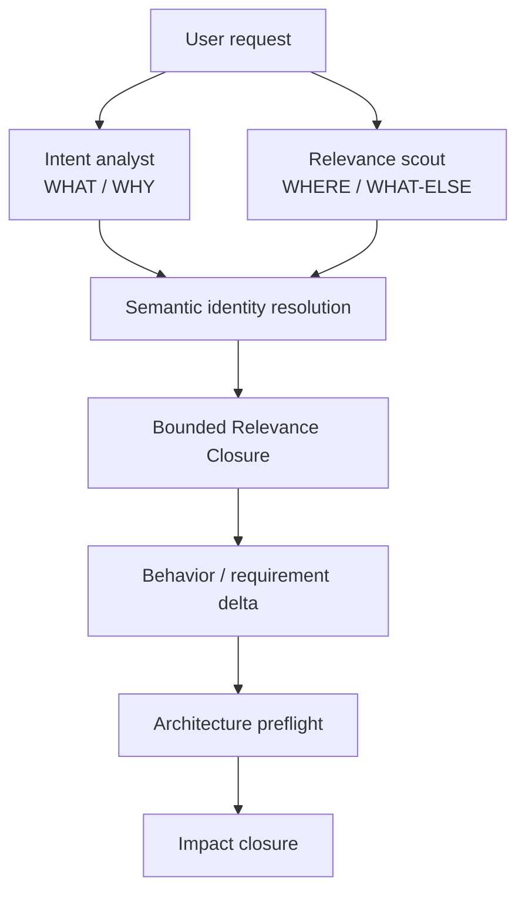

# Relevance and Change Cognition

## Purpose

Projector MUST prevent local reasoning from masquerading as globally coherent reasoning.

Before a request becomes a committed semantic delta, Projector finds existing canonical semantics and observed implementation relationships that might materially affect correct interpretation or planning. This **Relevance Closure** is distinct from the later **Impact Closure** used for invalidation and execution.

The core distinction is:

```text
Relevance discovery
  "What existing knowledge might change how I understand or plan this request?"

Impact closure
  "Given this known semantic delta, what is affected and what must be revalidated?"
```

Relevance discovery is allowed to be exploratory and confidence-ranked because its failure mode is omission or context waste. Impact closure controls mutation/completion and therefore remains conservative, observability-aware, and proof-bound.

Projector MUST NOT treat a top-N document/vector search as a Relevance Closure.

---

## WHAT / WHY, WHERE / WHAT-ELSE, and HOW

Change cognition keeps three questions separate:

1. **WHAT / WHY** — requested behavior, constraints, goals, non-goals, and externally meaningful outcomes.
2. **WHERE / WHAT-ELSE** — existing semantic identities, code regions, events, contracts, consumers, tests, decisions, invariants, and other non-obvious concerns that may be implicated.
3. **HOW** — architecture and implementation decisions.

Protecting WHAT from premature HOW MUST NOT require ignorance of WHERE.

For non-trivial changes Projector SHOULD evaluate WHAT/WHY and WHERE/WHAT-ELSE as parallel read-only tracks:



The Relevance Scout MAY inspect repository structure, semantic indexes, event/contract topology, tests, architecture decisions, and implementation bindings. It MUST NOT convert implementation precedent into behavioral intent or prematurely select a solution.

---

## Semantic identity resolution

Names are not identities.

Before Projector creates a durable Concept, Requirement, Behavioral Scenario, or other canonical semantic identity, it MUST resolve the requested meaning against existing canonical entities.

Resolution inputs SHOULD include:

- stable IDs and canonical keys.
- names and aliases.
- semantic similarity.
- existing typed Relations.
- ownership/boundary evidence.
- Projection Unit and Artifact bindings.
- event/contract producer-consumer topology.
- tests/verification bindings.
- relevant architecture decisions/invariants.
- historical/co-change evidence where informative.

Resolution outcomes are:

```text
reuse-existing
coordinated-modification
split-existing
merge-existing
replace-existing
create-new
no-durable-entity
unresolved
```

Creating a new durable identity requires an inspectable explanation of why existing identities do not already own the requested meaning.

Resolution MUST consider active entities plus relevant deprecated or superseded identities, tombstones, and lineage. This prevents renamed, replaced, or temporarily absent semantics from returning under a new ID. `split-existing`, `replace`, and merge-like outcomes create explicit lineage rather than relying on naming convention. `unresolved` MUST block automatic canonical identity creation in Govern/Autonomous modes. Guide mode may continue only with the ambiguity exposed and without silently minting competing authority.

```ts
export interface SemanticIdentityCandidate {
  entityId: EntityId;
  entityKind: "concept" | "requirement" | "scenario";
  similarity: Confidence;
  ownershipFit: Confidence;
  boundaryFit: Confidence;
  evidence: EvidenceRef[];
  explanation: string;
}

export interface NewSemanticBoundary {
  owns: string[];
  excludes: string[];
  nearestEntityIds: EntityId[];
  rationale: string;
}

export interface SemanticIdentityResolution {
  id: EntityId;
  requestedMeaning: string;
  requestedKind: "concept" | "requirement" | "scenario" | "unknown";
  outcome:
    | "reuse-existing"
    | "coordinated-modification"
    | "split-existing"
    | "merge-existing"
    | "replace-existing"
    | "create-new"
    | "no-durable-entity"
    | "unresolved";
  candidates: SemanticIdentityCandidate[];
  selectedEntityIds: EntityId[];
  newBoundary?: NewSemanticBoundary;
  confidence: Confidence;
  evidence: EvidenceRef[];
  unknowns: string[];
  boundState: StateBinding;
  contentHash: ContentHash;
}
```

`SemanticIdentityResolution` is derived/inferred evidence by default. The resulting accepted Concept/Requirement/Scenario is canonical. The model's resolution artifact is not authority merely because it produced the candidate.

Projector SHOULD propose useful aliases when the same canonical entity appears under recurring alternate terminology. Alias acceptance changes discovery metadata, not semantic identity.

`duplicate-concept` remains a reconciliation defense, but successful operation SHOULD prevent most accidental duplicates before creation.

---

## Relevance seeds and bands

Relevance discovery starts from explicit seeds and expands through typed relationships.

```ts
export type RelevanceBand =
  | "direct"
  | "governing"
  | "consequence"
  | "possible";

export interface RelevanceSeed {
  kind:
    | "request-term"
    | "semantic-entity"
    | "projection-unit"
    | "artifact"
    | "code-symbol"
    | "contract"
    | "event"
    | "decision"
    | "manual";
  subjectId?: EntityId | string;
  value?: string;
  reason: string;
  confidence: Confidence;
}

export interface RelevanceReason {
  kind:
    | "explicit"
    | "identity-match"
    | "governs"
    | "constrains"
    | "depends-on"
    | "implementation-binding"
    | "selector-applicability"
    | "event-producer-consumer"
    | "contract-producer-consumer"
    | "verification-binding"
    | "package-dependency"
    | "historical-cochange"
    | "semantic-similarity"
    | "model-inference"
    | "analysis-facet"
    | "open-world-widening";
  fromId?: EntityId | string;
  weight: number;
  provenance: "declared" | "derived" | "observed" | "inferred";
  confidence: Confidence;
  explanation: string;
  evidenceIds: EntityId[];
}

export interface RelevanceEntry {
  entityId: EntityId;
  band: RelevanceBand;
  score: number;
  requiredForPlanning: boolean;
  reasons: RelevanceReason[];
}

export interface RelevanceClosure {
  id: EntityId;
  requestHash: ContentHash;
  seeds: RelevanceSeed[];
  entries: RelevanceEntry[];
  activatedFacetKeys: string[];
  unknowns: string[];
  unavailableLanes: string[];
  boundState: StateBinding;
  contentHash: ContentHash;
}
```

Reference semantics for the bands:

- **direct** — explicitly named/requested semantics and directly referenced/touched targets.
- **governing** — semantic owners, Requirements, invariants, active decisions, applicable contracts/rules that constrain direct material.
- **consequence** — consumers, dependents, downstream behavior, verification, or other entities that become plausibly relevant because of direct/governing material.
- **possible** — uncertain but meaningful semantic/historical/model-inferred adjacency retained to prevent silent omission.

These are progressive-disclosure bands, not proof classes.

---

## Relevance expansion

The reference Relevance Engine SHOULD combine, in descending preference for deterministic evidence where available:

1. Explicit semantic IDs and request terms.
2. Stable aliases and identity-resolution candidates.
3. Typed canonical Relations.
4. Projection Unit and Artifact bindings.
5. Selector/applicability dependencies.
6. Package/import/call/type topology.
7. Event producer/consumer topology.
8. API/message/schema/contract topology.
9. Test and verification bindings.
10. Architecture Decision, invariant, assumption, and Governance Basis relationships.
11. Git history/co-change and migration-direction evidence.
12. Semantic retrieval/model inference at gaps.

A semantic similarity result MAY seed discovery or widen a possible band. It MUST NOT silently become an exact derivation/Impact Rule edge.

Relevance propagation SHOULD use relationship-specific weights, evidence confidence, applicability, and decay. Exact numeric weights are policy/versioned implementation details. The important requirements are:

- the reason each entry entered the closure is inspectable.
- strong declared/derived governing edges outrank weak semantic adjacency.
- expansion stops under explicit thresholds/token budgets rather than traversing the entire graph.
- low-confidence entries are retained as summaries/frontier rather than silently discarded when they could materially change planning.
- deterministic graph topology is used instead of model rediscovery whenever available.

A global semantic graph MAY be queried, but a change MUST NOT require serializing the whole graph into model context.

### Closure-bound discovery dependencies

A Relevance Closure is valid only while both its selected semantic inputs **and the discovery results that bounded the closure** remain current. Every search, adjacency, membership, or enumeration that can alter planning MUST bind into the closure as a `StateQueryDependency`. This includes queries used to decide what entered, did not enter, or stopped expansion. Store those dependencies in the closure's `StateBinding`.

Examples include:

- semantic identity/alias search used to decide reuse versus creation.
- incoming/outgoing Relation-neighborhood queries.
- selector and applicability membership.
- Projection Unit/code binding lookup.
- event producer/consumer enumeration.
- contract producer/consumer enumeration.
- verification/test binding lookup.
- package/dependency-neighborhood lookup.
- bounded surface enumeration when absence is used as evidence.

Binding only returned entities is insufficient. A new entity or edge can change the correct closure without modifying any old entity. The closure therefore depends directly on the query result fingerprint.

If a discovery query participates only as weak advisory context and its result cannot affect required planning/context/unknowns, Projector MAY omit it from the binding. Projector MUST bind a query when it establishes absence, a stopping condition, an identity decision, a governing or context boundary, or material relevance ranking.

Negative-space conclusions require proof-eligible observability. A search over an `open`, `sampled`, or `unavailable` lane cannot justify "there are no other relevant consumers/requirements/relations". It contributes an explicit unknown/frontier instead.

---

## Progressive disclosure and context selection

The Context Compiler consumes a Relevance Closure and selects the least-cost representation that preserves the needed semantics.

Reference policy:

```text
direct       → full applicable semantic content
governing    → full applicable semantic content
consequence  → compact semantic summaries/kernel first; expand on demand
possible     → identity + why it may matter + uncertainty; expand when needed
```

Risk, ambiguity, token budget, and task phase MAY alter this policy. A high-risk task may expand more context. A deterministic mechanical task may need less.

The unit of progressive disclosure is the **relevant semantic subgraph**, not the filesystem directory containing its documents.

---

## Analysis Facets

Different changes require different reasoning lanes. Projector SHOULD compose versioned **Analysis Facets** instead of forcing every change through one monolithic methodology.

Useful facet keys may include:

```text
behavior
events
architecture
security
realtime
migration
public-contract
persistence
performance
observability
compatibility
distribution
```

An Analysis Facet may contribute:

- deterministic activation predicates.
- additional discovery questions.
- additional relevance traversals.
- required evidence lanes.
- minimum architecture concern materiality.
- required verification classes.

It MUST NOT silently choose a technology or create normative governance merely because it activated.

```ts
export interface AnalysisFacet {
  key: string;
  version: string;
  selector: SelectorExpr;
  questionKeys: string[];
  relevanceRuleIds: string[];
  requiredEvidenceLanes: ValidationResult["evidenceLane"][];
  outputKinds: string[];
}
```

Facet definitions are program/configuration artifacts, not automatically canonical project semantics. Project adoption becomes canonical only when a project-specific choice actually affects governance.

---

## Event and contract topology as relevance routers

Events and contracts are high-value deterministic relevance lanes because they expose non-local consumers that path/package proximity misses.

Example:

```text
MidiNoteCaptured
      ├── SessionRecorder
      ├── MultiplayerRelay
      ├── PerformanceAnalyzer
      └── LiveVisualization
```

Changing the semantics/schema of `MidiNoteCaptured` MUST seed those known producers/consumers into relevance/impact reasoning according to their evidence strength.

Adapters SHOULD compile producer/consumer relationships for public contracts when they can derive them. This includes APIs, OpenAPI/AsyncAPI, exported types, message/persistence schemas, protocols, and package interfaces.

Projector SHOULD represent event/command/policy/read-model/contract nodes as stable Concepts plus typed Relations until a specialized entity type shows additional semantic value.

---

## Requirements, scenarios, and executable behavior

Projector's canonical behavioral semantics are Requirements and Behavioral Scenarios, not Markdown feature files.

A Requirement answers what the system must do or preserve. A Behavioral Scenario provides observable examples/branches showing the Requirement. One Requirement may have multiple scenarios. A Scenario MAY show multiple tightly related Requirements when that preserves clearer semantic identity.

Representations may include:

- human technical specifications.
- Gherkin features/scenarios.
- compact agent context.
- generated acceptance-test skeletons.
- machine predicates when semantics fit the rule kernel.

The canonical identity remains stable across representation changes.

A scenario-to-test link is evidence. The test file itself is not the scenario identity.

---

## Relevance quality and omission pressure

Projector SHOULD measure Relevance Engine behavior separately from impact correctness.

Useful metrics include:

- known-relevant entity recall on held-out changes.
- irrelevant context expansion.
- governing-edge omission rate.
- average/percentile relevant-subgraph size relative to project semantic graph size.
- possible-band expansion rate.
- number of planning surprises later attributable to missing relevance.
- accepted new relationships learned from surprises.

A relevance engine that returns the entire repository has perfect recall and zero usefulness. A relevance engine that is tiny but misses cross-cutting constraints has failed the core product goal.

---

## Predicted-versus-observed impact and Planning Surprises

After implementation, Projector MUST derive semantic impact from the actual diff/observed mutations and compare it with the Relevance Closure and planned Impact Closure.

```ts
export interface PlanningSurprise {
  id: EntityId;
  planId: EntityId;
  kind:
    | "unpredicted-semantic-impact"
    | "unpredicted-code-impact"
    | "missing-relation"
    | "scope-expansion"
    | "agent-overreach"
    | "benign-discovery";
  predictedEntityIds: EntityId[];
  observedEntityIds: EntityId[];
  unexpectedEntityIds: EntityId[];
  evidence: EvidenceRef[];
  explanation: string;
  disposition:
    | "accept-and-learn"
    | "accept-no-model-change"
    | "repair-plan"
    | "revert-overreach"
    | "human-decision"
    | "unresolved";
  proposedRelationIds: EntityId[];
  contentHash: ContentHash;
}
```

Unexpected impact is not automatically a defect. It is a question:

> Why did implementation reality enter a semantic neighborhood that planning did not predict?

Legitimate newly discovered relationships MAY be proposed for canonical/derived graph promotion through normal evidence/authority rules. Agent overreach remains divergence. This feedback loop lets Projector improve future relevance without converting one model guess into authority.

---

## Relevance algorithm

For a fixed canonical snapshot, repository snapshot, adapter set, facet set, and model-inference artifacts, Relevance Closure compilation MUST be reproducible at the structured-result level.

Reference algorithm:

```text
1. Normalize user request into intent/constraint statements without choosing implementation.
2. Seed explicit semantic entities, terms, named targets, and known code/artifact targets.
3. Resolve requested meaning against existing semantic identities.
4. Activate applicable Analysis Facets.
5. Traverse declared/derived governing and implementation relationships.
6. Traverse event/contract producer-consumer and verification topology.
7. Evaluate selector/applicability matches and architecture-decision/invariant relationships.
8. Use semantic/historical/model inference only to fill uncertain gaps.
9. Rank entries into direct/governing/consequence/possible bands.
10. Stop expansion under policy thresholds while preserving material unknowns/frontier.
11. Compile `StateValueDependencyRef`s for selected facts and `StateQueryDependency`s for every closure-sensitive search/adjacency/membership/enumeration, including empty-result/stop conditions.
12. Emit a dependency-scoped `StateBinding` and reasons for every included entry; open/sampled/unavailable negative-space lanes remain explicit unknowns rather than absence proofs.
13. Compile the bounded context needed for requirement/scenario delta and architecture preflight.
```

The Relevance Engine MUST fail visibly or widen uncertainty when a required discovery lane is unavailable. It MUST NOT represent missing semantic/code analysis as an empty relevance result.
