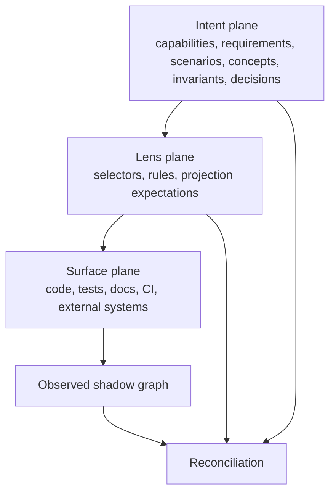
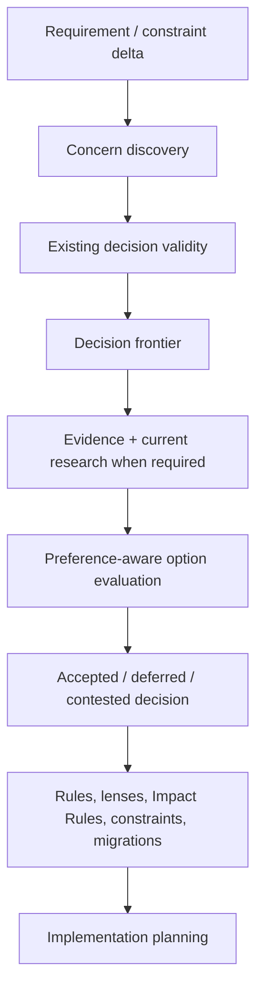
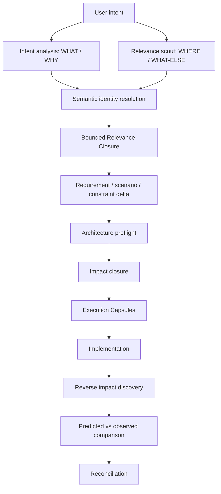
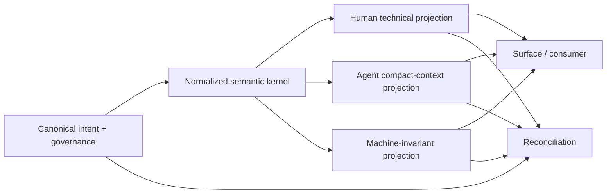

# Conceptual Architecture

## Conceptual architecture

Projector has three semantic planes, one observed shadow, and a stratified governance evaluator.



## Intent plane

Contains semantic meaning and accepted decisions:

- capabilities, Requirements, and Behavioral Scenarios.
- events, commands, policies, contracts, and behavioral relationships when they materially affect discovery or verification.
- invariants and obligations.
- ownership boundaries.
- architecture decisions.
- data contracts and interfaces.
- compatibility promises.
- platform constraints.
- migrations.

## Lens plane

Contains executable architecture:

- Projection Lenses.
- selectors.
- Projection Expectations.
- rules and Impact Rules.
- recognizers.
- validators.
- transforms.
- migration overlays.
- exceptions.

## Surface plane

Contains physical or externally addressable manifestations.

## Observed shadow graph

Represents what Projector can currently observe. It contains deterministic facts, timestamped external observations, and explicitly marked hypotheses. Reconciliation compares the intended/lens planes against this shadow.

## Governance strata

Governance evaluation MUST use these default strata:

```text
L0  physical observations
L1  deterministic structure
L2  semantic classifications and hypotheses
L3  lens memberships
L4  effective rules and projection expectations
L5  derivations, validity, divergence, and completion state
```

Dependencies SHOULD point from higher layers to lower layers. A rule at L4 may depend on a classification at L2. A physical fact at L0 MUST NOT depend on whether an L4 rule applies.

A recursive extension is allowed only when it declares:

- the participating entities.
- monotonic update semantics or another well-defined fixed-point rule.
- strongly connected component evaluation.
- a state-digest convergence test.
- maximum iterations/time.
- the failure emitted if convergence is not reached.

Required failures include `governance-cycle`, `nonconvergent-reconciliation`, and `derivation-cycle-unresolved`.

## Correctness oracles

Projector reasons with three different oracles and MUST NOT collapse them:

- **Rebuild oracle:** detects incremental/cache/indexing mistakes by rebuilding from canonical local inputs.
- **Independent conformance oracle:** supplies semantic evidence from an independent lane, such as compiler/type system, pre-existing tests, schemas, runtime observations, property tests, or an independent reviewer.
- **Historical/metamorphic oracle:** evaluates whether a lens, selector, or transform predicts useful outcomes across historical or systematically perturbed states.

The assurance attached to a conclusion MUST reflect which oracle actually supports it.

## Architecture decision lifecycle

Architecture decisions live in the Intent plane and compile consequences into the Lens plane. They are not a fourth implementation surface.



The lifecycle MUST be scope-aware. Adding a mobile target may make a web-only decision suspect for mobile. The change MUST NOT invalidate the decision for the existing web scope.

## Change cognition: relevance before impact

Projector's semantic planes describe authority and manifestation. Change-time cognition is a derived traversal over those planes and the observed shadow. It MUST NOT introduce a parallel source of truth.



**Relevance Closure** answers which existing knowledge may materially affect correct interpretation/planning of a proposed change. **Impact Closure** answers what an already-known semantic delta affects. The former may include confidence-ranked exploratory edges to prevent omission. The latter governs mutation/completion and therefore uses Projector's stronger proof/observability semantics.

Change intake MUST keep three questions distinct:

- **WHAT / WHY** — requested behavior, constraints, and intent.
- **WHERE / WHAT-ELSE** — existing semantic/code/event/contract neighborhoods that may be implicated.
- **HOW** — architecture and implementation choices, decided only after the first two are sufficiently understood.

Protecting WHAT from premature HOW MUST NOT require ignorance of WHERE.

## Semantic ownership and retrieval topology

Semantic encapsulation establishes one authoritative home for each durable truth. It does not define context boundaries. Repository/package structure, semantic ownership, platform boundaries, event/contract topology, and retrieval topology are orthogonal projections.

A cross-cutting invariant is authored once. Projector discovers it where relevant through typed relations, applicability selectors, implementation bindings, event/contract edges, and bounded relevance traversal. The physical canonical storage hierarchy MAY optimize Git locality and human browsing, but MUST NOT determine applicability or retrieval.

## Semantic representation projections

Representation is a compilation concern between canonical semantics/governance and the Surface plane. It is **not** a fourth authority plane.



Default target classes:

1. **Human technical** — optimize explicitness and low decoding ambiguity. Use one stable name per concept, explicit actors/conditions, direct verbs, short single-purpose sentences, and structured procedures. Style linting is useful, but a style score is not semantic proof.
2. **Agent compact context** — minimize actual context tokens after accounting for profile overhead. Remove filler, pleasantries, hedging, redundant rationale, and repeated explanations. Fragments are allowed only when protected semantics remain unambiguous. Preserve code, commands, paths, API names, numbers/units, identifiers, negation, and normative force exactly or through an exact structured kernel.
3. **Machine invariant** — serialize normalized rules, predicates, scopes, permissions, dependencies, and hashes directly. This is the strongest representation lane for semantics already expressible in Projector's rule/predicate kernel.

Projector MUST derive a Representation Projection from canonical semantic sources, not another lossy prose projection, when the canonical source is available. Common source hashes plus compatible Semantic Preservation Fingerprints establish cross-projection consistency, not textual similarity.

Changing a representation profile invalidates only projections, contexts, or derivations that depend on that profile unless the change also modifies canonical governance. It MUST NOT dirty the underlying decision/rule merely because the encoding changed.

Reference profiles MAY borrow controlled-technical-English discipline and aggressive token-compression techniques, but Projector's own profile contracts, preservation rules, and validators are authoritative. No third-party writing/compression system is a required runtime dependency.

---


