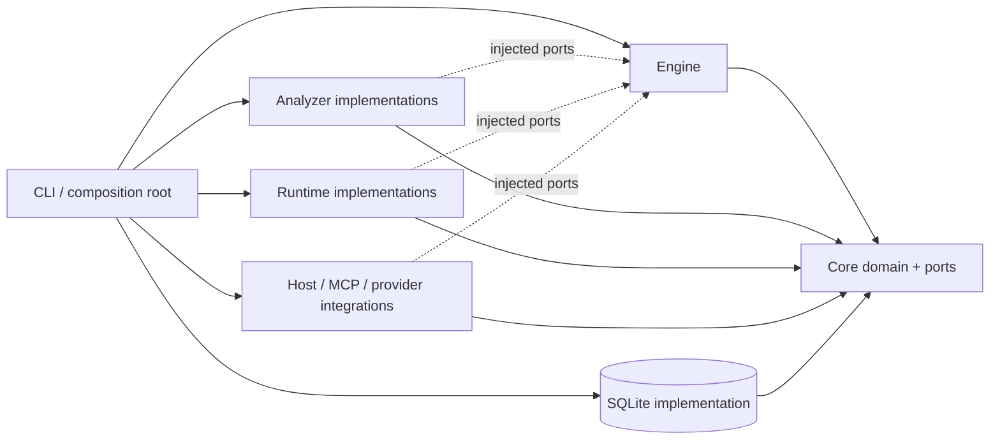

# Reference Implementation Architecture

## Reference implementation architecture

The semantic engine depends on ports, not concrete analyzer, runtime, host, provider, or persistence implementations. The CLI/application layer is the composition root.



Required semantic subsystems:

1. Deterministic observation and indexing.
2. Canonical semantic identity, Requirement, and Behavioral Scenario management.
3. Semantic identity resolution and duplicate/overlap prevention.
4. Relevance discovery and bounded context-subgraph compilation.
5. Inference and Pattern Candidate mining.
6. Authority and rationale evaluation.
7. Selectors, lenses, and rule compilation.
8. Derivation, semantic invalidation, and impact closure.
9. Semantic representation compilation and fidelity validation.
10. Deterministic transformation runtime.
11. Semantic change analysis, planner, and packet executor.
12. Reverse-impact comparison, reconciliation, and divergence.
13. Coverage and information-gain interaction.
14. Agent orchestration.
15. Host/MCP integration.
16. External surface adapter framework.

Core semantic services MUST be testable with in-memory/fake ports. No host brand, SQLite API, model vendor, process runner, or filesystem implementation may be required by domain contracts.

---


## Repository/package layout

Start with a small package graph whose dependency direction matches the ports architecture:

```text
/
├─ packages/
│  ├─ core/
│  │  ├─ src/domain/
│  │  ├─ src/schemas/
│  │  ├─ src/ports/
│  │  ├─ src/hashing/
│  │  └─ src/identity/
│  ├─ engine/
│  │  ├─ src/inference/
│  │  ├─ src/authority/
│  │  ├─ src/governance/
│  │  ├─ src/representation/
│  │  ├─ src/invalidation/
│  │  ├─ src/reconciliation/
│  │  ├─ src/coverage/
│  │  ├─ src/change/
│  │  └─ src/planning/
│  ├─ analyzers/
│  │  ├─ src/filesystem/
│  │  ├─ src/git/
│  │  ├─ src/typescript/
│  │  ├─ src/structured-data/
│  │  ├─ src/markdown/
│  │  └─ src/github-actions/
│  ├─ runtime/
│  │  ├─ src/primitives/
│  │  ├─ src/transforms/
│  │  ├─ src/execution/
│  │  ├─ src/journal/
│  │  └─ src/worktrees/
│  ├─ integrations/
│  │  ├─ src/codex/
│  │  ├─ src/claude/
│  │  ├─ src/mcp/
│  │  ├─ src/models/
│  │  └─ src/surfaces/
│  ├─ cli/
│  └─ testkit/
├─ fixtures/
├─ examples/
├─ docs/
├─ scripts/
└─ AGENTS.md
```

Dependency rule:

```text
core          -> no workspace dependency
engine        -> core
analyzers     -> core
runtime       -> core
integrations  -> core
cli           -> core + engine + analyzers + runtime + integrations
```

An integration wrapper MAY depend on the engine's narrow public facade when orchestration requires it, but MUST NOT import engine internals.

Concrete implementations are assembled in `cli` or another application composition root. This prevents `engine <-> runtime` and `engine <-> analyzer` dependency cycles while still allowing the engine to invoke injected ports.

A package SHOULD be split only when a release, security, performance, or dependency-isolation boundary justifies it.

---


## Technology choices

Reference implementation decisions MUST themselves show Projector's decision discipline. The choices below are defaults, not eternal doctrine. Implementation work SHOULD materialize them as Projector Architecture Decisions with Authority Records and reconsideration triggers.

| Choice | Why this is the reference default | Reconsider when |
|---|---|---|
| Node.js 24 LTS | Stable supported runtime for a TypeScript-first local CLI/library. Avoids chasing the current non-LTS line. | Support window, required runtime APIs, host compatibility, or deployment target materially changes. |
| Strict TypeScript + ESM | Keeps contracts explicit and machine-checkable in the primary implementation ecosystem. | A native or performance boundary clearly justifies another language or module boundary. |
| pnpm workspaces | Strong workspace support and low ceremony for the deliberately small monorepo. | Package topology, publishing requirements, organizational tooling, or package-manager constraints change. |
| Zod + exported JSON Schema | One executable schema source validates runtime/canonical contracts and exports interoperable schemas. | Another tool improves cross-language schema generation or performance without duplicating authority. |
| SQLite for derived state | Local, transactional, queryable, rebuildable state with no service dependency. | Measured graph/query/concurrency workloads exceed it. Do not pre-emptively add a graph/database service. |
| TypeScript Compiler API for TS/JS indexing | Provides semantic symbol/type data instead of text-only parsing for the initial language wedge. | Language coverage or measured performance justifies another adapter that preserves semantic contracts. |
| Source-location-preserving structured-data/Markdown parsers | Stable semantic anchors require structured addresses and source locations. | A parser fails supported syntax, fidelity, performance, or maintenance requirements. |
| Git subprocess integration | Git already provides the revision and transaction substrate, and its CLI is inspectable. | A library/native API improves correctness or portability without limiting supported Git workflows. |
| Vitest + fast-check | Fast TypeScript-native tests plus property testing for algebraic/incremental invariants. | Testing requirements or ecosystem support materially change. |
| Canonical JSON + versioned SHA-256 | Deterministic portable semantic/state digests without introducing a specialized content-addressing dependency. | Hash/security/interoperability requirements change or measured performance justifies another versioned scheme. |
| JSONL + optional OpenTelemetry-compatible spans | Useful local observability without requiring a hosted backend. | Operational deployments require another telemetry contract. |

The *reasoning* and triggers above are part of the architecture, not incidental documentation. A later implementation decision that changes one MUST update the corresponding decision/authority and any rules or lenses derived from it.

Do not require:

- graph database.
- daemon.
- message broker.
- hosted service.
- embeddings for initial clustering.
- generic Tree-sitter support before the TypeScript/structured-data vertical slice works.

---


