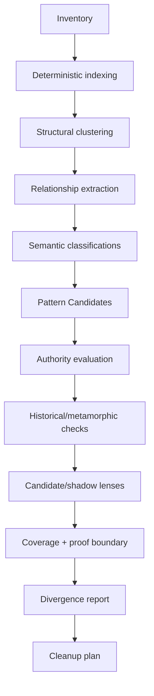

# Persistence and Observation

## Persistence, revisions, transactions, and Projector upgrades

## SQLite is derived state

Required logical tables include:

- entities.
- requirements.
- behavioral_scenarios.
- relations.
- semantic_identity_resolutions.
- relevance_closures.
- planning_surprises.
- lineage/tombstones.
- evidence.
- artifacts.
- projection_units.
- derivations and derivation inputs.
- signature profiles/results.
- selector matches and dependency keys.
- rule matches/bundles.
- divergences.
- runs.
- plans/packets.
- validations.
- model inference artifacts.
- analyzer capability/failure records.
- external observation snapshots.
- transaction journal and writer leases.

Fine-grained canonical files remain authoritative for authored/governance state. SQLite indexes them into the logical graph for queries. No query path may require a monolithic canonical model document.

## Graph revision

A successful semantic/indexing transaction increments a graph revision for diagnostics and snapshot consistency. Global revision MUST NOT be the primary cache key for selector/rule applicability or the sole stale-plan criterion. Dependency fingerprints and `StateBinding` dependencies are.

A run reads one consistent revision and promotes a new revision atomically inside SQLite only after the surrounding semantic transaction reaches the appropriate journal phase.

## Canonical rebuild invariant

A rebuild test MUST:

1. Save a fixed repository/Git snapshot and optional pinned external snapshot.
2. Delete `state.db` and caches.
3. Reload canonical `.projector/` state.
4. Run analyzers under the same adapter/signature-profile/toolchain versions.
5. Get semantically equivalent authored-index state (including Concepts, Requirements, Behavioral Scenarios, and Relations), deterministic observations, lens memberships, effective rules, derivations, divergences, and coverage.
6. Ignore only explicitly volatile operational fields.

The rebuild oracle proves consistency of Projector's derived state, not independent correctness of the software.

## Canonical schema and engine upgrades

Projector upgrades MUST separately version and migrate:

- SQLite schema.
- canonical file schemas.
- analyzer semantics.
- semantic-signature profiles.
- rule/predicate kernel versions.
- host/surface capability contracts.

An upgrade declares whether it requires reindex, selector rematch, authority reconsideration, derivation invalidation, or clean verification.

Old derivation proofs MUST NOT silently survive an incompatible analyzer/signature-profile/engine semantic change.

Canonical migrations are previewable and deterministic. Failed migrations leave the previous canonical state recoverable.

---

## Observation, analyzer capabilities, and initialization pipeline

## Analyzer contract

Each analyzer declares `AnalyzerCapabilities`, including semantic features it can prove, enumeration class, blind spots, adapter version, and whether it executes repository code.

Observation MUST be no-exec by default. Package scripts, build tools, generated-code commands, or tests are run only by explicit declared validator/command policy.

Analyzer output includes deterministic observations plus capability/failure records. Partial failure preserves unaffected observations and widens only dependent conclusions.

## Deterministic inventory

Discover without executing repository code where possible:

- packages/workspaces.
- source roots and languages.
- manifests/lockfiles.
- build/test declarations.
- scripts.
- generated markers.
- CI/infrastructure files.
- docs.
- ownership/instruction files as untrusted data.
- deployment manifests.
- Git metadata.

## Required semantic analyzer outputs

When implemented, adapters MUST preserve the following minimum semantic products rather than reducing them to generic file observations:

- TypeScript/JavaScript: declarations, exports/imports, call/type relationships, test pairings, source locations, stable symbol anchors, structural hashes, and public-interface semantic signatures/hashes. Include producer/consumer edges that Projector can derive for event/contract relevance.
- structured data: stable JSON Pointer/YAML/TOML path units with source locations where parser support permits. Recognized schema/contract references SHOULD produce typed producer/consumer or verification relationships.
- Markdown: stable section units plus code/reference links.
- GitHub Actions: workflow/job units, job dependencies, permissions, inputs/outputs, and path filters.
- Git: renames, introduction commits, co-change, copy/move clues, and migration-direction clues.

Formatting-only changes SHOULD NOT perturb semantic signatures whose declared profile excludes formatting. Unsupported syntax or unresolved module references MUST degrade the affected capability explicitly rather than abort unrelated analysis.

## Analyzer rollout

The implementation order is vertical-slice driven:

1. Filesystem/Git/package facts and minimal JS role features required by the misplaced-script scenario.
2. Semantic signature/backdating support for the API scenario.
3. Broader TypeScript/JavaScript indexing.
4. Structured data.
5. Markdown.
6. GitHub Actions.
7. Additional language/surface adapters only as justified.

## Structural clustering

Signals may include semantic-role features, AST shape, path/naming, dependency neighborhood, test relation, package position, co-change history, docs references, and generated lineage.

Outliers MUST be retained. Generated copies are grouped causally rather than counted as independent votes.

## Model inference input

Models SHOULD receive bounded evidence/graph neighborhoods instead of unrestricted repository content. Identity-resolution and relevance programs receive the smallest neighborhood sufficient to compare candidates or probe missing edges. Inference artifacts MUST include proposed identity/type, included/excluded entities or units, alternatives, confidence, provenance, and discriminating missing evidence.

Model-context construction removes sensitive values before serialization. It is not sufficient to redact logs after the model has already received them.

---

