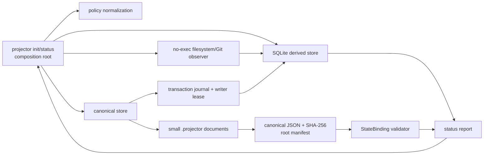

# Phase 1: Slice 0 — Foundation and Correctness Substrate - Research

**Researched:** 2026-08-07  
**Domain:** Deterministic local semantic-state foundation for a TypeScript/Node CLI  
**Confidence:** HIGH for normative scope and architecture; MEDIUM for current package/runtime particulars

<user_constraints>
## User Constraints (from CONTEXT.md)

### Locked Decisions

None.

### the agent's Discretion
- All implementation choices inside the locked Phase 1 boundary are at the agent's discretion because this is a pure infrastructure phase.
- The authoritative 1,319-requirement corpus and exact source snapshot remain the semantic source of truth; no requirement may be weakened, summarized away, or deferred merely because later phases consume the substrate.
- Implement the reference stack already fixed by the project: TypeScript/Node 24 ESM, pnpm, Zod plus JSON Schema, SQLite as derived state, canonical JSON plus SHA-256, Vitest, and fast-check.
- Prefer small independently addressed canonical files, explicit ports, deterministic/no-exec behavior, and in-memory fakes at every boundary.

### Deferred Ideas (OUT OF SCOPE)

None. Later phases are committed scope with explicit dependencies, not optional backlog.
</user_constraints>

## Project Constraints (from AGENTS.md)

- Work in WSL; use PowerShell and Windows path syntax only when a command must run natively on Windows. [VERIFIED: AGENTS.md:3]
- Use `gh` for GitHub Issues and follow `docs/agents/issue-tracker.md`; use the repository’s standard triage labels. [VERIFIED: AGENTS.md:8-9]
- Treat root `CONTEXT.md` and `docs/adr/` as domain guidance. [VERIFIED: AGENTS.md:10]
- Preserve the fixed reference stack and host-neutral ports/composition-root architecture; deviations require an explicit governed architecture decision. [VERIFIED: AGENTS.md:39]
- Start repository-changing work through a GSD workflow; this research only creates the delegated planning artifact. [VERIFIED: AGENTS.md:64-70]

## Summary

Phase 1 must establish an actually usable, deterministic substrate, not a collection of type declarations. It must deliver the complete public contract registry, fine-grained canonical filesystem store, canonical JSON/SHA-256 hashing, local state-binding validator, derived SQLite rebuild, journal/lease recovery, safe observation/path boundary, minimal `init` and `status`, and executable acceptance fixtures. The authoritative Slice 0 contract explicitly requires all of those together and forbids broad analyzers. [VERIFIED: .planning/intel/source-snapshot/PROJECTOR_SPEC/12-delivery/implementation-plan.md:14-42]

The central design split is non-negotiable: authored/governance files under `.projector/` are canonical and independently addressable; SQLite, indexes, observations, caches, and run state are derived and disposable. A complete root digest identifies a snapshot, while a `StateBinding` decides whether bounded work remains usable. Query-result fingerprints, including empty results when a boundary depends on them, prevent false-current work after membership changes. [VERIFIED: .planning/intel/source-snapshot/PROJECTOR_SPEC/02-semantic-kernel/canonical-state.md:47-100] [VERIFIED: .planning/intel/source-snapshot/PROJECTOR_SPEC/02-semantic-kernel/state-binding-and-ports.md:132-174]

**Primary recommendation:** Build a small pnpm workspace with `core`, `engine`, `runtime`, `analyzers`, `integrations`, `cli`, and `testkit`; implement all Phase 1 schemas in `core` first, then storage/binding/journal adapters and a minimal CLI composition root, driven throughout by adversarial fixtures.

## Architectural Responsibility Map

| Capability | Primary Tier | Secondary Tier | Rationale |
|---|---|---|---|
| Public contracts, canonical JSON, hashes, identity | Core domain | — | Domain contracts must not depend on filesystem, SQLite, host, or vendor APIs. [VERIFIED: .planning/intel/source-snapshot/PROJECTOR_SPEC/02-semantic-kernel/reference-implementation.md:3-29] |
| Canonical `.projector/` documents and root-safe paths | Runtime | Core domain | Runtime performs guarded I/O; core supplies schemas and identity semantics. [VERIFIED: .planning/intel/source-snapshot/PROJECTOR_SPEC/02-semantic-kernel/canonical-state.md:7-44] |
| Rebuildable indexes, migrations, journal, writer lease | Runtime | SQLite derived store | Derived state must be atomically rebuilt from canonical inputs. [VERIFIED: .planning/intel/source-snapshot/PROJECTOR_SPEC/09-evolution/persistence-and-observation.md:5-42] |
| State-binding validation and query fingerprints | Engine | Core domain | It determines local validity from explicit dependencies rather than a root digest. [VERIFIED: .planning/intel/source-snapshot/PROJECTOR_SPEC/02-semantic-kernel/state-binding-and-ports.md:132-174] |
| No-exec filesystem/Git/package observation | Analyzers | Runtime | Adapters must declare capability and failure without executing repository code. [VERIFIED: .planning/intel/source-snapshot/PROJECTOR_SPEC/09-evolution/persistence-and-observation.md:57-83] |
| `projector init` and `projector status` | CLI / composition root | Engine + adapters | CLI wires concrete ports and normalizes policy before work. [VERIFIED: .planning/intel/source-snapshot/PROJECTOR_SPEC/02-semantic-kernel/reference-implementation.md:3-29] [VERIFIED: .planning/intel/source-snapshot/PROJECTOR_SPEC/10-operation/cli-modes-and-security.md:5-72] |

## Standard Stack

### Core

| Library / runtime | Version verified | Purpose | Why standard |
|---|---:|---|---|
| Node.js | v24.16.0 installed | ESM CLI, `node:crypto`, `node:fs`, `node:sqlite` | The locked reference runtime is Node 24; `node:sqlite` exposes `DatabaseSync` and prepared statements, avoiding a native third-party driver in Slice 0. It is release-candidate stability, so isolate it behind a persistence port. [CITED: https://nodejs.org/download/release/latest-v24.x/docs/api/sqlite.html] |
| TypeScript | 7.0.2 | Strict ESM contracts and build | Locked reference language. [VERIFIED: npm registry] **WARNING:** legitimacy seam marked the latest package `SUS` because of recent publication; require the install checkpoint. |
| Zod | 4.4.3 | Runtime validation and exported JSON Schema | Zod provides first-party `z.toJSONSchema()`, matching the requirement for one public contract source. [VERIFIED: npm registry] [CITED: https://zod.dev/json-schema] |
| `node:sqlite` | Node built-in | SQLite derived-state adapter and SQL migrations | SQLite is required derived state; the built-in module avoids adding a driver package. [CITED: https://nodejs.org/download/release/latest-v24.x/docs/api/sqlite.html] |

### Supporting

| Library | Version verified | Purpose | When to use |
|---|---:|---|---|
| Vitest | 4.1.10 | Unit, fixture, integration, and CLI tests | Every normal test command; use fake ports, temporary fixture roots, and process-death simulation. [VERIFIED: npm registry] [CITED: https://main.vitest.dev/guide/learn/testing-in-practice] |
| fast-check | 4.9.0 | Property tests for ordering, hashing, locality, and rebuild invariants | Required for Phase 1’s deterministic properties. [VERIFIED: npm registry] [CITED: https://fast-check.dev/docs/tutorials/setting-up-your-test-environment/property-based-testing-with-vitest/] |
| `@types/node` | 26.1.2 latest (pin a Node-24-compatible range) | Type declarations for Node APIs | Required by TypeScript compilation; package identity is registry-confirmed but source provenance was not independently verified this session. [ASSUMED] |

### Alternatives Considered

| Instead of | Could Use | Tradeoff |
|---|---|---|
| `node:sqlite` adapter | Third-party SQLite driver | Do not add one in Slice 0: the built-in API satisfies local derived state but must stay behind a port because it is release-candidate stability. [CITED: https://nodejs.org/download/release/latest-v24.x/docs/api/sqlite.html] |
| Plain JSON hashing | JSON.stringify | Do not use: object insertion order is not a canonicalization contract; implement a schema-aware canonical JSON serializer then SHA-256. [VERIFIED: .planning/intel/source-snapshot/PROJECTOR_SPEC/11-validation/testing-and-adversarial-evaluation.md:37-62] |
| Global revision/root-only stale check | Dependency-scoped binding | Do not use: it creates global false staleness and misses query-boundary changes. [VERIFIED: .planning/intel/source-snapshot/PROJECTOR_SPEC/02-semantic-kernel/state-binding-and-ports.md:161-174] |

**Installation (after human verification checkpoints for flagged packages):**
```bash
pnpm add zod
pnpm add -D typescript vitest fast-check @types/node
```

## Package Legitimacy Audit

| Package | Registry | Age / downloads | Source repo | Verdict | Disposition |
|---|---|---|---|---|---|
| `zod` | npm | 251,703,836 weekly downloads | github.com/colinhacks/zod | OK | Approved; official Zod documentation also confirms the package. |
| `vitest` | npm | 88,401,360 weekly downloads | github.com/vitest-dev/vitest | OK | Approved; official Vitest documentation also confirms use. |
| `typescript` | npm | 259,561,424 weekly downloads | github.com/microsoft/TypeScript | SUS: too-new | Flagged — planner MUST add `checkpoint:human-verify` before install. |
| `fast-check` | npm | 29,592,089 weekly downloads | github.com/dubzzz/fast-check | SUS: too-new | Flagged — planner MUST add `checkpoint:human-verify` before install. |
| `@types/node` | npm | 406,774,710 weekly downloads | github.com/DefinitelyTyped/DefinitelyTyped | SUS: too-new | Flagged — planner MUST add `checkpoint:human-verify` before install. |

All five registry lookups found no `postinstall` script. [VERIFIED: npm registry]  
**Packages removed due to SLOP:** none.  
**Packages flagged as suspicious:** `typescript`, `fast-check`, `@types/node`; their legitimacy verdict requires a human checkpoint despite established repositories and download signals.

## Architecture Patterns

### System Architecture Diagram



The diagram implements the specified port architecture: core has no workspace dependency; adapters depend on core; only the CLI composition root assembles concrete runtime, analyzer, and persistence implementations. [VERIFIED: .planning/intel/source-snapshot/PROJECTOR_SPEC/02-semantic-kernel/reference-implementation.md:31-87]

### Recommended Project Structure

```text
packages/
├── core/        # Zod schemas, registry, canonicalization, hashes, domain ports
├── engine/      # StateBinding validation and deterministic query registry
├── runtime/     # root-safe files, canonical store, journal/lease, SQLite adapter
├── analyzers/   # no-exec filesystem/Git/package observation adapter
├── integrations/# contract-only placeholders; no host implementation in Slice 0
├── cli/         # command parsing and composition root
└── testkit/     # fakes, fixtures, crash runner, property arbitraries
fixtures/        # acceptance repositories, including crash/path/package fixtures
```

The package direction must be `core → none`, `engine|analyzers|runtime|integrations → core`, and `cli → core + engine + analyzers + runtime + integrations`. [VERIFIED: .planning/intel/source-snapshot/PROJECTOR_SPEC/02-semantic-kernel/reference-implementation.md:31-87]

### Pattern 1: Schema registry is the public-contract gate
**What:** Define each Phase 1 public serialized contract once as a Zod schema, export its inferred TypeScript type and JSON Schema, then register it in one machine-readable registry. Do not use `any` to get circular references compiling. [VERIFIED: .planning/intel/source-snapshot/PROJECTOR_SPEC/02-semantic-kernel/identity-and-relations.md:3-8] [CITED: https://zod.dev/json-schema]

```ts
// Source: https://zod.dev/json-schema
const publicSchema = z.object({ /* exact contract fields */ });
const exportedJsonSchema = z.toJSONSchema(publicSchema);
contractRegistry.register({ schema: publicSchema, jsonSchema: exportedJsonSchema });
```

### Pattern 2: Canonical record + derived index
**What:** Parse/validate one canonical document at a time; compute document and semantic hashes from declared projections; build SQLite exclusively from those validated inputs. Never make SQLite the authoritative writer for authored/governance state. [VERIFIED: .planning/intel/source-snapshot/PROJECTOR_SPEC/02-semantic-kernel/canonical-state.md:47-88] [VERIFIED: .planning/intel/source-snapshot/PROJECTOR_SPEC/09-evolution/persistence-and-observation.md:5-42]

### Pattern 3: State binding has value and query dependencies
**What:** On any root change, compare explicit value hashes and re-run every possibly affected registered deterministic query. Rebind if unchanged, stale if material input or result changed, and mark unavailable/suspect when evaluation cannot establish the lane. [VERIFIED: .planning/intel/source-snapshot/PROJECTOR_SPEC/02-semantic-kernel/state-binding-and-ports.md:132-174]

### Pattern 4: Journal before canonical mutation
**What:** Make independent canonical files atomic through an append-only phase journal plus an exclusive writer lease. Test process interruption at every phase; never mark success while workspace/canonical state is partial. [VERIFIED: .planning/intel/source-snapshot/PROJECTOR_SPEC/12-delivery/acceptance-core.md:76-82]

### Anti-Patterns to Avoid
- **Monolithic model file:** destroys locality, causes synthetic conflicts, and violates bounded operation. [VERIFIED: .planning/intel/source-snapshot/PROJECTOR_SPEC/02-semantic-kernel/canonical-state.md:47-51]
- **Root digest as the only cache key:** creates false staleness and cannot represent query negative space. [VERIFIED: .planning/intel/source-snapshot/PROJECTOR_SPEC/02-semantic-kernel/state-binding-and-ports.md:153-174]
- **Raw filesystem path joins:** bypasses required POSIX-relative, traversal, drive/UNC, symlink, real-target, and case-sensitivity controls. [VERIFIED: .planning/intel/source-snapshot/PROJECTOR_SPEC/10-operation/cli-modes-and-security.md:118-127]
- **Analyzer runs package scripts:** observation must remain no-exec except under an explicit validator/command policy. [VERIFIED: .planning/intel/source-snapshot/PROJECTOR_SPEC/09-evolution/persistence-and-observation.md:64-67]
- **Implementing only the next phase’s behavior:** Slice 0 explicitly needs its full listed contract/storage/binding/journal acceptance substrate now; only broad analyzers are sequenced later. [VERIFIED: .planning/intel/source-snapshot/PROJECTOR_SPEC/12-delivery/implementation-plan.md:14-42]

## Don't Hand-Roll

| Problem | Don't Build | Use Instead | Why |
|---|---|---|---|
| Runtime schemas and external JSON Schema | Separate handwritten TS validators and JSON Schema copies | Zod schemas plus `z.toJSONSchema()` | Avoids two authorities for the contract. [CITED: https://zod.dev/json-schema] |
| SQLite engine / driver | Custom persistence engine | `node:sqlite` behind `SqliteStore` port | SQLite is the required derived store; no third-party driver is needed for Slice 0. [CITED: https://nodejs.org/download/release/latest-v24.x/docs/api/sqlite.html] |
| SHA-256 | Custom digest algorithm | Node `crypto` SHA-256 over canonical bytes | The contract fixes canonical JSON plus versioned SHA-256; custom crypto creates unnecessary correctness and security risk. [VERIFIED: .planning/PROJECT.md:88-96] |
| Property input generator | Handwritten random loops | fast-check | Required algebraic properties need shrinking and repeatable seeds. [CITED: https://fast-check.dev/docs/tutorials/setting-up-your-test-environment/property-based-testing-with-vitest/] |
| Command strings | Shell-escaped interpolation | Explicit argv command adapter | Required trust boundary; protects untrusted source text. [VERIFIED: .planning/intel/source-snapshot/PROJECTOR_SPEC/10-operation/cli-modes-and-security.md:129-137] |

## Common Pitfalls

### Pitfall 1: Confusing `semanticHash`, document hash, and root digest
**What goes wrong:** Alias/display-only changes either become invisible or invalidate every meaning-only consumer.  
**How to avoid:** Declare projections per schema; use semantic hash for meaning, discovery hash for retrieval metadata, complete document hash for exact document identity, and a sorted manifest/root digest for complete snapshots. [VERIFIED: .planning/intel/source-snapshot/PROJECTOR_SPEC/02-semantic-kernel/canonical-state.md:73-100]

### Pitfall 2: Binding selected entities but not the query that selected them
**What goes wrong:** A newly matching relation/membership fails to stale work because old entity hashes did not change.  
**How to avoid:** Persist query program/version, normalized input, result projection, observability, assumptions, unavailable lanes, and dependency keys; fingerprint empty results whenever the conclusion depends on them. [VERIFIED: .planning/intel/source-snapshot/PROJECTOR_SPEC/02-semantic-kernel/state-binding-and-ports.md:153-172]

### Pitfall 3: Treating unavailable discovery as absence
**What goes wrong:** An empty open/sampled/unavailable result gets reported as a proof.  
**How to avoid:** Only closed, or bounded-with-held-assumptions, lanes can prove absence; all other lanes widen the frontier. [VERIFIED: .planning/intel/source-snapshot/PROJECTOR_SPEC/02-semantic-kernel/state-binding-and-ports.md:166-170]

### Pitfall 4: A “safe” path check that resolves too late
**What goes wrong:** `..`, Windows drive/UNC forms, or symlinked targets escape the governed root after a superficially valid string check.  
**How to avoid:** Centralize every file operation in one root-constrained utility and test real-target policy before mutation. Node `realpath` resolves dot segments and symlinks but must be combined with Projector’s root-policy checks. [VERIFIED: .planning/intel/source-snapshot/PROJECTOR_SPEC/10-operation/cli-modes-and-security.md:118-127] [CITED: https://nodejs.org/download/release/v25.9.0/docs/api/fs.html]

### Pitfall 5: Passing a clean rebuild as independent correctness
**What goes wrong:** The same analyzer bug can make incremental and clean rebuild agree on the same wrong result.  
**How to avoid:** Label rebuild evidence as rebuild consistency; use schema, property, or independent validator lanes for independent conformance. [VERIFIED: .planning/intel/source-snapshot/PROJECTOR_SPEC/11-validation/testing-and-adversarial-evaluation.md:3-35]

## Code Examples

### Binding validation decision flow
```text
root unchanged → current
root changed → compare explicit value dependencies and rerun possibly affected queries
  neither changed → rebound
  relevant value/query changed → stale
  required lane cannot be evaluated → suspect or unavailable
```
Source: [VERIFIED: .planning/intel/source-snapshot/PROJECTOR_SPEC/02-semantic-kernel/state-binding-and-ports.md:134-174]

### Zod-to-JSON-Schema export
```ts
// Source: https://zod.dev/json-schema
const jsonSchema = z.toJSONSchema(contractSchema);
```

## State of the Art

| Older approach | Current approach | Impact |
|---|---|---|
| External native SQLite dependency by default | Node 24 includes `node:sqlite` | Use an adapter boundary; the current module is release-candidate stability, so do not let it leak into domain contracts. [CITED: https://nodejs.org/download/release/latest-v24.x/docs/api/sqlite.html] |
| Separate Zod and JSON Schema authority | Zod 4 first-party JSON Schema export | Keep one source of runtime validation and external schema export. [CITED: https://zod.dev/json-schema] |

## Phase Requirements

The following matrix covers every one of the 116 Phase 1 requirement IDs. It is an implementation allocation, not a deferral list.

| Requirement IDs | Required implementation evidence |
|---|---|
| CORE-002, CORE-003, CORE-006; PROD-012, PROD-018, PROD-030, PROD-032 | Bounded module/registry reading, separate semantic planes, fine-grained canonical ownership, local validity. |
| KERN-001, KERN-002, KERN-003, KERN-004, KERN-005, KERN-006, KERN-007, KERN-008, KERN-012, KERN-013, KERN-014, KERN-015, KERN-016, KERN-017, KERN-018, KERN-020, KERN-032, KERN-039, KERN-042, KERN-043, KERN-045, KERN-046, KERN-047, KERN-049, KERN-050, KERN-051, KERN-052, KERN-053, KERN-054 | Exact Zod schemas + JSON Schema exports + registry; canonical layout; semantic/discovery/document/root hashing; ports; all Phase-1 contract types declared with no missing cross-package reference. |
| KNOW-010, KNOW-013, KNOW-014, KNOW-029 | Ship the exact identity/relevance entity contracts now and persist canonical Requirement/Scenario semantics; later slices consume these contracts rather than replacing or deferring them. |
| EVID-001, EVID-002, EVID-003, EVID-005, EVID-006, EVID-007, EVID-008, EVID-009, EVID-010, EVID-011, EVID-012; RISK-001, RISK-002, RISK-003 | Ship exact evidence/authority/risk schema contracts now; test source-class, causal-origin, and non-self-justification invariants without pretending Phase 1 runs full authority inference. |
| GOV-001, GOV-002, GOV-003, GOV-004, GOV-005 | Canonical serializable selector AST, deterministic evaluator, no executable query payload, declared dependency keys. |
| PERS-001, PERS-002, PERS-003; OBSV-002, OBSV-003; SURF-001 | SQLite logical schema and migrations, canonical rebuild, adapter capability/failure records, local no-exec observer, surface contract only. |
| SEC-001, SEC-002, SEC-006, SEC-007, SEC-008, SEC-009, SEC-010, SEC-011, SEC-012 | Initialization-time trust boundary and root-constrained POSIX path utility with cross-platform/symlink tests. |
| CLI-001, CLI-002; METR-002, METR-003 | `init` writes minimal canonical config and derived index; `status` reports state; both record config and toolchain digests. |
| RUNTIME-001 | Expose only small deterministic primitives; keep them independent of authority and compact-context machinery. |
| DELV-001, DELV-002, DELV-003, DELV-004, DELV-005, DELV-006, DELV-007; SLICE-000, SLICE-001, SLICE-002, SLICE-003, SLICE-004, SLICE-005, SLICE-006, SLICE-007, SLICE-008, SLICE-009, SLICE-010 | Start with failing fixtures/property tests; package graph and composition root; no broad analyzer or speculative adapter package. |
| TEST-002, TEST-003, TEST-004, TEST-037, TEST-038, TEST-044, TEST-058; EVAL-004 | Unit/property/adversarial rebuild tests for canonical serialization, identity, locality, volatility, and SQLite rebuild. |
| ACC-000, ACC-001, ACC-002, ACC-003, ACC-004, ACC-005, ACC-006, ACC-007, ACC-008, ACC-009, ACC-063 | Dedicated black-box acceptance fixtures for registry completeness, rebuild closure, local update, order-independent digest, binding rebind/stale behavior, observability boundaries, crash recovery, and dependency direction. |

## Assumptions Log

| # | Claim | Section | Risk if Wrong |
|---|---|---|---|
| A1 | `@types/node` is needed as a dev dependency and a Node-24-compatible version will be selected at implementation time. | Standard Stack | Type-check setup may require a different Node typing strategy. |
| A2 | A `node:sqlite` adapter is sufficient for Slice 0’s single-writer derived-state workload. | Standard Stack | Concurrency or API limitations would require a governed driver substitution behind the port. |

## Open Questions

1. **Does `node:sqlite` meet all target-platform operational needs?**
   - What we know: Node 24 exposes `DatabaseSync`; it is release-candidate stability. [CITED: https://nodejs.org/download/release/latest-v24.x/docs/api/sqlite.html]
   - Recommendation: implement `SqliteStore` behind the core persistence port and verify migration, rebuild, and writer-lease fixtures before widening use.
2. **How should case sensitivity be probed on each supported filesystem?**
   - What we know: the contract requires actual-filesystem behavior. [VERIFIED: .planning/intel/source-snapshot/PROJECTOR_SPEC/10-operation/cli-modes-and-security.md:120-127]
   - Recommendation: make the result an explicit root-capability observation and test Linux/WSL plus Windows-drive path cases in the fixture harness.

## Environment Availability

| Dependency | Required by | Available | Version | Fallback |
|---|---|---:|---|---|
| Node.js | CLI, ESM, built-in SQLite | ✓ | v24.16.0 | — |
| pnpm | workspace/package installation | ✓ | 10.30.0 | — |
| npm | package verification only | ✓ | 12.0.1 | — |
| Git CLI | repository digest and journal integration | ✓ | 2.43.0 | — |
| SQLite CLI | diagnostic fixture inspection | ✓ | 3.50.6 | `node:sqlite` remains runtime API |
| Existing test scaffolding | Phase verification | ✗ | — | Wave 0 creates it |

**Missing dependencies with no fallback:** none.  
**Missing dependencies with fallback:** test infrastructure — create the locked Vitest/fast-check harness first.

## Validation Architecture

### Test Framework

| Property | Value |
|---|---|
| Framework | Vitest 4.1.10 + fast-check 4.9.0 (post-checkpoint for fast-check) |
| Config file | none — Wave 0 |
| Quick run command | `pnpm test` |
| Full suite command | `pnpm -r test` |

### Phase Requirements → Test Map

| Requirement group | Behavior | Test type | Automated command | File Exists? |
|---|---|---|---|---|
| KERN-001–008, KERN-032, KERN-039, KERN-042–054, KNOW/EVID/RISK/GOV groups | Exact schemas, registry closure, deterministic selector/hash contracts | unit + schema | `pnpm test -- contracts` | ❌ Wave 0 |
| KERN-012–020, PERS-001–003, TEST-002–004, TEST-037–038, TEST-044, TEST-058 | Fine-grained persistence, canonical/root hash, SQLite rebuild | unit + property | `pnpm test -- canonical` | ❌ Wave 0 |
| KERN-043, KERN-045–047, ACC-005–007 | Local rebinding, query membership, observability-bound absence | property + acceptance | `pnpm test -- state-binding` | ❌ Wave 0 |
| SEC-001–012, OBSV-002–003 | no-exec and root/symlink/Windows path safety | unit + adversarial fixture | `pnpm test -- path-safety` | ❌ Wave 0 |
| ACC-008, SLICE-007 | crash phase recovery and writer lease | integration fixture | `pnpm test -- transaction-crash` | ❌ Wave 0 |
| ACC-009, KERN-051–053, SLICE-000 | workspace dependency direction | static architecture test | `pnpm test -- package-graph` | ❌ Wave 0 |
| CLI-001–002, METR-002–003, ACC-001–004, ACC-063 | init/status, rebuild closure, acceptance behavior | black-box CLI fixture | `pnpm test -- cli-foundation` | ❌ Wave 0 |

### Sampling Rate
- **Per task commit:** `pnpm test`
- **Per wave merge:** `pnpm -r test`
- **Phase gate:** full suite plus all eight acceptance fixtures green before verification.

### Wave 0 Gaps
- [ ] Root `package.json`, `pnpm-workspace.yaml`, TypeScript build configuration, and package manifests.
- [ ] Vitest configuration plus `packages/testkit` fixture helpers.
- [ ] Acceptance fixture roots for canonical rebuild, state-binding, path escape, transaction crash, and package direction.
- [ ] Explicit test scripts required before implementation work begins.

## Security Domain

### Applicable ASVS Categories

| ASVS Category | Applies | Standard control |
|---|---|---|
| V1 Architecture, Design, Threat Modeling | yes | ports/composition root; trust boundary begins at initialization. [CITED: https://devguide.owasp.org/en/06-verification/01-guides/03-asvs/] |
| V2 Authentication | no | No authentication surface in Phase 1. |
| V3 Session Management | no | No session surface in Phase 1. |
| V4 Access Control | yes | State-bound policy and root-constrained write scope. [VERIFIED: .planning/intel/source-snapshot/PROJECTOR_SPEC/10-operation/cli-modes-and-security.md:145-147] |
| V5 Validation, Sanitization, Encoding | yes | Zod validation; serialized selector/query data, never arbitrary code. [CITED: https://devguide.owasp.org/en/11-security-gap-analysis/01-guides/02-asvs/] |
| V6 Stored Cryptography | yes | Versioned SHA-256 for identities; do not implement crypto primitives. [CITED: https://devguide.owasp.org/en/11-security-gap-analysis/01-guides/02-asvs/] |
| V7 Error Handling and Logging | yes | Capability/failure records; no secret-bearing diagnostic leak. [VERIFIED: .planning/intel/source-snapshot/PROJECTOR_SPEC/09-evolution/persistence-and-observation.md:64-67] |
| V12 Files and Resources | yes | Path normalization, drive/UNC validation, real-target/symlink policy, no-exec observer. [VERIFIED: .planning/intel/source-snapshot/PROJECTOR_SPEC/10-operation/cli-modes-and-security.md:118-137] |

### Known Threat Patterns for the stack

| Pattern | STRIDE | Standard mitigation |
|---|---|---|
| Prompt/instruction injection in repo data | Elevation of privilege | Treat docs, commits, metadata, web/model output as data; no content changes policy or grants tools. [VERIFIED: .planning/intel/source-snapshot/PROJECTOR_SPEC/10-operation/cli-modes-and-security.md:110-116] |
| Traversal/symlink escape | Tampering | One root-constrained path utility; normalize, validate Windows forms, resolve/record target, refuse out-of-root writes. [VERIFIED: .planning/intel/source-snapshot/PROJECTOR_SPEC/10-operation/cli-modes-and-security.md:118-127] |
| Shell injection | Elevation of privilege | Explicit argv, no interpolation of untrusted text, declared scopes/budgets. [VERIFIED: .planning/intel/source-snapshot/PROJECTOR_SPEC/10-operation/cli-modes-and-security.md:129-137] |
| False absence / stale authorization | Tampering | Query-result fingerprints and conservative re-evaluation; unavailable lanes are suspect, not current. [VERIFIED: .planning/intel/source-snapshot/PROJECTOR_SPEC/02-semantic-kernel/state-binding-and-ports.md:153-174] |
| Partial transaction presented as complete | Repudiation | Lease + journal phase recovery; crash fixtures. [VERIFIED: .planning/intel/source-snapshot/PROJECTOR_SPEC/12-delivery/acceptance-core.md:76-82] |

## Sources

### Primary (authoritative project sources)
- `.planning/intel/source-snapshot/PROJECTOR_SPEC/02-semantic-kernel/{canonical-state,identity-and-relations,state-binding-and-ports,reference-implementation}.md` — contracts, canonical/derived boundary, ports, and package graph.
- `.planning/intel/source-snapshot/PROJECTOR_SPEC/09-evolution/persistence-and-observation.md` — derived SQLite, rebuild, no-exec observation.
- `.planning/intel/source-snapshot/PROJECTOR_SPEC/10-operation/cli-modes-and-security.md` — CLI, trust, paths, and authorization.
- `.planning/intel/source-snapshot/PROJECTOR_SPEC/11-validation/testing-and-adversarial-evaluation.md` — unit/property/adversarial strategy.
- `.planning/intel/source-snapshot/PROJECTOR_SPEC/12-delivery/implementation-plan.md` and acceptance modules — full Slice 0 scope and acceptance criteria.

### Secondary (official documentation)
- [Node SQLite](https://nodejs.org/download/release/latest-v24.x/docs/api/sqlite.html) — `DatabaseSync` and Node 24 status.
- [Zod JSON Schema](https://zod.dev/json-schema) — first-party JSON Schema export behavior.
- [Vitest property-based testing](https://main.vitest.dev/guide/learn/testing-in-practice) and [fast-check Vitest integration](https://fast-check.dev/docs/tutorials/setting-up-your-test-environment/property-based-testing-with-vitest/) — property-test integration.
- [OWASP ASVS](https://owasp.org/www-project-application-security-verification-standard/) — security verification category framing.

## Metadata

**Confidence breakdown:**
- Standard stack: MEDIUM — project-fixed stack is authoritative; current Node/Zod/Vitest package details were externally checked, and Node SQLite remains release-candidate.
- Architecture: HIGH — directly specified in the exact, checksummed source snapshot and Phase 1 context.
- Pitfalls: HIGH — explicitly represented by Slice 0 acceptance/adversarial requirements; filesystem API usage is MEDIUM-confidence official-documentation support.

**Research date:** 2026-08-07  
**Valid until:** 2026-08-14 for npm/runtime details; authoritative snapshot findings remain valid until amended by governed project decision.
