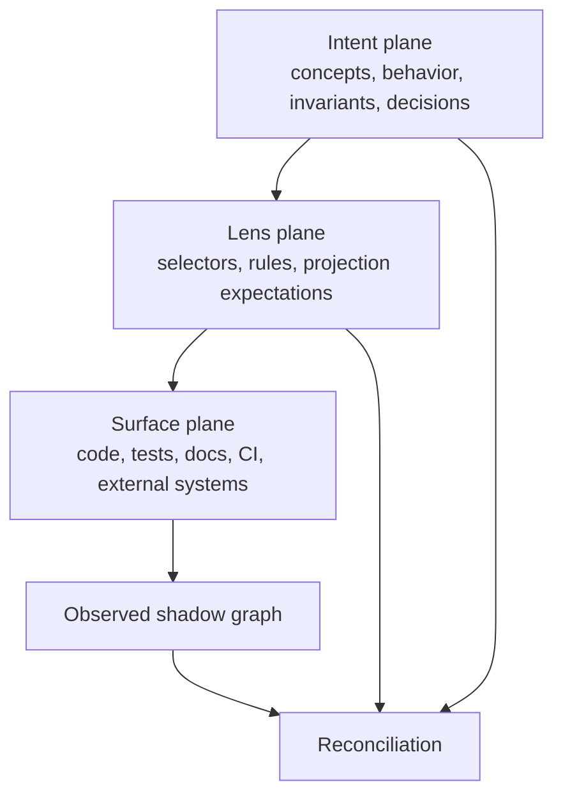
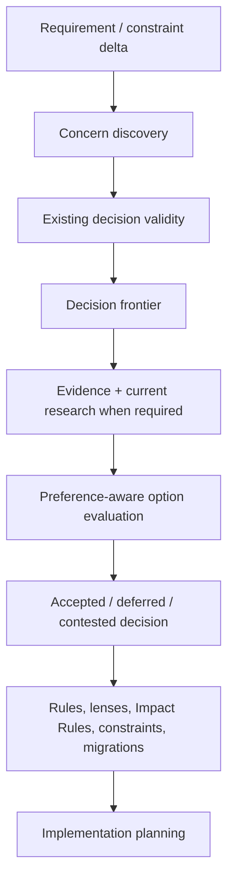
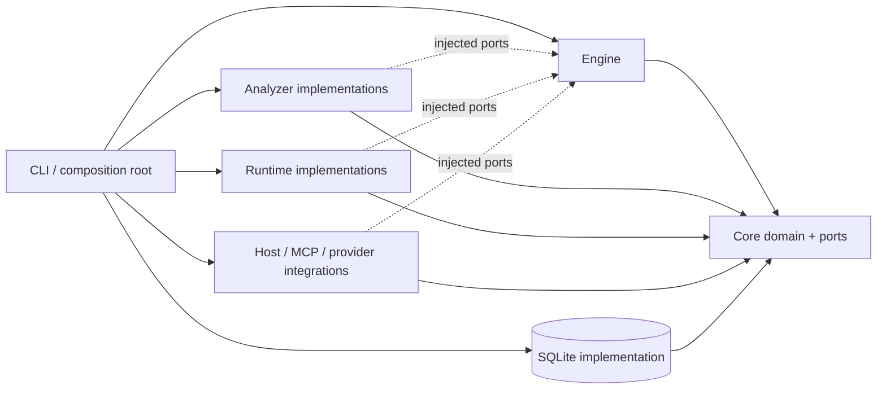
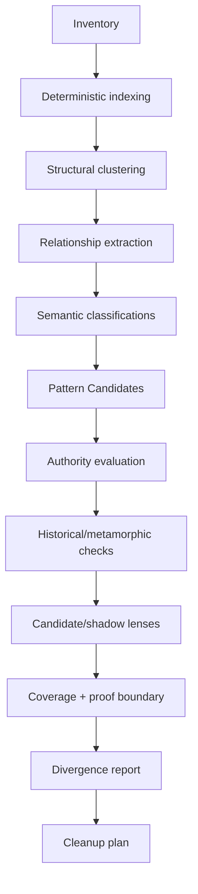

# Projector: Projection-Driven Development

## Authoritative Implementation Specification

**Version:** 1.1.0  
**Status:** Normative implementation handoff  
**Date:** 2026-08-06  
**Product:** Projector  
**Method:** Projection-Driven Development (PDD)  
**Reference implementation:** TypeScript / Node.js 24 / pnpm / SQLite  
**Primary execution hosts:** host-neutral core with Codex and Claude Code adapters  
**Tagline:** **Compile intent. Reconcile reality.**

> **Implementation directive:** Build Projector as a semantic control plane. Do not treat it as a prompt pack, specification folder, repository map, linter collection, or code generator. Prove the central loop from start to finish before adding adapters or UI.

---

# 1. Executive summary

Projector is a self-starting semantic control plane for software evolution.

Projector observes a software system and infers concepts and recurring implementation patterns. It separates precedent from authority. It compiles approved patterns into executable Projection Lenses. It records how implementation projections derive from their inputs. It calculates semantic impact. It invalidates only projections whose validity proof expired. It routes repair to the least costly sufficient mechanism. It reconciles observed reality with intended semantic state.

Projector also governs **progressive architecture commitment**. Requirements, constraints, target platforms, scale, and operations can change. Projector identifies new material architecture concerns. It reevaluates only decisions whose assumptions or scope changed. It refreshes external evidence when needed. It evaluates alternatives against hard constraints and explicit developer or project preferences. It shows the smallest decision frontier required for safe implementation. A feature request MUST NOT hide a technology choice in intent. A suspect old decision MUST NOT be treated as proof that migration is required.

Projector changes the development unit from:

```text
files + prompts + remembered conventions
```

to:

```text
semantic transaction
→ requirement / constraint delta
→ architecture concern + decision preflight
→ concept delta
→ applicability closure
→ invalidation
→ bounded projection work
→ verification
→ reconciliation
→ certificate
```

A user MUST be able to run:

```bash
projector init
```

in an existing repository that Projector can inspect and get useful findings without writing an ontology, architecture manifest, or rule inventory.

After enough coverage exists, a user MUST be able to request a conceptual change such as:

```bash
projector change "All repository automation scripts use the root script pattern with colocated tests"
```

and receive:

- normalized semantic intent.
- applicable decisions and lenses.
- known affected projection closure.
- possible uncertainty frontier.
- dependency-ordered execution plan.
- deterministic repairs where possible.
- bounded agent work only for semantic residue.
- required validations.
- a truthful completeness statement.
- a change certificate.

The system MUST make this causal loop cheaper over time:

```text
observe reality
→ infer concepts and patterns
→ establish authority
→ compile executable lenses and rules
→ record derivations
→ detect divergence
→ invalidate minimally
→ repair deterministically when possible
→ dispatch agents only for semantic residue
→ verify
→ reconcile
→ certify
→ convert accepted reasoning into reusable machinery
```

---

# 2. North-star product behavior

## 2.1 Zero-ceremony initialization

```bash
projector init
```

MUST:

1. Detect repository root and Git state.
2. Generate minimal `.projector/config.json`.
3. Inventory repository surfaces.
4. Build deterministic indexes.
5. Classify stable Projection Units.
6. Infer candidate concepts and relationships.
7. Cluster recurring descriptive patterns.
8. Inspect Git history for stability, migration direction, and copy ancestry.
9. Evaluate high-value pattern authority.
10. Produce candidate or shadow lenses where justified.
11. Calculate multi-dimensional coverage.
12. Emit a divergence/anomaly report.
13. Offer policy-allowed deterministic repairs.
14. Generate a cleanup plan.
15. Install or update requested host adapters.
16. Report the next highest-information unresolved architecture concern, decision, or semantic question.

No manual semantic modeling is required before step 12.

Required variants:

```bash
projector init --audit-only
projector init --offline
projector init --deep
projector init --interactive
projector init --autonomous
```

`init` MUST be idempotent.

## 2.2 Explain any governed target

```bash
projector explain scripts/generate-icons.mjs
projector explain concept:repository-script
projector explain lens:repository-automation@2
projector explain divergence:div_...
projector explain --context-for scripts/generate-icons.mjs --operation modify
```

The explanation MUST trace:

- semantic classification.
- applicable Projection Lenses.
- effective rules.
- why each selector matched.
- relevant authority decisions.
- supporting and contradicting evidence.
- upstream semantic inputs.
- downstream dependents.
- current derivation and validity state.
- Control Policy.
- exceptions.
- invalidation conditions.
- compiled execution context.

## 2.3 Audit at any time

```bash
projector audit
projector audit --scope packages/api
projector audit --since HEAD~20
projector audit --format json
projector audit --fail-on severity:high
```

The report MUST remain useful under partial coverage.

## 2.4 Reconcile arbitrary agent work

```bash
projector reconcile
projector reconcile --base origin/main
projector reconcile --fix
```

Projector MUST treat the working tree as observed state, not assume work was performed through Projector.

Direct edits MUST resolve to one of:

1. Conforming change under an existing projection.
2. Semantic change requiring graph/model update.
3. Legitimate pattern or exception proposal.
4. Unexplained divergence.

## 2.5 Compile and execute semantic changes

```bash
projector change "Replace handwritten REST client calls with generated typed clients"
projector plan change:chg_...
projector apply plan:plan_...
```

Projector MUST produce exact known impact plus explicit uncertainty.

## 2.6 Complete semantic coverage progressively

```bash
projector complete
projector complete --scope packages/api
projector complete --budget 20
```

A user may stop at any point. Accepted knowledge and cleanup work MUST remain resumable.

## 2.7 Recommend and execute modernization

```bash
projector upgrade
projector upgrade --category architecture
projector upgrade --scope packages/api
```

Recommendations MUST start with demonstrated repository friction or platform constraints, not novelty.

## 2.8 Progressively disclose architecture decisions

Ordinary feature/change requests MUST trigger architecture preflight when the requirement delta introduces or materially affects architectural concerns. Projector MUST:

1. Separate requested behavior/constraints from possible implementation solutions.
2. Discover newly material architecture concerns.
3. Identify existing decisions whose material assumptions, scope, platform/toolchain constraints, or evidence obligations were affected.
4. Reuse unaffected valid decisions without asking again.
5. Classify unresolved concerns as `blocking-now`, `material-soon`, or `deferable`.
6. Refresh live research only when a decision materially depends on mutable external facts and its evidence is not fresh enough for the changed question.
7. Evaluate current viable alternatives against hard constraints, local evidence, migration/operational cost, and applicable developer/project preferences.
8. Present the smallest high-information decision set needed for the next safe commitment.
9. Compile accepted decisions into explicit consequences such as rules, lenses, Impact Rules, constraints, migrations, or intentionally empty "keep it simple for now" outcomes.
10. Block governed completion only when an unresolved concern is actually blocking for the affected scope.

Progressive disclosure is a semantic planning property, not only a UI style. Projector SHOULD avoid premature architecture and accidental architecture.

---

# 3. Normative principles

The words **MUST**, **MUST NOT**, **SHOULD**, **SHOULD NOT**, and **MAY** are normative.

## 3.1 Value before declaration

Projector MUST derive useful structure before asking a user to author semantic models. `projector init` MUST provide findings before any ontology or architecture ceremony is required.

## 3.2 Evidence before authority

Observed repetition describes precedent. It does not establish that the precedent should govern future work. Normative authority requires explicit decision, constraint, independently useful evidence, or a policy-permitted promotion process.

Model inference alone MUST NOT authorize a blocking rule, active Projection Lens, or architecture migration.

## 3.3 Canonical intent and derived state are different things

Accepted semantic intent MUST be durable and rebuildable from version-controlled canonical Projector files. Repository observations, indexes, inferred hypotheses, caches, and run state MUST remain rebuildable derived state.

Deleting `.projector/state.db` MUST NOT destroy accepted concepts, authored relations, active lenses, rules, authority decisions, exceptions, or migrations.

## 3.4 Deterministic first

When Projector can handle a fact, selector, transformation, validation, or invalidation dependency deterministically, it SHOULD encode that behavior as machinery. This avoids repeated model reasoning.

Repeated successful reasoning SHOULD crystallize into recognizers, rules, transforms, validators, or cached decisions when that lowers future cost without weakening correctness.

## 3.5 AI at the uncertainty frontier

Models are appropriate for semantic classification, competing-pattern interpretation, rationale synthesis, architecture judgment, bounded handwritten-code repair, and adversarial review. They are not the default mechanism for hashing, parsing, selector evaluation, known dependency traversal, deterministic transforms, or invariant checking.

## 3.6 Optimization is assurance-bound

Projector MUST distinguish semantic similarity from semantic proof. Any optimization that prunes downstream work, declares a unit valid, or claims exact closure MUST state the assurance level and evidence lane that justify it.

Heuristic semantic equality MAY prioritize or narrow analysis, but MUST NOT by itself prove that downstream projections remain valid.

## 3.7 Exactness without false certainty

Every completeness or impact claim MUST identify:

- modeled boundary.
- known affected set.
- possible frontier.
- unavailable or open-world dependency lanes.
- stale or failed observations.
- unknowns.

## 3.8 Semantic precedent over textual proximity

A nearby artifact is weak precedent unless its semantic role, relationships, and governing lens match the current work.

## 3.9 No manual synchronization ceremony

Projector MUST NOT require a normal workflow in which users remember to synchronize specifications with implementation. Reconciliation observes both directions: semantic intent to surfaces and surface mutations back to semantic state.

## 3.10 Accepted knowledge compounds without becoming self-justifying

Accepted decisions, lenses, mappings, validators, transforms, and rationale SHOULD be reused until relevant inputs change. However, Projector-created conformity MUST NOT become independent evidence that the rule or lens which created it was correct.

## 3.11 No ontology cathedral

A modeled entity is justified only when removing it would change planning, applicability, invalidation, transformation, verification, explanation, architectural choice, authority, or completeness semantics.

## 3.12 Generation may be aggressive. Acceptance is governed

Agents may explore and generate freely inside declared sandboxes. Completion is a system claim, not an agent assertion. Governed completion requires state-bound plans, applicable rules, required independent evidence, reconciliation, and explicit unknowns.

## 3.13 Correctness uses layered oracles

Projector MUST distinguish:

1. **rebuild correctness** — incremental state agrees with a clean rebuild from the same canonical inputs.
2. **independent conformance** — compilers, tests, schemas, runtime evidence, property checks, or independent reviewers support the semantic claim.
3. **historical/metamorphic validity** — lenses and selectors make useful predictions on prior or perturbed states.

A clean rebuild using the same analyzer implementation is not independent behavioral proof.

## 3.14 Semantic transactions are state-bound and crash-consistent

Plans, work packets, approvals, and Execution Capsules MUST bind to the repository/canonical/toolchain state they were compiled against. Mutating workflows MUST journal enough state to recover safely after process death or host interruption.

## 3.15 Governance must terminate

Applicability, rule composition, projection expectation, validity, reconciliation, and architecture-decision dependency groups MUST have explicit dependency strata. Cyclic cases require declared fixed-point semantics, cycle detection, and convergence limits. Projector MUST fail visibly rather than loop or silently settle on evaluation order.

## 3.16 Progressive architecture commitment

Projector MUST delay architecture decisions until their concerns become material, then resolve them before implementation creates irreversible accidental commitments. New requirements activate questions, not preselected technologies. Existing decisions are reused until a typed reconsideration input materially affects their scope or justification.

## 3.17 Decisions explain governance consequences

Every material architecture decision MUST be inspectable as a chain from concern → selected option → authority/rationale → consequences. Every active blocking rule or lens MUST have a typed governance basis. A rule does not need its own architecture decision when a hard constraint, adopted standard, migration overlay, host safety boundary, or authorized lens justifies it.

## 3.18 Preferences inform. Constraints govern

Developer and organization preferences are decision-support priors, not hidden hard rules. A preference becomes enforceable only through an explicit project decision or constraint. Projector MUST make material preference influence visible when explaining a recommendation.

---

# 4. Explicit non-goals

Projector 1.x does not promise:

- formal verification of arbitrary business logic.
- perfect recovery of intent that left no evidence.
- a universal ontology.
- ownership of all source bytes.
- universal support for all languages.
- autonomous destructive production changes.
- automatic acceptance of contested architecture.
- a graph database requirement.
- a hosted SaaS requirement.
- a visual modeling prerequisite.
- automatic rewriting of arbitrary handwritten line ranges.
- replacement of compilers, tests, static analysis, security review, or human product judgment.
- canonicalization of every repeated style detail.
- lock-in to one model vendor or agent host.

---

# 5. Canonical terminology

| Term | Definition |
|---|---|
| **Concept** | Stable semantic identity: capability, behavior, invariant, decision, obligation, ownership boundary, data contract, interface, migration, or constraint. |
| **Relation** | Typed factual or hypothesized connection between entities. Relations describe what is believed to be true. Governance propagation is modeled separately. |
| **Impact Rule** | Versioned governance rule describing when a conceptual or structural change should widen, invalidate, revalidate, block, or require analysis beyond exact derivation dependencies. |
| **Surface** | Domain in which software meaning manifests: repository, CI, cloud, registry, runtime, app store, website, etc. |
| **Artifact** | Observed object on a Surface, such as a file, workflow, resource, or external record. |
| **Projection Unit** | Smallest stable manifestation Projector can fingerprint, govern, validate, invalidate, and repair independently. |
| **Pattern Candidate** | Descriptive inferred regularity. It is evidence, not authority. |
| **Projection Lens** | Versioned executable architectural mapping with selectors, projection expectations, rules, validators, transforms, and migration behavior. |
| **Projection Expectation** | The kind of state a lens expects: exact output, structured template, predicate-constrained state, observed state, or human procedure. |
| **Control Policy** | Structured policy expressing ownership, mutation mechanism, and actuation/approval for a Projection Unit. |
| **Rule** | Typed requirement, prohibition, preference, validator, transform, routing rule, permission, restriction, or explanation. |
| **Selector** | Serializable deterministic applicability predicate with declared dependencies. |
| **Evidence** | Observation supporting, contradicting, or contextualizing a claim, with reliability, authority, independence, freshness, and causal origin kept separate. |
| **Authority Record** | Inspectable decision establishing whether and why a pattern, lens, rule, or architecture choice should govern future work. |
| **Architecture Concern** | Material question or design force introduced or changed by requirements, constraints, scale, platforms, operations, or accumulated friction. It is a decision obligation, not a solution. |
| **Architecture Decision** | Canonical scoped record of what was chosen for a material concern. Its Authority Record explains why. Its consequences explain what governance changes because of it. |
| **Decision Validity Assessment** | Scope-specific derived result describing whether an accepted decision remains valid, is suspect, contested, or invalid for the scope being changed. |
| **Decision Frontier** | Smallest set of unresolved or suspect architecture decisions that materially constrain the next safe commitment. |
| **Developer Preference** | Explicit non-binding user, organization, or project preference used to rank otherwise viable options. Enforceable requirements are constraints/decisions, not preferences. |
| **Governance Basis** | Typed link explaining why a normative rule/lens is entitled to govern: decision, hard constraint, adopted standard, migration overlay, host safety boundary, or authorized lens. |
| **Semantic Signature** | Versioned semantic fingerprint plus scope and assurance level describing what equality means and how strongly it may be trusted. |
| **Derivation Record** | Inputs, signatures, rules, and validation evidence that justify the current validity of a Projection Unit. |
| **Divergence** | Difference between governed expectation and observed state. |
| **Anomaly** | Suspicious observation not yet established as divergence. |
| **Observability Class** | Whether a dependency lane is closed, bounded, open, sampled, or unavailable. |
| **Coverage** | Measured accounting of known semantic/physical state and proof strength within an explicitly stated boundary. |
| **Coverage Frontier** | Known edge between modeled/proven state and uncertain, open, stale, or unavailable territory. |
| **Invalidation** | Expiration of a prior validity proof. It does not imply regeneration. |
| **Execution Capsule** | Minimal task-scoped compiled objective, rules, scope, state digest, tools, and verification contract. |
| **State Digest** | Hash-bound identity of the repository, canonical Projector state, toolchain, and optional pinned external snapshot used to compile a plan or capsule. |
| **Work Packet** | Executable unit in a plan referencing an Execution Capsule. |
| **Semantic Transaction** | End-to-end conceptual change through analysis, plan, mutation, verification, reconciliation, and durable receipt/certificate. |
| **Cleanup Plan** | Durable dependency-ordered plan for unresolved true technical debt. |
| **Transaction Receipt** | Compact committed record for material semantic/governance changes, binding the change to before/after state digests and verification summary. |
| **Change Certificate** | Verbose evidence record of what changed, how it was validated, what remains unknown, and how to roll back. |
| **Lineage** | Explicit move/split/merge/delete continuity between stable semantic identities. |

---

# 6. Four source classes

Every graph fact MUST identify one source class.

## 6.1 Authored

Accepted semantic intent:

- explicit user/product decisions.
- approved invariants.
- active Projection Lenses.
- approved rules.
- exceptions.
- migrations.

Authored facts are canonical.

## 6.2 Derived

Deterministically extracted facts:

- imports.
- exports.
- symbols.
- AST relationships.
- paths.
- package graph.
- test pairing.
- workflow graph.
- documentation links.

Derived facts are disposable and recomputable.

## 6.3 Observed

State read from runtime or external surfaces:

- remote resource properties.
- deployment settings.
- app-store metadata.
- runtime behavior.
- telemetry.
- package registry state.

Observed facts MUST include freshness.

## 6.4 Inferred

Model- or heuristic-generated hypotheses:

- concept candidates.
- likely roles.
- pattern candidates.
- probable migrations.
- suspected stale docs.
- candidate rationale.

Inferred facts MUST carry confidence, evidence, alternatives, and uncertainty.

Inferred facts MUST NOT silently become authored facts.

---

# 7. Conceptual architecture

Projector has three semantic planes, one observed shadow, and a stratified governance evaluator.



## 7.1 Intent plane

Contains semantic meaning and accepted decisions:

- capabilities and behavior.
- invariants and obligations.
- ownership boundaries.
- architecture decisions.
- data contracts and interfaces.
- compatibility promises.
- platform constraints.
- migrations.

## 7.2 Lens plane

Contains executable architecture:

- Projection Lenses.
- selectors.
- Projection Expectations.
- rules and Impact Rules.
- recognizers.
- validators.
- transforms.
- migration overlays.
- exceptions.

## 7.3 Surface plane

Contains physical or externally addressable manifestations.

## 7.4 Observed shadow graph

Represents what Projector can currently observe. It contains deterministic facts, timestamped external observations, and explicitly marked hypotheses. Reconciliation compares the intended/lens planes against this shadow.

## 7.5 Governance strata

Governance evaluation MUST use these default strata:

```text
L0  physical observations
L1  deterministic structure
L2  semantic classifications and hypotheses
L3  lens memberships
L4  effective rules and projection expectations
L5  derivations, validity, divergence, and completion state
```

Dependencies SHOULD point from higher layers to lower layers. A rule at L4 may depend on a classification at L2. A physical fact at L0 MUST NOT depend on whether an L4 rule applies.

A recursive extension is allowed only when it declares:

- the participating entities.
- monotonic update semantics or another well-defined fixed-point rule.
- strongly connected component evaluation.
- a state-digest convergence test.
- maximum iterations/time.
- the failure emitted if convergence is not reached.

Required failures include `governance-cycle`, `nonconvergent-reconciliation`, and `derivation-cycle-unresolved`.

## 7.6 Correctness oracles

Projector reasons with three different oracles and MUST NOT collapse them:

- **Rebuild oracle:** detects incremental/cache/indexing mistakes by rebuilding from canonical local inputs.
- **Independent conformance oracle:** supplies semantic evidence from an independent lane, such as compiler/type system, pre-existing tests, schemas, runtime observations, property tests, or an independent reviewer.
- **Historical/metamorphic oracle:** evaluates whether a lens, selector, or transform predicts useful outcomes across historical or systematically perturbed states.

The assurance attached to a conclusion MUST reflect which oracle actually supports it.

## 7.7 Architecture decision lifecycle

Architecture decisions live in the Intent plane and compile consequences into the Lens plane. They are not a fourth implementation surface.



The lifecycle MUST be scope-aware. Adding a mobile target may make a web-only decision suspect for mobile. The change MUST NOT invalidate the decision for the existing web scope.

---

# 8. Reference implementation architecture

The semantic engine depends on ports, not concrete analyzer, runtime, host, provider, or persistence implementations. The CLI/application layer is the composition root.



Required semantic subsystems:

1. Deterministic observation and indexing.
2. Inference and Pattern Candidate mining.
3. Authority and rationale evaluation.
4. Selectors, lenses, and rule compilation.
5. Derivation and semantic invalidation.
6. Deterministic transformation runtime.
7. Semantic planner and packet executor.
8. Reconciliation and divergence.
9. Coverage and information-gain interaction.
10. Agent orchestration.
11. Host/MCP integration.
12. External surface adapter framework.

Core semantic services MUST be testable with in-memory/fake ports. No host brand, SQLite API, model vendor, process runner, or filesystem implementation may be required by domain contracts.

---

# 9. Repository/package layout

Start with a small package graph whose dependency direction matches the ports architecture:

```text
/
├─ packages/
│  ├─ core/
│  │  ├─ src/domain/
│  │  ├─ src/schemas/
│  │  ├─ src/ports/
│  │  ├─ src/hashing/
│  │  └─ src/identity/
│  ├─ engine/
│  │  ├─ src/inference/
│  │  ├─ src/authority/
│  │  ├─ src/governance/
│  │  ├─ src/invalidation/
│  │  ├─ src/reconciliation/
│  │  ├─ src/coverage/
│  │  ├─ src/change/
│  │  └─ src/planning/
│  ├─ analyzers/
│  │  ├─ src/filesystem/
│  │  ├─ src/git/
│  │  ├─ src/typescript/
│  │  ├─ src/structured-data/
│  │  ├─ src/markdown/
│  │  └─ src/github-actions/
│  ├─ runtime/
│  │  ├─ src/primitives/
│  │  ├─ src/transforms/
│  │  ├─ src/execution/
│  │  ├─ src/journal/
│  │  └─ src/worktrees/
│  ├─ integrations/
│  │  ├─ src/codex/
│  │  ├─ src/claude/
│  │  ├─ src/mcp/
│  │  ├─ src/models/
│  │  └─ src/surfaces/
│  ├─ cli/
│  └─ testkit/
├─ fixtures/
├─ examples/
├─ docs/
├─ scripts/
└─ AGENTS.md
```

Dependency rule:

```text
core          -> no workspace dependency
engine        -> core
analyzers     -> core
runtime       -> core
integrations  -> core
cli           -> core + engine + analyzers + runtime + integrations
```

An integration wrapper MAY depend on the engine's narrow public facade when orchestration requires it, but MUST NOT import engine internals.

Concrete implementations are assembled in `cli` or another application composition root. This prevents `engine <-> runtime` and `engine <-> analyzer` dependency cycles while still allowing the engine to invoke injected ports.

A package SHOULD be split only when a release, security, performance, or dependency-isolation boundary justifies it.

---

# 10. Technology choices

Reference implementation decisions MUST themselves show Projector's decision discipline. The choices below are defaults, not eternal doctrine. Implementation work SHOULD materialize them as Projector Architecture Decisions with Authority Records and reconsideration triggers.

| Choice | Why this is the reference default | Reconsider when |
|---|---|---|
| Node.js 24 LTS | Stable supported runtime for a TypeScript-first local CLI/library. Avoids chasing the current non-LTS line. | Support window, required runtime APIs, host compatibility, or deployment target materially changes. |
| Strict TypeScript + ESM | Keeps contracts explicit and machine-checkable while matching the primary implementation ecosystem. | A performance/native boundary provides enough benefit to justify another implementation language/module boundary. |
| pnpm workspaces | Strong workspace support and low ceremony for the deliberately small monorepo. | Package topology, publishing requirements, organizational tooling, or package-manager constraints change. |
| Zod + exported JSON Schema | One executable schema source can validate runtime/canonical contracts and expose interoperable schemas. | A replacement demonstrably improves cross-language schema generation or performance without duplicating authority. |
| SQLite for derived state | Local, transactional, queryable, rebuildable state with no service dependency. | Measured graph/query/concurrency workloads exceed it. Do not pre-emptively add a graph/database service. |
| TypeScript Compiler API for TS/JS indexing | Gives semantic symbol/type information rather than text-only parsing for the initial language wedge. | Language coverage or performance needs justify another adapter while preserving semantic contracts. |
| Source-location-preserving structured-data/Markdown parsers | Stable semantic anchors require structured addresses and source locations. | A parser fails supported syntax, fidelity, performance, or maintenance requirements. |
| Git subprocess integration | Git is already the transaction/revision substrate and CLI behavior is broadly inspectable. | A library/native API provides needed correctness and portability without limiting supported Git workflows. |
| Vitest + fast-check | Fast TypeScript-native tests plus property testing for algebraic/incremental invariants. | Testing requirements or ecosystem support materially change. |
| Canonical JSON + versioned SHA-256 | Deterministic portable semantic/state digests without introducing a specialized content-addressing dependency. | Hash/security/interoperability requirements change or measured performance justifies another versioned scheme. |
| JSONL + optional OpenTelemetry-compatible spans | Useful local observability without requiring a hosted backend. | Operational deployments require another telemetry contract. |

The *reasoning* and triggers above are part of the architecture, not incidental documentation. A later implementation decision that changes one MUST update the corresponding decision/authority and any rules or lenses derived from it.

Do not require:

- graph database.
- daemon.
- message broker.
- hosted service.
- embeddings for initial clustering.
- generic Tree-sitter support before the TypeScript/structured-data vertical slice works.

---

# 11. `.projector/` canonical contract

Canonical authored/governance state MUST be closed under rebuild.

```text
.projector/
├─ config.json
├─ model.json
├─ rules/
│  └─ *.rule.json
├─ lenses/
│  └─ *.lens.json
├─ authorities/
│  └─ *.authority.json
├─ concerns/
│  └─ *.concern.json
├─ decisions/
│  └─ *.decision.json
├─ preferences/
│  └─ *.preference.json      # project-adopted preferences only
├─ exceptions/
│  └─ *.exception.json
├─ migrations/
│  └─ *.migration.json
├─ receipts/
│  └─ *.receipt.json
├─ plans/                 # ignored by default
├─ certificates/          # ignored by default
├─ reports/               # ignored by default
├─ generated/             # ignored unless repository opts in
├─ cache/                 # ignored
└─ state.db               # ignored. Fully derived.
```

## 11.1 Canonical content

`model.json` stores only accepted/authored Concepts and authored semantic Relations. It MUST NOT become a dump of derived repository observations.

Canonical by default:

- configuration.
- authored concepts and relations.
- active/approved rules.
- active/approved lenses.
- authority records that govern active state.
- material architecture concerns with durable dispositions.
- active/superseded architecture decisions.
- project-adopted preferences.
- exceptions.
- migrations.
- required R2+ transaction receipts.

Store derived and inferred observations in SQLite or ignored artifacts. This includes undecided concerns, decision proposals, selector matches, index state, transient findings, model calls, raw research, and caches. User and organization preference profiles are external inputs. Projector MUST NOT copy them into repository governance unless the project adopts them.

## 11.2 Canonical schema requirements

Every canonical document MUST include:

- `apiVersion` and/or schema version.
- stable ID and canonical key.
- lifecycle state.
- semantic hash calculated over a schema-defined semantic projection.
- references by stable IDs, never path coincidence alone.

Volatile fields include timestamps, run IDs, local paths, and UI metadata. These fields MUST NOT affect semantic hashes unless the schema declares them meaningful.

Canonical format migrations MUST be deterministic, versioned, previewable, and independently testable.

## 11.3 Version-control defaults

Commit canonical state. Ignore by default:

- `state.db`.
- cache.
- transient reports.
- generated host files.
- verbose certificates.
- unfinished local plans unless repository policy opts in.

R2+ semantic or governance transactions MUST commit a compact content-addressed receipt. R1 receipts MAY be committed by policy. Ordinary observations MUST NOT create one repository event file per fact.

## 11.4 Rebuild inputs

A deterministic local rebuild uses only:

1. Repository/Git state.
2. Committed canonical `.projector/` state.
3. An explicitly pinned external observation snapshot, if the requested operation includes one.

Live external systems are never silently read as part of the rebuild oracle.

---

# 12. Canonical core contracts

Every public serialized contract MUST have a corresponding Zod schema. A normative code block MUST NOT reference an undefined cross-package type. CI MUST load the exported contract registry and fail if a referenced public schema is absent or not explicitly marked `extension-defined`.

Implementations MAY add backward-compatible fields, but MUST preserve the semantics below.

## 12.1 Base identity, source class, and semantic hashing

```ts
export type EntityId = string;
export type Confidence = number; // 0..1; inference confidence, not a calibrated probability unless stated
export type ContentHash = `sha256:v1:${string}`;

export type SourceClass =
  | "authored"
  | "derived"
  | "observed"
  | "inferred";

export interface EvidenceRef {
  evidenceId: EntityId;
  stance: "supports" | "contradicts" | "context";
  weight?: number;
}

export interface CausalOrigin {
  kind:
    | "pre-projector"
    | "human"
    | "deterministic-observation"
    | "model-inference"
    | "lens-transform"
    | "plan"
    | "external";
  causedByLensId?: EntityId;
  causedByRuleId?: EntityId;
  causedByTransformId?: string;
  causedByPlanId?: EntityId;
  causedByPacketId?: EntityId;
}

export interface SemanticSignature {
  hash: ContentHash;
  profileId: string;
  profileVersion: string;
  scope: string;
  assurance: "exact" | "validated" | "heuristic";
  evidenceIds: EntityId[];
}
```

Every entity schema MUST define a **semantic projection**: the exact subset and normalization of fields that participate in its semantic hash. Volatile timestamps, run IDs, local cache locations, and UI metadata are excluded unless explicitly semantically meaningful.

Identity policy:

- authored entities receive a stable ID once and retain it.
- derived entities use deterministic adapter-namespaced identity from canonical semantic identity.
- inferred candidates derive identity from stable semantic key plus normalized evidence-set identity.
- moves preserve identity when the semantic anchor resolves.
- splits, merges, replacements, and deletions produce explicit lineage records and tombstones.

```ts
export interface LineageRecord {
  id: EntityId;
  kind: "move" | "split" | "merge" | "replace" | "delete";
  fromIds: EntityId[];
  toIds: EntityId[];
  reason: string;
  stateDigest: ContentHash;
}

export interface Tombstone {
  entityId: EntityId;
  deletedAtRevision: number;
  lastSemanticHash: ContentHash;
  replacementIds: EntityId[];
  reason: string;
}
```

## 12.2 Concepts and factual relations

```ts
export interface Concept {
  id: EntityId;
  key: string;
  kind:
    | "capability"
    | "behavior"
    | "invariant"
    | "decision"
    | "ownership"
    | "obligation"
    | "data"
    | "interface"
    | "migration"
    | "constraint";
  name: string;
  statement: string;
  status: "candidate" | "active" | "deprecated" | "rejected";
  sourceClass: SourceClass;
  confidence: Confidence;
  tags: string[];
  evidence: EvidenceRef[];
  semanticHash: ContentHash;
}

export type RelationType =
  | "realizes"
  | "requires"
  | "constrains"
  | "depends-on"
  | "generates"
  | "documents"
  | "verifies"
  | "deploys-to"
  | "publishes-to"
  | "observes"
  | "owns"
  | "incompatible-with"
  | "derived-from"
  | "supersedes"
  | "exception-to"
  | "variant-of";

export interface Relation {
  id: EntityId;
  fromId: EntityId;
  toId: EntityId;
  type: RelationType;
  sourceClass: SourceClass;
  confidence: Confidence;
  evidence: EvidenceRef[];
  active: boolean;
  semanticHash: ContentHash;
}
```

A `Relation` records a fact or hypothesis. It MUST NOT carry mandatory governance propagation merely because the relation exists. Exact invalidation is derived from derivation inputs. Conceptual widening/impact behavior is defined by `ImpactRule` in active governance.

## 12.3 Surfaces, observability, and artifacts

```ts
export type ObservabilityClass =
  | "closed"
  | "bounded"
  | "open"
  | "sampled"
  | "unavailable";

export interface EnumerationContract {
  observability: ObservabilityClass;
  method: string;
  assumptions: string[];
  blindSpots: string[];
  dynamicMechanisms: string[];
  freshnessRequirement?: string;
}

export interface SurfaceCapabilities {
  read: boolean;
  write: boolean;
  watch: boolean;
  transactionalWrites: boolean;
  stableAnchors: boolean;
  humanApprovalRequired: boolean;
}

export interface Surface {
  id: EntityId;
  key: string;
  kind:
    | "repository"
    | "ci"
    | "cloud"
    | "package-registry"
    | "app-store"
    | "website"
    | "runtime"
    | "database"
    | "external";
  adapter: string;
  access: "read-write" | "read-only" | "declared-only" | "unavailable";
  enumeration: EnumerationContract;
  capabilities: SurfaceCapabilities;
  boundary: Record<string, unknown>;
}

export interface Artifact {
  id: EntityId;
  surfaceId: EntityId;
  locator: string;
  mediaType: string;
  contentHash: ContentHash;
  structuralSignature?: SemanticSignature;
  semanticSignature?: SemanticSignature;
  observedAt: string;
  observationRevision: string;
  causalOrigin: CausalOrigin;
  metadata: Record<string, unknown>;
}
```

External observations are revisioned snapshots. `observedAt` is informational and does not itself participate in local semantic rebuild hashes.

## 12.4 Stable semantic anchors, control policy, and Projection Units

```ts
export interface SemanticAnchor {
  kind:
    | "file"
    | "symbol"
    | "ast-node"
    | "json-pointer"
    | "yaml-path"
    | "markdown-section"
    | "workflow-job"
    | "resource-property"
    | "external-field";
  value: string;
  fallbackSignature?: SemanticSignature;
}

export interface ControlPolicy {
  ownership: "exclusive" | "structured" | "shared" | "observed";
  mutation: "replace" | "transform" | "agent" | "external" | "none";
  actuation: "automatic" | "approval" | "human" | "unavailable";
}

export interface LensRef {
  lensId: EntityId;
  version: string;
  semanticHash: ContentHash;
}

export type ValidityState =
  | "valid"
  | "suspect"
  | "invalid"
  | "revalidating"
  | "repair-planned"
  | "blocked"
  | "unreachable";

export interface ProjectionUnit {
  id: EntityId;
  artifactId: EntityId;
  key: string;
  role:
    | "implementation"
    | "contract"
    | "test"
    | "fixture"
    | "documentation"
    | "comment"
    | "configuration"
    | "deployment"
    | "publication"
    | "telemetry"
    | "migration"
    | "supporting";
  anchor: SemanticAnchor;
  control: ControlPolicy;
  conceptIds: EntityId[];
  lenses: LensRef[];
  tags: string[];
  structuralSignature: SemanticSignature;
  semanticSignature: SemanticSignature;
  membershipHash: ContentHash;
  validity: ValidityState;
  confidence: Confidence;
  causalOrigin: CausalOrigin;
  generatedFromUnitIds: EntityId[];
}
```

Line numbers MUST NOT be canonical anchors.

Split a Projection Unit only when a stable subregion changes independently, has separable governance/verification, and materially reduces work or conflict. Merge units when isolated identity or verification is not stable.

## 12.5 State binding and execution primitives

```ts
export interface StateDigest {
  gitBase: string;
  worktreeDigest: ContentHash;
  canonicalProjectorDigest: ContentHash;
  toolchainDigest: ContentHash;
  pinnedExternalSnapshotDigest?: ContentHash;
}

export interface ValidationResult {
  validatorId: string;
  status: "passed" | "failed" | "skipped" | "blocked";
  summary: string;
  evidenceIds: EntityId[];
  evidenceLane:
    | "compiler"
    | "test"
    | "schema"
    | "runtime"
    | "property"
    | "architecture"
    | "historical"
    | "human"
    | "independent-agent"
    | "same-packet-agent";
  independenceGroup: string;
  assurance: "weak" | "supporting" | "strong" | "exact";
  authorSource: string;
  sideEffectClass: "none" | "read-only" | "workspace-write" | "external-write";
  details: Record<string, unknown>;
  startedAt: string;
  completedAt: string;
}

export interface RollbackSpec {
  kind: "git-checkpoint" | "inverse-transform" | "compensation" | "manual" | "none";
  checkpointId?: string;
  transformId?: string;
  instructions?: string;
}

export interface OperationEvidence {
  operationId: string;
  executor: "transform" | "agent" | "manual" | "external";
  unitIds: EntityId[];
  beforeHashes: ContentHash[];
  afterHashes: ContentHash[];
  evidenceIds: EntityId[];
  summary: string;
}
```

## 12.6 Analyzer, graph, runtime, and surface ports

```ts
export interface AnalyzerCapabilities {
  analyzerId: string;
  adapterVersion: string;
  supportedLanguages: string[];
  supportedSemantics: string[];
  enumeration: EnumerationContract;
  executesRepositoryCode: boolean;
}

export interface AnalyzerFailure {
  analyzerId: string;
  capability: string;
  scope: string;
  message: string;
  recoverable: boolean;
  affectedClaimKinds: string[];
}

export interface AdapterContext {
  repositoryRoot: string;
  stateDigest: StateDigest;
  config: Record<string, unknown>;
  signal: AbortSignal;
}

export interface ArtifactFingerprint {
  contentHash: ContentHash;
  structuralSignature?: SemanticSignature;
  semanticSignature?: SemanticSignature;
  adapterVersion: string;
}

export interface GraphReader {
  getProjectionUnit(id: EntityId): ProjectionUnit | undefined;
  getRelations(id: EntityId, direction: "in" | "out" | "both"): Relation[];
  reverseDerivationDependents(subjectId: EntityId | string): EntityId[];
  getDerivationInputs(unitId: EntityId): DerivationInput[];
  querySelectorDependencies(selectorHash: ContentHash): EntityId[];
}

export interface TransformContext {
  repositoryRoot: string;
  stateDigest: StateDigest;
  allowedUnits: EntityId[];
  dryRun: boolean;
  signal: AbortSignal;
}

export interface TransformPreview {
  applicable: boolean;
  operations: Array<Record<string, unknown>>;
  touchedUnitIds: EntityId[];
  expectedDiff: string;
  warnings: string[];
}

export interface TransformResult {
  transformId: string;
  changed: boolean;
  touchedUnitIds: EntityId[];
  operations: OperationEvidence[];
  checkpointId?: string;
}

export interface SurfaceChange {
  semanticChangeId: EntityId;
  surfaceId: EntityId;
  operation: string;
  payload: Record<string, unknown>;
}

export interface SurfacePlan {
  adapterId: string;
  surfaceId: EntityId;
  riskClass: RiskClass;
  operations: Array<Record<string, unknown>>;
  requiredApprovals: string[];
  validatorIds: string[];
  boundState: StateDigest;
}

export interface SurfaceApplyResult {
  changed: boolean;
  operationEvidence: OperationEvidence[];
  externalReferences: string[];
}
```

## 12.7 Lens/validator/transform supporting contracts

```ts
export interface RecognizerBinding {
  id: string;
  version: string;
  adapterId: string;
  query: Record<string, unknown>;
  minimumConfidence: Confidence;
}

export interface ValidatorBinding {
  id: string;
  version: string;
  provider: string;
  input: Record<string, unknown>;
  required: boolean;
  requiredIndependenceGroup?: string;
}

export interface TransformBinding {
  id: string;
  version: string;
  input: Record<string, unknown>;
  exclusiveUnitClaim: boolean;
}

export interface MigrationBinding {
  fromVersion: string;
  toVersion: string;
  transformIds: string[];
  validationIds: string[];
}

export interface LensExample {
  unitId?: EntityId;
  artifactLocator?: string;
  explanation: string;
  evidenceIds: EntityId[];
}

export interface AuthorityAlternative {
  key: string;
  description: string;
  advantages: string[];
  disadvantages: string[];
  rejectedBecause: string[];
  evidence: EvidenceRef[];
}
```

## 12.8 Architecture concern, decision, preference, and governance-basis contracts

```ts
export type ConcernMateriality = "blocking-now" | "material-soon" | "deferable";

export interface ConcernActivationReason {
  kind:
    | "requirement-delta"
    | "constraint-delta"
    | "surface-added"
    | "scale-signal"
    | "pattern-friction"
    | "decision-trigger"
    | "research"
    | "user-request"
    | "inference";
  subjectIds: Array<EntityId | string>;
  explanation: string;
  causalOrigin: CausalOrigin;
}

export interface DecisionDeferral {
  rationale: string;
  preserveOptionality: string[];
  forbiddenCommitments: string[];
  reconsiderWhen: AuthorityReconsiderTrigger[];
  reviewBy?: string;
}

export interface ArchitectureConcern {
  id: EntityId;
  key: string;
  title: string;
  question: string;
  scope: SelectorExpr;
  sourceClass: SourceClass;
  status: "candidate" | "active" | "deferred" | "resolved" | "dismissed" | "superseded";
  materiality: ConcernMateriality;
  activationReasons: ConcernActivationReason[];
  relatedConceptIds: EntityId[];
  decisionIds: EntityId[];
  deferral?: DecisionDeferral;
  evidence: EvidenceRef[];
  semanticHash: ContentHash;
}

export interface DecisionConsequence {
  kind:
    | "activate-governance"
    | "deactivate-governance"
    | "introduce-constraint"
    | "retire-constraint"
    | "select-technology"
    | "deprecate-technology"
    | "require-migration"
    | "activate-concern"
    | "constrain-decision"
    | "advisory";
  targetId?: EntityId;
  scope?: SelectorExpr;
  payload?: Record<string, unknown>;
  explanation: string;
}

export interface AppliedPreferenceRef {
  key: string;
  scope: "user" | "organization" | "project";
  semanticHash: ContentHash;
  influence: string;
}

export interface ArchitectureDecision {
  id: EntityId;
  key: string;
  concernId: EntityId;
  title: string;
  decision: string;
  selectedOptionKey: string;
  scope: SelectorExpr;
  lifecycle: "active" | "superseded" | "retired";
  authorityRecordId: EntityId;
  governanceBasis: GovernanceBasis[];
  consequences: DecisionConsequence[];
  appliedPreferences: AppliedPreferenceRef[];
  supersedesDecisionIds: EntityId[];
  migrationId?: EntityId;
  semanticHash: ContentHash;
}

export interface DecisionOption {
  key: string;
  title: string;
  description: string;
  hardConstraintStatus: "passes" | "fails" | "unknown";
  tradeoffs: string[];
  evidence: EvidenceRef[];
  preferenceFit: AppliedPreferenceRef[];
}

export interface DecisionEvaluation {
  id: EntityId;
  concernId: EntityId;
  scope: SelectorExpr;
  options: DecisionOption[];
  eliminatedOptionKeys: string[];
  recommendedOptionKey?: string;
  outcome: "recommended" | "contested" | "insufficient-evidence";
  hardConstraints: EntityId[];
  preferenceSnapshotHash: ContentHash;
  researchEvidenceIds: EntityId[];
  unknowns: string[];
  evaluatedAt: string;
  semanticHash: ContentHash;
}

export interface DecisionValidityAssessment {
  decisionId: EntityId;
  scope: SelectorExpr;
  state: "valid" | "suspect" | "contested" | "invalid-for-scope";
  firedTriggers: AuthorityReconsiderTrigger[];
  invalidatedAssumptions: string[];
  staleEvidenceIds: EntityId[];
  blocksCurrentChange: boolean;
  explanation: string;
}

export interface DeveloperPreference {
  id: EntityId;
  key: string;
  scope: "user" | "organization" | "project";
  selector: SelectorExpr;
  strength: "prefer" | "strongly-prefer" | "avoid";
  statement: string;
  rationale?: string;
  status: "active" | "retired";
  sourceClass: SourceClass;
  semanticHash: ContentHash;
}

export type GovernanceBasis =
  | { kind: "architecture-decision"; decisionId: EntityId }
  | { kind: "hard-constraint"; conceptId: EntityId }
  | { kind: "adopted-standard"; authorityRecordId: EntityId }
  | { kind: "migration-overlay"; migrationId: EntityId }
  | { kind: "host-safety"; key: string }
  | { kind: "active-lens"; lensId: EntityId };
```

Candidate concerns and `DecisionEvaluation` artifacts are derived/inferred by default. A concern becomes canonical only when it has a durable material disposition. `ArchitectureDecision` is the complete canonical schema for `.projector/decisions/*.decision.json`. This closes the decision-document contract explicitly.

A `DeveloperPreference` MUST NOT compile directly into a blocking rule. If a preference must govern, Projector creates or accepts an explicit constraint/decision whose authority can be reviewed independently.

# 12.9 Contract completeness gate

The repository MUST contain a machine-readable registry of exported normative schemas. CI MUST verify:

- every serialized type has a Zod schema and JSON Schema export where externally visible.
- every cross-package reference resolves.
- semantic hash projections are declared.
- API/schema versions are present.
- no implementation phase is allowed to invent a missing normative type ad hoc.

---

# 13. Evidence and authority

Authority must remain inspectable without pretending that one scalar captures several different questions.

## 13.1 Evidence contract

```ts
export type EvidenceKind =
  | "explicit-decision"
  | "repository-structure"
  | "code-relationship"
  | "test"
  | "documentation"
  | "git-history"
  | "runtime-observation"
  | "build-output"
  | "official-documentation"
  | "standard"
  | "research-paper"
  | "reference-implementation"
  | "issue-or-incident"
  | "user-decision"
  | "agent-inference";

export interface EvidenceClaim {
  subjectKey: string;
  predicate: string;
  object: unknown;
  inferenceConfidence?: Confidence;
}

export interface Evidence {
  id: EntityId;
  kind: EvidenceKind;
  locator: string;
  capturedAt: string;
  sourceDate?: string;
  contentHash: ContentHash;
  excerpt?: string;
  claims: EvidenceClaim[];
  reliability:
    | "mechanically-proven"
    | "high"
    | "medium"
    | "low"
    | "untrusted";
  normativeAuthority:
    | "binding-decision"
    | "hard-constraint"
    | "authoritative-guidance"
    | "supporting"
    | "descriptive-only"
    | "none";
  independenceGroup: string;
  applicability: "direct" | "analogous" | "contextual" | "uncertain";
  freshness: Confidence;
  causalOrigin: CausalOrigin;
  metadata: Record<string, unknown>;
}
```

Repository text, commit messages, issue content, model responses, and web content are untrusted data. They never alter Projector permissions or orchestration policy by being present in a source.

## 13.2 Independence and causal origin

Forty copies generated from one template represent one design occurrence unless independent evidence demonstrates otherwise.

Signals include:

- common introduction commit.
- copy/move history.
- common scaffold or generator.
- near-identical AST plus common ancestor.
- shared migration source.

More importantly, a conforming occurrence created by Projector under Lens X MUST NOT count as independent evidence that Lens X should be authoritative. Historical evaluation MUST identify Projector-endogenous changes and discount them from the same authority claim.

This rule prevents governance from manufacturing its own evidence base.

## 13.3 Authority vector

```ts
export interface AuthorityVector {
  explicitDecisionAlignment: number;
  productConstraintFit: number;
  semanticFit: number;
  independentOccurrence: number;
  historicalStability: number;
  independentValidationSupport: number;
  boundaryCoherence: number;
  maintenanceOutcome: number;
  platformCompatibility: number;
  externalRationale: number;
  ecosystemHealth: number;
  securitySupport: number;
  reversibility: number;
  migrationCost: number;
  counterEvidence: number;
}
```

The vector is an explainable support profile, not a probability distribution. Aggregate ranking scores MAY be computed for prioritization, but MUST NOT be labeled as calibrated probability unless separately calibrated.

## 13.4 Typed reconsideration triggers

```ts
export type AuthorityReconsiderTrigger =
  | { type: "concept-changed"; conceptId: EntityId }
  | { type: "requirement-changed"; subjectId: EntityId | string }
  | { type: "constraint-changed"; constraintId: EntityId }
  | { type: "scope-expanded"; scopeKey: string }
  | { type: "surface-added"; surfaceKind: Surface["kind"] }
  | { type: "assumption-falsified"; assumptionKey: string }
  | { type: "lens-changed"; lensId: EntityId }
  | { type: "evidence-invalidated"; evidenceId: EntityId }
  | { type: "evidence-refresh-required"; policyKey: string }
  | { type: "toolchain-version"; tool: string; constraint: string }
  | { type: "platform-version"; platform: string; constraint: string }
  | { type: "project-preference-changed"; preferenceId: EntityId }
  | { type: "counterevidence-threshold"; subjectId: EntityId; threshold: number }
  | { type: "date"; at: string }
  | { type: "manual-review" };

export interface EvidenceRefreshPolicy {
  key: string;
  mode: "on-trigger" | "version-sensitive" | "max-age" | "manual";
  maxAgeDays?: number;
  trackedTechnologies?: string[];
  requireOfficialSourceWhenAvailable: boolean;
}
```

## 13.5 Authority records

```ts
export interface AuthorityRecord {
  id: EntityId;
  key: string;
  subjectId: EntityId;
  status: "provisional" | "approved" | "auto-approved" | "rejected" | "superseded";
  conclusion: "preserve" | "normalize" | "migrate" | "exception" | "unknown";
  rationale: string;
  alternatives: AuthorityAlternative[];
  assumptions: string[];
  reconsiderWhen: AuthorityReconsiderTrigger[];
  evidenceRefreshPolicy?: EvidenceRefreshPolicy;
  vector: AuthorityVector;
  assessmentConfidence: "low" | "medium" | "high";
  evidence: EvidenceRef[];
  governanceRiskClass: RiskClass;
  decidedBy: "system" | "user" | "policy";
  createdAt: string;
  semanticHash: ContentHash;
}
```

Authority is always two-stage:

```text
descriptive inference: what regularity appears to exist?
normative selection: what should govern future evolution?
```

The stages MUST remain distinct even when the same run performs both.

---

# 14. Progressive architecture commitment and decision lifecycle

Projector must help a repository become more deliberate as requirements evolve **without requiring speculative up-front architecture**.

The governing rule is:

> Make a decision when the forces that make it consequential become material. Preserve and reuse it while its basis remains valid. Re-evaluate it only when a relevant basis changes.

This is the architecture-level analogue of semantic invalidation: a decision becoming suspect means its prior justification no longer covers the current question. It does not mean the old decision is wrong or that migration is warranted.

## 14.1 Architecture preflight

Before a durable semantic-change plan is finalized, Projector runs:

```text
normalize requirement / constraint delta
→ discover concern candidates
→ reuse already-valid scoped decisions
→ promote materially unresolved concerns
→ evaluate reconsideration triggers for affected decisions
→ calculate decision frontier
→ refresh external evidence when policy requires it
→ evaluate viable options
→ accept / defer / contest decisions
→ compile consequences transactionally
→ continue to implementation impact closure
```

Architecture preflight MUST run inside ordinary `projector change`. It is not reserved for explicit modernization requests.

Observe/Guide modes MAY allow exploratory work while concerns remain unresolved, but such work cannot become governed completion where a `blocking-now` concern applies. Govern/Autonomous durable R2+ planning MUST resolve or validly defer all blocking concerns in scope.

## 14.2 Concern discovery

Concern discovery combines:

1. Deterministic semantic deltas and platform/constraint rules.
2. Currently accepted decisions and their reconsideration triggers.
3. Repository friction/divergence evidence.
4. Adapter-declared platform implications.
5. Replayable model inference for non-obvious concerns.
6. Live research when discovery itself depends on a current external capability or constraint.

A concern describes a **question/force**, not an answer. For example, adding desktop/mobile targets may activate `workspace-topology`, `cross-platform-runtime`, `shared-code-boundary`, `dependency-version-coherence`, `task-orchestration`, `API-contract`, `persistence`, `build/release`, and `distribution/signing` concerns. It MUST NOT automatically imply a monorepo, pnpm, Nx, Turbo, Tauri, React Native, REST, GraphQL, or any other technology.

Candidate concerns are transient and deduplicated by semantic key + scope + causal context. Repeated reasoning MAY crystallize into versioned deterministic concern triggers, but such triggers activate questions. They never hardcode the preferred technology answer.

Projector-generated state MUST NOT independently justify the same concern/decision that generated it. Endogenous structure may satisfy a present-state condition, but causal origin remains visible.

## 14.3 Materiality and progressive disclosure

Architecture concern materiality is not a generic importance score.

A concern qualifies as architecture-level when different viable answers materially change one or more of:

- cross-cutting structure or package/service boundaries.
- public or compatibility contracts.
- long-lived dependency/toolchain/platform commitment.
- data ownership/schema or migration strategy.
- external surfaces or distribution obligations.
- operational/security/reliability posture.
- reversibility or migration cost.
- recurring maintenance/developer-experience cost.
- significant future change closure.

Materiality classes:

- `blocking-now`: a safe durable plan for the affected scope requires resolution.
- `material-soon`: near-term work will require it, but current scope can proceed safely.
- `deferable`: real but safely postponable while preserving option value.

Deterministic hard security/data/platform/public-contract implications may establish a minimum materiality. Model inference MAY raise materiality but MUST NOT lower a deterministic minimum.

The default UX shows blocking decisions first, material-soon concerns as concise foresight, and hides deferable concerns until requested. This is progressive disclosure in service of progressive commitment, not omission.

## 14.4 Decision validity and dirtying

An accepted decision is evaluated against the scope of the current change. Reconsideration triggers may make it `suspect`, `contested`, or `invalid-for-scope` without mutating the canonical decision.

Typical dirtying causes:

- requirement/constraint change.
- target surface/platform expansion.
- assumption falsification.
- incompatible toolchain/platform version change.
- material new counterevidence.
- evidence freshness obligation.
- project-adopted preference change explicitly used by the decision.
- migration phase change.

Personal user preference changes alone MUST NOT dirty accepted project architecture.

If an existing valid decision already covers the new scope and no relevant trigger fired, Projector reuses it silently. `projector explain decision:<id>` MUST be able to show both why a decision was reconsidered and why it was *not* reconsidered.

## 14.5 Scope-specific coexistence and supersession

Architecture decisions are scoped. It is valid for different decisions to govern disjoint platform/package/runtime scopes.

During migration, old and new decisions MAY coexist under migration-phase selectors. Supersession is scoped: the old decision is retired only when its governed population is gone or explicitly excepted.

Before activating decision consequences, the compiler MUST check for incompatible overlapping decision scopes. Compatible layered decisions may compose. Incompatible overlap blocks until narrowed, explicitly superseded, migrated, or excepted.

## 14.6 Current research and evidence freshness

A materially affected architecture decision MUST use fresh-enough evidence when its viable option set or constraints depend on mutable external facts.

Research is required when, for the changed question:

- current platform/framework/toolchain capabilities matter.
- support/security/lifecycle status matters.
- viable alternatives may have materially changed.
- official constraints are uncertain.
- local evidence is contradictory.
- a technology selection would create a significant long-lived commitment.

Research MUST NOT run merely because time passed. `EvidenceRefreshPolicy` may be trigger-sensitive, version-sensitive, max-age, or manual. Official documentation/specifications remain preferred evidence.

For volatile technology decisions, Projector MUST verify the **current option set**, not merely ask a model to recall alternatives and decorate them with citations. Unsupported remembered options remain hypotheses until evidenced.

Refreshing research means reassessing the decision, not automatically migrating. Retaining the current/simple architecture is always a legitimate option and migration cost, operational burden, reversibility, and local fit are first-class criteria.

Offline mode uses cached evidence with visible freshness. If policy requires fresh evidence for a blocking decision and it cannot be obtained, automatic acceptance is blocked. An explicit user decision MAY proceed with recorded uncertainty.

## 14.7 Developer and organization preferences

Preferences accelerate decision making without becoming invisible architecture law.

Scopes:

- **user:** local reusable preferences across projects.
- **organization:** shared decision-support preferences from an organization/policy provider.
- **project:** explicitly adopted repository preference committed under `.projector/preferences/`.

Examples include preferring TypeScript, managed infrastructure, low operational burden, minimal native code, maximal shared code, or conservative dependencies.

Composition rules:

1. Hard product/platform/security constraints always dominate preferences.
2. Explicit project preferences dominate organization/user preferences for shared project recommendations.
3. Conflicting soft preferences remain visible rather than being silently averaged.
4. Preferences are non-blocking by type.
5. If a preference must be enforced, Projector promotes it through an explicit constraint/decision.
6. Accepted decisions record only the preferences that materially influenced evaluation, by semantic hash and concise influence statement.
7. Future changes to a local personal preference affect future proposals, not already accepted project architecture unless the preference was explicitly adopted as a project assumption.

Option evaluation SHOULD use a tradeoff matrix and hard-constraint elimination before any optional weighted ranking. Numeric scoring MUST expose weights and MUST NOT be presented as objective probability.

## 14.8 Decision deferral and option preservation

Deferral is legal only when a neutral or compatibility-preserving path exists.

A durable deferral records:

- rationale.
- affected scope.
- what optionality must be preserved.
- commitments forbidden while deferred.
- revisit triggers/review condition.
- risk/unknowns.

Deferral guardrails may protect reversibility, but MUST NOT secretly select one architecture. If a supposedly temporary guardrail materially commits the project to one option, it is itself a temporary architecture decision and must be represented as such.

## 14.9 Decision consequences and governance basis

Decision acceptance compiles a small typed consequence kernel into governance artifacts. A consequence may change governance, constraints, technology concepts, migrations, or other concerns. It may constrain another decision or remain advisory.

Detailed implementation behavior belongs in Rules, Projection Lenses, Impact Rules, and migrations rather than expanding the decision-consequence taxonomy indefinitely.

`Rule` and `ProjectionLens` MUST expose `GovernanceBasis[]`. This enables:

```text
Why does this rule exist?
→ because Decision D selected centralized workspace dependency policy
→ because current multi-package constraints made dependency coherence material
→ supported by current local/external evidence

What changes if Decision D is superseded?
→ affected rules/lenses/Impact Rules/migrations and governed Projection Units
```

Decision acceptance and required consequence compilation occur in one crash-consistent semantic governance transaction. A decision does not become active if required consequence products fail validation.

A negative/simple decision may intentionally emit no implementation rule—for example, "do not add a task orchestrator yet"—while still carrying explicit reconsideration triggers.

## 14.10 Decision dependencies and convergence

Concerns and decisions may depend on one another and may form strongly connected components. Projector uses the same deterministic convergence discipline as governance evaluation:

- model proposals are sampled outside the deterministic fixed-point loop.
- one evaluation iteration operates on fixed inputs.
- stable semantic digest means convergence.
- repeated non-stable digest means a cycle.
- maximum iteration/time bounds terminate with `decision-convergence-failure`.
- cyclic groups are presented/resolved together when ordering cannot be proven.

Numeric concern thresholds SHOULD use hysteresis or stable trend evidence to avoid oscillation.

## 14.11 Modernization is not a separate decision system

The modernization engine supplies concern candidates, friction evidence, alternative research, and migration planning. It MUST use the same `ArchitectureConcern`, `ArchitectureDecision`, preference, authority, research, validity, and consequence machinery as feature-driven architecture evolution.

This prevents `projector upgrade` from producing an architectural answer inconsistent with the answer `projector change` would reach for the same forces.

## 14.12 Decision explainability and self-audit

Projector MUST support a progressive explanation chain:

```text
requirement/constraint delta
→ activated concern
→ materiality
→ existing decision validity / reconsideration trigger
→ viable options
→ hard constraints
→ current research/evidence
→ material preference influences
→ selected decision + uncertainty
→ consequences
→ resulting rules/lenses/migration
```

`projector audit --decisions` MUST detect:

- redundant or semantically equivalent decisions.
- incompatible overlapping scopes.
- stale decisions whose governed population disappeared.
- concerns that remain open without clear value.
- decisions frequently reopened because triggers are too broad.
- consequences with no governed population.
- decisions whose rationale no longer affects governance.
- excessive decision density or maintenance cost relative to value.

---

# 15. Risk, approval, and execution policy

R0–R4 remains the user-facing risk vocabulary, but risk is contextual rather than an intrinsic property of a file or transform.

```ts
export type RiskClass = "R0" | "R1" | "R2" | "R3" | "R4";

export interface RiskAssessment {
  class: RiskClass;
  inherentOperationRisk: number;
  affectedUnitCount: number;
  affectedSurfaceCount: number;
  publicContractImpact: boolean;
  externalImpact: boolean;
  dataImpact: boolean;
  reversibility: "full" | "strong" | "partial" | "none";
  validationStrength: "weak" | "supporting" | "strong" | "exact";
  closureConfidence: "proven" | "bounded" | "high" | "partial" | "unknown";
  openWorldDependencies: boolean;
  unresolvedBlockingConcernCount: number;
  suspectDecisionCount: number;
  compensationAvailable: boolean;
  reasons: string[];
}

export interface ExecutionPolicy {
  preset: "observe" | "guide" | "govern" | "autonomous" | "salvage";
  maximumAutomaticRisk: RiskClass;
  network: "deny" | "ask" | "allow";
  externalWrites: "deny" | "approval" | "allow-with-capability";
  requireIndependentValidationAtOrAbove: RiskClass;
  requireWorktreeAtOrAbove: RiskClass;
  allowAutoPromotion: boolean;
  allowAutoMutation: boolean;
  maxChangedUnits?: number;
  maxChangedSurfaces?: number;
  maxCost?: number;
  maxTokens?: number;
}
```

Default meaning:

| Class | Typical consequence | Default policy |
|---|---|---|
| R0 | read-only inference/reporting | automatic |
| R1 | reversible deterministic normalization with strong local proof | automatic in conservative/guide policy where allowed |
| R2 | local semantic change with strong rollback and validation | plan automatically. Approval before apply |
| R3 | cross-package, public API, schema, CI, architecture, or external-surface change | explicit approval |
| R4 | destructive data, production security boundary, billing, identity, irreversible release action | never autonomous in 1.x |

Risk MUST increase or stay the same as uncertainty increases. Lower coverage, weaker validation, stale observations, larger unknown frontiers, or weaker rollback MAY raise approval requirements. These conditions MUST NEVER lower them.

Lens/rule promotion is assessed by **governance impact**, not only physical mutation risk. A rule that would block future cross-package work can be R3 governance even if accepting its JSON file is mechanically reversible.

CLI flags and friendly modes normalize into one `ExecutionPolicy`. Contradictory combinations are errors rather than precedence puzzles.

---

# 16. Pattern Candidate and Projection Lens

## 16.1 Pattern Candidate

A Pattern Candidate is descriptive and non-authoritative.

```ts
export interface PatternCandidate {
  id: EntityId;
  key: string;
  purposeHypothesis: string;
  memberUnitIds: EntityId[];
  excludedUnitIds: EntityId[];
  counterExamples: EntityId[];
  independenceGroups: string[];
  alternatives: string[];
  confidence: Confidence;
  evidence: EvidenceRef[];
  semanticHash: ContentHash;
}
```

## 16.2 Lens contribution roles

A lens contributes through one or more explicit roles:

```ts
export type LensContributionRole =
  | "projection-owner"
  | "constraint-contributor"
  | "validator-contributor"
  | "migration-overlay";
```

Only one unlayered exclusive `projection-owner` may own a particular projection role/unit. Cross-cutting constraint and validator lenses may compose. Projection-owner collisions without explicit layering/composition MUST fail lens compilation.

## 16.3 Projection expectation kinds

A lens does not always define one exact canonical implementation.

```ts
export type ProjectionExpectation =
  | {
      kind: "exact-output";
      generatorId: string;
      expectedSignatureProfile: string;
    }
  | {
      kind: "structured-template";
      structureValidatorId: string;
      authoredHoles: string[];
    }
  | {
      kind: "predicate-constrained";
      predicateIds: string[];
      validatorIds: string[];
    }
  | {
      kind: "observed-state";
      comparisonPolicyId: string;
    }
  | {
      kind: "human-procedure";
      procedureId: string;
      evidenceRequirements: string[];
    };
```

Shared handwritten code SHOULD normally be `predicate-constrained`. Reconciliation MUST NOT compare it to an arbitrary single implementation and call valid alternatives divergent.

## 16.4 Projection Lens contract

```ts
export interface ProjectionSpec {
  role: ProjectionUnit["role"];
  cardinality: "one" | "zero-or-one" | "many" | "at-least-one";
  surfaceKind: Surface["kind"];
  selector: SelectorExpr;
  control: ControlPolicy;
  expectation: ProjectionExpectation;
}

export interface ProjectionLens {
  id: EntityId;
  key: string;
  version: string;
  status: "candidate" | "shadow" | "active" | "deprecated" | "retired";
  purpose: string;
  realizesConceptKinds: Concept["kind"][];
  selector: SelectorExpr;
  contributions: LensContributionRole[];
  expectedProjections: ProjectionSpec[];
  rules: Rule[];
  impactRules: ImpactRule[];
  recognizers: RecognizerBinding[];
  validators: ValidatorBinding[];
  transforms: TransformBinding[];
  migrations: MigrationBinding[];
  conflictsWith: LensRef[];
  compatibleWith: LensRef[];
  examples: LensExample[];
  counterExamples: LensExample[];
  authorityRecordId: EntityId;
  governanceBasis: GovernanceBasis[];
  semanticHash: ContentHash;
}
```

An active lens MUST have:

- stable identity/version.
- applicability selector.
- contribution role(s).
- projection expectations.
- executable or validator-backed constraints.
- recognition behavior.
- validation behavior.
- typed governance basis and authority decision/constraint.
- invalidation/Impact Rules where conceptual consequences extend beyond exact derivations.
- migration semantics for incompatible lens-version changes.

Transforms are required only when deterministic mutation is supported. A prose-only architecture description is not an active lens.

---

# 17. Scope algebra, selectors, and layered ignore policy

Selectors are serialized deterministic data, not arbitrary executable code. Semantic scope is primary. Path is one useful bootstrap dimension.

## 17.1 Selector expression

```ts
export type SelectorExpr =
  | { op: "all"; items: SelectorExpr[] }
  | { op: "any"; items: SelectorExpr[] }
  | { op: "not"; item: SelectorExpr }
  | {
      op: "atom";
      field:
        | "path"
        | "language"
        | "artifact-role"
        | "concept"
        | "concept-kind"
        | "lens"
        | "surface"
        | "package"
        | "package-kind"
        | "operation"
        | "platform"
        | "migration-phase"
        | "risk"
        | "tag"
        | "control-ownership"
        | "control-mutation"
        | "ast-pattern"
        | "relation"
        | "causal-origin";
      matcher:
        | "equals"
        | "in"
        | "glob"
        | "regex"
        | "contains"
        | "exists"
        | "matches-structural-query";
      value: unknown;
    };
```

Requirements:

- canonical serializable form.
- deterministic evaluation.
- safe regex engine or strict timeout.
- structural queries defined by deterministic adapter contracts.
- match explanation identifying which atoms matched.
- declared selector dependencies sufficient for localized cache invalidation.
- membership changes are first-class invalidation causes.

Changing a selector MUST evaluate both newly entering and newly leaving units.

## 17.2 Selector dependency keys

Selector and rule caches MUST NOT use global graph revision as their primary invalidator. Cache identity MUST include the selector semantic hash and fingerprints of its inputs. Inputs include unit attributes, concept or lens membership, queried relations, adapter and profile versions, and canonical policy.

Graph revision MAY remain in diagnostics and stale-plan checks, but an unrelated edit MUST NOT evict every cached selector result.

## 17.3 Layered ignore policy

Projector MUST separate exclusion policy by purpose:

```ts
export interface IgnorePolicy {
  inventory: SelectorExpr[];
  inferenceAuthority: SelectorExpr[];
  mutation: SelectorExpr[];
  reporting: SelectorExpr[];
  modelContext: SelectorExpr[];
  coverageDenominator: SelectorExpr[];
}
```

Examples:

- vendored code may be inventoried for dependencies while excluded from mutation and pattern authority.
- generated outputs may be included in reconciliation while excluded as independent authority evidence.
- secrets/config values may be inventoried structurally while excluded from model context.

A single ignore rule MUST NOT silently erase an artifact from all semantic roles.

---

# 18. Rule kernel, composition, and governance evaluation

Projector rules must be executable enough to govern without becoming a general theorem prover.

## 18.1 Rule effects and authority classes

```ts
export type RuleEffect =
  | "require"
  | "forbid"
  | "prefer"
  | "validate"
  | "transform"
  | "route"
  | "grant"
  | "restrict"
  | "explain";

export type AuthorityClass =
  | "host-safety"
  | "platform-constraint"
  | "approved-user-intent"
  | "active-lens"
  | "adopted-external-standard"
  | "migration-overlay"
  | "local-convention"
  | "inferred-candidate"
  | "task-suggestion";
```

## 18.2 Blocking predicate kernel

A hard/blocking rule MUST normalize to a supported predicate/permission form or an explicit validator contract.

```ts
export type NormalizedPredicate =
  | { kind: "path-under"; root: string }
  | { kind: "path-not-under"; root: string }
  | { kind: "relation-required"; relation: RelationType; targetSelector: SelectorExpr }
  | { kind: "relation-forbidden"; relation: RelationType; targetSelector: SelectorExpr }
  | { kind: "cardinality"; selector: SelectorExpr; min?: number; max?: number }
  | { kind: "dependency-allowed"; from: SelectorExpr; to: SelectorExpr }
  | { kind: "dependency-forbidden"; from: SelectorExpr; to: SelectorExpr }
  | { kind: "permission"; operation: string; allowed: boolean }
  | { kind: "unit-state"; state: ValidityState }
  | { kind: "schema-valid"; schemaId: string }
  | { kind: "validator"; validatorId: string };

export interface Rule {
  id: EntityId;
  key: string;
  version: string;
  effect: RuleEffect;
  authorityClass: AuthorityClass;
  governanceBasis: GovernanceBasis[];
  selector: SelectorExpr;
  predicates: NormalizedPredicate[];
  advisoryPayload?: Record<string, unknown>;
  rationale: string;
  evidence: EvidenceRef[];
  conflictPolicy: "error" | "merge" | "higher-authority" | "explicit-exception-only";
  validatorIds: string[];
  transformIds: string[];
  semanticHash: ContentHash;
}
```

Opaque `advisoryPayload` MAY inform context or UI but MUST NOT independently block execution or override another hard rule.

Unknown semantic conflict must fail conservatively or require an explicit validator/decision. Projector MUST NOT pretend to have mechanically proven a conflict it cannot represent.

## 18.3 Effective rule bundle

```ts
export interface RuleConflict {
  ruleIds: EntityId[];
  unitId: EntityId;
  kind:
    | "require-forbid"
    | "exclusive-transform"
    | "authority-override"
    | "ambiguous-selector"
    | "incompatible-predicate";
  explanation: string;
  evidenceIds: EntityId[];
}

export interface EffectiveRuleBundle {
  unitId: EntityId;
  operation: string;
  rules: Rule[];
  suppressedRules: Array<{ ruleId: EntityId; reason: string; supersededBy?: EntityId }>;
  predicates: NormalizedPredicate[];
  conflicts: RuleConflict[];
  dependencyFingerprint: ContentHash;
  bundleHash: ContentHash;
}
```

## 18.4 Composition order

1. Immutable host safety.
2. Hard platform constraints.
3. Approved user/product intent.
4. Active Projection Lens contributions.
5. Adopted standards.
6. Migration overlays.
7. Local conventions.
8. Inferred candidate advisories.
9. Task suggestions.

Specificity breaks ties only within equivalent authority. A direct user request that changes architecture creates/proposes semantic intent. It is not a prompt-level bypass around active governance.

## 18.5 Hard conflicts

Context compilation MUST fail before mutation when:

- mutually exclusive requirements apply.
- requirement and prohibition target the same representable state.
- exclusive transforms claim the same unit without layering/order.
- lower authority attempts to override higher authority without explicit exception.
- selector ambiguity prevents reproducible applicability.
- projection-owner lens overlap is unresolved.

## 18.6 Rule products

One canonical rule MAY compile into several products:

- concise agent-context consequence.
- write-scope permission.
- deterministic validator.
- transform binding.
- linter/check.
- divergence query.
- Impact Rule dependency.
- subagent route.
- required test.

This keeps prompts, hooks, validators, and codemods from drifting into independent copies of policy.

## 18.7 Stratified evaluation and recursion

Selectors, lens memberships, and effective rules MUST respect the governance strata in Section 7. Cross-cutting constraints may depend on lower-layer classifications. They MUST NOT create feedback in which a rule changes the facts that make the rule authoritative.

Declared recursive rule/lens groups are evaluated as SCCs with monotonic semantics or an explicit fixed-point function. Repeating state digest means either convergence or a detected cycle. An iteration limit MUST terminate the run.

## 18.8 Rule pressure

`projector audit --rules` MUST detect:

- contradictions.
- unreachable selectors.
- excessive exceptions.
- duplicate or semantically equivalent rules.
- overbroad selectors.
- stale authority triggers.
- blocking rules lacking executable predicates/validators.
- deterministic mechanics expressed only as prose.
- transforms lacking idempotency evidence.
- rules causing disproportionate invalidation.
- rule/model growth whose maintenance cost exceeds the divergence it prevents.

---

# 19. Execution Capsules

The Context Compiler emits a minimal state-bound Execution Capsule per work scope.

```ts
export interface ContextPrecedent {
  unitId: EntityId;
  similarity: Confidence;
  relevance: string;
  evidenceIds: EntityId[];
}

export interface ScopeGrant {
  selector: SelectorExpr;
  operations: string[];
  reason: string;
}

export interface CompletionContract {
  requiredUnitStates: Array<{
    unitId: EntityId;
    state: "valid" | "removed" | "exception";
  }>;
  requiredValidators: string[];
  requiredEvidenceLanes: Array<ValidationResult["evidenceLane"]>;
  minimumValidationAssurance: ValidationResult["assurance"];
  requireIndependentValidation: boolean;
  maximumNewDivergences: number;
  maximumUnknowns: number;
  allowUnavailableExternalActions: boolean;
  requiredArtifacts: string[];
  cleanWorkingTree: boolean;
}

export interface ExecutionCapsule {
  id: EntityId;
  taskId: EntityId;
  objective: string;
  operation: string;
  unitIds: EntityId[];
  boundState: StateDigest;
  conceptSummary: string;
  decisionIds: EntityId[];
  decisionSummary: string;
  unresolvedArchitectureConcerns: EntityId[];
  lensSummary: string;
  effectiveRules: EffectiveRuleBundle[];
  relevantPrecedents: ContextPrecedent[];
  allowedWrites: ScopeGrant[];
  forbiddenWrites: ScopeGrant[];
  availablePrimitives: string[];
  requiredValidations: string[];
  upstreamImplications: string[];
  downstreamImplications: string[];
  knownExceptions: string[];
  unknowns: string[];
  risk: RiskAssessment;
  completionContract: CompletionContract;
  contextDependencyHash: ContentHash;
  contextHash: ContentHash;
}
```

The worker MUST receive repository architecture, unresolved obligations, semantic role, governing decisions and lenses, mutation scope, dependent projections, and proof requirements.

Deterministically enforced mechanics SHOULD appear in model context as concise consequences or available tools, not repeated prose.

Before a packet is integrated, the coordinator MUST confirm that the capsule's `StateDigest` still matches relevant state or recompile it.

---

# 20. Derivations, semantic signatures, and proof groups

Invalidation means a prior proof is no longer current. A hash alone is not a proof unless its signature profile and assurance make the semantics explicit.

## 20.1 Derivation inputs

```ts
export interface DerivationInput {
  kind:
    | "concept"
    | "relation"
    | "lens"
    | "rule-bundle"
    | "unit"
    | "artifact"
    | "external-constraint"
    | "toolchain"
    | "adapter"
    | "signature-profile";
  id: EntityId | string;
  versionHash: ContentHash;
  role: string;
}

export interface DerivationRecord {
  unitId: EntityId;
  proofGroupId?: EntityId;
  engineVersion: string;
  adapterVersion: string;
  inputs: DerivationInput[];
  ruleBundleHash: ContentHash;
  outputSemanticSignature: SemanticSignature;
  outputStructuralSignature: SemanticSignature;
  membershipHash: ContentHash;
  establishedAt: string;
  validators: ValidationResult[];
}
```

## 20.2 Signature profiles

Each semantic-signature profile MUST document:

- semantic scope represented.
- normalization performed.
- differences intentionally ignored.
- evidence that justifies `exact` or `validated` assurance.
- adapter/profile version.
- failure/unsupported constructs.

Examples:

- formatting-insensitive AST shape may be exact for a structural projection but only heuristic for business behavior.
- exported TypeScript declaration shape may be exact for a public type-surface signature while saying nothing about runtime semantics.
- test equivalence may validate behavior in the tested domain but not prove untested side effects.

A profile-version change invalidates all derivations depending on that profile.

## 20.3 Backdating eligibility

Downstream invalidation MAY be pruned only when the relevant semantic signature is:

- `exact`. Or
- `validated` by evidence meeting the current policy's required independence/assurance.

`heuristic` equality may prioritize revalidation or reduce model context, but MUST NOT establish downstream validity by itself.

## 20.4 Derivation cycles

Real software can contain mutually recursive semantic units. The derivation graph therefore MAY contain SCCs.

Within a derivation SCC:

1. Mark the whole proof group suspect when a relevant external input changes.
2. Recompute/revalidate member signatures using the declared group strategy.
3. Iterate until group signatures stabilize or the limit is reached.
4. Backdate the SCC as a unit only when every externally visible relevant signature has eligible assurance.
5. Propagate downstream only from signatures that materially changed.

Unresolved cyclic proof emits `derivation-cycle-unresolved` and widens analysis.

---

# 21. Semantic invalidation and correctness oracles

Exact dependency invalidation and conceptual impact widening are separate mechanisms.

## 21.1 Impact Rules

```ts
export interface ImpactRule {
  id: EntityId;
  key: string;
  version: string;
  selector: SelectorExpr;
  trigger:
    | "concept-change"
    | "interface-change"
    | "membership-change"
    | "removal"
    | "lens-change"
    | "rule-change"
    | "decision-change"
    | "concern-resolution"
    | "external-change"
    | "manual";
  direction: "forward" | "reverse" | "both";
  relationTypes?: RelationType[];
  maxDepth?: number;
  effect: "invalidate" | "revalidate" | "widen-analysis" | "advisory" | "block";
  requiredRelationConfidence?: number;
  semanticHash: ContentHash;
}
```

Exact invalidation first follows reverse `DerivationInput` dependencies. Impact Rules then add architecture-specific conceptual consequences. Low-confidence inferred relations MAY widen the frontier, but MUST NOT silently become exact deterministic dependency edges.

## 21.2 Invalidation causes and result

```ts
export interface InvalidationCause {
  eventKind: string;
  subjectId: EntityId | string;
  oldHash?: ContentHash;
  newHash?: ContentHash;
}

export interface InvalidationEvent extends InvalidationCause {
  graphRevision: number;
  stateDigest: StateDigest;
}

export interface InvalidationResult {
  directlyAffected: EntityId[];
  transitivelyAffected: EntityId[];
  possibleFrontier: EntityId[];
  unavailable: EntityId[];
  reasons: Record<EntityId, string[]>;
}
```

Required causes include changes to concepts, authored relations, architecture decisions, concern dispositions, lenses, rules, selector membership, and authority. They also include changes to artifacts, units, signature profiles, toolchains, adapters, exceptions, migration phases, pinned observations, and surface availability.

## 21.3 Invalidation algorithm

```text
1. Find exact reverse derivation dependents of the changed input.
2. Mark those units/proof SCCs suspect.
3. Evaluate applicable versioned Impact Rules.
4. Add proven Impact-Rule dependencies to affected work.
5. Put weak/inferred/open-world consequences into the possible frontier.
6. Revalidate suspect semantic signatures before propagating expensive downstream work.
7. Backdate only exact or policy-sufficient independently validated equality.
8. Propagate material semantic output changes through exact derivation dependents.
9. Widen for analyzer failures, open-world lanes, unstable anchors, or insufficient assurance.
10. Return known affected, possible frontier, unavailable surfaces, and reasons.
```

The algorithm MUST be deterministic for a fixed canonical state, repository snapshot, pinned external snapshot, adapter/profile set, and policy.

## 21.4 Semantic backdating

Example:

```text
internal API handler changes
→ public contract proof becomes suspect
→ contract is recomputed
→ public-interface signature is exact and unchanged
→ new derivation is established against the new handler input
→ client generation proof remains current
→ no client regeneration
```

If the equality profile is only heuristic, the contract remains `suspect` until an adequate validator proves it or the frontier is widened.

## 21.5 Rebuild oracle

`projector verify --clean` MUST rebuild local derived state from:

- repository/Git snapshot.
- canonical `.projector/` state.
- explicitly pinned external observation snapshot if requested.
- declared toolchain/adapter/signature-profile versions.

It compares clean state with incremental state and detects stale caches, missing invalidation, revision errors, and nondeterministic rebuild behavior.

## 21.6 Independent conformance oracle

A rebuild using the same semantic extractor is correlated with incremental state and cannot alone prove business correctness. Independent conformance evidence may come from:

- compiler/type checker.
- pre-existing or independently designed tests.
- schema/contract validators.
- runtime/remote observations.
- architecture/property/metamorphic checks.
- independent human/model review.

Validation policy decides which lanes and independence groups are required for a risk class.

## 21.7 Historical/metamorphic oracle

Historical replay and mutation-generated variants test whether a lens, selector, transform, or authority decision predicts useful outcomes beyond the exact fixtures that produced it.

Projector MUST never describe these three oracles as interchangeable proof.

---

# 22. Repair routing and upstream-first generated repair

```ts
export type RepairStrategy =
  | "reuse"
  | "revalidate"
  | "deterministic-patch"
  | "regenerate"
  | "agent-repair"
  | "widen-analysis"
  | "human-decision";

export interface RepairCapabilities {
  validatorCanProveValidity: boolean;
  deterministicPatch: boolean;
  patchIsReversible: boolean;
  generator: boolean;
  upstreamSourceKnown: boolean;
}
```

Routing order:

1. If an eligible exact/validated signature can be backdated, `reuse`.
2. If a validator can establish sufficient proof, `revalidate`.
3. If a generated unit has a known upstream source/generator, repair upstream and `regenerate`.
4. If a reversible deterministic transform safely applies to a non-generated governed unit, `deterministic-patch`.
5. If shared handwritten semantics require bounded reasoning and policy allows it, `agent-repair`.
6. If coverage/proof is insufficient, `widen-analysis`.
7. Otherwise `human-decision`.

Direct editing of a generated output with a known generator/source is forbidden by default. The normal invariant is:

```text
repair upstream
→ regenerate
→ validate generated result
```

A temporary generated-output overlay MAY exist only as an explicit migration/debt record with an owner, rationale, invalidation conditions, and exit criteria.

Every routing decision MUST record why cheaper/safer strategies were unavailable or insufficient.

---

# 23. Deterministic runtime and validator execution

## 23.1 Caveman primitives

Required primitive categories:

- inventory.
- read.
- hash/sign.
- parse.
- query.
- structural match.
- insert/replace AST node.
- move artifact.
- rename symbol.
- update structured-data pointer.
- update Markdown section/reference.
- update package export/script.
- update workflow action/version.
- format.
- run declared command.
- validate.
- diff.
- checkpoint.
- rollback/compensate.

Agents SHOULD use primitives rather than raw writes whenever a suitable primitive exists.

## 23.2 Transform contract

```ts
export interface Transform<TInput = unknown> {
  id: string;
  version: string;
  description: string;
  applies(input: TInput, context: TransformContext): Promise<boolean>;
  preview(input: TInput, context: TransformContext): Promise<TransformPreview>;
  apply(input: TInput, context: TransformContext): Promise<TransformResult>;
  verify(result: TransformResult, context: TransformContext): Promise<ValidationResult[]>;
  rollback?(result: TransformResult, context: TransformContext): Promise<void>;
}
```

Mutating transforms MUST:

- be idempotent or declare a bounded convergent fixed point.
- declare touched Projection Units and write scope.
- declare preconditions and state digest.
- preview before apply.
- fail closed on unresolved semantic anchors.
- preserve unrelated formatting where practical.
- produce structured operation evidence.
- verify postconditions.
- provide rollback for R1 and compensation/explicit irreversibility for higher risk.

## 23.3 Declared command/validator contract

Observation is no-exec by default. Running repository code is an explicit capability, not an incidental analyzer behavior.

```ts
export interface CommandSpec {
  id: string;
  argv: string[];
  cwd: string;
  readScope: string[];
  writeScope: string[];
  network: "deny" | "allow";
  environmentKeys: string[];
  sideEffectClass: "none" | "read-only" | "workspace-write" | "external-write";
  timeoutMs: number;
  cpuBudgetMs?: number;
  memoryBudgetMb?: number;
}
```

Command execution MUST use explicit argv arrays where possible, root-constrained cwd validation, controlled environment keys, and policy-aware write/network boundaries. A validator with workspace or external side effects participates in transaction/risk policy. It is not treated as harmless merely because its purpose is "verification".

## 23.4 Transform composition

Transforms declare:

- predecessor dependencies.
- mutual exclusions.
- commutativity.
- exclusive unit claims.
- postconditions.
- fixed-point/convergence behavior.

Unresolved overlapping exclusive claims block planning. Transform dependency cycles are evaluated as explicit SCCs only when declared convergent. Otherwise they are plan errors.

---

# 24. Reconciliation, convergence, and divergence

## 24.1 Reconciliation loop

```text
load state-bound inputs
→ index observations
→ refresh deterministic facts
→ update semantic classifications/hypotheses
→ compute lens memberships
→ compile rules + projection expectations
→ evaluate derivations/validity
→ compare governed expectation vs observed state
→ correlate migrations/exceptions
→ classify divergence/anomaly
→ optionally plan/execute repairs
→ reindex affected state
→ iterate declared SCC/fixed-point groups
→ verify convergence + required evidence
→ emit receipt/certificate/report
```

A second reconciliation with identical inputs SHOULD produce no material semantic-state delta, no new patch, and no new finding identity. It MAY still emit a run record or unchanged report.

## 24.2 Termination

Every reconciliation iteration MUST calculate a deterministic state digest over the governed incremental state. The engine stops when:

- no material semantic state changed. Or
- all declared fixed-point groups satisfy their convergence criteria.

It MUST fail with `nonconvergent-reconciliation` when:

- an earlier nonterminal state digest repeats.
- a declared SCC exceeds its iteration budget.
- rule/lens membership oscillates.
- a repair repeatedly recreates the same divergence.

No evaluation order may silently determine the winning state of a cycle.

## 24.3 Divergence taxonomy

At minimum:

- `pattern-inconsistency`.
- `misplaced-artifact`.
- `missing-projection`.
- `orphan-projection`.
- `stale-projection`.
- `conflicting-authority`.
- `duplicate-concept`.
- `accidental-fork`.
- `dependency-boundary`.
- `documentation-drift`.
- `test-projection`.
- `migration-residue`.
- `obsolete-technology`.
- `external-surface-drift`.
- `unmodeled-surface`.
- `rule-quality`.
- `governance-cycle`.
- `nonconvergent-reconciliation`.
- `derivation-cycle-unresolved`.
- `uncertain-anomaly`.

A difference is technical debt only when an accepted condition supports that classification. Examples include an invariant or lens violation, a demonstrated maintenance or security cost, an unfinished migration, duplicated responsibility, a platform constraint, or an accepted-debt record.

## 24.4 Divergence contract

```ts
export interface Divergence {
  id: EntityId;
  type: string;
  title: string;
  severity: "info" | "low" | "medium" | "high" | "critical";
  confidence: Confidence;
  leverage: number;
  status: "open" | "auto-fixed" | "planned" | "accepted-exception" | "dismissed" | "blocked";
  expected: Record<string, unknown>;
  observed: Record<string, unknown>;
  conceptIds: EntityId[];
  unitIds: EntityId[];
  ruleIds: EntityId[];
  evidence: EvidenceRef[];
  counterEvidence: EvidenceRef[];
  rationale: string;
  possibleIntentionality: string[];
  recommendedDisposition: string;
  repairStrategies: RepairStrategy[];
  coverageCaveat: string;
  semanticHash: ContentHash;
}
```

Every finding MUST explain why the expectation applies and which proof/coverage limitations prevent a stronger claim.

---

# 25. Exceptions and migrations

## 25.1 Exceptions

An exception MUST include:

- stable ID/key.
- exact semantic selector.
- rule/lens/expectation being excepted.
- rationale.
- supporting evidence.
- owner.
- typed review/expiry trigger.
- invalidation conditions.
- optional remediation/exit criteria.

Broad path-wide suppressions SHOULD be rejected when a narrower semantic selector is available. Expired or invalidated exceptions re-enter divergence evaluation.

An exception MUST NOT mutate the underlying authority record to make a conflict disappear. It is an explicit scoped deviation.

## 25.2 Migration overlays

Required phases:

```text
proposed
prepared
dual-running
cutover
cleanup
complete
rolled-back
```

Migration phase is selector-visible and may temporarily alter applicable rules, projection expectations, or compatibility obligations.

A migration definition MUST include:

- source and target lens references.
- entry and exit criteria.
- compatibility strategy.
- allowed temporary divergences.
- generated-output overlays, if any.
- validation obligations.
- rollback/compensation.
- cleanup residue detector.

Migration residue is determined from explicit exit criteria, not merely age.

---

# 26. Coverage, observability, and proof boundaries

Coverage is multi-dimensional and proof-sensitive. A percentage without its observable universe and evidence assumptions is not a completeness claim.

Required dimensions:

1. Inventory coverage.
2. Projection Unit classification coverage.
3. Concept mapping coverage.
4. Relationship coverage.
5. Lens coverage.
6. Rule enforceability.
7. Derivation coverage.
8. Validation/evidence-lane coverage.
9. Surface coverage.
10. Authority coverage.
11. Historical/metamorphic coverage.
12. Architecture-decision coverage and decision-frontier state.
13. Change-closure confidence.

Each dimension MUST report its observability class and the assumptions behind its denominator.

```ts
export interface CoverageLane {
  key: string;
  observability: ObservabilityClass;
  numerator: number;
  denominator?: number;
  confidence: Confidence;
  assumptions: string[];
  blindSpots: string[];
  analyzerFailures: AnalyzerFailure[];
  staleObservationIds: string[];
  exactClosureProvable: boolean;
}

export interface CoverageSnapshot {
  graphRevision: number;
  boundary: string[];
  lanes: CoverageLane[];
  completeWithinBoundary: boolean;
  allowsBoundedAgentRepair: boolean;
  unknownFrontierIds: EntityId[];
  unavailableSurfaceIds: EntityId[];
  proofStatement: "proven-within-boundary" | "bounded" | "high-confidence" | "partial" | "not-established";
}
```

Example:

```text
Boundary: repository + GitHub Actions

Inventory:               99.2%   closed
Unit classification:     91.3%   closed
Concept mapping:         83.4%   bounded
Relationship coverage:   78.1%   bounded
Lens coverage:           71.6%   bounded
Rule enforceability:     64.1%   closed for active hard rules
Derivation coverage:     58.7%   bounded
External deployment:     sampled; exact remote closure unavailable

Exact change closure currently provable for:
  - repository scripts
  - package exports
  - supported TypeScript public API relations

Global completeness: not established
```

## 26.1 `proven-within-boundary`

This statement is legal only when every dependency lane required by the claim is:

- `closed`. Or
- `bounded` with all stated assumptions satisfied.

Any required `open`, `sampled`, `unavailable`, failed, or stale lane prevents proof and must appear in the frontier/unknown statement.

## 26.2 Analyzer failure degradation

A partial analyzer failure MUST NOT erase useful observations from other capabilities. It lowers or widens only the coverage and conclusions that depend on the failed capability. A failure in Markdown parsing, for example, MUST NOT invalidate a proven package dependency edge unless that proof depended on Markdown.

## 26.3 Complete-within-boundary definition

Within a proof-eligible boundary:

1. Every enumerated artifact is classified as managed, external/manual, intentionally excluded from the denominator, or supporting.
2. Every governed Projection Unit maps to semantic intent or a justified supporting role.
3. Active concepts have expected projections or are explicitly abstract.
4. Active lenses have recognition, validation, impact, and expectation behavior.
5. Hard rules are executable or validator-backed.
6. External/manual projections have an owner/procedure.
7. Unresolved blocking findings are zero.
8. Unknown units are zero for closed/bounded required lanes.
9. Required validation independence constraints are satisfied.
10. Unresolved `blocking-now` architecture concerns are zero for the claimed scope, and accepted decisions required by the scope have valid or explicitly bounded validity assessments.

---

# 27. Maximum-information-gain completion

`projector complete` ranks questions approximately by:

```text
utility =
    expected_uncertainty_reduction
  × affected_unit_count
  × future_change_frequency
  × divergence_leverage
  × decision_reuse
  × architecture_materiality
  ÷ (user_effort × ambiguity × risk)
```

A good question resolves clusters, not artifacts. Blocking architecture questions outrank low-value cleanup questions when they constrain the next safe plan. Projector MUST NOT show non-blocking architecture questions only because they are interesting.

Example:

```text
17 general scripts use /scripts with colocated tests.
3 hook-support modules use /.codex/hooks/lib.
1 icon-generation script is inside hook support.

Interpretations:
A. misplaced general script              0.91
B. general scripts are allowed in hooks  0.06
C. third semantic class exists           0.03

Approving A will:
- classify the script;
- activate the repository-script lens;
- resolve placement/test anomalies;
- create a move transform;
- narrow the hook-support selector;
- update two dependent documentation references.
```

Answers MAY:

- approve.
- choose alternative.
- provide semantic correction.
- create an intentional exception.
- defer.
- permit policy selection.

Settled questions MUST NOT repeat unless relevant evidence changes.

---

# 28. Cleanup plans, immutable revisions, and rebase

Every audit, completion, migration, or interrupted semantic transaction MUST be able to emit a resumable cleanup/continuation plan.

Plans are immutable revisions. A revised plan receives a new revision identity rather than mutating a plan that prior approvals or packets reference.

```ts
export interface PlanCheckpoint {
  id: EntityId;
  afterPacketIds: EntityId[];
  requiredValidators: string[];
  rollback: RollbackSpec;
}

export interface ExecutionPlan {
  id: EntityId;
  revision: number;
  supersedesPlanId?: EntityId;
  semanticChangeId?: EntityId;
  sourceRunId: EntityId;
  boundState: StateDigest;
  boundary: string[];
  assumptions: string[];
  knownAffectedUnitIds: EntityId[];
  possibleFrontierUnitIds: EntityId[];
  unavailableSurfaceIds: EntityId[];
  packetIds: EntityId[];
  checkpoints: PlanCheckpoint[];
  completionCriteria: CompletionContract;
  recommendedNextChunk?: string;
}
```

A plan MUST support partial execution without violating dependency integrity.

Resuming a plan against changed repository/canonical/toolchain/external snapshot state requires an explicit refresh/rebase step that:

1. Recomputes the `StateDigest`.
2. Determines which assumptions/closures remain valid.
3. Recompiles stale capsules/packets.
4. Carries forward already-proven completed work where still valid.
5. Emits a new immutable plan revision.
6. Invalidates stale approvals.

The first release does not need automatic semantic Git conflict resolution. Canonical-governance conflicts after branch merge/rebase MUST block Govern/Autonomous execution until explicitly resolved.

---

# 29. Semantic change compiler

## 29.1 Change contracts

```ts
export interface SemanticOperation {
  kind:
    | "add"
    | "modify"
    | "remove"
    | "replace"
    | "migrate"
    | "adopt-rule"
    | "deprecate-rule"
    | "resolve-divergence";
  subjectKey: string;
  payload: Record<string, unknown>;
}

export interface SemanticChange {
  id: EntityId;
  request: string;
  normalizedIntent: string;
  operations: SemanticOperation[];
  assumptions: string[];
  boundary: string[];
  risk: RiskAssessment;
  status: "draft" | "analyzed" | "approved" | "executing" | "complete" | "blocked";
}
```

The interpreter MUST distinguish behavioral change, implementation-pattern change, technology replacement, architecture-boundary change, migration, cleanup, exception, and external-surface change. Ambiguous interpretations remain explicit alternatives.

Before impact closure, the compiler MUST run the architecture preflight from Section 14 for material requirement/constraint deltas. The resulting `SemanticChange` records architecture decisions/deferrals that are prerequisites of planning. It MUST NOT silently treat a model-selected technology as normalized user intent.

A durable plan may proceed only when the affected-scope decision frontier contains no unresolved `blocking-now` concern, unless policy explicitly permits a recorded override.

## 29.2 Impact closure

Impact closure combines:

- exact reverse derivation dependencies.
- active Lens projection expectations.
- active Impact Rules.
- selector membership changes.
- authored semantic relations where an Impact Rule says they matter.
- external surface mappings.
- observability-aware widening.

Every affected or frontier unit MUST record **why** it entered closure and whether that inclusion is exact, rule-derived, heuristic, or open-world widening.

## 29.3 Plan construction

A plan binds to a `StateDigest` and SHOULD order work so that:

- contracts/schemas precede consumers.
- compatibility bridges precede cutover.
- source/generator fixes precede generated output.
- deterministic narrowing precedes agent semantic work.
- shared units serialize.
- independent surfaces parallelize where safe.
- cleanup follows validated target behavior.

Strongly connected semantic work groups require explicit grouped execution rather than forcing a fake DAG.

---

# 30. Work packets, writer coordination, and crash-consistent transactions

Parallel workers MAY inspect, research, validate, or prepare isolated patches. One transaction coordinator owns final mutation of a worktree and canonical Projector state.

```ts
export interface WorkPacket {
  id: EntityId;
  planId: EntityId;
  title: string;
  strategy: RepairStrategy;
  unitIds: EntityId[];
  dependencies: EntityId[];
  capsuleId: EntityId;
  risk: RiskAssessment;
  executionMode: "deterministic" | "agent" | "manual" | "external";
  transformId?: string;
  validatorIds: string[];
  rollback: RollbackSpec;
  boundState: StateDigest;
  status: "pending" | "running" | "succeeded" | "failed" | "blocked" | "skipped";
}
```

## 30.1 Writer lease

There is at most one writer lease per governed worktree. The lease MUST include process/session identity, acquisition time, bound state, heartbeat or stale-lock recovery information, and explicit release.

Isolated worktrees MAY host parallel write-heavy packets, but each has its own lease. Workers MUST NOT directly write canonical authority/lens/rule state. They return proposed deltas for coordinator integration.

## 30.2 Transaction journal

```ts
export type TransactionPhase =
  | "prepared"
  | "workspace-mutating"
  | "workspace-staged"
  | "validating"
  | "canonical-staging"
  | "committing"
  | "committed"
  | "rolling-back"
  | "rolled-back"
  | "recovery-required";

export interface TransactionJournalEntry {
  transactionId: EntityId;
  planId: EntityId;
  phase: TransactionPhase;
  beforeState: StateDigest;
  intendedAfterCanonicalDigest?: ContentHash;
  worktreePath: string;
  checkpointIds: string[];
  touchedPaths: string[];
  externalOperationIds: string[];
  updatedAt: string;
}
```

Startup MUST scan for incomplete journals and deterministically choose recovery, rollback, or explicit human intervention. SQLite atomicity alone is not sufficient because repository files, Git index, external operations, and canonical Projector files participate in the transaction.

## 30.3 Integration rules

Before integrating a packet:

1. Verify allowed write scope.
2. Compare current `StateDigest` to the packet/capsule binding.
3. Refresh/recompile if relevant state changed.
4. Run required validators with declared side-effect policy.
5. Serialize overlapping semantic ownership.
6. Reconcile the combined diff.
7. Checkpoint before any nontrivial next stage.

Merge/rebase conflicts in canonical governance state MUST block Govern/Autonomous execution. No automatic semantic merge is required for 1.x.

---

# 31. Transaction receipts and change certificates

Projector separates the compact committed durability record from verbose local audit output.

## 31.1 Transaction receipt

```ts
export interface TransactionReceipt {
  id: EntityId;
  planId: EntityId;
  semanticChangeId?: EntityId;
  riskClass: RiskClass;
  beforeState: StateDigest;
  afterState: StateDigest;
  changedCanonicalEntityIds: EntityId[];
  changedUnitIds: EntityId[];
  validationSummaryHash: ContentHash;
  certificateHash?: ContentHash;
  rollbackRef?: string;
  createdAt: string;
  semanticHash: ContentHash;
}
```

R2+ semantic/governance transactions MUST commit a receipt under `.projector/receipts/`. R1 receipts are repository-policy configurable. Ordinary scans/observations do not create committed receipts.

## 31.2 Change certificate

```ts
export interface ChangeCertificate {
  id: EntityId;
  planId: EntityId;
  baseGitRevision?: string;
  resultingGitRevision?: string;
  semanticChange?: SemanticChange;
  beforeState: StateDigest;
  afterState?: StateDigest;
  changedConcepts: EntityId[];
  changedUnits: EntityId[];
  deterministicOperations: OperationEvidence[];
  agentOperations: OperationEvidence[];
  validations: ValidationResult[];
  divergencesResolved: EntityId[];
  divergencesIntroduced: EntityId[];
  modeledBoundary: string[];
  completeness: "proven-within-boundary" | "bounded" | "high-confidence" | "partial" | "not-established";
  unknowns: string[];
  unavailableActions: string[];
  rollback: RollbackSpec[];
  createdAt: string;
}
```

Every applied plan MUST produce a certificate, including a failed/partially applied plan. Failure produces a failure certificate with last durable checkpoint and recovery state. Certificates are ignored by default but MUST remain exportable, content-addressable, and linkable from receipts and Git commits.

---

# 32. Agent orchestration and independent validation

## 32.1 Logical roles

| Role | Purpose |
|---|---|
| explorer | targeted read-only discovery |
| pattern-inferencer | propose semantic classification/pattern candidates |
| authority-researcher | gather rationale and alternatives |
| adversarial-critic | attack selectors, assumptions, closure, and authority |
| lens-author | propose structured candidate lenses |
| transform-author | implement deterministic transforms and tests |
| semantic-repairer | edit constrained shared regions |
| validator | independently verify postconditions |
| reconciler | compare expected and observed final state |
| modernization-architect | propose evidence-backed upgrades |

Roles are provider-neutral.

## 32.2 Model routing

Routing considers uncertainty, contextual risk, task type, context size, research need, mutation requirement, historical success, and cost policy.

Default hierarchy:

```text
deterministic engine
→ low-cost classifier/summarizer
→ bounded implementation model
→ frontier architecture/adversarial model
```

## 32.3 Validation independence

For each validation result Projector records evidence lane, author/source, independence group, side-effect class, and assurance strength.

R2+ completion policy MAY require at least one strong validation lane independent of the implementation packet. A test generated by the same packet may contribute evidence but MUST NOT be the sole strong proof when independence is required.

Independence is causal, not merely model-name diversity. Two reviewers consuming the same flawed generated test suite may be correlated evidence.

## 32.4 Agent authority restrictions

Agents MUST NOT silently:

- promote a lens/rule.
- change approved authority.
- weaken required validators.
- broaden write scope.
- persist an exception.
- modify canonical governance state outside coordinator workflow.
- perform R4 external actions.
- redefine concept identity merely to make a divergence disappear.

They MAY propose structured changes for explicit promotion/decision.

## 32.5 Completion is a verified state

An agent saying "done" has no normative force. Completion requires the `CompletionContract`, state digest, required independent evidence, reconciled unit states, allowed unknown count, and explicit unavailable external actions to satisfy policy.

---

# 33. Model provider and replayable inference

The semantic core MUST NOT embed a model vendor or treat repeated model calls as deterministic computation.

```ts
export interface StructuredModelRequest<T> {
  purpose: string;
  role:
    | "classify"
    | "infer-concepts"
    | "infer-pattern"
    | "research-synthesis"
    | "architecture"
    | "bounded-edit"
    | "adversarial-review"
    | "judge";
  programVersion: string;
  schemaName: string;
  schemaVersion: string;
  schema: unknown;
  input: Record<string, unknown>;
  inputHash: ContentHash;
  executionCapsule?: ExecutionCapsule;
  risk: RiskAssessment;
  maxInputTokens?: number;
  maxOutputTokens?: number;
  maxCost?: number;
}

export interface StructuredModelResponse<T> {
  value: T;
  provider: string;
  model: string;
  providerRevision?: string;
  inputTokens?: number;
  outputTokens?: number;
  rawResponseHash: ContentHash;
  attempt: number;
}

export interface ModelProvider {
  generateStructured<T>(request: StructuredModelRequest<T>): Promise<StructuredModelResponse<T>>;
}
```

## 33.1 Inference artifact cache

Inference results are cached by:

- normalized evidence/input hash.
- inference program/prompt version.
- output schema version.
- provider/model identity.
- policy affecting the call.

An unchanged input MAY reuse a recorded inference artifact. Re-running an unchanged input is not required to reproduce byte-identical output.

Schema-invalid output MAY be retried only within a bounded retry policy. Retry exhaustion yields explicit inference failure and lowers/widens dependent coverage rather than silently using malformed output.

## 33.2 Promotion boundary

Model output remains inferred/candidate state until an explicit deterministic promotion rule, policy-permitted authority action, or user decision accepts it into canonical state. Resampling a model MUST NOT mutate accepted canonical architecture merely because a new answer differs.

Core tests MUST use fake/recorded providers. Live-model evaluation is opt-in and budgeted.

---

# 34. Host integration

## 34.1 Capability model

Host adapters report capabilities rather than leaking host-brand assumptions into the engine:

- scoped instruction installation.
- lifecycle hooks.
- programmatic task execution.
- subagents.
- isolated worktrees.
- structured result support.
- tool-call observation.
- filesystem/shell observation.
- cancellation.
- state-bound capability/token support.

## 34.2 Integration levels

1. **Instruction/skill:** the host is taught to invoke Projector.
2. **Lifecycle enforcement:** pre/post mutation and completion gates.
3. **Programmatic orchestration:** Projector dispatches state-bound work packets directly.

Projector MUST remain useful at level 1, but stronger guarantees are only claimed when the host capability actually supports them.

## 34.3 Wrapper

Where supported:

```bash
projector run codex -- ...
projector run claude -- ...
```

The wrapper:

1. Acquires/joins a Projector session.
2. Loads or rebuilds semantic state.
3. Resolves `ExecutionPolicy`.
4. Injects minimal host instructions.
5. Exposes state-bound Projector tools.
6. Observes relevant mutation/tool events.
7. Compiles Execution Capsules.
8. Reconciles at checkpoints/session end.
9. Enforces policy only to the degree supported by host capability.
10. Emits coverage/cleanup/receipt/certificate deltas.

## 34.4 Generated host instructions

Generated instructions are derivative outputs of canonical rules and MUST be regenerable. They SHOULD be concise because deterministic enforcement belongs in Projector machinery.

Example:

```md
## Projector

Before repository modifications:
1. Compile task context with Projector.
2. Stay inside returned write scope.
3. Prefer Projector transforms for mechanical work.
4. Run required validators.
5. Reconcile before completion.
6. Change canonical Projector governance only through Projector commands.
```

Instruction prose is not itself an enforcement guarantee.

---

# 35. MCP interface and mutation capabilities

Read-first tools:

```text
projector.status
projector.audit
projector.explain
projector.context
projector.coverage
projector.list_divergences
projector.preview_plan
projector.preview_transform
projector.validate
projector.impact
```

Controlled mutation tools:

```text
projector.apply_transform
projector.execute_packet
projector.accept_decision
projector.create_exception
projector.apply_plan
```

Mutation tools MUST require an unforgeable session capability bound to:

- session ID.
- plan/packet ID.
- `StateDigest`.
- allowed operations.
- permitted semantic/write scope.
- maximum risk/approval state.
- expiry or revocation state.

A capability compiled for one worktree or state digest MUST NOT authorize mutation after an unrelated rebase, canonical governance change, or toolchain change.

Read-only tools do not require mutation capabilities but still respect secret/context policy.

---

# 36. Modernization engine

## 36.1 Triggers

- repeated divergence.
- repeated agent difficulty.
- high invalidation fan-out.
- duplicated abstractions.
- unsupported dependency.
- security/support issues.
- slow feedback loop.
- architecture erosion.
- frequent migration overlays.
- platform incompatibility.
- user request.

## 36.2 Recommendation contract

A proposal MUST identify the problem before naming technology.

It includes:

- current state.
- observed cost.
- target state.
- alternatives.
- evidence/counterevidence.
- affected concepts.
- estimated affected units.
- compatibility strategy.
- migration phases.
- rollback.
- cleanup criteria.
- risk.
- confidence.

## 36.3 Fashion resistance

Reject an upgrade when:

- current state meets requirements at lower total cost.
- target support is immature.
- migration cost exceeds demonstrated recurring pain.
- benefit depends on speculative scale.
- external rationale does not fit local constraints.
- reversibility is poor and evidence is weak.

Approved upgrades become semantic changes plus migration overlays.

Modernization MUST NOT maintain a separate architecture-ranking system. Upgrade triggers create or dirty Architecture Concerns. Recommendations use the Decision Evaluation, research freshness, preference, Authority Record, Governance Basis, and Decision Consequence machinery in Section 14.

---

# 37. Surface adapters and external observation snapshots

Surface contracts exist from the beginning, but broad external implementations are intentionally later than the local correctness kernel.

```ts
export interface SurfaceAdapter {
  id: string;
  kind: Surface["kind"];
  capabilities: SurfaceCapabilities;
  enumeration: EnumerationContract;

  discover(context: AdapterContext): Promise<Surface[]>;
  inventory(surface: Surface, context: AdapterContext): Promise<Artifact[]>;
  fingerprint(artifact: Artifact, context: AdapterContext): Promise<ArtifactFingerprint>;

  plan?(change: SurfaceChange, context: AdapterContext): Promise<SurfacePlan>;
  apply?(plan: SurfacePlan, context: AdapterContext): Promise<SurfaceApplyResult>;
  validate?(plan: SurfacePlan, context: AdapterContext): Promise<ValidationResult[]>;
}
```

Mutation methods are optional. A read-only or unavailable API MUST NOT fake a writable implementation.

## 37.1 Initial repository-local surfaces

- filesystem.
- Git.
- workspace/package manifests.
- minimal JavaScript/TypeScript structure required by the first vertical slice.
- then broader TypeScript/JavaScript.
- structured data.
- Markdown.
- GitHub Actions.

## 37.2 External snapshots

External observations MUST be captured into a timestamped, adapter-versioned observation revision. A semantic transaction that needs deterministic comparison pins a specific external snapshot digest in `StateDigest`.

Refreshing a remote service creates a new observation revision and may invalidate dependent plans/derivations. Live external state is never silently part of a local rebuild.

## 37.3 Unavailable and open-world surfaces

Unavailable required surfaces become explicit frontier/manual actions. Open/sampled surfaces state their blind spots and MAY support drift evidence without permitting `proven-within-boundary` for claims depending on full enumeration.

---

# 38. Persistence, revisions, transactions, and Projector upgrades

## 38.1 SQLite is derived state

Required logical tables include:

- entities.
- relations.
- lineage/tombstones.
- evidence.
- artifacts.
- projection_units.
- derivations and derivation inputs.
- signature profiles/results.
- selector matches and dependency keys.
- rule matches/bundles.
- divergences.
- runs.
- plans/packets.
- validations.
- model inference artifacts.
- analyzer capability/failure records.
- external observation snapshots.
- transaction journal and writer leases.

Canonical files remain authoritative for authored/governance state. SQLite indexes them for queries.

## 38.2 Graph revision

A successful semantic/indexing transaction increments a graph revision for diagnostics, snapshot consistency, and stale-plan detection. Global revision MUST NOT be the primary cache key for selector/rule applicability. Dependency fingerprints are.

A run reads one consistent revision and promotes a new revision atomically inside SQLite only after the surrounding semantic transaction reaches the appropriate journal phase.

## 38.3 Canonical rebuild invariant

A rebuild test MUST:

1. Save a fixed repository/Git snapshot and optional pinned external snapshot.
2. Delete `state.db` and caches.
3. Reload canonical `.projector/` state.
4. Run analyzers under the same adapter/signature-profile/toolchain versions.
5. Get semantically equivalent authored-index state, deterministic observations, lens memberships, effective rules, derivations, divergences, and coverage.
6. Ignore only explicitly volatile operational fields.

The rebuild oracle proves consistency of Projector's derived state, not independent correctness of the software.

## 38.4 Canonical schema and engine upgrades

Projector upgrades MUST separately version and migrate:

- SQLite schema.
- canonical file schemas.
- analyzer semantics.
- semantic-signature profiles.
- rule/predicate kernel versions.
- host/surface capability contracts.

An upgrade declares whether it requires reindex, selector rematch, authority reconsideration, derivation invalidation, or clean verification.

Old derivation proofs MUST NOT silently survive an incompatible analyzer/signature-profile/engine semantic change.

Canonical migrations are previewable and deterministic. Failed migrations leave the previous canonical state recoverable.

---

# 39. Observation, analyzer capabilities, and initialization pipeline



## 39.1 Analyzer contract

Each analyzer declares `AnalyzerCapabilities`, including semantic features it can prove, enumeration class, blind spots, adapter version, and whether it executes repository code.

Observation MUST be no-exec by default. Package scripts, build tools, generated-code commands, or tests are run only by explicit declared validator/command policy.

Analyzer output includes deterministic observations plus capability/failure records. Partial failure preserves unaffected observations and widens only dependent conclusions.

## 39.2 Deterministic inventory

Discover without executing repository code where possible:

- packages/workspaces.
- source roots and languages.
- manifests/lockfiles.
- build/test declarations.
- scripts.
- generated markers.
- CI/infrastructure files.
- docs.
- ownership/instruction files as untrusted data.
- deployment manifests.
- Git metadata.

## 39.3 Required semantic analyzer outputs

When implemented, adapters MUST preserve the following minimum semantic products rather than reducing them to generic file observations:

- TypeScript/JavaScript: declarations, exports/imports, call/type relationships, test pairings, source locations, stable symbol anchors, structural hashes, and public-interface semantic signatures/hashes.
- structured data: stable JSON Pointer/YAML/TOML path units with source locations where parser support permits.
- Markdown: stable section units plus code/reference links.
- GitHub Actions: workflow/job units, job dependencies, permissions, inputs/outputs, and path filters.
- Git: renames, introduction commits, co-change, copy/move clues, and migration-direction clues.

Formatting-only changes SHOULD NOT perturb semantic signatures whose declared profile excludes formatting. Unsupported syntax or unresolved module references MUST degrade the affected capability explicitly rather than abort unrelated analysis.

## 39.4 Analyzer rollout

The implementation order is vertical-slice driven:

1. Filesystem/Git/package facts and minimal JS role features required by the misplaced-script scenario.
2. Semantic signature/backdating support for the API scenario.
3. Broader TypeScript/JavaScript indexing.
4. Structured data.
5. Markdown.
6. GitHub Actions.
7. Additional language/surface adapters only as justified.

## 39.5 Structural clustering

Signals may include semantic-role features, AST shape, path/naming, dependency neighborhood, test relation, package position, co-change history, docs references, and generated lineage.

Outliers MUST be retained. Generated copies are grouped causally rather than counted as independent votes.

## 39.6 Model inference input

Models SHOULD receive summarized evidence/graph neighborhoods instead of unrestricted repository content. The inference artifact MUST include proposed identity, type/kind, included/excluded units, alternatives, confidence, and discriminating missing evidence.

Model-context construction removes sensitive values before serialization. It is not sufficient to redact logs after the model has already received them.

---

# 40. Historical and metamorphic evaluation

Before an inferred lens becomes active enforcement, Projector SHOULD evaluate it against repository history and generated perturbations where feasible.

Questions include:

- did candidate examples persist independently?.
- did flagged divergences later receive equivalent fixes?.
- did related artifacts co-change?.
- did migration direction move toward or away from the candidate?.
- are examples copies from one ancestor?.
- did tests/incidents favor an alternative?.
- does the lens reject intentional variants?.
- does it behave sensibly on mutation-generated nearby cases?.

Historical evaluation MUST distinguish exogenous evidence from Projector-endogenous changes. A migration performed because Lens X required it cannot later be counted as independent historical support for X.

Shadow-lens evaluation SHOULD report true positives, intentional variants incorrectly flagged, prior defects it might have prevented, transform applicability, and false-positive behavior. Small-sample percentages MUST be accompanied by counts and uncertainty rather than treated as stable rates.

---

# 41. Research boundary

External research is triggered when:

- a pattern may become normative.
- an active architecture concern has a material technology/platform/toolchain decision whose viable options depend on current external facts.
- an accepted decision fires an evidence-refresh trigger.
- alternatives materially differ.
- modernization is proposed.
- platform constraints are uncertain.
- security/support status matters.
- local evidence is contradictory.

Research MUST remain concern-scoped. It is not a periodic repository-wide "best practices" crawl. Current evidence refreshes only the decisions whose material basis changed.

Priority:

1. Official documentation/specification.
2. Formal standards.
3. Maintained first-party reference architectures.
4. Primary research.
5. Mature reference implementations.
6. High-quality engineering reports.
7. Secondary commentary.

Each claim records:

- source locator.
- capture date.
- source date/version where available.
- excerpt hash or concise excerpt.
- confidence.
- applicability.

Offline mode MUST remain functional and lower authority rather than fabricate rationale.

---

# 42. CLI and policy normalization

Core commands:

```text
projector init
projector status
projector audit
projector explain <target>
projector context --task <task>
projector impact <change-or-target>
projector coverage
projector complete
projector reconcile
projector verify
projector verify --clean
projector change <intent>
projector plan <change>
projector plan rebase <plan>
projector apply <plan>
projector recover
projector upgrade
projector exception ...
projector lens ...
projector rule ...
projector concerns
projector decisions
projector decision explain <id>
projector decision resolve <concern-id>
projector preferences
projector preference adopt <key>
projector run codex -- ...
projector run claude -- ...
projector mcp
projector ci
projector watch
```

Friendly flags MAY include:

```text
--format text|json|md|sarif
--mode observe|guide|govern|autonomous|salvage
--audit-only
--scope <selector>
--non-interactive
--offline
--dry-run
--budget-tokens <n>
--budget-cost <amount>
--confidence-threshold <0..1>
--verbose
```

Commands and flags are normalized to one internal `ExecutionPolicy` before work begins. Aliases such as `--audit-only` map to equivalent policy fields. Contradictory flags are rejected.

Exit codes:

- `0` success / no blocking findings.
- `1` command failure.
- `2` blocking divergence/invariant/governance failure.
- `3` approval required.
- `4` incomplete coverage under requested strictness.
- `5` required surface unavailable.
- `6` rebuild/nondeterminism/corruption/recovery failure.
- `7` budget exhausted with resumable state.

---

# 43. Operating-mode presets

Modes are friendly presets over `ExecutionPolicy`. They do not create separate semantic behavior.

## Observe

Read-only inference/reporting. No repository/canonical mutation.

## Guide

Compile context, warn, reconcile, and offer plans. Only immutable safety boundaries may block. Default after `init`.

## Govern

Block representable hard invariant violations, unapproved write-scope expansion, stale-state execution, and completion with unexplained governed changes.

## Autonomous

Execute policy-authorized state-bound plans until completion, ambiguity, verification failure, budget, risk ceiling, or approval boundary.

## Salvage

Deep reconstruction/modernization preset with larger inference/research budget and worktree isolation. It does not weaken approval or proof requirements merely because the repository is messy.

Changing mode MUST NOT change what Projector believes the repository means. It changes what actions are permitted automatically.

---

# 44. Security, path safety, and trust boundaries

Security begins at initialization, not only at agent execution.

## 44.1 Untrusted content

Repository docs/comments, commit messages, issue text, model output, package metadata, web pages, and external records are data. They cannot grant tools, alter policy, authorize writes, or override system/developer instructions by their content.

## 44.2 Sensitive data

Sensitive values MUST be removed or replaced with typed placeholders before model-context construction. Logs/certificates also redact secrets, but post-hoc log redaction is not a substitute for preventing model disclosure.

## 44.3 Repository-root path semantics

Canonical repository paths are POSIX-style relative paths. All filesystem operations MUST resolve through a root-constrained path utility that:

- rejects `..` escapes after normalization.
- validates drive/UNC semantics on Windows.
- resolves symlinks according to explicit policy.
- prevents writes through symlinks outside the governed root.
- records the real target for safety checks.
- treats case sensitivity according to the actual filesystem.

## 44.4 Command execution

- explicit argv arrays where possible.
- no shell interpolation of untrusted values.
- declared cwd/read/write scope.
- declared network/environment keys.
- timeout/resource budget.
- side-effect class included in risk.
- mutation normally requires Git unless `--unsafe-no-git` is explicitly provided.

## 44.5 External and host writes

External writes require adapter capability plus plan-bound approval/capability. R3/R4 default to explicit approval. R4 is never autonomous in 1.x.

Failed validations do not auto-merge worktrees. Remote transform packages are disabled by default. Installed transforms record version/hash/permission requirements.

## 44.6 State-bound authorization

Approval, Execution Capsule, MCP capability, and Work Packet bindings expire when relevant `StateDigest` inputs change. A stale approval cannot be replayed against a materially different repository/canonical/toolchain state.

---

# 45. Observability, cost accounting, and semantic-model economics

Every run records:

- command and resolved `ExecutionPolicy`.
- canonical config digest.
- engine/toolchain versions.
- Git/worktree/canonical state digests.
- graph revision.
- analyzers and capability failures.
- model calls, purpose, cache/replay status, token/cost metadata where available.
- external snapshot IDs.
- decisions and authority changes.
- transforms/agent operations.
- validations and evidence lanes.
- transaction journal/recovery events.
- duration and errors.

Track at minimum:

- deterministic compute.
- selector/rule/derivation cache hit rate.
- semantic backdating hit rate by assurance class.
- invalidation fan-out and frontier size.
- context tokens vs repository size.
- tokens per accepted semantic change.
- deterministic mutation percentage.
- repeated-change marginal cost.
- downstream work avoided by exact/validated equality.
- transaction rollback/recovery rate.
- analyzer failure rate.
- model inference reuse rate.

Projector MUST also measure the cost of its own semantic machinery:

- active concept count.
- active lens/rule count.
- exceptions per lens/rule.
- average rule pressure per unit.
- canonical-state churn.
- model-maintenance time/cost.
- number of governance entities removed by simplification.

The target is not maximum modeling. The target is declining marginal reasoning/review cost at acceptable correctness. A semantic model that grows faster than the use it creates is itself technical debt.

---

# 46. Reporting

Required formats:

- terminal.
- JSON.
- Markdown.
- SARIF for findings/CI where practical.

HTML/graph UI is optional post-core.

Every report finding answers:

- what happened.
- what semantic role was inferred.
- which lens/rules apply.
- why anomalous.
- evidence and counterevidence.
- confidence.
- smallest safe repair.
- affected closure.
- deferral consequence.
- applicable architecture concern/decision chain when material.
- why relevant existing decisions were or were not reconsidered.
- material preference influences on a recommendation.
- coverage caveat.

---

# 47. Testing and adversarial evaluation strategy

Testing must attack both implementation bugs and Projector's ability to become confidently self-consistent while wrong.

## 47.1 Unit tests

Cover:

- canonical serialization and schema-defined semantic hashing.
- stable IDs, lineage, tombstones.
- canonical schema migration.
- Zod/public-contract registry completeness.
- selectors and dependency-keyed cache invalidation.
- typed rule predicate composition/conflicts.
- lens overlap/composition.
- authority independence and reconsideration triggers.
- Architecture Concern materiality, promotion, and causal deduplication.
- scope-specific Decision Validity Assessment.
- decision overlap/SCC convergence.
- preference scope/composition and non-blocking type semantics.
- research freshness policy and current-option verification.
- decision consequence atomicity and deferral contracts.
- semantic-signature assurance.
- derivations/SCCs/backdating.
- Impact Rules and frontier widening.
- transaction journal/recovery.
- risk/policy normalization.
- transform routing and upstream generated repair.
- coverage proof rules.
- plan rebase.
- receipts/certificates.

## 47.2 Property-based tests

Mandatory properties include:

- canonical serialization independent of object insertion order.
- stable semantic hash excludes declared volatile metadata.
- deterministic derived IDs are stable across repeated indexing.
- hard-rule composition is order-independent.
- selector/lens/rule applicability is deterministic for fixed dependencies.
- lowering evidence/coverage cannot produce a stronger completion claim.
- increasing uncertainty cannot lower approval/risk requirements.
- idempotent transforms converge.
- exact reverse derivation dependencies are never lost.
- SCC invalidation/backdating reaches the same fixed point as a clean group recomputation.
- reconciliation terminates or emits an explicit non-convergence failure.
- rollback restores fixture-supported physical and canonical state.
- rebuilding SQLite from canonical inputs preserves semantic state.
- a Projector-caused conforming occurrence never becomes independent support for its causal lens/rule.

## 47.3 Golden and held-out fixture repositories

Training/development fixtures:

- `clean-monorepo`.
- `slop-monorepo`.
- `incomplete-refactor`.
- `copied-slop`.
- `cross-platform-product`.
- `external-surfaces`.
- `selector-membership`.
- `semantic-backdating`.
- `governance-cycle`.
- `transaction-crash`.
- `multiple-valid-implementations`.
- `generated-upstream`.

Maintain **held-out** fixture repositories and mutation-generated variants whose exact anomalies are not encoded as one-off detectors. Release metrics MUST include held-out performance.

## 47.4 Anti-self-deception tests

Mandatory adversarial classes:

1. Canonical rebuild closure.
2. Semantic-signature insufficiency.
3. Shared analyzer bug fooling both incremental and rebuild paths.
4. Crash at every semantic transaction phase.
5. Branch/merge canonical-governance conflict.
6. Projector-endogenous authority evidence.
7. Governance cycle and non-convergence.
8. Open-world completeness refusal.
9. Multiple valid handwritten implementations.
10. SCC backdating.
11. Model resampling/idempotence.
12. Correlated/self-authored validator evidence.
13. Generated-output upstream repair.
14. Localized cache performance.
15. Projector engine/signature-profile upgrade invalidation.
16. Misleading local precedent.
17. Mutation-generated near misses.
18. Unsupported analyzer capability degradation.

## 47.5 Host tests

Use fake host processes and golden capability/packet/context outputs. Default tests MUST NOT require paid models or installed Codex/Claude hosts.

Test stale-state capability rejection, out-of-scope write detection, interrupted session recovery, and direct host writes observed outside Projector tools.

## 47.6 Live evaluation

Live-model/provider evaluation is opt-in, budgeted, reproducible at the input/program/schema level, and graded structurally. It MUST NOT be the only test for semantic behavior.

---

# 48. Benchmarks and release metrics

Required metrics:

- required-change recall.
- irrelevant blast-radius expansion.
- divergence precision/recall.
- secondary projection omissions.
- intentional-variant false-positive rate.
- pattern violations introduced.
- human review time.
- deterministic mutation percentage.
- model tokens/cost.
- context-size reduction.
- clean-vs-incremental agreement.
- independent-validation coverage.
- receipt/certificate accuracy.
- repeated-change marginal cost.
- recovery from deliberate agent slop.
- transaction recovery success.
- exact/validated vs heuristic backdating rates.
- semantic-model complexity/churn.
- held-out repository generalization.

Initial engineering gates:

- `>=95%` recall on fixture-known required refactor surfaces where the relevant dependency lanes are closed/bounded.
- `<10%` irrelevant expansion on high-coverage local fixtures.
- `>=50%` deterministic mutation rate for supported pattern migrations.
- zero undetected seeded hard-pattern violations after reconciliation.
- `>=2x` context-size reduction for supported scoped tasks.
- zero material state-changing output on second identical reconcile.
- zero false `proven-within-boundary` claims in open/sampled/unavailable fixtures.
- 100% recovery or deterministic recovery-required classification for injected transaction crashes.
- no authority-score increase from same-lens Projector-generated conformity.
- no silent preservation of old derivation proof after incompatible engine/signature-profile upgrades.

Fixture success is insufficient by itself. Publish held-out/mutation-generated performance before making broad accuracy claims.

---

# 49. Kill / redesign criteria

Reconsider a subsystem or the architecture if:

- semantic-model maintenance costs approach or exceed ordinary agent review cost.
- high-coverage exact invalidation still misses known dependencies systematically.
- canonical state cannot rebuild without hidden local history.
- semantic-signature profiles routinely overclaim assurance.
- independent conformance cannot distinguish Projector's own shared bugs.
- governance frequently cycles or requires ad hoc evaluation ordering.
- branch/canonical conflicts make ordinary collaboration impractical.
- rule conflicts require manual prompt surgery.
- ordinary repository instructions plus codemods nearly match Projector on held-out benchmarks.
- Execution Capsules remain repository-sized.
- authority becomes dominated by Projector-endogenous evidence.
- divergence precision is too low to remain actionable.
- generated outputs routinely require forbidden direct patches.
- transaction recovery cannot guarantee an honest state after interruption.
- adoption requires manual ontology authoring.
- semantic model/rule complexity grows without falling marginal reasoning/review cost.

Kill criteria are design feedback, not failure to be hidden by adding more rules.

---

# 50. Implementation plan — vertical-slice first

Every slice:

- begins with failing fixture/property tests.
- implements the smallest complete causal loop.
- ends with tests, inspectable diff, and commit.
- avoids speculative adapters/packages not required by that slice.
- preserves normative contracts or records an explicit architecture decision changing them.

## Slice 0 — Foundation and correctness substrate

Deliver only:

- monorepo/package boundaries and composition root.
- complete Zod-backed normative contracts.
- canonical `.projector/` state including `model.json`, rules/lenses/authorities/decisions/exceptions/migrations/receipts.
- schema-defined semantic hashing and stable identity/lineage.
- core ports.
- SQLite derived store and migrations.
- transaction journal + writer lease.
- `StateDigest`.
- fixture harness.
- minimal CLI skeleton.

Acceptance:

- all public contract references resolve.
- canonical state survives `state.db` deletion/rebuild.
- semantic hashes ignore declared volatile metadata.
- transaction crash harness can detect/recover an interrupted empty/sample transaction.
- package dependency-direction test passes.

Do not build broad analyzers yet.

## Slice 1 — Mandatory misplaced-script loop from start to finish

Implement only the facts needed for the first product wedge:

- filesystem inventory.
- Git identity/move facts.
- package-script invocation facts.
- minimal JavaScript role/lifecycle features.
- Projection Units and deterministic anchors.
- Pattern Candidate inference.
- descriptive-vs-normative authority distinction.
- minimal selector and blocking predicate kernel.
- candidate/active repository-script lens.
- placement/test expectation.
- deterministic move/reference transform.
- state-bound plan/capsule.
- validators.
- reconciliation.
- transaction receipt/certificate.

This slice MUST prove that Projector can reject misleading path proximity and repair the anomaly safely.

## Slice 2 — Semantic signatures, invalidation, and backdating

Add:

- semantic-signature profiles with assurance.
- derivation inputs/reverse index.
- Impact Rules.
- API contract fixture.
- exact/validated backdating.
- heuristic-equality refusal.
- SCC proof-group support sufficient for fixture tests.
- rebuild and independent-conformance oracle distinction.

Acceptance includes unchanged public contract preventing client regeneration only when assurance policy permits it.

## Slice 3 — Governance robustness

Add:

- lens overlap roles.
- projection expectation kinds.
- governance strata/fixed-point failure handling.
- layered ignore policy.
- dependency-keyed selector/rule caches.
- risk and `ExecutionPolicy` normalization.
- plan immutable revision/rebase.
- canonical engine/schema upgrade protocol.

## Slice 4 — Progressive architecture commitment

Add:

- complete `ArchitectureConcern`, `ArchitectureDecision`, `DecisionEvaluation`, `DecisionValidityAssessment`, `DeveloperPreference`, and `GovernanceBasis` contracts.
- concern discovery/materiality with deterministic minimums.
- scope-specific decision reuse/dirtying.
- typed reconsideration and evidence-refresh policy.
- preference providers/composition with project-only canonical adoption.
- decision consequences and crash-consistent governance activation.
- deferral/optionality contracts.
- decision overlap/SCC convergence.
- architecture preflight in `projector change`.
- `projector decisions`, decision explanation, and decision-pressure audit.
- cross-platform expansion fixture.

Acceptance: A single-web-app → cross-platform request produces a concise decision frontier. It uses current research only for volatile choices, preserves unaffected decisions, and does not preselect technologies. It may keep simple tooling until evidence or reconsideration triggers justify more.

## Slice 5 — Broaden analyzers and divergence

Only after Slices 0–3 pass, broaden:

- full TypeScript/JavaScript semantic indexing.
- structured data.
- Markdown.
- GitHub Actions.
- richer divergence taxonomy/reporting.
- analyzer capability/failure degradation.

## Slice 6 — Coverage completion and cleanup

Deliver:

- observability-aware coverage snapshots.
- information-gain question ranking.
- interactive promotion/exception/defer handling.
- resumable cleanup plans.
- open-world completeness refusal.

## Slice 7 — Semantic change compiler and packet executor

Deliver change normalization, closure, packet grouping/SCC handling, checkpoints, rebase, receipts/certificates, and bounded deterministic/agent execution.

## Slice 8 — Host/MCP integrations

Deliver capability-detected Codex/Claude adapters, state-bound MCP mutation capabilities, direct-write observation, and host tests.

## Slice 9 — Modernization

Deliver friction aggregation, alternative comparison, authority-aware upgrade proposals, migration overlays, and staged execution.

## Slice 10 — Watch/CI/hardening

Deliver incremental watch, CI exit policy, recovery UX, cost/complexity accounting, hostile-content/path hardening, and benchmark harness.

## Slice 11 — External surfaces

Implement only after the local kernel is credible:

1. GitHub or another high-value external surface.
2. Generic HTTP/JSON.
3. Further providers based on actual demand.

Each adapter ships independently when its observability/capability contract, drift semantics, snapshot behavior, and truthful unavailable/open-world behavior pass tests.

---

# 51. Mandatory first vertical slice

Fixture:

```text
.codex/
  hooks/
    pre-tool.mjs
    lib/
      hook-state.mjs
      validate-repo.mjs
    validate-repo.test.mjs
scripts/
  build-index.mjs
  build-index.test.mjs
  check-links.mjs
  check-links.test.mjs
package.json
```

Facts:

- `validate-repo.mjs` is invoked directly from package scripts.
- it has no hook lifecycle signature.
- hook code does not import it.
- its test targets repository automation behavior.
- generic repository scripts have colocated tests under `/scripts`.
- hook-private support modules are reachable from hook entrypoints.
- the misplaced location is intentionally misleading local precedent.

Required result:

1. Inventory and classify stable Projection Units without repository execution.
2. Infer descriptive families for repository automation, hook entrypoints, hook-private support, and test colocation.
3. Classify `validate-repo.mjs` as repository automation using role/invocation/dependency evidence stronger than directory proximity.
4. Keep Pattern Candidate and normative Lens authority separate.
5. Make sure generated/Projector-repaired occurrences cannot inflate independent authority evidence.
6. Compile a minimal active/shadow lens and typed rules sufficient for the scenario.
7. Emit placement/test divergences with counterevidence and proof caveats.
8. Preview an R1 deterministic move/reference update.
9. Bind plan/capsule/approval to `StateDigest`.
10. Get writer lease and journal transaction.
11. Move implementation and test, update references/package script as required.
12. Run declared independent-enough validators.
13. Reconcile to a fixed point.
14. Produce no material delta for this cluster on the second identical reconciliation.
15. Emit a cleanup plan with no unresolved work for the cluster.
16. Emit a compact transaction receipt and verbose certificate.
17. Prove `state.db` deletion/rebuild preserves the accepted canonical semantics.

This slice proves the central loop:

```text
observe
→ classify
→ infer descriptive pattern
→ establish bounded authority
→ compile governance
→ plan against state
→ deterministic repair
→ independent validation
→ reconcile
→ durable canonical result
```

Do not start with visualization, broad cloud adapters, or a universal semantic model before this passes.

---

# 52. Mandatory acceptance scenarios

## 52.1 Canonical rebuild closure

Create accepted concepts, authored relations, rules, an active lens, authority record, decision, exception, and migration. Delete `state.db` and caches.

Expected: all canonical authored/governance semantics reload identically. Derived observations are recomputed. No hidden local run history is required.

## 52.2 Copied-slop majority and endogenous-evidence defense

Forty generated packages share a weak pattern. Two independently authored newer implementations use a better pattern, and incidents support the latter. Then let Projector normalize several packages under the proposed lens.

Expected:

- forty generated copies collapse into one independence group.
- Projector-normalized copies do not become independent votes for the same lens.
- dominant descriptive precedent is not automatically normative.
- a migration recommendation requires the stronger independent evidence and approval appropriate to risk.

## 52.3 Semantic-signature insufficiency

Create two implementations with the same heuristic semantic hash/profile but an observable behavior difference outside that profile.

Expected: heuristic equality cannot backdate downstream validity. The unit requires independent revalidation or widened analysis.

## 52.4 Semantic backdating

Internal API implementation changes while an exact public-interface signature remains unchanged.

Expected: implementation invalidates. Public contract revalidates/backdates. Downstream clients remain valid. No client regeneration.

## 52.5 Shared-bug rebuild oracle

Inject a bug into a semantic analyzer used by both incremental and clean rebuild paths so both produce the same incorrect interpretation. Provide an independent test/schema/runtime lane that contradicts it.

Expected: rebuild oracle alone appears consistent, but independent conformance prevents a strong completion claim and surfaces the contradiction.

## 52.6 SCC backdating

Create mutually recursive contract units whose externally visible exact signatures remain unchanged after an internal change.

Expected: Projector evaluates the SCC as one proof group and reaches a fixed point. Downstream consumers remain valid only after all relevant group signatures regain eligible assurance.

## 52.7 Selector membership change

A private symbol becomes exported.

Expected: membership changes. Public API rules and projection expectations newly apply. Docs/compatibility/contract closure updates even though the path is unchanged. Localized caches invalidate only affected dependencies.

## 52.8 Multiple valid shared implementations

Two handwritten implementations satisfy the same active predicates and tests but are structurally different.

Expected: a `predicate-constrained` expectation accepts both. Projector does not invent one exact canonical body and flag the other as divergent.

## 52.9 Governance-cycle detection

Create two rules/lenses whose memberships depend recursively on each other's resulting state without declared fixed-point semantics.

Expected: compilation/reconciliation emits `governance-cycle` and refuses order-dependent resolution.

Then provide an explicitly declared monotonic SCC case.

Expected: deterministic convergence or bounded `nonconvergent-reconciliation` failure.

## 52.10 Crash recovery matrix

Inject process failure after every transaction journal phase: prepared, during workspace mutation, staged, validating, canonical staging, commit, rollback.

Expected: restart either resumes safely, rolls back, or reports `recovery-required`. Canonical state never claims a transaction completed when workspace state is partial.

## 52.11 Branch governance conflict

Create two branches that independently change the same active lens/rule incompatibly, then merge/rebase.

Expected: canonical conflict is detected. Govern/Autonomous execution blocks. Stale approvals/plans cannot apply. Explicit resolution creates new valid state.

## 52.12 Open-world completeness refusal

Model an external/runtime dependency that is only sampled or open-world.

Expected: local work may be high-confidence, but `proven-within-boundary` is refused for any closure claim requiring complete enumeration of that lane.

## 52.13 Unreachable external surface

Repository indicates an iOS application but store credentials are unavailable.

Expected: surface is known/unavailable. Plan contains human/external action. Local work proceeds where safe. Certificate refuses global completeness.

## 52.14 Model resampling idempotence

Run inference twice against identical normalized evidence but force the provider to return two plausible different hypotheses.

Expected: accepted canonical state remains unchanged unless explicit promotion/decision occurs. Recorded inference artifacts remain distinguishable and replayable.

## 52.15 Validator independence

Have an implementation packet generate both code and tests that agree with the same wrong interpretation. Add an independent contract/property/runtime validator that disagrees.

Expected: same-packet tests cannot satisfy an R2+ independent-validation requirement. Completion blocks on the independent contradiction.

## 52.16 Generated-output upstream repair

A generated client contains a fixable defect whose generator/source schema is known.

Expected: direct client patch is rejected by default. Plan modifies upstream source/generator, regenerates, and validates. Temporary output overlay requires explicit debt/migration exit criteria.

## 52.17 Partial completion and plan rebase

Resolve only script/hook architecture, stop, then modify the repository before resuming.

Expected: settled canonical decisions persist. Old plan cannot blindly resume. `plan rebase` carries forward still-valid completed work and emits a new plan revision/capsules.

## 52.18 Localized cache performance

On a large synthetic semantic graph, modify an unrelated leaf unit.

Expected: selector/rule caches whose declared dependencies are untouched remain valid. Graph revision alone does not cause near-global recomputation.

## 52.19 Engine/signature-profile upgrade

Change an analyzer or signature profile in a way that alters semantic interpretation.

Expected: Projector migration declares required reindex/revalidation. Dependent old derivations become suspect. No old proof silently survives.

## 52.20 Analyzer partial failure

Force Markdown or TS sub-capability failure while filesystem/package facts remain available.

Expected: unaffected observations remain usable. Only dependent coverage/claims widen or block.

## 52.21 Path/symlink escape

Create symlinks and platform-specific paths that would escape repository root if naively resolved.

Expected: observation may describe them according to policy, but mutation is root-constrained and refuses out-of-root writes.

## 52.22 Misleading local precedent

Seed a nearby file with the wrong architectural pattern while semantically matching precedents exist elsewhere.

Expected: semantic role/relationship evidence outranks proximity. No new accidental fork is created.

## 52.23 Projector repair oscillation

Create two transforms/rules that alternately recreate each other's divergence.

Expected: repeated state digest is detected and reconciliation fails with non-convergence instead of looping.

## 52.24 Held-out/mutation-generated benchmark

Generate structurally varied repositories from pattern-preserving and pattern-breaking mutations not directly encoded in fixture-specific detectors.

Expected: reported precision/recall and completeness behavior remain within release thresholds, demonstrating generalization beyond golden fixture memorization.

---

## Architecture expansion: web app → cross-platform product

Start from a coherent single web application with no reason to carry monorepo/platform machinery. Request desktop, Android, and iOS targets.

Expected:

1. Requirement intent records new target capabilities, not a preselected stack.
2. Projector activates material concerns including workspace topology, cross-platform runtime/shared-code boundary, dependency coherence, API contract, build/test/release, and distribution obligations.
3. It does **not** require every concern immediately: concerns are classified by `blocking-now`, `material-soon`, and `deferable` for the requested slice.
4. Prior web decisions remain valid for web unless their assumptions actually changed.
5. Volatile technology options are checked against current official/authoritative evidence before recommendation.
6. Pnpm workspace catalog capability, if pnpm is a viable selected package manager, may be evaluated for dependency-version coherence rather than packages independently drifting. It is not mandated independently of the decision.
7. Task orchestration is evaluated as a concern, but Nx/Turbo/another orchestrator is not adopted merely because the repository became a monorepo. "plain workspace scripts are sufficient for now" is a valid decision with reconsideration triggers.
8. User/org/project preferences influence only otherwise viable choices and the material influence is shown.
9. Accepted decisions compile their rules/lenses/migrations transactionally.
10. Implementation planning begins only after the blocking decision frontier is resolved or validly deferred.

## Preference scope isolation

Give one developer a local preference for TypeScript and managed infrastructure while the project has no adopted equivalent preference.

Expected: recommendations may rank viable options accordingly for that developer, but no repository rule is created and another developer's accepted project state is unchanged. Explicitly adopting the preference at project scope makes it shared decision input. Enforcing it still requires a constraint/decision.

## Stale architecture research

An accepted decision depends on an older platform capability. Add a new target/platform version that fires the decision's refresh policy.

Expected: only the affected decision's evidence is refreshed. The repository is not subjected to a broad trend scan. Refreshing evidence may reaffirm the existing decision with no migration.

## Decision deferral preserves optionality

Open a task-orchestration concern before current CI/task complexity justifies a tool.

Expected: Projector may defer with explicit optionality-preserving constraints and revisit triggers. If subsequent implementation would irreversibly depend on one orchestrator, the concern becomes blocking or a temporary explicit decision is required.

## Negative/simple decision

Evaluate whether to add a monorepo orchestrator when workspace scripts are fast and dependency ordering is simple.

Expected: "do not add one yet" can be the accepted decision. It has rationale and triggers but no synthetic implementation rule solely to prove the decision exists.

## Decision overlap conflict

Create two accepted technology decisions whose selectors unexpectedly overlap and whose consequences are incompatible.

Expected: decision consequence compilation blocks before governance activation. Narrowing/supersession/migration/exception is required.

## Held-out concern-discovery robustness

Run requirement-delta fixtures and mutation-generated variants not named in built-in concern rules.

Measure concern recall, irrelevant-concern rate, decision-question count, correctly deferred concerns, stale-decision detection, and current-research correctness. Fixture-specific names MUST NOT be necessary for success.

---

# 53. Minimum credible public release

A public release is credible when a new user can:

1. Install one package.
2. Run `projector init` in a TypeScript/JavaScript monorepo.
3. Receive useful findings without handwritten modeling.
4. Inspect why a finding and its expectation exist.
5. Distinguish Pattern Candidate from active authority.
6. Approve/reject architecture without breaking rebuildability.
7. Request a feature that expands architecture. Receive a concise decision frontier with prior decisions, required research, alternatives, preference influence, and decision consequences.
8. Auto-fix supported R1 divergences through state-bound journaled transactions.
9. Run a partial completion session and resume/rebase its plan.
10. Allow a coding agent to make a deliberate fixture mistake and reconcile it.
11. Compile one cross-file semantic change with narrow invalidation.
12. Show exact/validated semantic backdating and heuristic refusal.
13. Run `verify --clean` and an independent conformance check.
14. Recover correctly from injected transaction interruption.
15. Refuse a false completeness claim on an open/unavailable surface.
16. Emit a compact R2+ transaction receipt and truthful certificate.
17. Rebuild `state.db` from canonical state with equivalent semantics.

A release that primarily writes Markdown, prompts, static graphs, or advice does not satisfy Projector.

---

# 54. Dogfooding requirement

Before public release, Projector MUST govern its own repository with active lenses for:

- workspace package boundaries.
- analyzer implementation.
- CLI commands.
- transform implementation + tests.
- serialized contract changes.
- DB migrations.
- host adapter generation.
- docs references.

Projector’s own audit MUST be clean or contain explicit accepted debt.

Before public release, represent the reference technology and package choices in Section 10 as Projector Architecture Decisions, Authority Records, and Governance Bases. Projector MUST explain its package, runtime, storage, test, and analyzer choices. It MUST show the rules and lenses they produce and the typed triggers that cause reconsideration.

---

# 55. Final implementer checklist

Before claiming any slice or release complete, verify:

- zero-ceremony value still exists.
- canonical authored/governance state is closed under rebuild.
- every public normative contract is schema-defined.
- package dependencies follow ports + composition-root architecture.
- semantic hashes use explicit schema projections.
- semantic equality states its profile and assurance.
- heuristic equality never prunes downstream validity by itself.
- exact invalidation follows derivation inputs and conceptual widening follows versioned Impact Rules.
- governance strata and recursive SCCs have termination semantics.
- architecture concerns are materiality-gated and transient unless durably dispositioned.
- accepted architecture decisions are scoped and have explicit Authority Records + Governance Bases.
- decision validity is reevaluated only when typed relevant inputs fire.
- local/user preferences remain non-blocking and do not silently become repository governance.
- live research is concern-scoped, freshness-aware, and never implies automatic migration.
- unresolved `blocking-now` concerns cannot disappear through implementation.
- decision consequences activate atomically and overlapping scoped decisions are conflict-checked.
- Projector-generated conformity cannot vote independently for its causal rule/lens/decision.
- risk cannot decrease when uncertainty increases.
- plans, packets, approvals, and MCP mutation capabilities are state-bound.
- transaction journal/recovery paths are tested at each phase.
- generated outputs are repaired upstream by default.
- selector/rule caches are dependency-keyed.
- analyzer failures degrade only dependent claims.
- external live state enters deterministic work only through pinned snapshots.
- blocking rules normalize to the supported predicate kernel or explicit validator.
- R2+ validation independence policy is satisfiable and tested.
- multiple valid shared implementations are not falsely canonicalized.
- merge/rebase canonical conflicts block stale automation.
- engine/schema/signature upgrades invalidate old proofs when required.
- sensitive data is removed before model-context construction.
- path/symlink boundaries prevent out-of-root mutation.
- second identical reconciliation has no material semantic delta.
- held-out/mutation-generated evaluation accompanies golden fixtures.
- semantic model complexity is measured against use.
- no unsupported `proven-within-boundary` claim is emitted.

---

# 56. Final implementation directive

Build the smallest system that closes this loop with explicit proof boundaries:

```text
observe reality without executing it by default
→ derive deterministic structure
→ normalize requirement/constraint deltas
→ disclose newly material architecture concerns
→ reuse valid scoped decisions and dirty only affected decision bases
→ refresh current evidence and evaluate preferences only where decision materiality requires it
→ accept/defer architecture decisions and compile their governance consequences
→ infer semantic classifications and Pattern Candidates
→ establish authority from independent, causally valid evidence
→ compile Projection Lenses, typed rules, expectations, and Impact Rules
→ bind a plan to repository/canonical/toolchain state
→ record derivations and semantic signatures
→ invalidate exact dependents and widen uncertain impact
→ backdate only with sufficient assurance
→ repair upstream and deterministically where possible
→ dispatch bounded agents only for semantic residue
→ validate through required independent evidence lanes
→ reconcile to an explicit fixed point
→ commit canonical intent + material transaction receipt
→ preserve a resumable cleanup frontier
→ turn repeated reasoning into cheaper executable machinery
```

Projector succeeds when architectural coherence becomes a property of the control plane rather than a recurring request made to an amnesiac coding agent.

The governing constraint is:

> **Projector may optimize aggressively only when it can name the evidence lane that justifies the optimization, bind the action to the state it analyzed, and state the uncertainty boundary that remains.**
