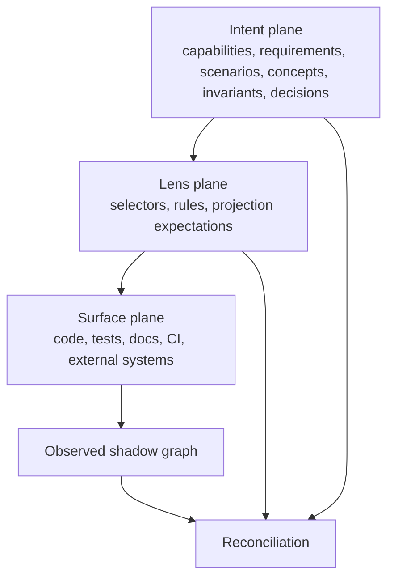
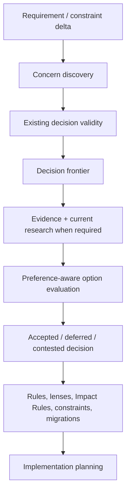
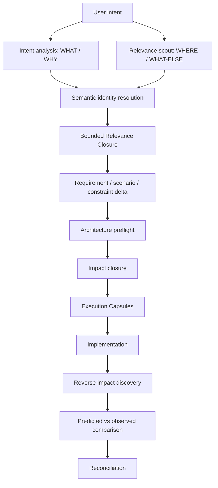
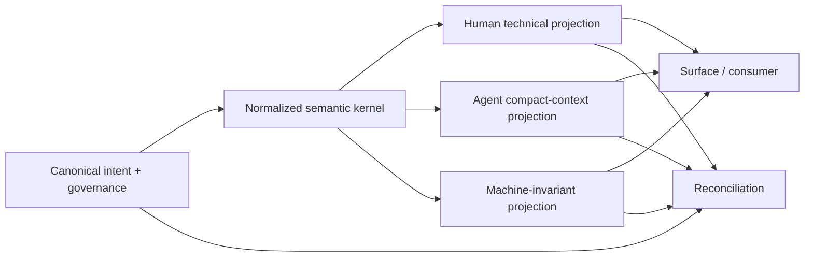
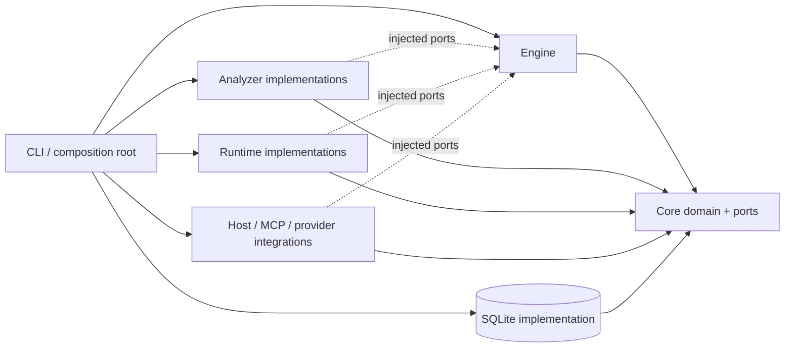
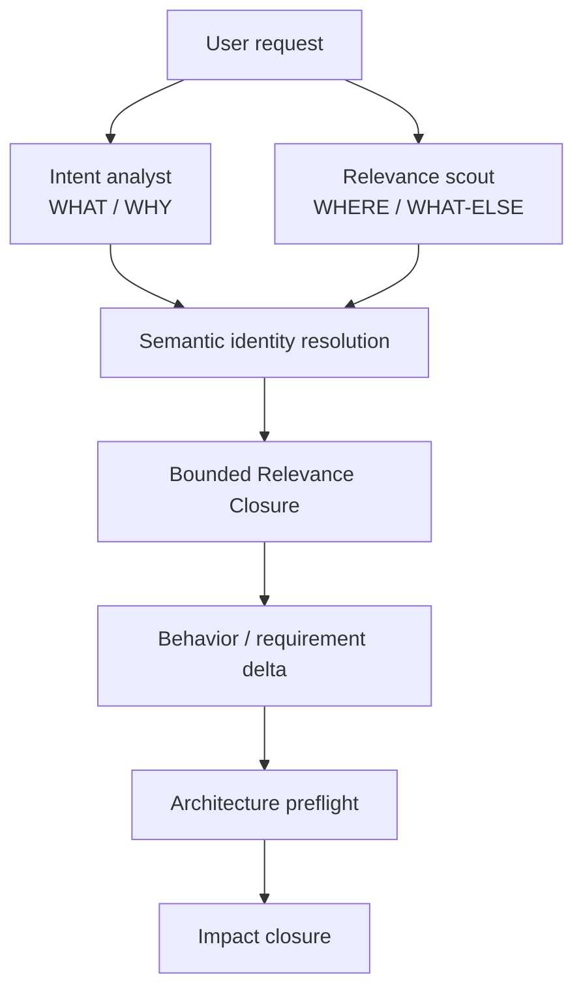
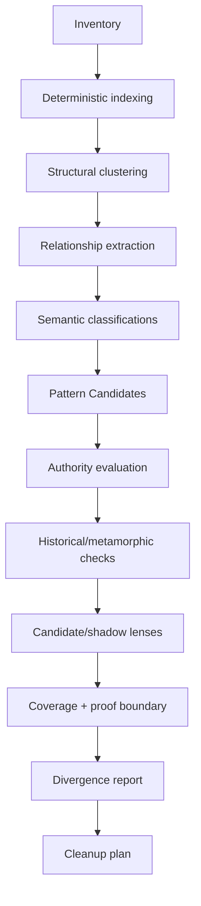

<!-- GENERATED FROM SPEC.md + spec.manifest.json. EDIT AUTHORITATIVE MODULES, NOT THIS BUNDLE. -->

<a id="projector-spec-entry"></a>

# Projector: Projection-Driven Development

## Authoritative Implementation Specification

**Version:** 2.0.0  
**Status:** Normative implementation handoff  
**Date:** 2026-08-07  
**Product:** Projector  
**Method:** Projection-Driven Development (PDD)  
**Reference implementation:** TypeScript / Node.js 24 / pnpm / SQLite  
**Primary execution hosts:** host-neutral core with Codex and Claude Code adapters  
**Tagline:** **Compile intent. Reconcile reality.**

> **Implementation directive:** Build Projector as a semantic control plane and change-cognition system. Do not treat it as a prompt pack, specification folder, repository map, linter collection, code generator, or giant document retrieval system. Prove the central semantic loop end to end before broad adapters or UI.

---

## Authority and composition

This modular specification is the authoritative implementation contract.

- `SPEC.md` defines product identity, specification-composition rules, the global causal loop, and progressive-disclosure routes.
- The Markdown modules listed in `spec.manifest.json` contain authoritative subsystem requirements and contracts.
- `INDEX.md` is a navigation/index projection. It MUST NOT introduce semantics absent from authoritative modules.
- `PROJECTOR_SPEC.md` is a deterministically generated portable bundle. It has no independent authority. Its source is `SPEC.md` plus manifest-ordered modules.
- No module may silently redefine a canonical contract owned by another module. Cross-module references use the canonical definition rather than copying it.
- If a concise root summary appears less specific than a subsystem requirement, the subsystem requirement governs. A true contradiction is a specification defect and MUST be resolved rather than handled by undocumented precedence.

The specification uses the same architecture it requires from Projector. Canonical knowledge is independently addressable, and explicit links/indexes route cross-cutting relevance. No implementation task should require the full specification when a bounded module set is sufficient.

---

## Product thesis

Projector makes globally coherent software change a property of the control plane rather than a recurring request made to an agent with incomplete context.

For every meaningful requested change, Projector determines which accumulated project semantics matter **before** local implementation reasoning dominates. It maintains stable semantic identity and separates descriptive precedent from normative authority. It progressively commits architecture and compiles bounded execution context. It tracks derivations and impact, verifies with independent evidence when required, reconciles observed reality, and learns reusable relationships and mechanics from successful reasoning.

The development unit is:

```text
semantic transaction
→ intent interpretation
→ semantic identity resolution
→ bounded Relevance Closure
→ Requirement / Behavioral Scenario / constraint delta
→ architecture concern + decision preflight
→ semantic operations
→ Impact Closure
→ dependency-scoped state binding
→ bounded projection work
→ reverse-impact comparison
→ verification
→ reconciliation
→ durable receipt / certificate
```

---

## Global causal loop

```text
observe reality without executing it by default
→ derive deterministic structure
→ interpret WHAT / WHY while independently scouting WHERE / WHAT-ELSE
→ resolve requested meaning against existing stable semantic identities
→ compile a bounded relevant semantic subgraph
→ create/modify durable Requirements and Behavioral Scenarios only where useful
→ resolve newly material architecture concerns without prematurely selecting HOW
→ compile Projection Lenses, Rules, expectations, and Impact Rules
→ bind plans/capsules to the semantic/physical dependencies they actually rely on
→ invalidate exact dependents and widen uncertain impact
→ repair deterministically/upstream where possible
→ dispatch agents only for bounded semantic residue
→ compare predicted relevance/impact with actual implementation impact
→ validate through required evidence lanes
→ reconcile to a fixed point
→ commit fine-grained canonical semantic state
→ turn accepted reasoning and relationships into cheaper executable machinery
```

---

## Semantic architecture at a glance

Projector maintains three authority/manifestation planes plus an observed shadow:

```text
Intent plane
  Concepts · Requirements · Behavioral Scenarios · invariants · decisions
       ↓
Lens plane
  selectors · Projection Lenses · Rules · Impact Rules · validators · transforms
       ↓
Surface plane
  code · tests · contracts · docs · CI · runtime · external systems
       ↓
Observed shadow
  deterministic facts · timestamped observations · explicit hypotheses
```

Change-time cognition traverses these planes rather than becoming a separate authority plane:

```text
request
→ Intent Analysis + Relevance Scout
→ Semantic Identity Resolution
→ Relevance Closure
→ behavior/constraint delta
→ architecture preflight
→ Impact Closure
→ Execution Capsules
→ implementation
→ reverse impact
→ reconciliation
```

**Encapsulation defines where canonical truth is owned. Relevance traversal determines when that truth must be considered.**

Projector does not collapse physical package structure, semantic ownership, event/contract topology, and retrieval topology into one tree.

---

## Core invariants

An implementation of Projector is not conforming unless it preserves these invariants:

1. **Zero-ceremony value:** `projector init` produces useful findings before manual ontology authoring.
2. **Stable semantic identity:** names, paths, and wording do not define identity. New durable semantics are resolved against existing identities first.
3. **Fine-grained canonical state:** bounded work does not require loading or rewriting a project-wide semantic blob.
4. **Relevance before impact:** Projector separately determines what must be understood and what a known delta actually affects.
5. **Semantic ownership without retrieval blindness:** cross-cutting truth is authored once and discovered through relationships/applicability.
6. **Evidence before authority:** repetition/inference is not normative by itself.
7. **Progressive architecture commitment:** concerns activate when material. Valid scoped decisions are reused until relevant basis changes.
8. **Meaning over encoding:** Markdown, Gherkin, agent context, and machine forms are representations of canonical semantics where Projector governs them.
9. **Deterministic first, AI at uncertainty:** deterministic computation owns exact mechanics. Models operate at semantic uncertainty frontiers.
10. **Dependency-scoped validity:** global snapshot digests identify snapshots but do not globally stale unrelated local work.
11. **Proof-aware optimization:** heuristic similarity cannot masquerade as exact semantic proof.
12. **Observed-vs-predicted reconciliation:** implementation surprises are surfaced, classified, and learned from rather than hidden.
13. **Crash-consistent governed mutation:** plans, approvals, transactions, rollback/recovery, and completion claims are state-bound and journaled.
14. **Truthful boundaries:** completeness, impact, and certainty claims expose unavailable/open-world/stale lanes.
15. **No ontology cathedral:** semantic machinery must reduce future reasoning/review cost enough to justify itself.

---

## Progressive-disclosure reading routes

Use [INDEX.md](#projector-spec-index) for the complete semantic index. For common tasks, start here:

| Task | Read first | Then |
|---|---|---|
| Understand Projector's product contract | [Vision and North-Star](#module-01-product-vision-and-north-star-md) | [Principles and Non-Goals](#module-01-product-principles-and-non-goals-md) |
| Implement canonical semantics/storage | [Canonical State](#module-02-semantic-kernel-canonical-state-md) | [Identity, Concepts, and Relations](#module-02-semantic-kernel-identity-and-relations-md), [State Binding and Core Ports](#module-02-semantic-kernel-state-binding-and-ports-md) |
| Implement SDD/change cognition | [Relevance and Change Cognition](#module-03-knowledge-relevance-and-change-cognition-md) | [Semantic Change Compiler](#module-07-change-semantic-change-compiler-md), [Execution Capsules](#module-05-projections-execution-capsules-md) |
| Implement architecture decisions | [Progressive Architecture Commitment](#module-03-knowledge-architecture-decisions-md) | concern/validity + evidence/consequence + risk modules linked there |
| Implement Projection Lenses/rules | [Lenses](#module-04-governance-lenses-md) | [Scope, Selectors, and Rules](#module-04-governance-scope-and-rules-md) |
| Implement invalidation/backdating | [Derivations and Invalidation](#module-05-projections-derivations-and-invalidation-md) | [Reconciliation and Divergence](#module-06-reconciliation-reconciliation-and-divergence-md) |
| Implement planning/execution | [Semantic Change Compiler](#module-07-change-semantic-change-compiler-md) | [Plans](#module-07-change-plans-md), [Transactions and Certificates](#module-07-change-transactions-and-certificates-md) |
| Implement analyzers/derived state | [Persistence and Observation](#module-09-evolution-persistence-and-observation-md) | [Conceptual Architecture](#module-02-semantic-kernel-conceptual-architecture-md) |
| Implement Codex/Claude integration | [Agent Orchestration](#module-08-agents-orchestration-and-models-md) | [Hosts and MCP](#module-08-agents-hosts-and-mcp-md) |
| Implement/verify a delivery slice | [Implementation Plan](#module-12-delivery-implementation-plan-md) | relevant acceptance modules under `12-delivery/`, then [Testing](#module-11-validation-testing-and-adversarial-evaluation-md) |

---

## Delivery rule

Implement by vertical slice, not by package completion. Each slice must close a causal loop with failing tests first, inspectable contracts, bounded context, deterministic machinery where possible, verification, reconciliation, and explicit proof boundaries.

Do not start broad visualization, cloud adapters, universal language support, or speculative ontology work before required local slices pass their acceptance scenarios.

---

<a id="projector-spec-index"></a>

# Projector Specification Index

This index routes readers and agents to authoritative modules without requiring full-spec ingestion. It is navigation, not an independent source of requirements.

## Module map

### Product

- [Vision and North-Star Behavior](#module-01-product-vision-and-north-star-md) — product behavior, initialization, explain/audit/reconcile/change/complete/upgrade behaviors.
- [Normative Principles and Non-Goals](#module-01-product-principles-and-non-goals-md) — global invariants, proof/authority rules, identity/relevance principles, explicit exclusions.

### Semantic kernel

- [Terminology and Source Classes](#module-02-semantic-kernel-terminology-and-source-classes-md) — canonical vocabulary and authored/derived/observed/inferred separation.
- [Conceptual Architecture](#module-02-semantic-kernel-conceptual-architecture-md) — intent/lens/surface planes, observed shadow, change cognition, semantic ownership vs retrieval.
- [Reference Implementation Architecture](#module-02-semantic-kernel-reference-implementation-md) — ports/composition-root architecture, package topology, technology defaults.
- [Canonical State](#module-02-semantic-kernel-canonical-state-md) — independently addressable canonical files, rebuild closure, version-control contract.
- [Identity, Concepts, and Relations](#module-02-semantic-kernel-identity-and-relations-md) — stable identity, aliases, Requirements, Behavioral Scenarios, Concept/Relation contracts, lineage.
- [Surfaces and Projection Units](#module-02-semantic-kernel-surfaces-and-projection-units-md) — observed artifacts, semantic anchors, Control Policy, code/spec traceability.
- [State Binding and Core Ports](#module-02-semantic-kernel-state-binding-and-ports-md) — global snapshot identity vs dependency-scoped validity, analyzer/graph/runtime/surface ports.
- [Architecture Decision Contracts](#module-02-semantic-kernel-architecture-decision-contracts-md) — concerns, decisions, validity, preferences, governance bases.
- [Semantic Representation Contracts](#module-02-semantic-kernel-representation-contracts-md) — human, behavioral/Gherkin, agent, machine representations and fidelity contracts.

### Knowledge, relevance, and authority

- [Relevance and Change Cognition](#module-03-knowledge-relevance-and-change-cognition-md) — WHAT/WHY vs WHERE/WHAT-ELSE, identity resolution, Relevance Closure, context bands, Analysis Facets, event/contract routing, Planning Surprises.
- [Evidence and Authority](#module-03-knowledge-evidence-and-authority-md) — evidence reliability/authority/independence/freshness, authority vectors/records, reconsideration triggers.
- [Progressive Architecture Commitment](#module-03-knowledge-architecture-decisions-md) — entrypoint for architecture reasoning.
- [Architecture Concerns and Decision Validity](#module-03-knowledge-architecture-concerns-and-validity-md) — preflight, concern discovery/materiality, scoped decision validity/coexistence.
- [Architecture Evidence, Preferences, and Consequences](#module-03-knowledge-architecture-evidence-and-consequences-md) — fresh evidence, preferences, deferral, consequence compilation, convergence/audit.
- [Risk, Approval, and Execution Policy](#module-03-knowledge-risk-and-execution-policy-md) — contextual R0–R4 risk and action policy.

### Governance

- [Pattern Candidates and Projection Lenses](#module-04-governance-lenses-md) — descriptive patterns, lens roles/expectations, active governance contract.
- [Scope, Selectors, and Rules](#module-04-governance-scope-and-rules-md) — scope algebra, dependency-keyed selectors, layered ignore policy, rule kernel/composition.

### Projections and validity

- [Execution Capsules](#module-05-projections-execution-capsules-md) — bounded task context, relevance/requirements/decisions/rules, completion contract.
- [Derivations, Invalidation, and Repair Routing](#module-05-projections-derivations-and-invalidation-md) — signatures, proof groups, Impact Rules, backdating, oracles, repair strategy.
- [Deterministic Runtime and Representation Validation](#module-05-projections-runtime-and-representations-md) — primitives, transforms, commands, representation fidelity.

### Reconciliation and coverage

- [Reconciliation, Divergence, Exceptions, and Migrations](#module-06-reconciliation-reconciliation-and-divergence-md) — fixed-point reconciliation, Planning Surprise comparison, divergence taxonomy, exceptions/migrations.
- [Coverage and Progressive Completion](#module-06-reconciliation-coverage-and-completion-md) — proof-sensitive coverage, relevance/identity lanes, information-gain completion.

### Change and execution

- [Plans, Revisions, and Rebase](#module-07-change-plans-md) — immutable plans, dependency-scoped bindings, partial completion/rebind/rebase.
- [Semantic Change Compiler](#module-07-change-semantic-change-compiler-md) — request → relevance → behavior delta → architecture → impact → plan.
- [Work Packets, Transactions, and Certificates](#module-07-change-transactions-and-certificates-md) — writer coordination, journal/recovery, receipts/certificates.

### Agents and hosts

- [Agent Orchestration and Model Inference](#module-08-agents-orchestration-and-models-md) — agent roles, model routing, validation independence, replayable inference.
- [Host and MCP Integration](#module-08-agents-hosts-and-mcp-md) — Codex/Claude capabilities, wrappers, generated instructions, state-bound tools.

### Evolution and external surfaces

- [Modernization and External Surfaces](#module-09-evolution-modernization-and-surfaces-md) — evidence-backed upgrades and surface adapter contract.
- [Persistence and Observation](#module-09-evolution-persistence-and-observation-md) — SQLite derived graph, revisions, rebuild, analyzers/init pipeline.
- [Historical Evaluation and Research](#module-09-evolution-historical-evaluation-and-research-md) — shadow-lens evaluation, co-change relevance evidence, current external research boundary.

### Operation

- [CLI, Modes, and Security](#module-10-operation-cli-modes-and-security-md) — command surface, modes, trust/path/authorization rules.
- [Observability, Economics, and Reporting](#module-10-operation-observability-and-reporting-md) — metrics for cost, relevance, semantic complexity, representation, reporting.

### Validation and delivery

- [Testing and Adversarial Evaluation](#module-11-validation-testing-and-adversarial-evaluation-md) — unit/property/fixture/host/live evaluation.
- [Benchmarks and Redesign Criteria](#module-11-validation-benchmarks-and-redesign-criteria-md) — release metrics, engineering gates, kill/redesign criteria.
- [Implementation Plan](#module-12-delivery-implementation-plan-md) — dependency-ordered vertical slices.
- [Mandatory First Vertical Slice](#module-12-delivery-first-vertical-slice-md) — misplaced-script causal-loop proof.
- [Core Acceptance Scenarios](#module-12-delivery-acceptance-core-md) — correctness/recovery/invalidation baseline.
- [Relevance and Semantic Identity Acceptance](#module-12-delivery-acceptance-relevance-and-identity-md) — anti-tunnel-vision, duplicate prevention, state-binding locality, Planning Surprises.
- [Representation Acceptance Scenarios](#module-12-delivery-acceptance-representation-md) — semantic-fidelity and token-economics behavior.
- [Architecture Acceptance Scenarios](#module-12-delivery-acceptance-architecture-md) — progressive architecture commitment and preference isolation.
- [Release, Dogfooding, and Final Directive](#module-12-delivery-release-and-directive-md) — public-release bar, self-governance, implementer checklist, final loop.

---

## Semantic lookup

| Concept / question | Canonical definition / primary module | Important consumers |
|---|---|---|
| Concept / stable identity / aliases | [Identity, Concepts, and Relations](#module-02-semantic-kernel-identity-and-relations-md) | relevance, projection units, governance, reconciliation |
| Requirement / Behavioral Scenario | [Identity, Concepts, and Relations](#module-02-semantic-kernel-identity-and-relations-md) | relevance, change compiler, representations, verification |
| Semantic Identity Resolution | [Relevance and Change Cognition](#module-03-knowledge-relevance-and-change-cognition-md) | change compiler, completion, testing |
| Relevance Closure | [Relevance and Change Cognition](#module-03-knowledge-relevance-and-change-cognition-md) | architecture preflight, capsules, plans, reporting |
| Impact Closure / Impact Rule | [Derivations and Invalidation](#module-05-projections-derivations-and-invalidation-md) | semantic change compiler, reconciliation, certificates |
| Planning Surprise | [Relevance and Change Cognition](#module-03-knowledge-relevance-and-change-cognition-md) | reconciliation, observability, acceptance tests |
| Fine-grained canonical persistence | [Canonical State](#module-02-semantic-kernel-canonical-state-md) | persistence/rebuild, transactions, Slice 0 |
| StateDigest | [State Binding and Core Ports](#module-02-semantic-kernel-state-binding-and-ports-md) | receipts, certificates, rebuild diagnostics |
| StateBinding | [State Binding and Core Ports](#module-02-semantic-kernel-state-binding-and-ports-md) | plans, capsules, transforms, MCP capabilities |
| Projection Unit | [Surfaces and Projection Units](#module-02-semantic-kernel-surfaces-and-projection-units-md) | lenses, derivations, repair, coverage |
| Projection Lens | [Pattern Candidates and Projection Lenses](#module-04-governance-lenses-md) | selectors/rules, derivations, reconciliation |
| Rule / Selector | [Scope, Selectors, and Rules](#module-04-governance-scope-and-rules-md) | capsules, transformations, governance |
| Architecture Concern / Decision | [Progressive Architecture Commitment](#module-03-knowledge-architecture-decisions-md) | semantic change compiler, modernization, rules/lenses |
| Evidence / Authority | [Evidence and Authority](#module-03-knowledge-evidence-and-authority-md) | patterns, decisions, research, validation |
| Representation Projection | [Semantic Representation Contracts](#module-02-semantic-kernel-representation-contracts-md) | capsules, host instructions, Gherkin/human specs |
| Derivation / Semantic Signature | [Derivations and Invalidation](#module-05-projections-derivations-and-invalidation-md) | invalidation, backdating, coverage |
| Reconciliation / Divergence | [Reconciliation and Divergence](#module-06-reconciliation-reconciliation-and-divergence-md) | completion, repair, certificates |
| Execution Capsule | [Execution Capsules](#module-05-projections-execution-capsules-md) | packets, hosts, agents |
| Semantic Change | [Semantic Change Compiler](#module-07-change-semantic-change-compiler-md) | plans, transactions, architecture preflight |
| Transaction / Receipt / Certificate | [Transactions and Certificates](#module-07-change-transactions-and-certificates-md) | recovery, audit, release evidence |

---

## Change-type reading routes

### A feature or behavior change

1. [Relevance and Change Cognition](#module-03-knowledge-relevance-and-change-cognition-md)
2. [Semantic Change Compiler](#module-07-change-semantic-change-compiler-md)
3. [Progressive Architecture Commitment](#module-03-knowledge-architecture-decisions-md) when material
4. [Execution Capsules](#module-05-projections-execution-capsules-md)
5. [Derivations and Invalidation](#module-05-projections-derivations-and-invalidation-md)
6. [Reconciliation and Divergence](#module-06-reconciliation-reconciliation-and-divergence-md)

### A pattern/refactor/governance change

1. [Pattern Candidates and Projection Lenses](#module-04-governance-lenses-md)
2. [Scope, Selectors, and Rules](#module-04-governance-scope-and-rules-md)
3. [Derivations and Invalidation](#module-05-projections-derivations-and-invalidation-md)
4. [Deterministic Runtime](#module-05-projections-runtime-and-representations-md)
5. [Reconciliation and Divergence](#module-06-reconciliation-reconciliation-and-divergence-md)

### A cross-platform or architecture-expanding change

1. [Relevance and Change Cognition](#module-03-knowledge-relevance-and-change-cognition-md)
2. [Architecture Concerns and Decision Validity](#module-03-knowledge-architecture-concerns-and-validity-md)
3. [Architecture Evidence, Preferences, and Consequences](#module-03-knowledge-architecture-evidence-and-consequences-md)
4. [Risk and Execution Policy](#module-03-knowledge-risk-and-execution-policy-md)
5. [Semantic Change Compiler](#module-07-change-semantic-change-compiler-md)

### Canonical storage / identity work

1. [Canonical State](#module-02-semantic-kernel-canonical-state-md)
2. [Identity, Concepts, and Relations](#module-02-semantic-kernel-identity-and-relations-md)
3. [State Binding and Core Ports](#module-02-semantic-kernel-state-binding-and-ports-md)
4. [Persistence and Observation](#module-09-evolution-persistence-and-observation-md)
5. [Relevance Acceptance](#module-12-delivery-acceptance-relevance-and-identity-md)

### Host/agent integration

1. [Execution Capsules](#module-05-projections-execution-capsules-md)
2. [Agent Orchestration and Model Inference](#module-08-agents-orchestration-and-models-md)
3. [Host and MCP Integration](#module-08-agents-hosts-and-mcp-md)
4. [CLI, Modes, and Security](#module-10-operation-cli-modes-and-security-md)

---

<a id="module-01-product-vision-and-north-star-md"></a>

# Vision and North-Star Behavior

## Executive summary

Projector is a self-starting semantic control plane for software evolution.

Projector observes a software system and infers concepts and recurring implementation patterns. It separates precedent from authority.

Projector also models durable behavioral intent: capabilities, requirements, scenarios, constraints, events/contracts, and the relationships that connect them across implementation boundaries. Before a request becomes a semantic delta, Projector resolves existing semantic identities. It then compiles a bounded relevance subgraph that prevents tunnel vision.

Projector compiles approved patterns into executable Projection Lenses and records derivations from their inputs. It calculates semantic impact and invalidates only expired validity proofs. It routes repair to the least costly sufficient mechanism and reconciles observed reality with intended semantic state.

Projector also governs **progressive architecture commitment**. Requirements, constraints, target platforms, scale, and operations can change. Projector identifies new material architecture concerns. It reevaluates only decisions whose assumptions or scope changed. It refreshes external evidence when needed.

Projector evaluates alternatives against hard constraints and explicit developer or project preferences. It shows the smallest decision frontier required for safe implementation.

A feature request MUST NOT hide a technology choice in intent. A suspect old decision MUST NOT be treated as proof that migration is required.

Projector also treats **human prose, agent context, and machine-checkable constraints as derived representations of the same canonical semantics**. Canonical concepts, decisions, rules, and predicates remain authoritative. Target-specific representation profiles may optimize readability or token cost. They MUST preserve normative force, negation, scope, cardinality, conditions, exceptions, dependency/order, and protected identifiers/literals. A compressed or polished rendering MUST NOT become authority merely because it is convenient to read or cheap to transmit.

Projector changes the development unit from:

```text
files + prompts + remembered conventions
```

to:

```text
semantic transaction
→ intent interpretation
→ semantic identity resolution
→ bounded relevance closure
→ requirement / scenario / constraint delta
→ architecture concern + decision preflight
→ concept + relationship delta
→ impact closure
→ invalidation
→ bounded projection work
→ reverse-impact comparison
→ verification
→ reconciliation
→ certificate
```

A user MUST be able to run:

```bash
projector init
```

in an existing repository that Projector can inspect and get useful findings without writing an ontology, architecture manifest, or rule inventory.

After enough coverage exists, a user MUST be able to request a conceptual change such as:

```bash
projector change "All repository automation scripts use the root script pattern with colocated tests"
```

and receive:

- normalized semantic intent.
- resolved existing semantic identities and any justified new identities.
- relevant canonical requirements, scenarios, invariants, decisions, events/contracts, and implementation bindings.
- a bounded relevance closure with explicit reasons and uncertainty.
- applicable decisions and lenses.
- known affected projection closure.
- possible uncertainty frontier.
- dependency-ordered execution plan.
- deterministic repairs where possible.
- bounded agent work only for semantic residue.
- required validations.
- a truthful completeness statement.
- a change certificate.

The system MUST make this causal loop cheaper over time:

```text
observe reality
→ infer concepts, relationships, and patterns
→ establish authority
→ resolve semantic identities before creating new ones
→ compile behavioral intent and relevance relationships
→ discover the bounded knowledge subgraph for each requested change
→ compile executable lenses and rules
→ compile target-specific semantic representations
→ record derivations
→ detect divergence
→ invalidate minimally
→ repair deterministically when possible
→ dispatch agents only for semantic residue
→ compare predicted and observed impact
→ verify
→ reconcile
→ promote accepted newly learned relationships
→ certify
→ convert accepted reasoning into reusable machinery
```

---


## North-star product behavior

## Zero-ceremony initialization

```bash
projector init
```

MUST:

1. Detect repository root and Git state.
2. Generate minimal `.projector/config.json`.
3. Inventory repository surfaces.
4. Build deterministic indexes.
5. Classify stable Projection Units.
6. Infer candidate concepts and relationships.
7. Cluster recurring descriptive patterns.
8. Inspect Git history for stability, migration direction, and copy ancestry.
9. Evaluate high-value pattern authority.
10. Produce candidate or shadow lenses where justified.
11. Calculate multi-dimensional coverage.
12. Emit a divergence/anomaly report.
13. Offer policy-allowed deterministic repairs.
14. Generate a cleanup plan.
15. Install or update requested host adapters.
16. Report the next highest-information unresolved architecture concern, decision, or semantic question.

No manual semantic modeling is required before step 12.

Required variants:

```bash
projector init --audit-only
projector init --offline
projector init --deep
projector init --interactive
projector init --autonomous
```

`init` MUST be idempotent.

## Explain any governed target

```bash
projector explain scripts/generate-icons.mjs
projector explain concept:repository-script
projector explain lens:repository-automation@2
projector explain divergence:div_...
projector explain --context-for scripts/generate-icons.mjs --operation modify
projector explain representation:agent-compact@1
projector explain requirement:REQ-...
projector explain relevance:rel_...
```

The explanation MUST trace:

- semantic classification.
- canonical identity and aliases.
- governing requirements and behavioral scenarios.
- why related entities entered the relevance closure.
- applicable Projection Lenses.
- effective rules.
- why each selector matched.
- relevant authority decisions.
- supporting and contradicting evidence.
- upstream semantic inputs.
- downstream dependents.
- current derivation and validity state.
- Control Policy.
- exceptions.
- invalidation conditions.
- compiled execution context.
- representation profile, protected semantic dimensions, and fidelity/token accounting when a derived representation applies.

## Audit at any time

```bash
projector audit
projector audit --scope packages/api
projector audit --since HEAD~20
projector audit --format json
projector audit --fail-on severity:high
```

The report MUST remain useful under partial coverage.

## Reconcile arbitrary agent work

```bash
projector reconcile
projector reconcile --base origin/main
projector reconcile --fix
```

Projector MUST treat the working tree as observed state, not assume work was performed through Projector.

Direct edits MUST resolve to one of:

1. Conforming change under an existing projection.
2. Semantic change requiring graph/model update.
3. Legitimate pattern or exception proposal.
4. Unexplained divergence.

## Compile and execute semantic changes

```bash
projector change "Replace handwritten REST client calls with generated typed clients"
projector plan change:chg_...
projector apply plan:plan_...
```

Before impact planning, Projector MUST resolve the request against existing semantic identities and compile a bounded relevance closure. It MUST then produce exact known impact and explicit uncertainty. Relevance discovery determines what knowledge must be considered to understand the change. Impact closure determines what a known semantic delta affects.

## Complete semantic coverage progressively

```bash
projector complete
projector complete --scope packages/api
projector complete --budget 20
```

A user may stop at any point. Accepted knowledge and cleanup work MUST remain resumable.

## Recommend and execute modernization

```bash
projector upgrade
projector upgrade --category architecture
projector upgrade --scope packages/api
```

Recommendations MUST start with demonstrated repository friction or platform constraints, not novelty.

## Progressively disclose architecture decisions

Ordinary feature/change requests MUST trigger architecture preflight when the requirement delta introduces or materially affects architectural concerns. Projector MUST:

1. Separate requested behavior/constraints from possible implementation solutions.
2. Discover newly material architecture concerns.
3. Identify existing decisions whose material assumptions, scope, platform/toolchain constraints, or evidence obligations were affected.
4. Reuse unaffected valid decisions without asking again.
5. Classify unresolved concerns as `blocking-now`, `material-soon`, or `deferable`.
6. Refresh live research only when a decision materially depends on mutable external facts and its evidence is not fresh enough for the changed question.
7. Evaluate current viable alternatives against hard constraints, local evidence, migration/operational cost, and applicable developer/project preferences.
8. Present the smallest high-information decision set needed for the next safe commitment.
9. Compile accepted decisions into explicit consequences such as rules, lenses, Impact Rules, constraints, migrations, or intentionally empty "keep it simple for now" outcomes.
10. Block governed completion only when an unresolved concern is actually blocking for the affected scope.

Progressive disclosure is a semantic planning property, not only a UI style. Projector SHOULD avoid premature architecture and accidental architecture.

---

---

<a id="module-01-product-principles-and-non-goals-md"></a>

# Normative Principles and Non-Goals

## Normative principles

The words **MUST**, **MUST NOT**, **SHOULD**, **SHOULD NOT**, and **MAY** are normative.

## Value before declaration

Projector MUST derive useful structure before asking a user to author semantic models. `projector init` MUST provide findings before any ontology or architecture ceremony is required.

## Evidence before authority

Observed repetition describes precedent. It does not establish that the precedent should govern future work. Normative authority requires explicit decision, constraint, independently useful evidence, or a policy-permitted promotion process.

Model inference alone MUST NOT authorize a blocking rule, active Projection Lens, or architecture migration.

## Canonical intent and derived state are different things

Accepted semantic intent MUST be durable and rebuildable from version-controlled canonical Projector files. Repository observations, indexes, inferred hypotheses, caches, and run state MUST remain rebuildable derived state.

Deleting `.projector/state.db` MUST NOT destroy accepted Concepts, Requirements, Behavioral Scenarios, authored Relations, active lenses, rules, authority decisions, exceptions, or migrations.

## Deterministic first

When Projector can handle a fact, selector, transformation, validation, or invalidation dependency deterministically, it SHOULD encode that behavior as machinery. This avoids repeated model reasoning.

Repeated successful reasoning SHOULD crystallize into recognizers, rules, transforms, validators, or cached decisions when that lowers future cost without weakening correctness.

## AI at the uncertainty frontier

Models are appropriate for semantic classification, competing-pattern interpretation, rationale synthesis, architecture judgment, bounded handwritten-code repair, and adversarial review. They are not the default mechanism for hashing, parsing, selector evaluation, known dependency traversal, deterministic transforms, or invariant checking.

## Optimization is assurance-bound

Projector MUST distinguish semantic similarity from semantic proof. Any optimization that prunes downstream work, declares a unit valid, or claims exact closure MUST state the assurance level and evidence lane that justify it.

Heuristic semantic equality MAY prioritize or narrow analysis, but MUST NOT by itself prove that downstream projections remain valid.

## Exactness without false certainty

Every completeness or impact claim MUST identify:

- modeled boundary.
- known affected set.
- possible frontier.
- unavailable or open-world dependency lanes.
- stale or failed observations.
- unknowns.

## Semantic precedent over textual proximity

A nearby artifact is weak precedent unless its semantic role, relationships, and governing lens match the current work.

## No manual synchronization ceremony

Projector MUST NOT require a normal workflow in which users remember to synchronize specifications with implementation. Reconciliation observes both directions: semantic intent to surfaces and surface mutations back to semantic state.

## Accepted knowledge compounds without becoming self-justifying

Accepted decisions, lenses, mappings, validators, transforms, and rationale SHOULD be reused until relevant inputs change. However, Projector-created conformity MUST NOT become independent evidence that the rule or lens which created it was correct.

## No ontology cathedral

A modeled entity is justified only when removing it would change planning, applicability, invalidation, transformation, verification, explanation, architectural choice, authority, or completeness semantics.

## Generation may be aggressive. Acceptance is governed

Agents may explore and generate freely inside declared sandboxes. Completion is a system claim, not an agent assertion. Governed completion requires state-bound plans, applicable rules, required independent evidence, reconciliation, and explicit unknowns.

## Correctness uses layered oracles

Projector MUST distinguish:

1. **rebuild correctness** — incremental state agrees with a clean rebuild from the same canonical inputs.
2. **independent conformance** — compilers, tests, schemas, runtime evidence, property checks, or independent reviewers support the semantic claim.
3. **historical/metamorphic validity** — lenses and selectors make useful predictions on prior or perturbed states.

A clean rebuild using the same analyzer implementation is not independent behavioral proof.

## Semantic transactions are state-bound and crash-consistent

Plans, work packets, approvals, and Execution Capsules MUST bind to the repository/canonical/toolchain state they were compiled against. Mutating workflows MUST journal enough state to recover safely after process death or host interruption.

## Governance must terminate

Applicability, rule composition, projection expectation, validity, reconciliation, and architecture-decision dependency groups MUST have explicit dependency strata. Cyclic cases require declared fixed-point semantics, cycle detection, and convergence limits. Projector MUST fail visibly rather than loop or silently settle on evaluation order.

## Progressive architecture commitment

Projector MUST delay architecture decisions until their concerns become material, then resolve them before implementation creates irreversible accidental commitments. New requirements activate questions, not preselected technologies. Existing decisions are reused until a typed reconsideration input materially affects their scope or justification.

## Decisions explain governance consequences

Every material architecture decision MUST be inspectable as a chain from concern → selected option → authority/rationale → consequences. Every active blocking rule or lens MUST have a typed governance basis. A rule does not need its own architecture decision when a hard constraint, adopted standard, migration overlay, host safety boundary, or authorized lens justifies it.

## Preferences inform. Constraints govern

Developer and organization preferences are decision-support priors, not hidden hard rules. A preference becomes enforceable only through an explicit project decision or constraint. Projector MUST make material preference influence visible when explaining a recommendation.

## Meaning is authoritative. Encoding is derived

Canonical semantic intent, governance, and executable predicates MUST remain authoritative over any human-readable or agent-optimized rendering. Human documentation, compact agent context, generated host instructions, and machine-facing invariant serializations are **Representation Projections** derived from canonical sources.

A Representation Projection MUST identify the source semantic state and representation profile that produced it. Editing a derived representation MUST NOT silently mutate canonical intent. If the edit represents a real semantic change, reconciliation promotes it through the normal semantic-change/authority workflow. Otherwise it is regenerated or classified as divergence.

## Optimize instruction efficiency, not token count alone

Token reduction is useful only when it preserves required behavior and lowers total cost. Projector MUST optimize representation under semantic-preservation and verification constraints rather than treating shortest text as best. Representation overhead, repeated profile injection, repair/retry cost, and behavior degradation count against the optimization.

A token-saving representation MAY be skipped when the source is already terse, the profile overhead exceeds expected savings, or evidence shows worse task/conformance outcomes.

## Resolve identity before creating semantics

Before Projector creates a durable semantic entity, it MUST try to resolve the requested meaning against existing canonical identities. This includes Concepts, Requirements, and Behavioral Scenarios. Names, paths, and wording are discovery signals, not identity. Creating a new identity requires an inspectable reason why existing entities do not already own the meaning.

## Relevance precedes impact

Projector MUST distinguish **relevance discovery** from **impact closure**. Relevance discovery determines what existing project knowledge may materially affect correct interpretation and planning of a proposed change. Impact closure determines what a known semantic delta affects. Relevance MAY use confidence-ranked semantic and historical evidence to prevent omission. Mutation/completion claims remain governed by the stronger proof rules of impact, invalidation, and coverage.

## Encapsulation owns. Traversal retrieves

Each canonical semantic fact MUST have one authoritative owner/home. Cross-cutting semantics MUST NOT be copied into every package or subsystem they affect merely to make them discoverable. Repository hierarchy, semantic ownership, event topology, platform topology, and retrieval topology are separate concerns. Encapsulation determines where truth is maintained. Typed relationships, applicability, implementation topology, and bounded relevance traversal determine when that truth enters a change context.

## Behavior is canonical. Spec encodings are projections

Durable product/system behavior SHOULD be represented as canonical Requirements and Behavioral Scenarios where doing so changes planning, verification, explanation, or change closure. Markdown specifications, Gherkin, ticket text, and agent-oriented summaries are representations or origin evidence. They MAY propose authored semantic changes, but durable Projector authority is established only after normalization into stable canonical semantic entities/relations through the semantic transaction workflow. Projector MUST NOT depend on an agent remembering to browse a specification directory for correctness.

## Snapshot identity is not local validity

Projector MAY compute global repository and canonical-root digests to identify complete snapshots. A global digest change MUST NOT be the sole reason that independently scoped semantic work becomes stale. Plans, capsules, approvals, and mutation capabilities MUST bind to explicit semantic/physical dependencies and query-result fingerprints. The fingerprints establish whether relied-on state changed.

---


## Explicit non-goals

Projector 1.x does not promise:

- formal verification of arbitrary business logic.
- perfect recovery of intent that left no evidence.
- a universal ontology.
- ownership of all source bytes.
- universal support for all languages.
- autonomous destructive production changes.
- automatic acceptance of contested architecture.
- a graph database requirement.
- one monolithic canonical semantic document that must be loaded or rewritten as a unit.
- a repository/package tree serving as the semantic ontology or context-retrieval boundary.
- a conventional spec-folder workflow whose correctness depends on agents voluntarily discovering relevant documents.
- a hosted SaaS requirement.
- a visual modeling prerequisite.
- automatic rewriting of arbitrary handwritten line ranges.
- replacement of compilers, tests, static analysis, security review, or human product judgment.
- canonicalization of every repeated style detail.
- treating controlled technical prose, compressed agent language, or generated host instructions as canonical semantic authority.
- proving arbitrary natural-language equivalence from compression or paraphrase alone.
- lock-in to one model vendor or agent host.

---

---

<a id="module-02-semantic-kernel-terminology-and-source-classes-md"></a>

# Terminology and Source Classes

## Canonical terminology

| Term | Definition |
|---|---|
| **Concept** | Stable semantic identity for a reusable project idea. Examples include capabilities, behaviors, invariants, decisions, ownership boundaries, events, commands, policies, read models, contracts, assumptions, data/interface boundaries, migrations, and constraints. |
| **Requirement** | Stable canonical statement of behavior, obligation, or externally meaningful system property that must remain addressable across wording, file, and implementation changes. |
| **Behavioral Scenario** | Stable observable example or branch that shows one or more Requirements. Gherkin and executable acceptance tests are representations or evidence, not identity. |
| **Semantic Identity Resolution** | Derived decision record that resolves requested meaning against canonical identities before reuse, split, coordinated modification, or new durable identity creation. |
| **Relation** | Typed factual or hypothesized connection between entities. Relations describe what is believed to be true. Governance propagation is modeled separately. |
| **Relevance Closure** | Bounded, provenance-aware, confidence-ranked semantic subgraph describing what existing knowledge may materially affect correct interpretation/planning of a requested change. It is distinct from impact closure. |
| **Analysis Facet** | Versioned change-analysis program that activates extra questions or relevance lanes. Typical concerns include behavior, events, security, realtime, migration, public contracts, and observability. It does not select architecture. |
| **Impact Rule** | Versioned governance rule describing when a known conceptual or structural change should widen, invalidate, revalidate, block, or require analysis beyond exact derivation dependencies. |
| **Impact Closure** | Proof-aware affected set/frontier produced after a semantic delta is known. Impact Closure controls invalidation/planning and MUST NOT be conflated with pre-change Relevance Closure. |
| **Planning Surprise** | Difference between predicted relevance/impact and the semantic closure implied by the actual implementation diff. It may reveal legitimate scope growth, an omitted relation, agent overreach, or a new reusable dependency. |
| **Surface** | Domain in which software meaning manifests: repository, CI, cloud, registry, runtime, app store, website, etc. |
| **Artifact** | Observed object on a Surface, such as a file, workflow, resource, or external record. |
| **Projection Unit** | Smallest stable manifestation Projector can fingerprint, govern, validate, invalidate, and repair independently. |
| **Pattern Candidate** | Descriptive inferred regularity. It is evidence, not authority. |
| **Projection Lens** | Versioned executable architectural mapping with selectors, projection expectations, rules, validators, transforms, and migration behavior. |
| **Projection Expectation** | The kind of state a lens expects: exact output, structured template, predicate-constrained state, observed state, or human procedure. |
| **Control Policy** | Structured policy expressing ownership, mutation mechanism, and actuation/approval for a Projection Unit. |
| **Rule** | Typed requirement, prohibition, preference, validator, transform, routing rule, permission, restriction, or explanation. |
| **Selector** | Serializable deterministic applicability predicate with declared dependencies. |
| **Evidence** | Observation supporting, contradicting, or contextualizing a claim, with reliability, authority, independence, freshness, and causal origin kept separate. |
| **Authority Record** | Inspectable decision establishing whether and why a pattern, lens, rule, or architecture choice should govern future work. |
| **Architecture Concern** | Material question or design force introduced or changed by requirements, constraints, scale, platforms, operations, or accumulated friction. It is a decision obligation, not a solution. |
| **Architecture Decision** | Canonical scoped record of what was chosen for a material concern. Its Authority Record explains why. Its consequences explain what governance changes because of it. |
| **Decision Validity Assessment** | Scope-specific derived result describing whether an accepted decision remains valid, is suspect, contested, or invalid for the scope being changed. |
| **Decision Frontier** | Smallest set of unresolved or suspect architecture decisions that materially constrain the next safe commitment. |
| **Developer Preference** | Explicit non-binding user, organization, or project preference used to rank otherwise viable options. Enforceable requirements are constraints/decisions, not preferences. |
| **Governance Basis** | Typed link that explains why a normative rule or lens may govern. Sources include decisions, hard constraints, adopted standards, migrations, host safety, or authorized lenses. |
| **Semantic Signature** | Versioned semantic fingerprint plus scope and assurance level describing what equality means and how strongly it may be trusted. |
| **Semantic Representation Profile** | Versioned target-specific encoding policy that compiles canonical semantics into human technical prose, compact agent context, or machine-checkable invariant form. |
| **Representation Projection** | Derived rendering that a Semantic Representation Profile produces. It binds to source semantic hashes/state and never gains authority merely because Projector generates or persists it. |
| **Semantic Preservation Fingerprint** | Dimensioned fingerprint used to check or prove protected meaning across representation. It covers normative force, negation, scope, cardinality, conditions, exceptions, dependency/order, and protected literals. |
| **Instruction Efficiency** | Workload-scoped ratio between validated behavioral/conformance utility and total instruction/context cost. The numerator definition MUST be explicit. It is not a universal scalar quality score. |
| **Derivation Record** | Inputs, signatures, rules, and validation evidence that justify the current validity of a Projection Unit. |
| **Divergence** | Difference between governed expectation and observed state. |
| **Anomaly** | Suspicious observation not yet established as divergence. |
| **Observability Class** | Whether a dependency lane is closed, bounded, open, sampled, or unavailable. |
| **Coverage** | Measured accounting of known semantic/physical state and proof strength within an explicitly stated boundary. |
| **Coverage Frontier** | Known edge between modeled/proven state and uncertain, open, stale, or unavailable territory. |
| **Invalidation** | Expiration of a prior validity proof. It does not imply regeneration. |
| **Execution Capsule** | Minimal task-scoped compiled objective, relevant semantic subgraph, rules, scope, state binding, tools, and verification contract. |
| **State Digest** | Global hash-bound identity of a complete repository/canonical/toolchain/external snapshot. It identifies a snapshot but is not by itself the validity dependency for locally scoped work. |
| **State Binding** | Dependency-scoped binding for plans, capsules, approvals, and capabilities. It binds selected values, boundary-defining query results, relevant toolchain inputs, and optional external snapshots. Query dependencies preserve negative-space facts such as selector membership, adjacency, and producer/consumer enumeration. |
| **Work Packet** | Executable unit in a plan referencing an Execution Capsule. |
| **Semantic Transaction** | End-to-end conceptual change through analysis, plan, mutation, verification, reconciliation, and durable receipt/certificate. |
| **Cleanup Plan** | Durable dependency-ordered plan for unresolved true technical debt. |
| **Transaction Receipt** | Compact committed record for material semantic/governance changes, binding the change to before/after state digests and verification summary. |
| **Change Certificate** | Verbose evidence record of what changed, how it was validated, what remains unknown, and how to roll back. |
| **Lineage** | Explicit move/split/merge/delete continuity between stable semantic identities. |

---


## Four source classes

Every graph fact MUST identify one source class.

## Authored

Accepted semantic intent:

- explicit user/product decisions.
- accepted Requirements and Behavioral Scenarios.
- approved invariants.
- active Projection Lenses.
- approved rules.
- exceptions.
- migrations.
- approved Semantic Representation Profiles.

Authored facts are canonical.

## Derived

Deterministically extracted facts:

- imports.
- exports.
- symbols.
- AST relationships.
- paths.
- package graph.
- test pairing.
- workflow graph.
- documentation links.
- Semantic Identity Resolutions, Relevance Closures, and Planning Surprise analyses unless explicitly promoted into canonical relationships.
- Representation Projections and Semantic Preservation Fingerprints.

Derived facts are disposable and recomputable.

## Observed

State read from runtime or external surfaces:

- remote resource properties.
- deployment settings.
- app-store metadata.
- runtime behavior.
- telemetry.
- package registry state.

Observed facts MUST include freshness.

## Inferred

Model- or heuristic-generated hypotheses:

- concept candidates.
- candidate aliases and duplicate/overlap matches.
- possible relevance relationships.
- likely roles.
- pattern candidates.
- probable migrations.
- suspected stale docs.
- candidate rationale.

Inferred facts MUST carry confidence, evidence, alternatives, and uncertainty.

Inferred facts MUST NOT silently become authored facts.

---

---

<a id="module-02-semantic-kernel-conceptual-architecture-md"></a>

# Conceptual Architecture

## Conceptual architecture

Projector has three semantic planes, one observed shadow, and a stratified governance evaluator.



## Intent plane

Contains semantic meaning and accepted decisions:

- capabilities, Requirements, and Behavioral Scenarios.
- events, commands, policies, contracts, and behavioral relationships when they materially affect discovery or verification.
- invariants and obligations.
- ownership boundaries.
- architecture decisions.
- data contracts and interfaces.
- compatibility promises.
- platform constraints.
- migrations.

## Lens plane

Contains executable architecture:

- Projection Lenses.
- selectors.
- Projection Expectations.
- rules and Impact Rules.
- recognizers.
- validators.
- transforms.
- migration overlays.
- exceptions.

## Surface plane

Contains physical or externally addressable manifestations.

## Observed shadow graph

Represents what Projector can currently observe. It contains deterministic facts, timestamped external observations, and explicitly marked hypotheses. Reconciliation compares the intended/lens planes against this shadow.

## Governance strata

Governance evaluation MUST use these default strata:

```text
L0  physical observations
L1  deterministic structure
L2  semantic classifications and hypotheses
L3  lens memberships
L4  effective rules and projection expectations
L5  derivations, validity, divergence, and completion state
```

Dependencies SHOULD point from higher layers to lower layers. A rule at L4 may depend on a classification at L2. A physical fact at L0 MUST NOT depend on whether an L4 rule applies.

A recursive extension is allowed only when it declares:

- the participating entities.
- monotonic update semantics or another well-defined fixed-point rule.
- strongly connected component evaluation.
- a state-digest convergence test.
- maximum iterations/time.
- the failure emitted if convergence is not reached.

Required failures include `governance-cycle`, `nonconvergent-reconciliation`, and `derivation-cycle-unresolved`.

## Correctness oracles

Projector reasons with three different oracles and MUST NOT collapse them:

- **Rebuild oracle:** detects incremental/cache/indexing mistakes by rebuilding from canonical local inputs.
- **Independent conformance oracle:** supplies semantic evidence from an independent lane, such as compiler/type system, pre-existing tests, schemas, runtime observations, property tests, or an independent reviewer.
- **Historical/metamorphic oracle:** evaluates whether a lens, selector, or transform predicts useful outcomes across historical or systematically perturbed states.

The assurance attached to a conclusion MUST reflect which oracle actually supports it.

## Architecture decision lifecycle

Architecture decisions live in the Intent plane and compile consequences into the Lens plane. They are not a fourth implementation surface.



The lifecycle MUST be scope-aware. Adding a mobile target may make a web-only decision suspect for mobile. The change MUST NOT invalidate the decision for the existing web scope.

## Change cognition: relevance before impact

Projector's semantic planes describe authority and manifestation. Change-time cognition is a derived traversal over those planes and the observed shadow. It MUST NOT introduce a parallel source of truth.



**Relevance Closure** answers which existing knowledge may materially affect correct interpretation/planning of a proposed change. **Impact Closure** answers what an already-known semantic delta affects. The former may include confidence-ranked exploratory edges to prevent omission. The latter governs mutation/completion and therefore uses Projector's stronger proof/observability semantics.

Change intake MUST keep three questions distinct:

- **WHAT / WHY** — requested behavior, constraints, and intent.
- **WHERE / WHAT-ELSE** — existing semantic/code/event/contract neighborhoods that may be implicated.
- **HOW** — architecture and implementation choices, decided only after the first two are sufficiently understood.

Protecting WHAT from premature HOW MUST NOT require ignorance of WHERE.

## Semantic ownership and retrieval topology

Semantic encapsulation establishes one authoritative home for each durable truth. It does not define context boundaries. Repository/package structure, semantic ownership, platform boundaries, event/contract topology, and retrieval topology are orthogonal projections.

A cross-cutting invariant is authored once. Projector discovers it where relevant through typed relations, applicability selectors, implementation bindings, event/contract edges, and bounded relevance traversal. The physical canonical storage hierarchy MAY optimize Git locality and human browsing, but MUST NOT determine applicability or retrieval.

## Semantic representation projections

Representation is a compilation concern between canonical semantics/governance and the Surface plane. It is **not** a fourth authority plane.



Default target classes:

1. **Human technical** — optimize explicitness and low decoding ambiguity. Use one stable name per concept, explicit actors/conditions, direct verbs, short single-purpose sentences, and structured procedures. Style linting is useful, but a style score is not semantic proof.
2. **Agent compact context** — minimize actual context tokens after accounting for profile overhead. Remove filler, pleasantries, hedging, redundant rationale, and repeated explanations. Fragments are allowed only when protected semantics remain unambiguous. Preserve code, commands, paths, API names, numbers/units, identifiers, negation, and normative force exactly or through an exact structured kernel.
3. **Machine invariant** — serialize normalized rules, predicates, scopes, permissions, dependencies, and hashes directly. This is the strongest representation lane for semantics already expressible in Projector's rule/predicate kernel.

Projector MUST derive a Representation Projection from canonical semantic sources, not another lossy prose projection, when the canonical source is available. Common source hashes plus compatible Semantic Preservation Fingerprints establish cross-projection consistency, not textual similarity.

Changing a representation profile invalidates only projections, contexts, or derivations that depend on that profile unless the change also modifies canonical governance. It MUST NOT dirty the underlying decision/rule merely because the encoding changed.

Reference profiles MAY borrow controlled-technical-English discipline and aggressive token-compression techniques, but Projector's own profile contracts, preservation rules, and validators are authoritative. No third-party writing/compression system is a required runtime dependency.

---

---

<a id="module-02-semantic-kernel-reference-implementation-md"></a>

# Reference Implementation Architecture

## Reference implementation architecture

The semantic engine depends on ports, not concrete analyzer, runtime, host, provider, or persistence implementations. The CLI/application layer is the composition root.



Required semantic subsystems:

1. Deterministic observation and indexing.
2. Canonical semantic identity, Requirement, and Behavioral Scenario management.
3. Semantic identity resolution and duplicate/overlap prevention.
4. Relevance discovery and bounded context-subgraph compilation.
5. Inference and Pattern Candidate mining.
6. Authority and rationale evaluation.
7. Selectors, lenses, and rule compilation.
8. Derivation, semantic invalidation, and impact closure.
9. Semantic representation compilation and fidelity validation.
10. Deterministic transformation runtime.
11. Semantic change analysis, planner, and packet executor.
12. Reverse-impact comparison, reconciliation, and divergence.
13. Coverage and information-gain interaction.
14. Agent orchestration.
15. Host/MCP integration.
16. External surface adapter framework.

Core semantic services MUST be testable with in-memory/fake ports. No host brand, SQLite API, model vendor, process runner, or filesystem implementation may be required by domain contracts.

---


## Repository/package layout

Start with a small package graph whose dependency direction matches the ports architecture:

```text
/
├─ packages/
│  ├─ core/
│  │  ├─ src/domain/
│  │  ├─ src/schemas/
│  │  ├─ src/ports/
│  │  ├─ src/hashing/
│  │  └─ src/identity/
│  ├─ engine/
│  │  ├─ src/inference/
│  │  ├─ src/authority/
│  │  ├─ src/governance/
│  │  ├─ src/representation/
│  │  ├─ src/invalidation/
│  │  ├─ src/reconciliation/
│  │  ├─ src/coverage/
│  │  ├─ src/change/
│  │  └─ src/planning/
│  ├─ analyzers/
│  │  ├─ src/filesystem/
│  │  ├─ src/git/
│  │  ├─ src/typescript/
│  │  ├─ src/structured-data/
│  │  ├─ src/markdown/
│  │  └─ src/github-actions/
│  ├─ runtime/
│  │  ├─ src/primitives/
│  │  ├─ src/transforms/
│  │  ├─ src/execution/
│  │  ├─ src/journal/
│  │  └─ src/worktrees/
│  ├─ integrations/
│  │  ├─ src/codex/
│  │  ├─ src/claude/
│  │  ├─ src/mcp/
│  │  ├─ src/models/
│  │  └─ src/surfaces/
│  ├─ cli/
│  └─ testkit/
├─ fixtures/
├─ examples/
├─ docs/
├─ scripts/
└─ AGENTS.md
```

Dependency rule:

```text
core          -> no workspace dependency
engine        -> core
analyzers     -> core
runtime       -> core
integrations  -> core
cli           -> core + engine + analyzers + runtime + integrations
```

An integration wrapper MAY depend on the engine's narrow public facade when orchestration requires it, but MUST NOT import engine internals.

Concrete implementations are assembled in `cli` or another application composition root. This prevents `engine <-> runtime` and `engine <-> analyzer` dependency cycles while still allowing the engine to invoke injected ports.

A package SHOULD be split only when a release, security, performance, or dependency-isolation boundary justifies it.

---


## Technology choices

Reference implementation decisions MUST themselves show Projector's decision discipline. The choices below are defaults, not eternal doctrine. Implementation work SHOULD materialize them as Projector Architecture Decisions with Authority Records and reconsideration triggers.

| Choice | Why this is the reference default | Reconsider when |
|---|---|---|
| Node.js 24 LTS | Stable supported runtime for a TypeScript-first local CLI/library. Avoids chasing the current non-LTS line. | Support window, required runtime APIs, host compatibility, or deployment target materially changes. |
| Strict TypeScript + ESM | Keeps contracts explicit and machine-checkable in the primary implementation ecosystem. | A native or performance boundary clearly justifies another language or module boundary. |
| pnpm workspaces | Strong workspace support and low ceremony for the deliberately small monorepo. | Package topology, publishing requirements, organizational tooling, or package-manager constraints change. |
| Zod + exported JSON Schema | One executable schema source validates runtime/canonical contracts and exports interoperable schemas. | Another tool improves cross-language schema generation or performance without duplicating authority. |
| SQLite for derived state | Local, transactional, queryable, rebuildable state with no service dependency. | Measured graph/query/concurrency workloads exceed it. Do not pre-emptively add a graph/database service. |
| TypeScript Compiler API for TS/JS indexing | Provides semantic symbol/type data instead of text-only parsing for the initial language wedge. | Language coverage or measured performance justifies another adapter that preserves semantic contracts. |
| Source-location-preserving structured-data/Markdown parsers | Stable semantic anchors require structured addresses and source locations. | A parser fails supported syntax, fidelity, performance, or maintenance requirements. |
| Git subprocess integration | Git already provides the revision and transaction substrate, and its CLI is inspectable. | A library/native API improves correctness or portability without limiting supported Git workflows. |
| Vitest + fast-check | Fast TypeScript-native tests plus property testing for algebraic/incremental invariants. | Testing requirements or ecosystem support materially change. |
| Canonical JSON + versioned SHA-256 | Deterministic portable semantic/state digests without introducing a specialized content-addressing dependency. | Hash/security/interoperability requirements change or measured performance justifies another versioned scheme. |
| JSONL + optional OpenTelemetry-compatible spans | Useful local observability without requiring a hosted backend. | Operational deployments require another telemetry contract. |

The *reasoning* and triggers above are part of the architecture, not incidental documentation. A later implementation decision that changes one MUST update the corresponding decision/authority and any rules or lenses derived from it.

Do not require:

- graph database.
- daemon.
- message broker.
- hosted service.
- embeddings for initial clustering.
- generic Tree-sitter support before the TypeScript/structured-data vertical slice works.

---

---

<a id="module-02-semantic-kernel-canonical-state-md"></a>

# Canonical State

## `.projector/` canonical contract

Canonical authored/governance state MUST be closed under rebuild.

```text
.projector/
├─ config.json
├─ model/
│  ├─ concepts/
│  │  └─ <stable-id>.concept.json
│  ├─ requirements/
│  │  └─ <stable-id>.requirement.json
│  ├─ scenarios/
│  │  └─ <stable-id>.scenario.json
│  └─ relations/
│     └─ <stable-id>.relation.json
├─ rules/
│  └─ *.rule.json
├─ lenses/
│  └─ *.lens.json
├─ representations/
│  └─ *.representation.json
├─ authorities/
│  └─ *.authority.json
├─ concerns/
│  └─ *.concern.json
├─ decisions/
│  └─ *.decision.json
├─ preferences/
│  └─ *.preference.json      # project-adopted preferences only
├─ exceptions/
│  └─ *.exception.json
├─ migrations/
│  └─ *.migration.json
├─ receipts/
│  └─ *.receipt.json
├─ plans/                    # ignored by default
├─ certificates/             # ignored by default
├─ reports/                  # ignored by default
├─ generated/                # ignored unless repository opts in
├─ cache/                    # ignored
└─ state.db                  # ignored. Fully derived.
```

## Canonical content

Canonical semantic state under `.projector/model/` is **fine-grained and independently addressable**. Projector persists Concepts, Requirements, Behavioral Scenarios, and authored Relations by stable semantic identity instead of collecting them in one project-wide semantic blob. The canonical model MUST NOT become a dump of derived repository observations.

The physical directory hierarchy is a storage/indexing projection, not semantic authority. Moving a canonical entity file does not change its identity. Repositories MAY deterministically shard a large kind directory by stable-ID prefix without semantic effect. Generated indexes and Projector queries support human/domain browsing without making path hierarchy define meaning.

Canonical by default:

- configuration.
- authored Concepts and Relations.
- accepted Requirements and Behavioral Scenarios.
- active/approved rules.
- active/approved lenses.
- active/approved Semantic Representation Profiles.
- authority records that govern active state.
- material architecture concerns with durable dispositions.
- active/superseded architecture decisions.
- project-adopted preferences.
- exceptions.
- migrations.
- required R2+ transaction receipts.

Representation Projection outputs are derived even when a repository elects to persist them under `.projector/generated/` or another governed surface. Committing a generated rendering does not make it authoritative. Its canonical source remains the profile plus referenced semantic entities.

Store derived and inferred observations in SQLite or ignored artifacts. This includes undecided concerns, decision proposals, selector matches, index state, transient findings, model calls, raw research, and caches. User and organization preference profiles are external inputs. Projector MUST NOT copy them into repository governance unless the project adopts them.

## Canonical schema requirements

Every canonical document MUST include:

- `apiVersion` and/or schema version.
- stable ID and canonical key.
- lifecycle state.
- semantic hash calculated over a schema-defined semantic projection.
- discovery hash when the entity participates in identity/retrieval metadata whose changes must be distinguishable from semantic changes.
- references by stable IDs, never path coincidence alone.

Complete canonical snapshot identity MUST be based on deterministic canonical-document content hashes, not only semantic hashes. Semantic/discovery hashes exist to localize *which dimension* changed. The canonical document hash exists to prove the exact canonical snapshot changed.

Volatile fields include timestamps, run IDs, local paths, and UI metadata. These fields MUST NOT affect semantic hashes unless the schema declares them meaningful.

Canonical format migrations MUST be deterministic, versioned, previewable, and independently testable.

## Canonical semantic addressability

Canonical semantic storage MUST satisfy all of the following:

- Canonical storage MUST NOT require a bounded change to load or rewrite the complete semantic graph to resolve, modify, validate, or hash its dependencies.
- Physical storage preserves enough semantic locality to avoid needless Git conflicts, context ingestion, cache invalidation, plan invalidation, or review noise.
- Stable IDs, not filenames or directories, define identity.
- Multi-entity semantic transactions remain atomic through Projector's transaction journal even though their canonical documents are physically independent.
- Global canonical-root digests MAY identify complete snapshots and support rebuild/audit. They MUST NOT be the sole validity dependency for local plans, capsules, approvals, or mutation capabilities.

A derived canonical-root manifest MAY be computed deterministically from the sorted `(entityId, canonicalDocumentHash)` set plus other canonical governance files. `canonicalDocumentHash` is computed from deterministic canonical serialization of the complete canonical document (excluding only explicitly noncanonical/volatile fields). It is distinct from schema-defined `semanticHash` and `discoveryHash`. This makes every canonical edit change complete snapshot identity without claiming that every edit changed behavioral meaning. The manifest is rebuildable and MUST NOT become an independently edited source of truth.

## Canonical locality and relations

Projector persists each Relation independently by stable ID unless a future schema defines an aggregate whose atomicity has semantic value. Projector MUST NOT require a relation and both endpoint entities to share a directory or package. Cross-cutting relations are precisely how canonical truth remains singular while retrieval crosses encapsulation boundaries.

## Version-control defaults

Commit canonical state. Ignore by default:

- `state.db`.
- cache.
- transient reports.
- generated host files.
- verbose certificates.
- unfinished local plans unless repository policy opts in.

R2+ semantic or governance transactions MUST commit a compact content-addressed receipt. Repository policy MAY require committing R1 receipts. Ordinary observations MUST NOT create one repository event file per fact.

## Rebuild inputs

A deterministic local rebuild uses only:

1. Repository/Git state.
2. Committed canonical `.projector/` state.
3. An explicitly pinned external observation snapshot, if the requested operation includes one.

Live external systems are never silently read as part of the rebuild oracle.

---

---

<a id="module-02-semantic-kernel-identity-and-relations-md"></a>

# Identity, Concepts, and Relations

## Core contract authority

Every public serialized contract MUST have a corresponding Zod schema. A normative code block MUST NOT reference an undefined cross-package type. CI MUST load the exported contract registry and fail if a referenced public schema is absent or not explicitly marked `extension-defined`.

Implementations MAY add backward-compatible fields, but MUST preserve the semantics below.

## Base identity, source class, and semantic hashing

```ts
export type EntityId = string;
export type Confidence = number; // 0..1; inference confidence, not a calibrated probability unless stated
export type ContentHash = `sha256:v1:${string}`;

export type SourceClass =
  | "authored"
  | "derived"
  | "observed"
  | "inferred";

export interface EvidenceRef {
  evidenceId: EntityId;
  stance: "supports" | "contradicts" | "context";
  weight?: number;
}

export interface CausalOrigin {
  kind:
    | "pre-projector"
    | "human"
    | "deterministic-observation"
    | "model-inference"
    | "semantic-resolution"
    | "relevance-analysis"
    | "planning-surprise"
    | "lens-transform"
    | "plan"
    | "external";
  causedByLensId?: EntityId;
  causedByRuleId?: EntityId;
  causedByTransformId?: string;
  causedBySemanticChangeId?: EntityId;
  causedByRelevanceClosureId?: EntityId;
  causedByPlanningSurpriseId?: EntityId;
  causedByPlanId?: EntityId;
  causedByPacketId?: EntityId;
}

export interface SemanticSignature {
  hash: ContentHash;
  profileId: string;
  profileVersion: string;
  scope: string;
  assurance: "exact" | "validated" | "heuristic";
  evidenceIds: EntityId[];
}
```

Every entity schema MUST define a **semantic projection**: the exact subset and normalization of fields that participate in its semantic hash. Volatile timestamps, run IDs, local cache locations, and UI metadata are excluded unless explicitly semantically meaningful.

Identity policy:

- authored entities receive a stable ID once and retain it.
- derived entities use deterministic adapter-namespaced identity from canonical semantic identity.
- inferred candidates derive identity from stable semantic key plus normalized evidence-set identity.
- moves preserve identity when the semantic anchor resolves.
- splits, merges, replacements, and deletions produce explicit lineage records and tombstones.

```ts
export interface LineageRecord {
  id: EntityId;
  kind: "move" | "split" | "merge" | "replace" | "delete";
  fromIds: EntityId[];
  toIds: EntityId[];
  reason: string;
  stateDigest: ContentHash;
}

export interface Tombstone {
  entityId: EntityId;
  deletedAtRevision: number;
  lastSemanticHash: ContentHash;
  replacementIds: EntityId[];
  reason: string;
}
```


## Concepts and factual relations

```ts
export interface Concept {
  id: EntityId;
  key: string;
  kind:
    | "capability"
    | "behavior"
    | "invariant"
    | "decision"
    | "ownership"
    | "obligation"
    | "data"
    | "interface"
    | "event"
    | "command"
    | "policy"
    | "read-model"
    | "contract"
    | "assumption"
    | "migration"
    | "constraint";
  name: string;
  aliases: string[];
  statement: string;
  status: "candidate" | "active" | "deprecated" | "rejected";
  sourceClass: SourceClass;
  confidence: Confidence;
  tags: string[];
  evidence: EvidenceRef[];
  discoveryHash: ContentHash;
  semanticHash: ContentHash;
}

export type RelationType =
  | "realizes"
  | "requires"
  | "constrains"
  | "depends-on"
  | "has-requirement"
  | "demonstrated-by"
  | "produces"
  | "consumes"
  | "triggers"
  | "governed-by"
  | "applies-to"
  | "generates"
  | "documents"
  | "verifies"
  | "deploys-to"
  | "publishes-to"
  | "observes"
  | "owns"
  | "incompatible-with"
  | "derived-from"
  | "supersedes"
  | "exception-to"
  | "variant-of";

export interface Relation {
  id: EntityId;
  fromId: EntityId;
  toId: EntityId;
  type: RelationType;
  sourceClass: SourceClass;
  confidence: Confidence;
  evidence: EvidenceRef[];
  active: boolean;
  semanticHash: ContentHash;
}
export interface IntentOriginRef {
  kind: "user-request" | "linear" | "github-issue" | "document" | "external";
  locator: string;
  contentHash?: ContentHash;
  description?: string;
}

export interface Requirement {
  id: EntityId;
  key: string;
  title: string;
  aliases: string[];
  statement: string;
  status: "candidate" | "active" | "deprecated" | "rejected" | "superseded";
  sourceClass: SourceClass;
  scope: SelectorExpr;
  origin: IntentOriginRef[];
  evidence: EvidenceRef[];
  discoveryHash: ContentHash;
  semanticHash: ContentHash;
}

export interface BehavioralScenarioStep {
  role: "precondition" | "trigger" | "expected-outcome" | "forbidden-outcome";
  statement: string;
}

export interface BehavioralScenario {
  id: EntityId;
  key: string;
  title: string;
  aliases: string[];
  status: "candidate" | "active" | "deprecated" | "rejected" | "superseded";
  sourceClass: SourceClass;
  scope: SelectorExpr;
  steps: BehavioralScenarioStep[];
  evidence: EvidenceRef[];
  discoveryHash: ContentHash;
  semanticHash: ContentHash;
}
```

A `Relation` records a fact or hypothesis. It MUST NOT carry mandatory governance propagation merely because the relation exists. Exact invalidation is derived from derivation inputs. Conceptual widening/impact behavior is defined by `ImpactRule` in active governance.

Requirements and Behavioral Scenarios are canonical semantic entities only when their stable identity changes planning, relevance discovery, verification, explanation, or change closure. They are not required for every trivial code edit.

Their authored `scope` reuses `SelectorExpr` machinery, but behavioral semantics SHOULD be scoped through semantic/product dimensions such as Concept, platform, operation, contract, or explicit tags. Implementation-only scope atoms MUST NOT define behavioral meaning just because current code lives there. Examples include path, language, AST pattern, and control mechanism. Implementation bindings belong in derived Relations/Projection Units unless location itself is an accepted product/compatibility constraint.

A Behavioral Scenario captures observable semantics, not an implementation test file or Gherkin syntax tree. `BehavioralScenarioStep.role` is representation-neutral: preconditions, trigger/action, expected outcomes, and explicitly forbidden outcomes. Gherkin `GIVEN`/`WHEN`/`THEN`/`AND`/`BUT`, Cucumber/Behave features, generated test skeletons, and human-readable acceptance specifications MAY be Representation Projections or verification evidence derived from the same scenario identity. Conjunction wording is a rendering concern. It MUST NOT become canonical scenario identity.

Aliases, canonical keys, and human-facing names/titles are discovery/terminology metadata. They MUST NOT define or replace stable identity, and changing them MUST NOT create a new entity or imply that the entity's behavioral/system meaning changed.

`discoveryHash` fingerprints the schema-defined metadata used by semantic identity resolution/retrieval. `semanticHash` fingerprints the entity's schema-defined meaning/applicability semantics and MUST exclude purely discovery/display metadata unless that metadata is itself semantically meaningful for that entity kind. A canonical document/snapshot hash still changes when any canonical field changes.

Therefore an alias/name change can invalidate identity-search/Relevance `StateQueryDependency`s while leaving derivations that depend only on unchanged semantic meaning current. Stable identity remains the entity ID, not either hash.

Use stable Concepts plus typed Relations for event, command, policy, read-model, and contract topology. Add a specialized canonical entity only when it changes Projector behavior enough to justify itself.

Canonical entity documents own intrinsic entity semantics. Canonical `Relation` documents own graph edges. Requirement↔Capability and Requirement↔Behavioral Scenario links MUST use typed Relations (`has-requirement`, `demonstrated-by`) rather than duplicating authoritative edge lists inside both endpoint documents. Derived indexes MAY materialize adjacency arrays for query speed, but they remain rebuildable.

`Concept` is the canonical generic semantic-identity record only when no richer specialized canonical contract owns the same semantics. Projector MUST NOT duplicate a `Requirement`, `BehavioralScenario`, or `ArchitectureDecision` as a second Concept document merely to make the graph uniform. Typed Relations may target any stable `EntityId` directly, and derived indexes MAY project common summary fields for heterogeneous graph queries. `Concept.kind = "decision"` is therefore reserved for durable non-architecture decisions that do not use the `ArchitectureDecision` contract. A `behavior` Concept names reusable behavioral meaning. A normative obligation about that behavior belongs in a `Requirement`.

---

<a id="module-02-semantic-kernel-surfaces-and-projection-units-md"></a>

# Surfaces and Projection Units

## Surfaces, observability, and artifacts

```ts
export type ObservabilityClass =
  | "closed"
  | "bounded"
  | "open"
  | "sampled"
  | "unavailable";

export interface EnumerationContract {
  observability: ObservabilityClass;
  method: string;
  assumptions: string[];
  blindSpots: string[];
  dynamicMechanisms: string[];
  freshnessRequirement?: string;
}

export interface SurfaceCapabilities {
  read: boolean;
  write: boolean;
  watch: boolean;
  transactionalWrites: boolean;
  stableAnchors: boolean;
  humanApprovalRequired: boolean;
}

export interface Surface {
  id: EntityId;
  key: string;
  kind:
    | "repository"
    | "ci"
    | "cloud"
    | "package-registry"
    | "app-store"
    | "website"
    | "runtime"
    | "database"
    | "external";
  adapter: string;
  access: "read-write" | "read-only" | "declared-only" | "unavailable";
  enumeration: EnumerationContract;
  capabilities: SurfaceCapabilities;
  boundary: Record<string, unknown>;
}

export interface Artifact {
  id: EntityId;
  surfaceId: EntityId;
  locator: string;
  mediaType: string;
  contentHash: ContentHash;
  structuralSignature?: SemanticSignature;
  semanticSignature?: SemanticSignature;
  observedAt: string;
  observationRevision: string;
  causalOrigin: CausalOrigin;
  metadata: Record<string, unknown>;
}
```

External observations are revisioned snapshots. `observedAt` is informational and does not itself participate in local semantic rebuild hashes.


## Stable semantic anchors, control policy, and Projection Units

```ts
export interface SemanticAnchor {
  kind:
    | "file"
    | "symbol"
    | "ast-node"
    | "json-pointer"
    | "yaml-path"
    | "markdown-section"
    | "workflow-job"
    | "resource-property"
    | "external-field";
  value: string;
  fallbackSignature?: SemanticSignature;
}

export interface ControlPolicy {
  ownership: "exclusive" | "structured" | "shared" | "observed";
  mutation: "replace" | "transform" | "agent" | "external" | "none";
  actuation: "automatic" | "approval" | "human" | "unavailable";
}

export interface LensRef {
  lensId: EntityId;
  version: string;
  semanticHash: ContentHash;
}

export type ValidityState =
  | "valid"
  | "suspect"
  | "invalid"
  | "revalidating"
  | "repair-planned"
  | "blocked"
  | "unreachable";

export interface ProjectionUnit {
  id: EntityId;
  artifactId: EntityId;
  key: string;
  role:
    | "implementation"
    | "contract"
    | "test"
    | "fixture"
    | "documentation"
    | "comment"
    | "configuration"
    | "deployment"
    | "publication"
    | "telemetry"
    | "migration"
    | "supporting";
  anchor: SemanticAnchor;
  control: ControlPolicy;
  conceptIds: EntityId[];
  requirementIds: EntityId[];
  scenarioIds: EntityId[];
  lenses: LensRef[];
  tags: string[];
  structuralSignature: SemanticSignature;
  semanticSignature: SemanticSignature;
  membershipHash: ContentHash;
  validity: ValidityState;
  confidence: Confidence;
  causalOrigin: CausalOrigin;
  generatedFromUnitIds: EntityId[];
}
```

Line numbers MUST NOT be canonical anchors.

Split a Projection Unit only when a stable subregion changes independently, has separable governance/verification, and materially reduces work or conflict. Merge units when isolated identity or verification is not stable.

`requirementIds` and `scenarioIds` provide direct traceability where the mapping is known. They are not required to duplicate transitive Concept relationships. A Projection Unit may implement a capability Concept while its Requirement links are derived through that capability. Projector SHOULD materialize direct bindings only when they improve relevance, impact, verification, or explanation enough to justify their maintenance/derivation cost.

---

<a id="module-02-semantic-kernel-state-binding-and-ports-md"></a>

# State Binding and Core Ports

## State binding and execution primitives

```ts
export interface StateDigest {
  gitBase: string;
  worktreeDigest: ContentHash; // complete governed worktree snapshot identity
  canonicalProjectorDigest: ContentHash; // complete canonical Projector snapshot identity
  toolchainDigest: ContentHash;
  pinnedExternalSnapshotDigest?: ContentHash;
}

export type StateValueDependencyKind =
  | "canonical-entity"
  | "canonical-governance"
  | "projection-unit"
  | "artifact"
  | "toolchain"
  | "adapter"
  | "signature-profile"
  | "representation-profile"
  | "external-snapshot";

export interface StateValueDependencyRef {
  kind: StateValueDependencyKind;
  id: EntityId | string;
  versionHash: ContentHash;
  role: string;
}

export type StateQueryKind =
  | "semantic-identity-search"
  | "relation-neighborhood"
  | "reverse-derivation"
  | "selector-membership"
  | "impact-rule-applicability"
  | "decision-applicability"
  | "implementation-binding"
  | "event-topology"
  | "contract-topology"
  | "verification-binding"
  | "package-dependency"
  | "surface-enumeration"
  | "custom";

export interface StateQuerySpec {
  id: string;
  kind: StateQueryKind;
  programId: string;
  programVersion: string;
  input: Record<string, unknown>;
  semanticHash: ContentHash;
}

export interface StateQueryResultFingerprint {
  queryHash: ContentHash;
  resultHash: ContentHash;
  resultCount: number;
  observability: ObservabilityClass;
  assumptions: string[];
  unavailableLanes: string[];
  dependencyKeys: string[];
}

export interface StateQueryDependency {
  query: StateQuerySpec;
  priorResult: StateQueryResultFingerprint;
  role: string;
}

export interface StateBinding {
  compiledAgainst: StateDigest;
  valueDependencies: StateValueDependencyRef[];
  queryDependencies: StateQueryDependency[];
  dependencyDigest: ContentHash;
}

export interface StateBindingValidation {
  status: "current" | "rebound" | "stale" | "suspect" | "unavailable";
  currentState: StateDigest;
  changedValueDependencyIds: Array<EntityId | string>;
  changedQueryDependencyIds: string[];
  reasons: string[];
  rebound?: StateBinding;
}

export interface ValidationResult {
  validatorId: string;
  status: "passed" | "failed" | "skipped" | "blocked";
  summary: string;
  evidenceIds: EntityId[];
  evidenceLane:
    | "compiler"
    | "test"
    | "schema"
    | "runtime"
    | "property"
    | "representation"
    | "architecture"
    | "historical"
    | "human"
    | "independent-agent"
    | "same-packet-agent";
  independenceGroup: string;
  assurance: "weak" | "supporting" | "strong" | "exact";
  authorSource: string;
  sideEffectClass: "none" | "read-only" | "workspace-write" | "external-write";
  details: Record<string, unknown>;
  startedAt: string;
  completedAt: string;
}

export interface RollbackSpec {
  kind: "git-checkpoint" | "inverse-transform" | "compensation" | "manual" | "none";
  checkpointId?: string;
  transformId?: string;
  instructions?: string;
}

export interface OperationEvidence {
  operationId: string;
  executor: "transform" | "agent" | "manual" | "external";
  unitIds: EntityId[];
  beforeHashes: ContentHash[];
  afterHashes: ContentHash[];
  evidenceIds: EntityId[];
  summary: string;
}
```

`StateDigest` identifies a complete snapshot and remains appropriate for receipts, certificates, rebuild comparison, and diagnostics. `StateBinding` determines whether bounded work is stale.

A mismatch in `compiledAgainst` MUST NOT automatically invalidate locally scoped work. Projector re-evaluates the binding's explicit dependencies and any selector/query membership fingerprints that could change the dependency set:

```text
snapshot root unchanged
→ binding current

snapshot root changed
→ compare bound dependencies + bound query-result fingerprints
   → none changed: rebind to the new snapshot without recomputing semantic work
   → relevant dependency changed: stale; recompile/revalidate
   → dependency lane unavailable/ambiguous: mark suspect and widen according to policy
```

The dependency set itself is part of correctness. A binding that omits a dependency required to determine applicability is a stale-analysis bug even if every recorded hash still matches.

`valueDependencies` bind facts that were selected or consumed. Their `versionHash` MUST use the hash dimension appropriate to the dependency role. Use semantic meaning/signature for behavioral or derivation dependence. Use discovery metadata when the consumer depends directly on names or aliases. Use canonical document content when exact document identity matters.

Other roles can use an explicitly versioned profile. A consumer MUST NOT bind a broader hash merely for convenience. Broad hashes cause needless invalidation.

`queryDependencies` bind the **discovery operations that established the selected boundary**. They also bind negative-space conclusions such as "no additional governing relation/consumer/membership exists within this observable scope."

Every `StateQuerySpec` MUST name a deterministic, versioned query program and normalized serializable input. Canonical/query data MUST NOT embed arbitrary executable code. `semanticHash` covers the query program identity/version and normalized input.

`StateQueryResultFingerprint.resultHash` covers the declared semantic result projection in deterministic order. The projection includes identity, membership, existence, and closure-relevant ranking or qualifying fields. It includes other declared result properties. It excludes display-only metadata.

A binding MUST capture a `StateQueryDependency` when correctness depends on a query returning its current set, including an empty set. This includes searches, adjacency lookups, selector membership, and producer/consumer enumeration. A new Concept, Requirement, Relation, Projection Unit, event consumer, contract consumer, selector match, or implementation binding can change a bound query result. When it does, Projector MUST stale or re-evaluate the closure even if every previously selected entity hash is unchanged.

Binding validation after a changed global snapshot therefore performs two independent checks:

1. Compare each `valueDependency` against its current version hash.
2. Re-evaluate each bound `StateQuerySpec` whose dependency keys may have changed. If Projector cannot prove the keys unchanged, re-evaluate conservatively. Then compare the new semantic result fingerprint with `priorResult`.

A query-program/version change itself invalidates the query dependency. If a query cannot be re-evaluated, or its required observation lane becomes unavailable, the binding becomes `suspect`/`unavailable` rather than silently current.

**Negative-space proof is observability-bound.** An empty or unchanged result can establish absence only for a `closed` lane. A `bounded` lane can also establish absence when its assumptions hold. `open`, `sampled`, and `unavailable` lanes may support relevance ranking or frontier widening. They MUST NOT prove that no additional relevant entity exists.

`dependencyKeys` are a performance optimization for localized query re-evaluation, not a correctness escape hatch. If Projector cannot prove from dependency keys that a query result is unaffected by a changed snapshot, it MUST re-run the query.

`dependencyDigest` hashes the normalized value dependencies and query dependencies, including their query/result fingerprints. It MUST NOT merely hash the currently returned semantic entities.

Global repository/canonical-root hashes MUST NOT be inserted into every local dependency set merely to simplify stale checks. That would recreate global invalidation under a different type name.


## Analyzer, graph, runtime, and surface ports

```ts
export interface AnalyzerCapabilities {
  analyzerId: string;
  adapterVersion: string;
  supportedLanguages: string[];
  supportedSemantics: string[];
  enumeration: EnumerationContract;
  executesRepositoryCode: boolean;
}

export interface AnalyzerFailure {
  analyzerId: string;
  capability: string;
  scope: string;
  message: string;
  recoverable: boolean;
  affectedClaimKinds: string[];
}

export interface AdapterContext {
  repositoryRoot: string;
  stateDigest: StateDigest;
  config: Record<string, unknown>;
  signal: AbortSignal;
}

export interface ArtifactFingerprint {
  contentHash: ContentHash;
  structuralSignature?: SemanticSignature;
  semanticSignature?: SemanticSignature;
  adapterVersion: string;
}

export interface GraphReader {
  getConcept(id: EntityId): Concept | undefined;
  getRequirement(id: EntityId): Requirement | undefined;
  getBehavioralScenario(id: EntityId): BehavioralScenario | undefined;
  getProjectionUnit(id: EntityId): ProjectionUnit | undefined;
  getRelations(id: EntityId, direction: "in" | "out" | "both"): Relation[];
  reverseDerivationDependents(subjectId: EntityId | string): EntityId[];
  getDerivationInputs(unitId: EntityId): DerivationInput[];
  querySelectorDependencies(selectorHash: ContentHash): EntityId[];
  searchSemanticIdentities(query: string, kinds?: Array<"concept" | "requirement" | "scenario">): EntityId[];
}

export interface StateQueryReader {
  evaluate(query: StateQuerySpec, context: AdapterContext): Promise<StateQueryResultFingerprint>;
}

export interface StateBindingValidator {
  validate(
    binding: StateBinding,
    currentState: StateDigest,
    context: AdapterContext,
  ): Promise<StateBindingValidation>;
}

export interface TransformContext {
  repositoryRoot: string;
  stateBinding: StateBinding;
  allowedUnits: EntityId[];
  dryRun: boolean;
  signal: AbortSignal;
}

export interface TransformPreview {
  applicable: boolean;
  operations: Array<Record<string, unknown>>;
  touchedUnitIds: EntityId[];
  expectedDiff: string;
  warnings: string[];
}

export interface TransformResult {
  transformId: string;
  changed: boolean;
  touchedUnitIds: EntityId[];
  operations: OperationEvidence[];
  checkpointId?: string;
}

export interface SurfaceChange {
  semanticChangeId: EntityId;
  surfaceId: EntityId;
  operation: string;
  payload: Record<string, unknown>;
}

export interface SurfacePlan {
  adapterId: string;
  surfaceId: EntityId;
  riskClass: RiskClass;
  operations: Array<Record<string, unknown>>;
  requiredApprovals: string[];
  validatorIds: string[];
  boundState: StateBinding;
}

export interface SurfaceApplyResult {
  changed: boolean;
  operationEvidence: OperationEvidence[];
  externalReferences: string[];
}

export interface TokenCounter {
  profileId: string;
  count(text: string): number;
}
```


## Lens/validator/transform supporting contracts

```ts
export interface RecognizerBinding {
  id: string;
  version: string;
  adapterId: string;
  query: Record<string, unknown>;
  minimumConfidence: Confidence;
}

export interface ValidatorBinding {
  id: string;
  version: string;
  provider: string;
  input: Record<string, unknown>;
  required: boolean;
  requiredIndependenceGroup?: string;
}

export interface TransformBinding {
  id: string;
  version: string;
  input: Record<string, unknown>;
  exclusiveUnitClaim: boolean;
}

export interface MigrationBinding {
  fromVersion: string;
  toVersion: string;
  transformIds: string[];
  validationIds: string[];
}

export interface LensExample {
  unitId?: EntityId;
  artifactLocator?: string;
  explanation: string;
  evidenceIds: EntityId[];
}

export interface AuthorityAlternative {
  key: string;
  description: string;
  advantages: string[];
  disadvantages: string[];
  rejectedBecause: string[];
  evidence: EvidenceRef[];
}
```

---

<a id="module-02-semantic-kernel-architecture-decision-contracts-md"></a>

# Architecture Decision Contracts

## Architecture concern, decision, preference, and governance-basis contracts

```ts
export type ConcernMateriality = "blocking-now" | "material-soon" | "deferable";

export interface ConcernActivationReason {
  kind:
    | "requirement-delta"
    | "scenario-delta"
    | "relevance-discovery"
    | "planning-surprise"
    | "constraint-delta"
    | "surface-added"
    | "scale-signal"
    | "pattern-friction"
    | "decision-trigger"
    | "research"
    | "user-request"
    | "inference";
  subjectIds: Array<EntityId | string>;
  explanation: string;
  causalOrigin: CausalOrigin;
}

export interface DecisionDeferral {
  rationale: string;
  preserveOptionality: string[];
  forbiddenCommitments: string[];
  reconsiderWhen: AuthorityReconsiderTrigger[];
  reviewBy?: string;
}

export interface ArchitectureConcern {
  id: EntityId;
  key: string;
  title: string;
  question: string;
  scope: SelectorExpr;
  sourceClass: SourceClass;
  status: "candidate" | "active" | "deferred" | "resolved" | "dismissed" | "superseded";
  materiality: ConcernMateriality;
  activationReasons: ConcernActivationReason[];
  relatedConceptIds: EntityId[];
  relatedRequirementIds: EntityId[];
  relevanceClosureId?: EntityId;
  decisionIds: EntityId[];
  deferral?: DecisionDeferral;
  evidence: EvidenceRef[];
  semanticHash: ContentHash;
}

export interface DecisionConsequence {
  kind:
    | "activate-governance"
    | "deactivate-governance"
    | "introduce-constraint"
    | "retire-constraint"
    | "select-technology"
    | "deprecate-technology"
    | "require-migration"
    | "activate-concern"
    | "constrain-decision"
    | "advisory";
  targetId?: EntityId;
  scope?: SelectorExpr;
  payload?: Record<string, unknown>;
  explanation: string;
}

export interface AppliedPreferenceRef {
  key: string;
  scope: "user" | "organization" | "project";
  semanticHash: ContentHash;
  influence: string;
}

export interface ArchitectureDecision {
  id: EntityId;
  key: string;
  concernId: EntityId;
  title: string;
  decision: string;
  selectedOptionKey: string;
  scope: SelectorExpr;
  lifecycle: "active" | "superseded" | "retired";
  authorityRecordId: EntityId;
  governanceBasis: GovernanceBasis[];
  consequences: DecisionConsequence[];
  appliedPreferences: AppliedPreferenceRef[];
  supersedesDecisionIds: EntityId[];
  migrationId?: EntityId;
  semanticHash: ContentHash;
}

export interface DecisionOption {
  key: string;
  title: string;
  description: string;
  hardConstraintStatus: "passes" | "fails" | "unknown";
  tradeoffs: string[];
  evidence: EvidenceRef[];
  preferenceFit: AppliedPreferenceRef[];
}

export interface DecisionEvaluation {
  id: EntityId;
  concernId: EntityId;
  scope: SelectorExpr;
  options: DecisionOption[];
  eliminatedOptionKeys: string[];
  recommendedOptionKey?: string;
  outcome: "recommended" | "contested" | "insufficient-evidence";
  hardConstraints: EntityId[];
  preferenceSnapshotHash: ContentHash;
  researchEvidenceIds: EntityId[];
  unknowns: string[];
  evaluatedAt: string;
  semanticHash: ContentHash;
}

export interface DecisionValidityAssessment {
  decisionId: EntityId;
  scope: SelectorExpr;
  state: "valid" | "suspect" | "contested" | "invalid-for-scope";
  firedTriggers: AuthorityReconsiderTrigger[];
  invalidatedAssumptions: string[];
  staleEvidenceIds: EntityId[];
  blocksCurrentChange: boolean;
  explanation: string;
}

export interface DeveloperPreference {
  id: EntityId;
  key: string;
  scope: "user" | "organization" | "project";
  selector: SelectorExpr;
  strength: "prefer" | "strongly-prefer" | "avoid";
  statement: string;
  rationale?: string;
  status: "active" | "retired";
  sourceClass: SourceClass;
  semanticHash: ContentHash;
}

export type GovernanceBasis =
  | { kind: "architecture-decision"; decisionId: EntityId }
  | { kind: "hard-constraint"; conceptId: EntityId }
  | { kind: "adopted-standard"; authorityRecordId: EntityId }
  | { kind: "migration-overlay"; migrationId: EntityId }
  | { kind: "host-safety"; key: string }
  | { kind: "active-lens"; lensId: EntityId };
```

Candidate concerns and `DecisionEvaluation` artifacts are derived/inferred by default. A concern becomes canonical only when it has a durable material disposition. `ArchitectureDecision` is the complete canonical schema for `.projector/decisions/*.decision.json`. This closes the decision-document contract explicitly.

A `DeveloperPreference` MUST NOT compile directly into a blocking rule. If a preference must govern, Projector creates or accepts an explicit constraint/decision whose authority can be reviewed independently.

---

<a id="module-02-semantic-kernel-representation-contracts-md"></a>

# Semantic Representation Contracts

## Semantic representation contracts

Representation contracts normalize the distinction between source meaning and target encoding. They MUST reuse existing canonical entities rather than creating a parallel ontology of requirements.

```ts
export type RepresentationTarget =
  | "human-technical"
  | "behavior-spec"
  | "agent-context"
  | "machine-invariant";

export type PreservationDimension =
  | "normative-force"
  | "negation"
  | "scope"
  | "quantifier-cardinality"
  | "logical-connective"
  | "condition-guard"
  | "exception"
  | "dependency-order"
  | "behavior-step-role"
  | "concept-identity"
  | "identifier-literal";

export interface SemanticPreservationFingerprint {
  sourceSemanticHash: ContentHash;
  profileId: EntityId;
  profileVersion: string;
  protectedDimensions: PreservationDimension[];
  dimensionHashes: Partial<Record<PreservationDimension, ContentHash>>;
  dimensionAssurance: Partial<Record<PreservationDimension, "exact" | "validated" | "heuristic">>;
  unsupportedDimensions: PreservationDimension[];
  assurance: "exact" | "validated" | "heuristic"; // no stronger than weakest protected dimension
  evidenceIds: EntityId[];
  semanticHash: ContentHash;
}

export interface RepresentationStyleRule {
  key: string;
  kind:
    | "terminology"
    | "sentence-structure"
    | "active-voice"
    | "condition-order"
    | "scenario-structure"
    | "paragraph-structure"
    | "word-choice"
    | "punctuation"
    | "abbreviation"
    | "narration"
    | "filler-removal"
    | "token-optimization"
    | "literal-preservation";
  parameters: Record<string, unknown>;
  blocking: boolean;
}

export interface SemanticRepresentationProfile {
  id: EntityId;
  key: string;
  version: string;
  status: "active" | "deprecated" | "retired";
  target: RepresentationTarget;
  selector: SelectorExpr;
  optimization: "clarity-first" | "token-first" | "machine-first";
  protectedDimensions: PreservationDimension[];
  styleRules: RepresentationStyleRule[];
  generatorId: string;
  validatorIds: string[];
  tokenizerProfileId?: string;
  fallbackProfileId?: EntityId;
  semanticHash: ContentHash;
}

export interface RepresentationTokenAccounting {
  sourceTokens?: number;
  outputTokens?: number;
  profileOverheadTokens?: number;
  estimatedNetTokens?: number;
  tokenizerProfileId?: string;
}

export interface RepresentationProjection {
  id: EntityId;
  profileId: EntityId;
  profileVersion: string;
  target: RepresentationTarget;
  sourceEntityIds: EntityId[];
  sourceSemanticHash: ContentHash;
  boundState: StateBinding;
  contentHash: ContentHash;
  preservation: SemanticPreservationFingerprint;
  tokenAccounting?: RepresentationTokenAccounting;
  status: "valid" | "suspect" | "invalid" | "fallback-used";
  validatorResults: ValidationResult[];
  semanticHash: ContentHash;
}

export interface RepresentationProjectionRef {
  projectionId: EntityId;
  profileId: EntityId;
  profileVersion: string;
  contentHash: ContentHash;
  preservationHash: ContentHash;
}
```

Semantic Representation Profiles govern encoding, not software architecture or product semantics. A profile change does not require an Architecture Decision by default. A durable product or public encoding contract can require one. Profiles MUST NOT turn style preferences into hard software rules.

Selectors scope profiles. No profile rewrites all prose by default. Existing authored prose stays authored unless governance makes it a generated Representation Projection.

Built-in reference behavior:

### `human-technical@1`

`human-technical@1` uses controlled technical prose without claiming certification against an external writing standard. It applies these rules:

1. Use one canonical name for one concept. Use an explicit alias only when the reader needs it.
2. Use short common words when they preserve technical precision.
3. Use an explicit actor when the actor is known and useful. Prefer active voice in that case.
4. Use a direct verb for an action. Avoid needless nominalizations and stacked helper verbs.
5. Keep one main instruction or claim in each sentence. Keep prose sentences at 25 words or fewer.
6. Put a condition before the action that depends on it.
7. Do not use contractions or semicolons in governed technical prose.
8. Do not use marketing language, modal filler, or discourse filler.
9. Keep one topic in each paragraph. Keep paragraphs at six sentences or fewer.
10. Use numbered vertical steps for procedures. Put one action in each step.
11. Preserve code, commands, paths, identifiers, API names, exact errors, numbers, and units.
12. Treat passive-voice and nominalization detectors as review signals, not semantic proof.

The Projector specification MUST pass the blocking mechanical subset of this profile. The blocking subset covers sentence length, semicolons, contractions, marketing language, modal filler, discouraged verbose wording, and paragraph length.

### `behavior-gherkin@1`

`behavior-gherkin@1` MAY compile canonical Requirements and Behavioral Scenarios into executable Gherkin/BDD form. It MUST preserve stable source identities plus scenario step roles and order. It MUST also preserve conditions, exceptions, cardinality, and normative force. Generated `.feature` files remain derived projections or evidence bindings. They are not canonical behavior.

### `agent-compact@1`

`agent-compact@1` removes discourse filler, pleasantries, hedging, repeated explanation, and unnecessary narration. It MAY use fragments only when meaning stays unambiguous. It SHOULD use shorter words only when the target tokenizer shows a real saving.

It MUST preserve code, commands, paths, API names, identifiers, exact errors, numbers, and units. It MUST NOT drop or weaken `no`, `not`, `never`, `only`, `except`, cardinality, conditions, ordering, or normative force. Standard well-known technical acronyms MAY remain. The profile SHOULD NOT invent prose abbreviations unless measurement shows a net token saving and clarity remains acceptable. It SHOULD suppress nonessential tool-call narration when host policy allows direct execution. It SHOULD avoid prose arrows unless tokenizer measurement shows a net saving and the relation stays unambiguous.

Persisted technical documentation SHOULD use `human-technical@1` by default. `agent-compact@1` targets transient agent context or generated host instructions unless repository governance explicitly says otherwise.

### `machine-invariant@1`

`machine-invariant@1` SHOULD serialize the normalized predicate/rule kernel and protected identities with minimal prose. This lane SHOULD provide `exact` preservation assurance when the kernel represents the required semantics.

A natural-language linter proves only mechanical style conformance. It MUST NOT claim that the text is true or semantically equivalent. A model that judges its own rendering supplies only heuristic or supporting evidence unless an independent lane raises assurance.

For high-risk normative agent context, Projector SHOULD carry the exact or validated machine-invariant kernel with compact prose. If the compact form cannot preserve required semantics, Projector MUST use a safer representation or block the projection.


## Contract completeness gate

The repository MUST contain a machine-readable registry of exported normative schemas. CI MUST verify:

- every serialized type has a Zod schema and JSON Schema export where externally visible.
- every cross-package reference resolves.
- semantic hash projections are declared.
- API/schema versions are present.
- no implementation phase is allowed to invent a missing normative type ad hoc.

---

---

<a id="module-03-knowledge-relevance-and-change-cognition-md"></a>

# Relevance and Change Cognition

## Purpose

Projector MUST prevent local reasoning from masquerading as globally coherent reasoning.

Before a request becomes a committed semantic delta, Projector finds existing canonical semantics and observed implementation relationships that might materially affect correct interpretation or planning. This **Relevance Closure** is distinct from the later **Impact Closure** used for invalidation and execution.

The core distinction is:

```text
Relevance discovery
  "What existing knowledge might change how I understand or plan this request?"

Impact closure
  "Given this known semantic delta, what is affected and what must be revalidated?"
```

Relevance discovery is allowed to be exploratory and confidence-ranked because its failure mode is omission or context waste. Impact closure controls mutation/completion and therefore remains conservative, observability-aware, and proof-bound.

Projector MUST NOT treat a top-N document/vector search as a Relevance Closure.

---

## WHAT / WHY, WHERE / WHAT-ELSE, and HOW

Change cognition keeps three questions separate:

1. **WHAT / WHY** — requested behavior, constraints, goals, non-goals, and externally meaningful outcomes.
2. **WHERE / WHAT-ELSE** — existing semantic identities, code regions, events, contracts, consumers, tests, decisions, invariants, and other non-obvious concerns that may be implicated.
3. **HOW** — architecture and implementation decisions.

Protecting WHAT from premature HOW MUST NOT require ignorance of WHERE.

For non-trivial changes Projector SHOULD evaluate WHAT/WHY and WHERE/WHAT-ELSE as parallel read-only tracks:



The Relevance Scout MAY inspect repository structure, semantic indexes, event/contract topology, tests, architecture decisions, and implementation bindings. It MUST NOT convert implementation precedent into behavioral intent or prematurely select a solution.

---

## Semantic identity resolution

Names are not identities.

Before Projector creates a durable Concept, Requirement, Behavioral Scenario, or other canonical semantic identity, it MUST resolve the requested meaning against existing canonical entities.

Resolution inputs SHOULD include:

- stable IDs and canonical keys.
- names and aliases.
- semantic similarity.
- existing typed Relations.
- ownership/boundary evidence.
- Projection Unit and Artifact bindings.
- event/contract producer-consumer topology.
- tests/verification bindings.
- relevant architecture decisions/invariants.
- historical/co-change evidence where informative.

Resolution outcomes are:

```text
reuse-existing
coordinated-modification
split-existing
merge-existing
replace-existing
create-new
no-durable-entity
unresolved
```

Creating a new durable identity requires an inspectable explanation of why existing identities do not already own the requested meaning.

Resolution MUST consider active entities plus relevant deprecated or superseded identities, tombstones, and lineage. This prevents renamed, replaced, or temporarily absent semantics from returning under a new ID. `split-existing`, `replace`, and merge-like outcomes create explicit lineage rather than relying on naming convention. `unresolved` MUST block automatic canonical identity creation in Govern/Autonomous modes. Guide mode may continue only with the ambiguity exposed and without silently minting competing authority.

```ts
export interface SemanticIdentityCandidate {
  entityId: EntityId;
  entityKind: "concept" | "requirement" | "scenario";
  similarity: Confidence;
  ownershipFit: Confidence;
  boundaryFit: Confidence;
  evidence: EvidenceRef[];
  explanation: string;
}

export interface NewSemanticBoundary {
  owns: string[];
  excludes: string[];
  nearestEntityIds: EntityId[];
  rationale: string;
}

export interface SemanticIdentityResolution {
  id: EntityId;
  requestedMeaning: string;
  requestedKind: "concept" | "requirement" | "scenario" | "unknown";
  outcome:
    | "reuse-existing"
    | "coordinated-modification"
    | "split-existing"
    | "merge-existing"
    | "replace-existing"
    | "create-new"
    | "no-durable-entity"
    | "unresolved";
  candidates: SemanticIdentityCandidate[];
  selectedEntityIds: EntityId[];
  newBoundary?: NewSemanticBoundary;
  confidence: Confidence;
  evidence: EvidenceRef[];
  unknowns: string[];
  boundState: StateBinding;
  contentHash: ContentHash;
}
```

`SemanticIdentityResolution` is derived/inferred evidence by default. The resulting accepted Concept/Requirement/Scenario is canonical. The model's resolution artifact is not authority merely because it produced the candidate.

Projector SHOULD propose useful aliases when the same canonical entity appears under recurring alternate terminology. Alias acceptance changes discovery metadata, not semantic identity.

`duplicate-concept` remains a reconciliation defense, but successful operation SHOULD prevent most accidental duplicates before creation.

---

## Relevance seeds and bands

Relevance discovery starts from explicit seeds and expands through typed relationships.

```ts
export type RelevanceBand =
  | "direct"
  | "governing"
  | "consequence"
  | "possible";

export interface RelevanceSeed {
  kind:
    | "request-term"
    | "semantic-entity"
    | "projection-unit"
    | "artifact"
    | "code-symbol"
    | "contract"
    | "event"
    | "decision"
    | "manual";
  subjectId?: EntityId | string;
  value?: string;
  reason: string;
  confidence: Confidence;
}

export interface RelevanceReason {
  kind:
    | "explicit"
    | "identity-match"
    | "governs"
    | "constrains"
    | "depends-on"
    | "implementation-binding"
    | "selector-applicability"
    | "event-producer-consumer"
    | "contract-producer-consumer"
    | "verification-binding"
    | "package-dependency"
    | "historical-cochange"
    | "semantic-similarity"
    | "model-inference"
    | "analysis-facet"
    | "open-world-widening";
  fromId?: EntityId | string;
  weight: number;
  provenance: "declared" | "derived" | "observed" | "inferred";
  confidence: Confidence;
  explanation: string;
  evidenceIds: EntityId[];
}

export interface RelevanceEntry {
  entityId: EntityId;
  band: RelevanceBand;
  score: number;
  requiredForPlanning: boolean;
  reasons: RelevanceReason[];
}

export interface RelevanceClosure {
  id: EntityId;
  requestHash: ContentHash;
  seeds: RelevanceSeed[];
  entries: RelevanceEntry[];
  activatedFacetKeys: string[];
  unknowns: string[];
  unavailableLanes: string[];
  boundState: StateBinding;
  contentHash: ContentHash;
}
```

Reference semantics for the bands:

- **direct** — explicitly named/requested semantics and directly referenced/touched targets.
- **governing** — semantic owners, Requirements, invariants, active decisions, applicable contracts/rules that constrain direct material.
- **consequence** — consumers, dependents, downstream behavior, verification, or other entities that become plausibly relevant because of direct/governing material.
- **possible** — uncertain but meaningful semantic/historical/model-inferred adjacency retained to prevent silent omission.

These are progressive-disclosure bands, not proof classes.

---

## Relevance expansion

The reference Relevance Engine SHOULD combine, in descending preference for deterministic evidence where available:

1. Explicit semantic IDs and request terms.
2. Stable aliases and identity-resolution candidates.
3. Typed canonical Relations.
4. Projection Unit and Artifact bindings.
5. Selector/applicability dependencies.
6. Package/import/call/type topology.
7. Event producer/consumer topology.
8. API/message/schema/contract topology.
9. Test and verification bindings.
10. Architecture Decision, invariant, assumption, and Governance Basis relationships.
11. Git history/co-change and migration-direction evidence.
12. Semantic retrieval/model inference at gaps.

A semantic similarity result MAY seed discovery or widen a possible band. It MUST NOT silently become an exact derivation/Impact Rule edge.

Relevance propagation SHOULD use relationship-specific weights, evidence confidence, applicability, and decay. Exact numeric weights are policy/versioned implementation details. The important requirements are:

- the reason each entry entered the closure is inspectable.
- strong declared/derived governing edges outrank weak semantic adjacency.
- expansion stops under explicit thresholds/token budgets rather than traversing the entire graph.
- low-confidence entries are retained as summaries/frontier rather than silently discarded when they could materially change planning.
- deterministic graph topology is used instead of model rediscovery whenever available.

A global semantic graph MAY be queried, but a change MUST NOT require serializing the whole graph into model context.

### Closure-bound discovery dependencies

A Relevance Closure is valid only while both its selected semantic inputs **and the discovery results that bounded the closure** remain current. Every search, adjacency, membership, or enumeration that can alter planning MUST bind into the closure as a `StateQueryDependency`. This includes queries used to decide what entered, did not enter, or stopped expansion. Store those dependencies in the closure's `StateBinding`.

Examples include:

- semantic identity/alias search used to decide reuse versus creation.
- incoming/outgoing Relation-neighborhood queries.
- selector and applicability membership.
- Projection Unit/code binding lookup.
- event producer/consumer enumeration.
- contract producer/consumer enumeration.
- verification/test binding lookup.
- package/dependency-neighborhood lookup.
- bounded surface enumeration when absence is used as evidence.

Binding only returned entities is insufficient. A new entity or edge can change the correct closure without modifying any old entity. The closure therefore depends directly on the query result fingerprint.

If a discovery query participates only as weak advisory context and its result cannot affect required planning/context/unknowns, Projector MAY omit it from the binding. Projector MUST bind a query when it establishes absence, a stopping condition, an identity decision, a governing or context boundary, or material relevance ranking.

Negative-space conclusions require proof-eligible observability. A search over an `open`, `sampled`, or `unavailable` lane cannot justify "there are no other relevant consumers/requirements/relations". It contributes an explicit unknown/frontier instead.

---

## Progressive disclosure and context selection

The Context Compiler consumes a Relevance Closure and selects the least-cost representation that preserves the needed semantics.

Reference policy:

```text
direct       → full applicable semantic content
governing    → full applicable semantic content
consequence  → compact semantic summaries/kernel first; expand on demand
possible     → identity + why it may matter + uncertainty; expand when needed
```

Risk, ambiguity, token budget, and task phase MAY alter this policy. A high-risk task may expand more context. A deterministic mechanical task may need less.

The unit of progressive disclosure is the **relevant semantic subgraph**, not the filesystem directory containing its documents.

---

## Analysis Facets

Different changes require different reasoning lanes. Projector SHOULD compose versioned **Analysis Facets** instead of forcing every change through one monolithic methodology.

Useful facet keys may include:

```text
behavior
events
architecture
security
realtime
migration
public-contract
persistence
performance
observability
compatibility
distribution
```

An Analysis Facet may contribute:

- deterministic activation predicates.
- additional discovery questions.
- additional relevance traversals.
- required evidence lanes.
- minimum architecture concern materiality.
- required verification classes.

It MUST NOT silently choose a technology or create normative governance merely because it activated.

```ts
export interface AnalysisFacet {
  key: string;
  version: string;
  selector: SelectorExpr;
  questionKeys: string[];
  relevanceRuleIds: string[];
  requiredEvidenceLanes: ValidationResult["evidenceLane"][];
  outputKinds: string[];
}
```

Facet definitions are program/configuration artifacts, not automatically canonical project semantics. Project adoption becomes canonical only when a project-specific choice actually affects governance.

---

## Event and contract topology as relevance routers

Events and contracts are high-value deterministic relevance lanes because they expose non-local consumers that path/package proximity misses.

Example:

```text
MidiNoteCaptured
      ├── SessionRecorder
      ├── MultiplayerRelay
      ├── PerformanceAnalyzer
      └── LiveVisualization
```

Changing the semantics/schema of `MidiNoteCaptured` MUST seed those known producers/consumers into relevance/impact reasoning according to their evidence strength.

Adapters SHOULD compile producer/consumer relationships for public contracts when they can derive them. This includes APIs, OpenAPI/AsyncAPI, exported types, message/persistence schemas, protocols, and package interfaces.

Projector SHOULD represent event/command/policy/read-model/contract nodes as stable Concepts plus typed Relations until a specialized entity type shows additional semantic value.

---

## Requirements, scenarios, and executable behavior

Projector's canonical behavioral semantics are Requirements and Behavioral Scenarios, not Markdown feature files.

A Requirement answers what the system must do or preserve. A Behavioral Scenario provides observable examples/branches showing the Requirement. One Requirement may have multiple scenarios. A Scenario MAY show multiple tightly related Requirements when that preserves clearer semantic identity.

Representations may include:

- human technical specifications.
- Gherkin features/scenarios.
- compact agent context.
- generated acceptance-test skeletons.
- machine predicates when semantics fit the rule kernel.

The canonical identity remains stable across representation changes.

A scenario-to-test link is evidence. The test file itself is not the scenario identity.

---

## Relevance quality and omission pressure

Projector SHOULD measure Relevance Engine behavior separately from impact correctness.

Useful metrics include:

- known-relevant entity recall on held-out changes.
- irrelevant context expansion.
- governing-edge omission rate.
- average/percentile relevant-subgraph size relative to project semantic graph size.
- possible-band expansion rate.
- number of planning surprises later attributable to missing relevance.
- accepted new relationships learned from surprises.

A relevance engine that returns the entire repository has perfect recall and zero usefulness. A relevance engine that is tiny but misses cross-cutting constraints has failed the core product goal.

---

## Predicted-versus-observed impact and Planning Surprises

After implementation, Projector MUST derive semantic impact from the actual diff/observed mutations and compare it with the Relevance Closure and planned Impact Closure.

```ts
export interface PlanningSurprise {
  id: EntityId;
  planId: EntityId;
  kind:
    | "unpredicted-semantic-impact"
    | "unpredicted-code-impact"
    | "missing-relation"
    | "scope-expansion"
    | "agent-overreach"
    | "benign-discovery";
  predictedEntityIds: EntityId[];
  observedEntityIds: EntityId[];
  unexpectedEntityIds: EntityId[];
  evidence: EvidenceRef[];
  explanation: string;
  disposition:
    | "accept-and-learn"
    | "accept-no-model-change"
    | "repair-plan"
    | "revert-overreach"
    | "human-decision"
    | "unresolved";
  proposedRelationIds: EntityId[];
  contentHash: ContentHash;
}
```

Unexpected impact is not automatically a defect. It is a question:

> Why did implementation reality enter a semantic neighborhood that planning did not predict?

Legitimate newly discovered relationships MAY be proposed for canonical/derived graph promotion through normal evidence/authority rules. Agent overreach remains divergence. This feedback loop lets Projector improve future relevance without converting one model guess into authority.

---

## Relevance algorithm

For a fixed canonical snapshot, repository snapshot, adapter set, facet set, and model-inference artifacts, Relevance Closure compilation MUST be reproducible at the structured-result level.

Reference algorithm:

```text
1. Normalize user request into intent/constraint statements without choosing implementation.
2. Seed explicit semantic entities, terms, named targets, and known code/artifact targets.
3. Resolve requested meaning against existing semantic identities.
4. Activate applicable Analysis Facets.
5. Traverse declared/derived governing and implementation relationships.
6. Traverse event/contract producer-consumer and verification topology.
7. Evaluate selector/applicability matches and architecture-decision/invariant relationships.
8. Use semantic/historical/model inference only to fill uncertain gaps.
9. Rank entries into direct/governing/consequence/possible bands.
10. Stop expansion under policy thresholds while preserving material unknowns/frontier.
11. Compile `StateValueDependencyRef`s for selected facts and `StateQueryDependency`s for every closure-sensitive search/adjacency/membership/enumeration, including empty-result/stop conditions.
12. Emit a dependency-scoped `StateBinding` and reasons for every included entry; open/sampled/unavailable negative-space lanes remain explicit unknowns rather than absence proofs.
13. Compile the bounded context needed for requirement/scenario delta and architecture preflight.
```

The Relevance Engine MUST fail visibly or widen uncertainty when a required discovery lane is unavailable. It MUST NOT represent missing semantic/code analysis as an empty relevance result.

---

<a id="module-03-knowledge-evidence-and-authority-md"></a>

# Evidence and Authority

## Evidence and authority

Authority must remain inspectable without pretending that one scalar captures several different questions.

## Evidence contract

```ts
export type EvidenceKind =
  | "explicit-decision"
  | "repository-structure"
  | "code-relationship"
  | "test"
  | "documentation"
  | "git-history"
  | "runtime-observation"
  | "build-output"
  | "official-documentation"
  | "standard"
  | "research-paper"
  | "reference-implementation"
  | "issue-or-incident"
  | "user-decision"
  | "agent-inference";

export interface EvidenceClaim {
  subjectKey: string;
  predicate: string;
  object: unknown;
  inferenceConfidence?: Confidence;
}

export interface Evidence {
  id: EntityId;
  kind: EvidenceKind;
  locator: string;
  capturedAt: string;
  sourceDate?: string;
  contentHash: ContentHash;
  excerpt?: string;
  claims: EvidenceClaim[];
  reliability:
    | "mechanically-proven"
    | "high"
    | "medium"
    | "low"
    | "untrusted";
  normativeAuthority:
    | "binding-decision"
    | "hard-constraint"
    | "authoritative-guidance"
    | "supporting"
    | "descriptive-only"
    | "none";
  independenceGroup: string;
  applicability: "direct" | "analogous" | "contextual" | "uncertain";
  freshness: Confidence;
  causalOrigin: CausalOrigin;
  metadata: Record<string, unknown>;
}
```

Repository text, commit messages, issue content, model responses, and web content are untrusted data. They never alter Projector permissions or orchestration policy by being present in a source.

## Independence and causal origin

Forty copies generated from one template represent one design occurrence unless independent evidence shows otherwise.

Signals include:

- common introduction commit.
- copy/move history.
- common scaffold or generator.
- near-identical AST plus common ancestor.
- shared migration source.

More importantly, a conforming occurrence created by Projector under Lens X MUST NOT count as independent evidence that Lens X should be authoritative. Historical evaluation MUST identify Projector-endogenous changes and discount them from the same authority claim.

This rule prevents governance from manufacturing its own evidence base.

## Authority vector

```ts
export interface AuthorityVector {
  explicitDecisionAlignment: number;
  productConstraintFit: number;
  semanticFit: number;
  independentOccurrence: number;
  historicalStability: number;
  independentValidationSupport: number;
  boundaryCoherence: number;
  maintenanceOutcome: number;
  platformCompatibility: number;
  externalRationale: number;
  ecosystemHealth: number;
  securitySupport: number;
  reversibility: number;
  migrationCost: number;
  counterEvidence: number;
}
```

The vector is an explainable support profile, not a probability distribution. Aggregate ranking scores MAY be computed for prioritization, but MUST NOT be labeled as calibrated probability unless separately calibrated.

## Typed reconsideration triggers

```ts
export type AuthorityReconsiderTrigger =
  | { type: "concept-changed"; conceptId: EntityId }
  | { type: "requirement-changed"; subjectId: EntityId | string }
  | { type: "scenario-changed"; scenarioId: EntityId }
  | { type: "relation-changed"; relationId: EntityId }
  | { type: "constraint-changed"; constraintId: EntityId }
  | { type: "scope-expanded"; scopeKey: string }
  | { type: "surface-added"; surfaceKind: Surface["kind"] }
  | { type: "assumption-falsified"; assumptionKey: string }
  | { type: "lens-changed"; lensId: EntityId }
  | { type: "evidence-invalidated"; evidenceId: EntityId }
  | { type: "evidence-refresh-required"; policyKey: string }
  | { type: "toolchain-version"; tool: string; constraint: string }
  | { type: "platform-version"; platform: string; constraint: string }
  | { type: "project-preference-changed"; preferenceId: EntityId }
  | { type: "counterevidence-threshold"; subjectId: EntityId; threshold: number }
  | { type: "date"; at: string }
  | { type: "manual-review" };

export interface EvidenceRefreshPolicy {
  key: string;
  mode: "on-trigger" | "version-sensitive" | "max-age" | "manual";
  maxAgeDays?: number;
  trackedTechnologies?: string[];
  requireOfficialSourceWhenAvailable: boolean;
}
```

## Authority records

```ts
export interface AuthorityRecord {
  id: EntityId;
  key: string;
  subjectId: EntityId;
  status: "provisional" | "approved" | "auto-approved" | "rejected" | "superseded";
  conclusion: "preserve" | "normalize" | "migrate" | "exception" | "unknown";
  rationale: string;
  alternatives: AuthorityAlternative[];
  assumptions: string[];
  reconsiderWhen: AuthorityReconsiderTrigger[];
  evidenceRefreshPolicy?: EvidenceRefreshPolicy;
  vector: AuthorityVector;
  assessmentConfidence: "low" | "medium" | "high";
  evidence: EvidenceRef[];
  governanceRiskClass: RiskClass;
  decidedBy: "system" | "user" | "policy";
  createdAt: string;
  semanticHash: ContentHash;
}
```

Authority is always two-stage:

```text
descriptive inference: what regularity appears to exist?
normative selection: what should govern future evolution?
```

The stages MUST remain distinct even when the same run performs both.

---

---

<a id="module-03-knowledge-architecture-decisions-md"></a>

# Progressive Architecture Commitment

Projector delays architecture decisions until their consequences become material, then resolves only the smallest decision frontier required for safe durable progress. Existing scoped decisions are reused until relevant assumptions, constraints, evidence obligations, preferences explicitly adopted by the project, or governed scope change.

Architecture reasoning consumes the bounded Relevance Closure produced during change cognition. It does not reconstruct project context from package proximity or load the entire semantic graph.

```text
Relevance Closure
→ Requirement / Scenario / constraint delta
→ concern discovery + materiality
→ existing decision validity
→ decision frontier
→ evidence / current research when required
→ preference-aware viable-option evaluation
→ accept / defer / contest
→ compile governance consequences
→ Impact Closure + implementation planning
```

The following modules divide authoritative detail by responsibility:

- [Architecture Concerns and Decision Validity](#module-03-knowledge-architecture-concerns-and-validity-md) — preflight, concern activation/materiality, scoped validity, coexistence/supersession.
- [Architecture Evidence, Preferences, and Consequences](#module-03-knowledge-architecture-evidence-and-consequences-md) — research freshness, preference scope, deferral, consequence compilation, convergence, explanation/audit.
- [Risk, Approval, and Execution Policy](#module-03-knowledge-risk-and-execution-policy-md) — contextual R0–R4 assessment and automatic-action policy.
- [Architecture Decision Contracts](#module-02-semantic-kernel-architecture-decision-contracts-md) — serialized normative contracts.

The governing rule is:

> Make a decision when the forces that make it consequential become material. Preserve and reuse it while its basis remains valid. Re-evaluate it only when a relevant basis changes.

---

<a id="module-03-knowledge-architecture-concerns-and-validity-md"></a>

# Architecture Concerns and Decision Validity

## Architecture preflight

Before a durable semantic-change plan is finalized, Projector runs:

```text
compile bounded Relevance Closure
→ normalize requirement / scenario / constraint delta
→ discover concern candidates
→ reuse already-valid scoped decisions
→ promote materially unresolved concerns
→ evaluate reconsideration triggers for affected decisions
→ calculate decision frontier
→ refresh external evidence when policy requires it
→ evaluate viable options
→ accept / defer / contest decisions
→ compile consequences transactionally
→ continue to implementation impact closure
```

Architecture preflight MUST run inside ordinary `projector change`. It is not reserved for explicit modernization requests.

Observe/Guide modes MAY allow exploratory work while concerns remain unresolved, but such work cannot become governed completion where a `blocking-now` concern applies. Govern/Autonomous durable R2+ planning MUST resolve or validly defer all blocking concerns in scope.

## Concern discovery

Concern discovery consumes the bounded Relevance Closure rather than rediscovering the project from scratch. It combines:

1. Requirement/Scenario/constraint deltas and the canonical entities selected by relevance discovery.
2. Deterministic platform/constraint and Analysis Facet rules.
3. Currently accepted decisions and their reconsideration triggers.
4. Repository friction/divergence evidence already relevant to the scope.
5. Event/contract/public-surface relationships and adapter-declared platform implications.
6. Replayable model inference for non-obvious concerns at the remaining frontier.
7. Live research when discovery itself depends on a current external capability or constraint.

Decision-frontier/applicability queries that materially determine whether an existing decision is valid, suspect, blocking, or absent are closure-sensitive state queries. When their result can change a bound plan, they MUST be represented in the plan's `StateBinding`. An unchanged set of previously loaded decision documents is not sufficient proof that no newly applicable decision/concern exists.

A concern describes a **question/force**, not an answer. For example, adding desktop/mobile targets may activate `workspace-topology`, `cross-platform-runtime`, `shared-code-boundary`, `dependency-version-coherence`, `task-orchestration`, `API-contract`, `persistence`, `build/release`, and `distribution/signing` concerns. It MUST NOT automatically imply a monorepo, pnpm, Nx, Turbo, Tauri, React Native, REST, GraphQL, or any other technology.

Candidate concerns are transient and deduplicated by semantic key + scope + causal context. Repeated reasoning MAY crystallize into versioned deterministic concern triggers, but such triggers activate questions. They never hardcode the preferred technology answer.

Projector-generated state MUST NOT independently justify the same concern/decision that generated it. Endogenous structure may satisfy a present-state condition, but causal origin remains visible.

## Materiality and progressive disclosure

Architecture concern materiality is not a generic importance score.

A concern qualifies as architecture-level when different viable answers materially change one or more of:

- cross-cutting structure or package/service boundaries.
- public or compatibility contracts.
- long-lived dependency/toolchain/platform commitment.
- data ownership/schema or migration strategy.
- external surfaces or distribution obligations.
- operational/security/reliability posture.
- reversibility or migration cost.
- recurring maintenance/developer-experience cost.
- significant future change closure.

Materiality classes:

- `blocking-now`: a safe durable plan for the affected scope requires resolution.
- `material-soon`: near-term work will require it, but current scope can proceed safely.
- `deferable`: real but safely postponable while preserving option value.

Deterministic hard security/data/platform/public-contract implications may establish a minimum materiality. Model inference MAY raise materiality but MUST NOT lower a deterministic minimum.

The default UX shows blocking decisions first, material-soon concerns as concise foresight, and hides deferable concerns until requested. This is progressive disclosure in service of progressive commitment, not omission.

## Decision validity and dirtying

An accepted decision is evaluated against the scope of the current change. Reconsideration triggers may make it `suspect`, `contested`, or `invalid-for-scope` without mutating the canonical decision.

Decision validity is proof validity, not conclusion inversion. `suspect` means the prior justification no longer proves that the decision covers the current scope/question. It MUST NOT be interpreted as proof that the decision is wrong or that migration is required. Re-evaluation may reaffirm the existing decision unchanged.

Typical dirtying causes:

- requirement/constraint change.
- target surface/platform expansion.
- assumption falsification.
- incompatible toolchain/platform version change.
- material new counterevidence.
- evidence freshness obligation.
- project-adopted preference change explicitly used by the decision.
- migration phase change.

Personal user preference changes alone MUST NOT dirty accepted project architecture.

If an existing valid decision already covers the new scope and no relevant trigger fired, Projector reuses it silently. `projector explain decision:<id>` MUST be able to show both why a decision was reconsidered and why it was *not* reconsidered.

## Scope-specific coexistence and supersession

Architecture decisions are scoped. It is valid for different decisions to govern disjoint platform/package/runtime scopes.

During migration, old and new decisions MAY coexist under migration-phase selectors. Supersession is scoped: the old decision is retired only when its governed population is gone or explicitly excepted.

Before activating decision consequences, the compiler MUST check for incompatible overlapping decision scopes. Compatible layered decisions may compose. Incompatible overlap blocks until narrowed, explicitly superseded, migrated, or excepted.

---

<a id="module-03-knowledge-architecture-evidence-and-consequences-md"></a>

# Architecture Evidence, Preferences, and Consequences

## Current research and evidence freshness

A materially affected architecture decision MUST use fresh-enough evidence when its viable option set or constraints depend on mutable external facts.

Research is required when, for the changed question:

- current platform/framework/toolchain capabilities matter.
- support/security/lifecycle status matters.
- viable alternatives may have materially changed.
- official constraints are uncertain.
- local evidence is contradictory.
- a technology selection would create a significant long-lived commitment.

Research MUST NOT run merely because time passed. `EvidenceRefreshPolicy` may be trigger-sensitive, version-sensitive, max-age, or manual. Official documentation/specifications remain preferred evidence.

For volatile technology decisions, Projector MUST verify the **current option set**, not merely ask a model to recall alternatives and decorate them with citations. Unsupported remembered options remain hypotheses until evidenced.

Refreshing research means reassessing the decision, not automatically migrating. Keeping the current or simple architecture remains valid when evidence supports it. Migration cost, operational burden, reversibility, and local fit are core criteria.

Offline mode uses cached evidence with visible freshness. If policy requires fresh evidence for a blocking decision and it cannot be obtained, automatic acceptance is blocked. An explicit user decision MAY proceed with recorded uncertainty.

## Developer and organization preferences

Preferences accelerate decision making without becoming invisible architecture law.

Scopes:

- **user:** local reusable preferences across projects.
- **organization:** shared decision-support preferences from an organization/policy provider.
- **project:** explicitly adopted repository preference committed under `.projector/preferences/`.

Examples include preferring TypeScript, managed infrastructure, low operational burden, minimal native code, maximal shared code, or conservative dependencies.

Composition rules:

1. Hard product/platform/security constraints always dominate preferences.
2. Explicit project preferences dominate organization/user preferences for shared project recommendations.
3. Conflicting soft preferences remain visible rather than being silently averaged.
4. Preferences are non-blocking by type.
5. If a preference must be enforced, Projector promotes it through an explicit constraint/decision.
6. Accepted decisions record only the preferences that materially influenced evaluation, by semantic hash and concise influence statement.
7. Future changes to a local personal preference affect future proposals, not already accepted project architecture unless the preference was explicitly adopted as a project assumption.

Option evaluation SHOULD use a tradeoff matrix and hard-constraint elimination before any optional weighted ranking. Numeric scoring MUST expose weights and MUST NOT be presented as objective probability.

## Decision deferral and option preservation

Deferral is legal only when a neutral or compatibility-preserving path exists.

A durable deferral records:

- rationale.
- affected scope.
- what optionality must be preserved.
- commitments forbidden while deferred.
- revisit triggers/review condition.
- risk/unknowns.

Deferral guardrails may protect reversibility, but MUST NOT secretly select one architecture. If a supposedly temporary guardrail materially commits the project to one option, it is itself a temporary architecture decision and must be represented as such.

## Decision consequences and governance basis

Decision acceptance compiles a small typed consequence kernel into governance artifacts. A consequence may change governance, constraints, technology concepts, migrations, or other concerns. It may constrain another decision or remain advisory.

Detailed implementation behavior belongs in Rules, Projection Lenses, Impact Rules, and migrations rather than expanding the decision-consequence taxonomy indefinitely.

`Rule` and `ProjectionLens` MUST expose `GovernanceBasis[]`. This enables:

```text
Why does this rule exist?
→ because Decision D selected centralized workspace dependency policy
→ because current multi-package constraints made dependency coherence material
→ supported by current local/external evidence

What changes if Decision D is superseded?
→ affected rules/lenses/Impact Rules/migrations and governed Projection Units
```

Decision acceptance and required consequence compilation occur in one crash-consistent semantic governance transaction. A decision does not become active if required consequence products fail validation.

A negative/simple decision may intentionally emit no implementation rule—for example, "do not add a task orchestrator yet"—while still carrying explicit reconsideration triggers.

## Decision dependencies and convergence

Concerns and decisions may depend on one another and may form strongly connected components. Projector uses the same deterministic convergence discipline as governance evaluation:

- model proposals are sampled outside the deterministic fixed-point loop.
- one evaluation iteration operates on fixed inputs.
- stable semantic digest means convergence.
- repeated non-stable digest means a cycle.
- maximum iteration/time bounds terminate with `decision-convergence-failure`.
- cyclic groups are presented/resolved together when ordering cannot be proven.

Numeric concern thresholds SHOULD use hysteresis or stable trend evidence to avoid oscillation.

## Modernization is not a separate decision system

The modernization engine supplies concern candidates, friction evidence, alternative research, and migration planning. It MUST use the same `ArchitectureConcern`, `ArchitectureDecision`, preference, authority, research, validity, and consequence machinery as feature-driven architecture evolution.

This prevents `projector upgrade` from producing an architectural answer inconsistent with the answer `projector change` would reach for the same forces.

## Decision explainability and self-audit

Projector MUST support a progressive explanation chain:

```text
user intent
→ resolved semantic identities + Relevance Closure
→ requirement/scenario/constraint delta
→ activated concern
→ materiality
→ existing decision validity / reconsideration trigger
→ viable options
→ hard constraints
→ current research/evidence
→ material preference influences
→ selected decision + uncertainty
→ consequences
→ resulting rules/lenses/migration
```

`projector audit --decisions` MUST detect:

- redundant or semantically equivalent decisions.
- incompatible overlapping scopes.
- stale decisions whose governed population disappeared.
- concerns that remain open without clear value.
- decisions frequently reopened because triggers are too broad.
- consequences with no governed population.
- decisions whose rationale no longer affects governance.
- excessive decision density or maintenance cost relative to value.

- architecture context repeatedly pulled into changes despite lacking a relevance path or materiality reason.

Architecture preflight MUST NOT use package location alone as a proxy for decision relevance. A decision may govern code across many packages, and code in one package may participate in multiple semantic domains. Applicability follows the decision scope, canonical relationships, and Relevance Closure.

---

---

<a id="module-03-knowledge-risk-and-execution-policy-md"></a>

# Risk, Approval, and Execution Policy

## Risk, approval, and execution policy

R0–R4 remains the user-facing risk vocabulary, but risk is contextual rather than an intrinsic property of a file or transform.

```ts
export type RiskClass = "R0" | "R1" | "R2" | "R3" | "R4";

export interface RiskAssessment {
  class: RiskClass;
  inherentOperationRisk: number;
  affectedUnitCount: number;
  affectedSurfaceCount: number;
  publicContractImpact: boolean;
  externalImpact: boolean;
  dataImpact: boolean;
  reversibility: "full" | "strong" | "partial" | "none";
  validationStrength: "weak" | "supporting" | "strong" | "exact";
  closureConfidence: "proven" | "bounded" | "high" | "partial" | "unknown";
  unresolvedIdentityCount: number;
  relevanceFrontierCount: number;
  openWorldDependencies: boolean;
  unresolvedBlockingConcernCount: number;
  suspectDecisionCount: number;
  compensationAvailable: boolean;
  reasons: string[];
}

export interface ExecutionPolicy {
  preset: "observe" | "guide" | "govern" | "autonomous" | "salvage";
  maximumAutomaticRisk: RiskClass;
  network: "deny" | "ask" | "allow";
  externalWrites: "deny" | "approval" | "allow-with-capability";
  requireIndependentValidationAtOrAbove: RiskClass;
  requireWorktreeAtOrAbove: RiskClass;
  allowAutoPromotion: boolean;
  allowAutoMutation: boolean;
  maxChangedUnits?: number;
  maxChangedSurfaces?: number;
  maxCost?: number;
  maxTokens?: number;
}
```

Default meaning:

| Class | Typical consequence | Default policy |
|---|---|---|
| R0 | read-only inference/reporting | automatic |
| R1 | reversible deterministic normalization with strong local proof | automatic in conservative/guide policy where allowed |
| R2 | local semantic change with strong rollback and validation | plan automatically. Approval before apply |
| R3 | cross-package, public API, schema, CI, architecture, or external-surface change | explicit approval |
| R4 | destructive data, production security boundary, billing, identity, irreversible release action | never autonomous in 1.x |

Risk MUST increase or stay the same as uncertainty increases. Unresolved semantic identity/ownership, weak relevance coverage, lower coverage, weaker validation, stale observations, larger unknown frontiers, or weaker rollback MAY raise approval requirements. These conditions MUST NEVER lower them.

Projector assesses lens/rule promotion by **governance impact**, not only physical mutation risk. A rule that would block future cross-package work can be R3 governance even if accepting its JSON file is mechanically reversible.

CLI flags and friendly modes normalize into one `ExecutionPolicy`. Contradictory combinations are errors rather than precedence puzzles.

---

---

<a id="module-04-governance-lenses-md"></a>

# Pattern Candidates and Projection Lenses

## Pattern Candidate and Projection Lens

## Pattern Candidate

A Pattern Candidate is descriptive and non-authoritative.

```ts
export interface PatternCandidate {
  id: EntityId;
  key: string;
  purposeHypothesis: string;
  memberUnitIds: EntityId[];
  excludedUnitIds: EntityId[];
  counterExamples: EntityId[];
  independenceGroups: string[];
  alternatives: string[];
  confidence: Confidence;
  evidence: EvidenceRef[];
  semanticHash: ContentHash;
}
```

## Lens contribution roles

A lens contributes through one or more explicit roles:

```ts
export type LensContributionRole =
  | "projection-owner"
  | "constraint-contributor"
  | "validator-contributor"
  | "migration-overlay";
```

Only one unlayered exclusive `projection-owner` may own a particular projection role/unit. Cross-cutting constraint and validator lenses may compose. Projection-owner collisions without explicit layering/composition MUST fail lens compilation.

## Projection expectation kinds

A lens does not always define one exact canonical implementation.

```ts
export type ProjectionExpectation =
  | {
      kind: "exact-output";
      generatorId: string;
      expectedSignatureProfile: string;
    }
  | {
      kind: "structured-template";
      structureValidatorId: string;
      authoredHoles: string[];
    }
  | {
      kind: "predicate-constrained";
      predicateIds: string[];
      validatorIds: string[];
    }
  | {
      kind: "observed-state";
      comparisonPolicyId: string;
    }
  | {
      kind: "human-procedure";
      procedureId: string;
      evidenceRequirements: string[];
    };
```

Shared handwritten code SHOULD normally be `predicate-constrained`. Reconciliation MUST NOT compare it to an arbitrary single implementation and call valid alternatives divergent.

## Projection Lens contract

```ts
export interface ProjectionSpec {
  role: ProjectionUnit["role"];
  cardinality: "one" | "zero-or-one" | "many" | "at-least-one";
  surfaceKind: Surface["kind"];
  selector: SelectorExpr;
  control: ControlPolicy;
  expectation: ProjectionExpectation;
}

export interface ProjectionLens {
  id: EntityId;
  key: string;
  version: string;
  status: "candidate" | "shadow" | "active" | "deprecated" | "retired";
  purpose: string;
  realizesConceptKinds: Concept["kind"][];
  selector: SelectorExpr;
  contributions: LensContributionRole[];
  expectedProjections: ProjectionSpec[];
  rules: Rule[];
  impactRules: ImpactRule[];
  recognizers: RecognizerBinding[];
  validators: ValidatorBinding[];
  transforms: TransformBinding[];
  migrations: MigrationBinding[];
  conflictsWith: LensRef[];
  compatibleWith: LensRef[];
  examples: LensExample[];
  counterExamples: LensExample[];
  authorityRecordId: EntityId;
  governanceBasis: GovernanceBasis[];
  semanticHash: ContentHash;
}
```

An active lens MUST have:

- stable identity/version.
- applicability selector.
- contribution role(s).
- projection expectations.
- executable or validator-backed constraints.
- recognition behavior.
- validation behavior.
- typed governance basis and authority decision/constraint.
- invalidation/Impact Rules where conceptual consequences extend beyond exact derivations.
- migration semantics for incompatible lens-version changes.

Transforms are required only when deterministic mutation is supported. A prose-only architecture description is not an active lens.

---

---

<a id="module-04-governance-scope-and-rules-md"></a>

# Scope, Selectors, and Rules

## Scope algebra, selectors, and layered ignore policy

Selectors are serialized deterministic data, not arbitrary executable code. Semantic scope is primary. Path is one useful bootstrap dimension.

## Selector expression

```ts
export type SelectorExpr =
  | { op: "all"; items: SelectorExpr[] }
  | { op: "any"; items: SelectorExpr[] }
  | { op: "not"; item: SelectorExpr }
  | {
      op: "atom";
      field:
        | "path"
        | "language"
        | "artifact-role"
        | "concept"
        | "concept-kind"
        | "requirement"
        | "scenario"
        | "lens"
        | "surface"
        | "package"
        | "package-kind"
        | "operation"
        | "platform"
        | "migration-phase"
        | "risk"
        | "tag"
        | "control-ownership"
        | "control-mutation"
        | "ast-pattern"
        | "relation"
        | "causal-origin";
      matcher:
        | "equals"
        | "in"
        | "glob"
        | "regex"
        | "contains"
        | "exists"
        | "matches-structural-query";
      value: unknown;
    };
```

Requirements:

- canonical serializable form.
- deterministic evaluation.
- safe regex engine or strict timeout.
- structural queries defined by deterministic adapter contracts.
- match explanation identifying which atoms matched.
- declared selector dependencies sufficient for localized cache invalidation.
- membership changes are explicit invalidation causes.

Changing a selector MUST evaluate both newly entering and newly leaving units.

## Selector dependency keys

Selector and rule caches MUST NOT use global graph revision as their primary invalidator. Cache identity MUST include the selector semantic hash and fingerprints of its inputs. Inputs include unit attributes, Concept/Requirement/Scenario or lens membership, queried Relations, relevance-affecting query results, adapter and profile versions, and canonical policy.

When selector/membership results participate in a plan/capsule/approval boundary, the same deterministic query semantics MUST be representable as a `StateQueryDependency`. A cache hit is not itself a validity proof. Query-program version and closure-sensitive result fingerprints are part of that dependency.

Graph revision MAY remain in diagnostics and stale-plan checks, but an unrelated edit MUST NOT evict every cached selector result. If dependency keys cannot prove that a changed snapshot leaves a bound query untouched, Projector re-evaluates the query rather than assuming locality.

## Layered ignore policy

Projector MUST separate exclusion policy by purpose:

```ts
export interface IgnorePolicy {
  inventory: SelectorExpr[];
  inferenceAuthority: SelectorExpr[];
  mutation: SelectorExpr[];
  reporting: SelectorExpr[];
  modelContext: SelectorExpr[];
  coverageDenominator: SelectorExpr[];
}
```

Examples:

- vendored code may be inventoried for dependencies while excluded from mutation and pattern authority.
- generated outputs may be included in reconciliation while excluded as independent authority evidence.
- secrets/config values may be inventoried structurally while excluded from model context.

A single ignore rule MUST NOT silently erase an artifact from all semantic roles.

---


## Rule kernel, composition, and governance evaluation

Projector rules must be executable enough to govern without becoming a general theorem prover.

## Rule effects and authority classes

```ts
export type RuleEffect =
  | "require"
  | "forbid"
  | "prefer"
  | "validate"
  | "transform"
  | "route"
  | "grant"
  | "restrict"
  | "explain";

export type AuthorityClass =
  | "host-safety"
  | "platform-constraint"
  | "approved-user-intent"
  | "active-lens"
  | "adopted-external-standard"
  | "migration-overlay"
  | "local-convention"
  | "inferred-candidate"
  | "task-suggestion";
```

## Blocking predicate kernel

A hard/blocking rule MUST normalize to a supported predicate/permission form or an explicit validator contract.

```ts
export type NormalizedPredicate =
  | { kind: "path-under"; root: string }
  | { kind: "path-not-under"; root: string }
  | { kind: "relation-required"; relation: RelationType; targetSelector: SelectorExpr }
  | { kind: "relation-forbidden"; relation: RelationType; targetSelector: SelectorExpr }
  | { kind: "cardinality"; selector: SelectorExpr; min?: number; max?: number }
  | { kind: "dependency-allowed"; from: SelectorExpr; to: SelectorExpr }
  | { kind: "dependency-forbidden"; from: SelectorExpr; to: SelectorExpr }
  | { kind: "permission"; operation: string; allowed: boolean }
  | { kind: "unit-state"; state: ValidityState }
  | { kind: "schema-valid"; schemaId: string }
  | { kind: "validator"; validatorId: string };

export interface Rule {
  id: EntityId;
  key: string;
  version: string;
  effect: RuleEffect;
  authorityClass: AuthorityClass;
  governanceBasis: GovernanceBasis[];
  selector: SelectorExpr;
  predicates: NormalizedPredicate[];
  advisoryPayload?: Record<string, unknown>;
  rationale: string;
  evidence: EvidenceRef[];
  conflictPolicy: "error" | "merge" | "higher-authority" | "explicit-exception-only";
  validatorIds: string[];
  transformIds: string[];
  semanticHash: ContentHash;
}
```

Opaque `advisoryPayload` MAY inform context or UI but MUST NOT independently block execution or override another hard rule.

Unknown semantic conflict must fail conservatively or require an explicit validator/decision. Projector MUST NOT pretend to have mechanically proven a conflict it cannot represent.

## Effective rule bundle

```ts
export interface RuleConflict {
  ruleIds: EntityId[];
  unitId: EntityId;
  kind:
    | "require-forbid"
    | "exclusive-transform"
    | "authority-override"
    | "ambiguous-selector"
    | "incompatible-predicate";
  explanation: string;
  evidenceIds: EntityId[];
}

export interface EffectiveRuleBundle {
  unitId: EntityId;
  operation: string;
  rules: Rule[];
  suppressedRules: Array<{ ruleId: EntityId; reason: string; supersededBy?: EntityId }>;
  predicates: NormalizedPredicate[];
  conflicts: RuleConflict[];
  dependencyFingerprint: ContentHash;
  bundleHash: ContentHash;
}
```

## Composition order

1. Immutable host safety.
2. Hard platform constraints.
3. Approved user/product intent.
4. Active Projection Lens contributions.
5. Adopted standards.
6. Migration overlays.
7. Local conventions.
8. Inferred candidate advisories.
9. Task suggestions.

Specificity breaks ties only within equivalent authority. A direct user request that changes architecture creates/proposes semantic intent. It is not a prompt-level bypass around active governance.

## Hard conflicts

Context compilation MUST fail before mutation when:

- mutually exclusive requirements apply.
- requirement and prohibition target the same representable state.
- exclusive transforms claim the same unit without layering/order.
- lower authority attempts to override higher authority without explicit exception.
- selector ambiguity prevents reproducible applicability.
- projection-owner lens overlap is unresolved.

## Rule products

One canonical rule MAY compile into several products:

- concise agent-context consequence compiled through an applicable Semantic Representation Profile.
- machine-invariant representation of normative predicates/permissions.
- write-scope permission.
- deterministic validator.
- transform binding.
- linter/check.
- divergence query.
- Impact Rule dependency.
- subagent route.
- required test.

This keeps prompts, hooks, validators, and codemods from drifting into independent copies of policy.

## Stratified evaluation and recursion

Selectors, lens memberships, and effective rules MUST respect the governance strata in [Conceptual Architecture](#module-02-semantic-kernel-conceptual-architecture-md). Cross-cutting constraints may depend on lower-layer classifications. They MUST NOT create feedback in which a rule changes the facts that make the rule authoritative.

Declared recursive rule/lens groups are evaluated as SCCs with monotonic semantics or an explicit fixed-point function. Repeating state digest means either convergence or a detected cycle. An iteration limit MUST terminate the run.

## Rule pressure

`projector audit --rules` MUST detect:

- contradictions.
- unreachable selectors.
- excessive exceptions.
- duplicate or semantically equivalent rules.
- overbroad selectors.
- stale authority triggers.
- blocking rules lacking executable predicates/validators.
- deterministic mechanics expressed only as prose.
- transforms lacking idempotency evidence.
- rules causing disproportionate invalidation.
- rule/model growth whose maintenance cost exceeds the divergence it prevents.

---

---

<a id="module-05-projections-execution-capsules-md"></a>

# Execution Capsules

## Execution Capsules

The Context Compiler emits a minimal state-bound Execution Capsule per work scope.

```ts
export interface ContextPrecedent {
  unitId: EntityId;
  similarity: Confidence;
  relevance: string;
  evidenceIds: EntityId[];
}

export interface ScopeGrant {
  selector: SelectorExpr;
  operations: string[];
  reason: string;
}

export interface CompletionContract {
  requiredUnitStates: Array<{
    unitId: EntityId;
    state: "valid" | "removed" | "exception";
  }>;
  requiredValidators: string[];
  requiredEvidenceLanes: Array<ValidationResult["evidenceLane"]>;
  minimumValidationAssurance: ValidationResult["assurance"];
  requireIndependentValidation: boolean;
  maximumNewDivergences: number;
  maximumUnknowns: number;
  allowUnavailableExternalActions: boolean;
  requiredArtifacts: string[];
  cleanWorkingTree: boolean;
}

export interface ExecutionCapsule {
  id: EntityId;
  taskId: EntityId;
  objective: string;
  operation: string;
  unitIds: EntityId[];
  boundState: StateBinding;
  relevanceClosureId: EntityId;
  analysisFacetKeys: string[];
  requirementIds: EntityId[];
  scenarioIds: EntityId[];
  conceptSummary: string;
  decisionIds: EntityId[];
  decisionSummary: string;
  unresolvedArchitectureConcerns: EntityId[];
  lensSummary: string;
  effectiveRules: EffectiveRuleBundle[];
  normativeKernelHash: ContentHash;
  representation?: RepresentationProjectionRef;
  relevantPrecedents: ContextPrecedent[];
  allowedWrites: ScopeGrant[];
  forbiddenWrites: ScopeGrant[];
  availablePrimitives: string[];
  requiredValidations: string[];
  upstreamImplications: string[];
  downstreamImplications: string[];
  knownExceptions: string[];
  unknowns: string[];
  risk: RiskAssessment;
  completionContract: CompletionContract;
  contextDependencyHash: ContentHash;
  contextHash: ContentHash;
}
```

The worker MUST receive the bounded semantic context needed for its objective. This includes direct/governing Requirements and Behavioral Scenarios, relevant architecture, unresolved obligations, semantic role, decisions/lenses, mutation scope, dependent projections, and proof requirements. Consequence-band material SHOULD enter as compact summaries/kernel references first. Possible-band material SHOULD normally enter as identity + relevance rationale + uncertainty unless risk or the task requires expansion.

The Context Compiler MUST compile this material from the `RelevanceClosure` and subsequent Impact Closure rather than from repository-directory proximity or an unconditional project-wide semantic dump. Every context item SHOULD remain explainable by a relevance/impact reason.

Deterministically enforced mechanics SHOULD appear in model context as concise consequences or available tools, not repeated prose. The structured `effectiveRules`, scope grants, completion contract, and `normativeKernelHash` remain the semantic source inside the capsule. A compact prose rendering is an optimization layer, not a replacement for them.

The Context Compiler SHOULD select the least-cost Representation Profile that meets the capsule's semantic-preservation and risk policy. If compression is net-negative after profile overhead or lowers measured task/conformance quality, it SHOULD use a less compressed profile.

Before a packet is integrated, the coordinator MUST confirm that the capsule's `StateBinding` still covers the relevant state dependencies. If the snapshot root changed, re-evaluate the binding before recompiling.

A root snapshot change with an unchanged dependency set MAY be rebound without regenerating model context. A change can alter relevance membership without changing loaded entity bodies. Examples include a new invariant, relation, export, event consumer, or selector result. Such a change MUST invalidate or re-evaluate the affected closure/binding.

---

---

<a id="module-05-projections-derivations-and-invalidation-md"></a>

# Derivations, Invalidation, and Repair Routing

## Derivations, semantic signatures, and proof groups

Invalidation means a prior proof is no longer current. A hash alone is not a proof unless its signature profile and assurance make the semantics explicit.

## Derivation inputs

```ts
export interface DerivationInput {
  kind:
    | "concept"
    | "requirement"
    | "scenario"
    | "relation"
    | "lens"
    | "rule-bundle"
    | "unit"
    | "artifact"
    | "external-constraint"
    | "toolchain"
    | "adapter"
    | "signature-profile"
    | "representation-profile"
    | "representation-projection";
  id: EntityId | string;
  versionHash: ContentHash;
  role: string;
}

export interface DerivationRecord {
  unitId: EntityId;
  proofGroupId?: EntityId;
  engineVersion: string;
  adapterVersion: string;
  inputs: DerivationInput[];
  ruleBundleHash: ContentHash;
  outputSemanticSignature: SemanticSignature;
  outputStructuralSignature: SemanticSignature;
  membershipHash: ContentHash;
  establishedAt: string;
  validators: ValidationResult[];
}
```

## Signature profiles

Each semantic-signature profile MUST document:

- semantic scope represented.
- normalization performed.
- differences intentionally ignored.
- evidence that justifies `exact` or `validated` assurance.
- adapter/profile version.
- failure/unsupported constructs.

Examples:

- formatting-insensitive AST shape may be exact for a structural projection but only heuristic for business behavior.
- exported TypeScript declaration shape may be exact for a public type-surface signature while saying nothing about runtime semantics.
- test equivalence may validate behavior in the tested domain but not prove untested side effects.

A profile-version change invalidates all derivations depending on that profile.

## Backdating eligibility

Downstream invalidation MAY be pruned only when the relevant semantic signature is:

- `exact`. Or
- `validated` by evidence meeting the current policy's required independence/assurance.

`heuristic` equality may prioritize revalidation or reduce model context, but MUST NOT establish downstream validity by itself.

## Derivation cycles

Real software can contain mutually recursive semantic units. The derivation graph therefore MAY contain SCCs.

Within a derivation SCC:

1. Mark the whole proof group suspect when a relevant external input changes.
2. Recompute/revalidate member signatures using the declared group strategy.
3. Iterate until group signatures stabilize or the limit is reached.
4. Backdate the SCC as a unit only when every externally visible relevant signature has eligible assurance.
5. Propagate downstream only from signatures that materially changed.

Unresolved cyclic proof emits `derivation-cycle-unresolved` and widens analysis.

---


## Semantic invalidation and correctness oracles

Exact dependency invalidation and conceptual impact widening are separate mechanisms. They operate **after a semantic delta is known**. Pre-change Relevance Closure is an upstream cognition mechanism and MUST NOT be used as a substitute for exact derivation dependencies or Impact Rules. A relevance edge may later become a canonical/derived relation or Impact Rule only through the normal evidence/governance path.

## Impact Rules

```ts
export interface ImpactRule {
  id: EntityId;
  key: string;
  version: string;
  selector: SelectorExpr;
  trigger:
    | "concept-change"
    | "interface-change"
    | "membership-change"
    | "removal"
    | "lens-change"
    | "rule-change"
    | "decision-change"
    | "concern-resolution"
    | "representation-profile-change"
    | "external-change"
    | "manual";
  direction: "forward" | "reverse" | "both";
  relationTypes?: RelationType[];
  maxDepth?: number;
  effect: "invalidate" | "revalidate" | "widen-analysis" | "advisory" | "block";
  requiredRelationConfidence?: number;
  semanticHash: ContentHash;
}
```

Exact invalidation first follows reverse `DerivationInput` dependencies. Impact Rules then add architecture-specific conceptual consequences. Low-confidence inferred relations MAY widen the frontier, but MUST NOT silently become exact deterministic dependency edges.

## Invalidation causes and result

```ts
export interface InvalidationCause {
  eventKind: string;
  subjectId: EntityId | string;
  oldHash?: ContentHash;
  newHash?: ContentHash;
}

export interface InvalidationEvent extends InvalidationCause {
  graphRevision: number;
  stateDigest: StateDigest;
}

export interface InvalidationResult {
  directlyAffected: EntityId[];
  transitivelyAffected: EntityId[];
  possibleFrontier: EntityId[];
  unavailable: EntityId[];
  reasons: Record<EntityId, string[]>;
}
```

Required causes include changes to Concepts, Requirements, Behavioral Scenarios, authored Relations, architecture decisions, concern dispositions, lenses, rules, Semantic Representation Profiles, selector membership, and authority. They also include changes to artifacts, units, signature profiles, toolchains, adapters, exceptions, migration phases, pinned observations, and surface availability.

## Invalidation algorithm

```text
1. Find exact reverse derivation dependents of the changed input.
2. Mark those units/proof SCCs suspect.
3. Evaluate applicable versioned Impact Rules.
4. Add proven Impact-Rule dependencies to affected work.
5. Put weak/inferred/open-world consequences into the possible frontier.
6. Revalidate suspect semantic signatures before propagating expensive downstream work.
7. Backdate only exact or policy-sufficient independently validated equality.
8. Propagate material semantic output changes through exact derivation dependents.
9. Widen for analyzer failures, open-world lanes, unstable anchors, or insufficient assurance.
10. Return known affected, possible frontier, unavailable surfaces, and reasons.
```

The algorithm MUST be deterministic for a fixed canonical state, repository snapshot, pinned external snapshot, adapter/profile set, and policy.

## Semantic backdating

Example:

```text
internal API handler changes
→ public contract proof becomes suspect
→ contract is recomputed
→ public-interface signature is exact and unchanged
→ new derivation is established against the new handler input
→ client generation proof remains current
→ no client regeneration
```

If the equality profile is only heuristic, the contract remains `suspect` until an adequate validator proves it or the frontier is widened.

## Rebuild oracle

`projector verify --clean` MUST rebuild local derived state from:

- repository/Git snapshot.
- canonical `.projector/` state.
- explicitly pinned external observation snapshot if requested.
- declared toolchain/adapter/signature-profile versions.

It compares clean state with incremental state and detects stale caches, missing invalidation, revision errors, and nondeterministic rebuild behavior.

## Independent conformance oracle

A rebuild using the same semantic extractor is correlated with incremental state and cannot alone prove business correctness. Independent conformance evidence may come from:

- compiler/type checker.
- pre-existing or independently designed tests.
- schema/contract validators.
- runtime/remote observations.
- architecture/property/metamorphic checks.
- independent human/model review.

Validation policy decides which lanes and independence groups are required for a risk class.

## Historical/metamorphic oracle

Historical replay and mutation-generated variants test whether a lens, selector, transform, or authority decision predicts useful outcomes beyond the exact fixtures that produced it.

Projector MUST never describe these three oracles as interchangeable proof.

---


## Repair routing and upstream-first generated repair

```ts
export type RepairStrategy =
  | "reuse"
  | "revalidate"
  | "deterministic-patch"
  | "regenerate"
  | "agent-repair"
  | "widen-analysis"
  | "human-decision";

export interface RepairCapabilities {
  validatorCanProveValidity: boolean;
  deterministicPatch: boolean;
  patchIsReversible: boolean;
  generator: boolean;
  upstreamSourceKnown: boolean;
}
```

Routing order:

1. If an eligible exact/validated signature can be backdated, `reuse`.
2. If a validator can establish sufficient proof, `revalidate`.
3. If a generated unit has a known upstream source/generator, repair upstream and `regenerate`.
4. If a reversible deterministic transform safely applies to a non-generated governed unit, `deterministic-patch`.
5. If shared handwritten semantics require bounded reasoning and policy allows it, `agent-repair`.
6. If coverage/proof is insufficient, `widen-analysis`.
7. Otherwise `human-decision`.

Direct editing of a generated output or Representation Projection with a known generator/source is forbidden by default. The normal invariant is:

```text
repair upstream canonical semantics/profile
→ regenerate
→ validate generated result + semantic preservation
```

A temporary generated-output overlay MAY exist only as an explicit migration/debt record with an owner, rationale, invalidation conditions, and exit criteria.

Every routing decision MUST record why cheaper/safer strategies were unavailable or insufficient.

---

---

<a id="module-05-projections-runtime-and-representations-md"></a>

# Deterministic Runtime and Representation Validation

## Deterministic runtime and validator execution

## Caveman primitives

`Caveman primitives` here means deliberately small deterministic execution operations. It is independent of the agent-context compression subsystem in [Semantic Representation Contracts](#module-02-semantic-kernel-representation-contracts-md). The two MUST NOT share authority or state merely because both favor minimal representations.

Required primitive categories:

- inventory.
- read.
- hash/sign.
- parse.
- query.
- structural match.
- insert/replace AST node.
- move artifact.
- rename symbol.
- update structured-data pointer.
- update Markdown section/reference.
- update package export/script.
- update workflow action/version.
- format.
- run declared command.
- validate.
- diff.
- checkpoint.
- rollback/compensate.

Agents SHOULD use primitives rather than raw writes whenever a suitable primitive exists.

## Transform contract

```ts
export interface Transform<TInput = unknown> {
  id: string;
  version: string;
  description: string;
  applies(input: TInput, context: TransformContext): Promise<boolean>;
  preview(input: TInput, context: TransformContext): Promise<TransformPreview>;
  apply(input: TInput, context: TransformContext): Promise<TransformResult>;
  verify(result: TransformResult, context: TransformContext): Promise<ValidationResult[]>;
  rollback?(result: TransformResult, context: TransformContext): Promise<void>;
}
```

Mutating transforms MUST:

- be idempotent or declare a bounded convergent fixed point.
- declare touched Projection Units and write scope.
- declare preconditions and dependency-scoped `StateBinding`.
- preview before apply.
- fail closed on unresolved semantic anchors.
- preserve unrelated formatting where practical.
- produce structured operation evidence.
- verify postconditions.
- provide rollback for R1 and compensation/explicit irreversibility for higher risk.

## Declared command/validator contract

Observation is no-exec by default. Running repository code is an explicit capability, not an incidental analyzer behavior.

```ts
export interface CommandSpec {
  id: string;
  argv: string[];
  cwd: string;
  readScope: string[];
  writeScope: string[];
  network: "deny" | "allow";
  environmentKeys: string[];
  sideEffectClass: "none" | "read-only" | "workspace-write" | "external-write";
  timeoutMs: number;
  cpuBudgetMs?: number;
  memoryBudgetMb?: number;
}
```

Command execution MUST use explicit argv arrays where possible, root-constrained cwd validation, controlled environment keys, and policy-aware write/network boundaries. A validator with workspace or external side effects participates in transaction/risk policy. It is not treated as harmless merely because its purpose is "verification".

## Transform composition

Transforms declare:

- predecessor dependencies.
- mutual exclusions.
- commutativity.
- exclusive unit claims.
- postconditions.
- fixed-point/convergence behavior.

Unresolved overlapping exclusive claims block planning. Transform dependency cycles are evaluated as explicit SCCs only when declared convergent. Otherwise they are plan errors.

## Representation compilation and fidelity validation

Representation compilation consumes canonical semantic entities, effective rule bundles, scope, and state binding. It produces a target-specific Representation Projection plus a Semantic Preservation Fingerprint.

Behavioral/Gherkin specifications MAY be compiled from canonical Requirements and Behavioral Scenarios through the same representation pipeline. They MUST bind to source semantic hashes and MUST NOT become a parallel authority merely because an acceptance runner consumes them.

Compilation order SHOULD be:

```text
canonical semantic sources
→ normalize representable semantic kernel
→ compute protected-dimension fingerprints
→ render target representation
→ run deterministic style/literal checks
→ run required semantic-fidelity validators
→ account for tokenizer/profile overhead
→ accept, fall back, or reject
```

Required fidelity checks for protected dimensions include, where applicable:

- normative-force preservation: `require`/`forbid`/`prefer`/permission strength MUST NOT silently weaken or strengthen.
- negation preservation.
- quantifier/cardinality preservation such as exactly/at-least/at-most/all/none.
- logical-connective preservation such as `and`/`or`, implication, and biconditional semantics.
- condition/guard preservation.
- exception preservation.
- dependency and ordering preservation where order is semantic.
- Behavioral Scenario step-role preservation: preconditions/triggers/outcomes/exceptions MUST NOT swap semantic roles when rendered as Gherkin or other behavioral syntax.
- semantic scope preservation.
- stable Concept/Requirement/Behavioral Scenario identity and one-name-per-entity mapping within the projection unless an explicit alias map is present.
- exact preservation of protected identifiers, code, commands, paths, URLs, API names, version numbers, numeric values, and units.

A rendering such as `Avoid deleting production data without approval` MUST NOT validate as equivalent to a canonical `MUST_NOT delete production data unless explicit approval` rule because the normative force changed. Likewise `A when B` cannot represent `A iff B`, and `one or more` cannot represent `exactly one`.

For human-facing technical prose, deterministic style linting SHOULD expose violations per document/word count and category so before/after deltas are measurable. The score is a style signal only.

For compact agent context, token accounting MUST use the tokenizer/profile relevant to the target host/model when available. Character count is not an acceptable substitute when it would change optimization decisions. Shortened spellings or invented abbreviations SHOULD NOT be used unless measured to save tokens and remain clear.

Fallback order for a failed compact projection SHOULD prefer:

1. Exact machine-invariant kernel plus compact advisory prose.
2. Less aggressive compact profile.
3. Human-technical profile.
4. Explicit block/unknown when required semantics still cannot be represented safely.

Projector MUST NOT repeatedly spend model tokens to compress already-small context when the expected savings do not exceed representation overhead. If the target tokenizer cannot be measured, savings estimates MUST be marked heuristic. Automatic selection that claims net-positive token economics requires measured or conservatively bounded accounting.

---

---

<a id="module-06-reconciliation-reconciliation-and-divergence-md"></a>

# Reconciliation, Divergence, Exceptions, and Migrations

## Reconciliation, convergence, and divergence

## Reconciliation loop

```text
load state-bound inputs
→ index observations
→ refresh deterministic facts
→ update semantic classifications/hypotheses
→ compute lens memberships
→ compile rules + projection expectations
→ refresh invalidated Representation Projections
→ evaluate derivations/validity
→ derive reverse semantic impact from actual mutations
→ compare predicted relevance/impact vs observed impact
→ classify Planning Surprises and propose missing relationships where justified
→ compare governed expectation vs observed state
→ correlate migrations/exceptions
→ classify divergence/anomaly
→ optionally plan/execute repairs
→ reindex affected state
→ iterate declared SCC/fixed-point groups
→ verify convergence + required evidence
→ emit receipt/certificate/report
```

A second reconciliation with identical inputs SHOULD produce no material semantic-state delta, no new patch, and no new finding identity. It MAY still emit a run record or unchanged report.

## Termination

Every reconciliation iteration MUST calculate a deterministic state digest over the governed incremental state. The engine stops when:

- no material semantic state changed. Or
- all declared fixed-point groups satisfy their convergence criteria.

It MUST fail with `nonconvergent-reconciliation` when:

- an earlier nonterminal state digest repeats.
- a declared SCC exceeds its iteration budget.
- rule/lens membership oscillates.
- a repair repeatedly recreates the same divergence.

No evaluation order may silently determine the winning state of a cycle.

## Divergence taxonomy

At minimum:

- `pattern-inconsistency`.
- `misplaced-artifact`.
- `missing-projection`.
- `orphan-projection`.
- `stale-projection`.
- `conflicting-authority`.
- `duplicate-concept`.
- `semantic-identity-overlap`.
- `unpredicted-impact`.
- `accidental-fork`.
- `dependency-boundary`.
- `documentation-drift`.
- `test-projection`.
- `migration-residue`.
- `obsolete-technology`.
- `external-surface-drift`.
- `unmodeled-surface`.
- `rule-quality`.
- `representation-drift`.
- `representation-fidelity`.
- `governance-cycle`.
- `nonconvergent-reconciliation`.
- `derivation-cycle-unresolved`.
- `uncertain-anomaly`.

A difference is technical debt only when an accepted condition supports that classification. Examples include an invariant or lens violation, a demonstrated maintenance or security cost, an unfinished migration, duplicated responsibility, a platform constraint, or an accepted-debt record.

## Divergence contract

```ts
export interface Divergence {
  id: EntityId;
  type: string;
  title: string;
  severity: "info" | "low" | "medium" | "high" | "critical";
  confidence: Confidence;
  leverage: number;
  status: "open" | "auto-fixed" | "planned" | "accepted-exception" | "dismissed" | "blocked";
  expected: Record<string, unknown>;
  observed: Record<string, unknown>;
  conceptIds: EntityId[];
  requirementIds: EntityId[];
  scenarioIds: EntityId[];
  unitIds: EntityId[];
  ruleIds: EntityId[];
  evidence: EvidenceRef[];
  counterEvidence: EvidenceRef[];
  rationale: string;
  possibleIntentionality: string[];
  recommendedDisposition: string;
  repairStrategies: RepairStrategy[];
  coverageCaveat: string;
  semanticHash: ContentHash;
}
```

Every finding MUST explain why the expectation applies and which proof/coverage limitations prevent a stronger claim.

## Planning Surprise reconciliation

For executed plans, reconciliation MUST compare the planned Relevance Closure and Impact Closure with the semantic/code closure implied by the actual diff and observed mutations.

Unexpected impact is classified before it is treated as failure:

1. **legitimate newly discovered relationship** — propose the relationship/evidence for acceptance or derived indexing so future changes discover it earlier.
2. **legitimate scope expansion** — refresh/rebase the plan and require any newly applicable governance/validation.
3. **agent overreach** — repair or revert work outside the authorized semantic/write scope.
4. **analysis deficiency** — retain a Planning Surprise and improve the relevant analyzer, facet, relation, or relevance rule where justified.
5. **benign incidental mutation** — record why it does not alter semantic closure.

One surprise MUST NOT automatically become canonical truth. Promotion follows normal source-class, evidence, authority, and causal-independence rules.

---


## Exceptions and migrations

## Exceptions

An exception MUST include:

- stable ID/key.
- exact semantic selector.
- rule/lens/expectation being excepted.
- rationale.
- supporting evidence.
- owner.
- typed review/expiry trigger.
- invalidation conditions.
- optional remediation/exit criteria.

Broad path-wide suppressions SHOULD be rejected when a narrower semantic selector is available. Expired or invalidated exceptions re-enter divergence evaluation.

An exception MUST NOT mutate the underlying authority record to make a conflict disappear. It is an explicit scoped deviation.

## Migration overlays

Required phases:

```text
proposed
prepared
dual-running
cutover
cleanup
complete
rolled-back
```

Migration phase is selector-visible and may temporarily alter applicable rules, projection expectations, or compatibility obligations.

A migration definition MUST include:

- source and target lens references.
- entry and exit criteria.
- compatibility strategy.
- allowed temporary divergences.
- generated-output overlays, if any.
- validation obligations.
- rollback/compensation.
- cleanup residue detector.

Migration residue is determined from explicit exit criteria, not merely age.

---

---

<a id="module-06-reconciliation-coverage-and-completion-md"></a>

# Coverage and Progressive Completion

## Coverage, observability, and proof boundaries

Coverage is multi-dimensional and proof-sensitive. A percentage without its observable universe and evidence assumptions is not a completeness claim.

Required dimensions:

1. Inventory coverage.
2. Projection Unit classification coverage.
3. Concept mapping coverage.
4. Relationship coverage.
5. Lens coverage.
6. Rule enforceability.
7. Derivation coverage.
8. Validation/evidence-lane coverage.
9. Surface coverage.
10. Authority coverage.
11. Historical/metamorphic coverage.
12. Architecture-decision coverage and decision-frontier state.
13. Semantic-identity resolution/overlap coverage.
14. Pre-change relevance coverage for supported dependency lanes.
15. Representation-projection fidelity and protected-dimension coverage.
16. Change-closure confidence.
17. Predicted-versus-observed impact surprise rate for executed changes.

Each dimension MUST report its observability class and the assumptions behind its denominator.

```ts
export interface CoverageLane {
  key: string;
  observability: ObservabilityClass;
  numerator: number;
  denominator?: number;
  confidence: Confidence;
  assumptions: string[];
  blindSpots: string[];
  analyzerFailures: AnalyzerFailure[];
  staleObservationIds: string[];
  exactClosureProvable: boolean;
}

export interface CoverageSnapshot {
  graphRevision: number;
  boundary: string[];
  lanes: CoverageLane[];
  completeWithinBoundary: boolean;
  allowsBoundedAgentRepair: boolean;
  unknownFrontierIds: EntityId[];
  unavailableSurfaceIds: EntityId[];
  proofStatement: "proven-within-boundary" | "bounded" | "high-confidence" | "partial" | "not-established";
}
```

Example:

```text
Boundary: repository + GitHub Actions

Inventory:               99.2%   closed
Unit classification:     91.3%   closed
Concept mapping:         83.4%   bounded
Identity resolution:     82.7%   bounded
Relevance discovery:     80.5%   bounded
Relationship coverage:   78.1%   bounded
Lens coverage:           71.6%   bounded
Rule enforceability:     64.1%   closed for active hard rules
Derivation coverage:     58.7%   bounded
External deployment:     sampled; exact remote closure unavailable

Exact change closure currently provable for:
  - repository scripts
  - package exports
  - supported TypeScript public API relations

Global completeness: not established
```

## `proven-within-boundary`

This statement is legal only when every dependency lane required by the claim is:

- `closed`. Or
- `bounded` with all stated assumptions satisfied.

Any required `open`, `sampled`, `unavailable`, failed, or stale lane prevents proof and must appear in the frontier/unknown statement.

## Analyzer failure degradation

A partial analyzer failure MUST NOT erase useful observations from other capabilities. It lowers or widens only the coverage and conclusions that depend on the failed capability. A failure in Markdown parsing, for example, MUST NOT invalidate a proven package dependency edge unless that proof depended on Markdown.

## Complete-within-boundary definition

Within a proof-eligible boundary:

1. Every enumerated artifact is classified as managed, external/manual, intentionally excluded from the denominator, or supporting.
2. Every governed Projection Unit maps to semantic intent or a justified supporting role.
3. Active Concepts, Requirements, and Behavioral Scenarios in scope are uniquely resolved or have an explicit overlap/uncertainty disposition.
4. Active concepts have expected projections or are explicitly abstract.
5. Required relevance lanes for the claimed change class are closed/bounded enough that omitted governing semantics are not silently treated as absent.
6. Active lenses have recognition, validation, impact, and expectation behavior.
7. Hard rules are executable or validator-backed.
8. External/manual projections have an owner/procedure.
9. Unresolved blocking findings are zero.
10. Unknown units are zero for closed/bounded required lanes.
11. Required validation independence constraints are satisfied.
12. Unresolved `blocking-now` architecture concerns are zero for the claimed scope, and accepted decisions required by the scope have valid or explicitly bounded validity assessments.

---


## Maximum-information-gain completion

`projector complete` ranks questions approximately by:

```text
utility =
    expected_uncertainty_reduction
  × affected_unit_count
  × future_change_frequency
  × divergence_leverage
  × decision_reuse
  × architecture_materiality
  ÷ (user_effort × ambiguity × risk)
```

A good question resolves clusters, not artifacts. Identity/ownership ambiguities that could fragment canonical semantics and missing relevance relationships that repeatedly cause planning surprises are high-information questions. Blocking architecture questions outrank low-value cleanup questions when they constrain the next safe plan. Projector MUST NOT show non-blocking architecture questions only because they are interesting.

Example:

```text
17 general scripts use /scripts with colocated tests.
3 hook-support modules use /.codex/hooks/lib.
1 icon-generation script is inside hook support.

Interpretations:
A. misplaced general script              0.91
B. general scripts are allowed in hooks  0.06
C. third semantic class exists           0.03

Approving A will:
- classify the script;
- activate the repository-script lens;
- resolve placement/test anomalies;
- create a move transform;
- narrow the hook-support selector;
- update two dependent documentation references.
```

Answers MAY:

- approve.
- choose alternative.
- provide semantic correction.
- create an intentional exception.
- defer.
- permit policy selection.

Settled questions MUST NOT repeat unless relevant evidence changes.

---

---

<a id="module-07-change-plans-md"></a>

# Plans, Revisions, and Rebase

## Cleanup plans, immutable revisions, and rebase

Every audit, completion, migration, or interrupted semantic transaction MUST be able to emit a resumable cleanup/continuation plan.

Plans are immutable revisions. A revised plan receives a new revision identity rather than mutating a plan that prior approvals or packets reference.

```ts
export interface PlanCheckpoint {
  id: EntityId;
  afterPacketIds: EntityId[];
  requiredValidators: string[];
  rollback: RollbackSpec;
}

export interface ExecutionPlan {
  id: EntityId;
  revision: number;
  supersedesPlanId?: EntityId;
  semanticChangeId?: EntityId;
  sourceRunId: EntityId;
  boundState: StateBinding;
  relevanceClosureId?: EntityId;
  predictedImpactClosureHash?: ContentHash;
  boundary: string[];
  assumptions: string[];
  knownAffectedUnitIds: EntityId[];
  possibleFrontierUnitIds: EntityId[];
  unavailableSurfaceIds: EntityId[];
  packetIds: EntityId[];
  checkpoints: PlanCheckpoint[];
  completionCriteria: CompletionContract;
  recommendedNextChunk?: string;
}
```

A plan MUST support partial execution without violating dependency integrity.

Resuming a plan against changed repository/canonical/toolchain/external snapshot state requires an explicit refresh/rebase step that:

1. Recomputes the global `StateDigest` and validates/rebinds the plan `StateBinding`.
2. Determines which assumptions/closures remain valid.
3. Recompiles stale capsules/packets.
4. Carries forward already-proven completed work where still valid.
5. Emits a new immutable plan revision.
6. Invalidates stale approvals.

If the global snapshot changed but all bound dependencies and query fingerprints remain current, Projector MAY perform a lightweight rebind. The rebind emits a new immutable plan revision without recomputing unaffected semantic analysis. This case MUST be distinguishable from a semantic rebase that changes relevance, impact, assumptions, or packets.

The first release does not need automatic semantic Git conflict resolution. Canonical-governance conflicts after branch merge/rebase MUST block Govern/Autonomous execution until explicitly resolved.

---

---

<a id="module-07-change-semantic-change-compiler-md"></a>

# Semantic Change Compiler

## Purpose

The Semantic Change Compiler turns a human request into a governed semantic transaction. It does not assume that the request names the correct canonical concepts or repository locations.

Its front half is deliberately distinct from architecture selection and impact closure:

```text
request
→ WHAT / WHY intent analysis
↘ WHERE / WHAT-ELSE Relevance Scout
→ semantic identity resolution
→ bounded Relevance Closure
→ Requirement / Behavioral Scenario / constraint delta
→ architecture preflight
→ semantic operations
→ Impact Closure
→ state-bound plan
```

The compiler MUST NOT jump directly from request text to file edits or newly named spec entities.

---

## Intent analysis

Intent analysis extracts only information that belongs to requested behavior and constraints:

- problem / why.
- desired externally meaningful outcome.
- behavior/capability changes.
- hard constraints.
- non-goals.
- explicitly stated assumptions.
- external work-item/origin references where available.

It MUST NOT silently convert a proposed implementation technology into product intent. If a request says "use Redis" before the underlying goal is established, Projector records Redis as an implementation proposal. Projector keeps the behavioral or constraint statement separate. It then resolves whether Redis is an explicit user decision or only a candidate solution.

```ts
export interface IntentStatement {
  kind: "behavior" | "constraint" | "non-goal" | "assumption" | "implementation-proposal";
  statement: string;
  origin: IntentOriginRef[];
  confidence: Confidence;
}

export interface ChangeIntentAnalysis {
  id: EntityId;
  request: string;
  normalizedIntent: string;
  statements: IntentStatement[];
  ambiguity: string[];
  assumptions: string[];
  contentHash: ContentHash;
}
```

Intent analysis is derived work until accepted semantic deltas are committed.

---

## Relevance Scout

In parallel with WHAT/WHY analysis, the Relevance Scout investigates WHERE/WHAT-ELSE without choosing HOW.

It MAY inspect:

- explicit paths/symbols/artifacts named by the request.
- canonical Concepts, Requirements, Behavioral Scenarios, aliases, and Relations.
- Projection Unit mappings.
- package/import/call/type topology.
- event producers/consumers.
- public/message/schema contracts and their consumers.
- tests/verification bindings.
- active Decisions, invariants, assumptions, and Governance Bases.
- relevant historical/co-change evidence.

Its output seeds Semantic Identity Resolution and the Relevance Engine. It does not authorize mutation and cannot turn descriptive implementation precedent into behavioral requirements.

---

## Identity resolution and Relevance Closure

Before creating durable semantic entities, the compiler resolves requested meaning using `SemanticIdentityResolution`.

A request may resolve to:

```text
one existing entity
several existing entities requiring coordinated change
an overloaded entity that should be split
a genuinely new entity
no durable semantic identity at all
an unresolved ambiguity requiring evidence/user decision
```

The resulting identities plus the Relevance Scout output seed a `RelevanceClosure`.

The compiler MUST NOT treat repository/package containment as sufficient relevance. Cross-cutting Requirements, invariants, events, contracts, and Decisions may govern code in many unrelated physical locations.

A human-readable specification or Gherkin representation MAY be generated from the resolved Requirement/Scenario subgraph for review. Such a rendering is a Representation Projection. Human edits to it MAY be interpreted as a proposed semantic change, but the rendering itself does not become the durable canonical semantic store.

---

## Requirement and scenario delta

For behaviorally meaningful changes, Projector resolves or creates stable Requirements and Behavioral Scenarios before architecture/implementation planning. Requirement and scenario deltas remain independent because their canonical many-to-many linkage is expressed through typed `Relation` operations rather than nested ownership. All semantic mutations live in one `ChangeOperation` stream. Behavior deltas are discriminated operation variants rather than duplicated side collections.

```ts
export interface RequirementDelta {
  subjectType: "requirement";
  kind: "add" | "modify" | "remove" | "supersede";
  requirementId?: EntityId;
  proposedRequirement?: Requirement;
  rationale: string;
}

export interface BehavioralScenarioDelta {
  subjectType: "scenario";
  kind: "add" | "modify" | "remove" | "supersede";
  scenarioId?: EntityId;
  proposedScenario?: BehavioralScenario;
  rationale: string;
}
```

Not every implementation cleanup requires a Requirement. Pattern migrations, mechanical refactors, governance repairs, and other changes MAY operate directly on existing Concepts/Lenses/Projection Units when no durable behavioral semantic identity would add value.

Behavioral requirements SHOULD be demonstrable through Behavioral Scenarios where examples/branches materially improve verification. Gherkin is an optional generated representation of those scenarios rather than the canonical storage format.

---

## Change contracts

```ts
export interface SemanticOperation {
  kind:
    | "add"
    | "modify"
    | "remove"
    | "replace"
    | "migrate"
    | "adopt-rule"
    | "deprecate-rule"
    | "resolve-divergence";
  subjectType:
    | "concept"
    | "relation"
    | "decision"
    | "lens"
    | "rule"
    | "projection"
    | "surface"
    | "other";
  subjectKey: string;
  subjectId?: EntityId;
  payload: Record<string, unknown>;
}

export type ChangeOperation =
  | SemanticOperation
  | RequirementDelta
  | BehavioralScenarioDelta;

export interface ImpactClosureRef {
  contentHash: ContentHash;
  knownAffectedUnitIds: EntityId[];
  possibleFrontierUnitIds: EntityId[];
  unavailableSurfaceIds: EntityId[];
}

export interface SemanticChange {
  id: EntityId;
  request: string;
  normalizedIntent: string;
  intentAnalysisId: EntityId;
  identityResolutionIds: EntityId[];
  relevanceClosureId: EntityId;
  analysisFacetKeys: string[];
  operations: ChangeOperation[];
  decisionIds: EntityId[];
  assumptions: string[];
  boundary: string[];
  predictedImpact?: ImpactClosureRef;
  risk: RiskAssessment;
  status: "draft" | "analyzed" | "approved" | "executing" | "complete" | "blocked";
}
```

The interpreter MUST distinguish behavioral change, implementation-pattern change, technology replacement, architecture-boundary change, migration, cleanup, exception, and external-surface change. Ambiguous interpretations remain explicit alternatives.

The Semantic Change is not canonical merely because it was inferred. Accepted Requirement/Scenario/Concept/Decision/governance deltas become canonical through the normal semantic transaction. Transient analyses remain derived/inferred.

---

## Analysis Facet activation

The compiler activates only Analysis Facets relevant to the change.

Examples:

```text
behavior
architecture
events
security
realtime
migration
public-contract
persistence
performance
observability
compatibility
distribution
```

Facet activation MAY add questions, relevance lanes, evidence requirements, concern triggers, or verification obligations. It MUST NOT itself select a technology or create a hard rule.

Facet selection SHOULD scale process depth to the actual change. Trivial low-risk changes MUST NOT be forced through architecture/event/security ceremony without an applicability reason.

---

## Architecture preflight

Before impact closure, the compiler MUST run architecture preflight from [Progressive Architecture Commitment](#module-03-knowledge-architecture-decisions-md) for material Requirement/Scenario/constraint deltas.

Architecture preflight consumes the Relevance Closure and behavior/constraint delta. It SHOULD NOT rescan the whole repository to reconstruct context already compiled by change cognition.

The resulting `SemanticChange` records architecture decisions/deferrals that are prerequisites of planning. It MUST NOT silently treat a model-selected technology as normalized user intent.

A durable plan may proceed only when the affected-scope decision frontier contains no unresolved `blocking-now` concern, unless policy explicitly permits a recorded override.

---

## Impact Closure

After the semantic delta is sufficiently known, Impact Closure combines:

- exact reverse derivation dependencies.
- active Lens projection expectations.
- active Impact Rules.
- selector membership changes.
- authored semantic Relations where an Impact Rule says they matter.
- event/contract producer-consumer topology where encoded as exact/validated dependency or applicable Impact Rule.
- external surface mappings.
- observability-aware widening.

Every affected or frontier unit MUST record **why** it entered closure and whether that inclusion is exact, rule-derived, heuristic, or open-world widening.

Impact Closure has the same negative-space obligation as Relevance Closure. A plan can depend on reverse-derivation traversal, Impact Rule applicability, selector membership, event/contract consumer enumeration, external mapping, or other bounded queries. If correctness depends on finding only the current affected set, the plan/capsule binding MUST record those query results as `StateQueryDependency`s. A new dependent/consumer/membership that changes such a query result stales or revalidates the bound plan even if every previously affected unit hash remains unchanged. Open/sampled/unavailable lanes cannot prove exhaustive impact absence.

A Relevance Closure entry does not automatically become an affected unit. Conversely, Impact Closure MAY discover additional affected units once the exact semantic delta is known.

---

## Plan construction

A plan binds to a dependency-scoped `StateBinding` compiled against a global `StateDigest` and SHOULD order work so that:

- behavior/contracts/schemas precede consumers when those semantics changed.
- compatibility bridges precede cutover.
- source/generator fixes precede generated output.
- deterministic narrowing precedes agent semantic work.
- shared units serialize.
- independent surfaces parallelize where safe.
- cleanup follows validated target behavior.

Strongly connected semantic work groups require explicit grouped execution rather than forcing a fake DAG.

The plan records both the Relevance Closure used for planning and the predicted Impact Closure used for execution. These become comparison inputs during reconciliation.

---

## Post-implementation reverse impact

After work executes, Projector derives an observed semantic/code impact set from the actual diff and changed external surfaces. It compares this with the planned Relevance and Impact Closures.

Unexpected material entries produce `PlanningSurprise` records rather than being silently folded into the plan after the fact.

This comparison is a learning mechanism:

```text
missed relevant relationship
→ implementation exposes unexpected semantic impact
→ reconciliation classifies the surprise
→ accepted relationship/analyzer/facet improvement is proposed
→ future related changes discover it earlier
```

A Planning Surprise MUST NOT weaken validation or expand authorized write scope retroactively. Legitimate new scope requires plan refresh/rebase and any newly applicable governance.

---

<a id="module-07-change-transactions-and-certificates-md"></a>

# Work Packets, Transactions, and Certificates

## Work packets, writer coordination, and crash-consistent transactions

Parallel workers MAY inspect, research, validate, or prepare isolated patches. One transaction coordinator owns final mutation of a worktree and canonical Projector state.

```ts
export interface WorkPacket {
  id: EntityId;
  planId: EntityId;
  title: string;
  strategy: RepairStrategy;
  unitIds: EntityId[];
  dependencies: EntityId[];
  capsuleId: EntityId;
  risk: RiskAssessment;
  executionMode: "deterministic" | "agent" | "manual" | "external";
  transformId?: string;
  validatorIds: string[];
  rollback: RollbackSpec;
  boundState: StateBinding;
  status: "pending" | "running" | "succeeded" | "failed" | "blocked" | "skipped";
}
```

## Writer lease

There is at most one writer lease per governed worktree. The lease MUST include process/session identity, acquisition time, the relevant `StateBinding` plus compiled-against snapshot identity, heartbeat or stale-lock recovery information, and explicit release.

Isolated worktrees MAY host parallel write-heavy packets, but each has its own lease. Workers MUST NOT directly write canonical authority/lens/rule state. They return proposed deltas for coordinator integration.

## Transaction journal

```ts
export type TransactionPhase =
  | "prepared"
  | "workspace-mutating"
  | "workspace-staged"
  | "validating"
  | "canonical-staging"
  | "committing"
  | "committed"
  | "rolling-back"
  | "rolled-back"
  | "recovery-required";

export interface TransactionJournalEntry {
  transactionId: EntityId;
  planId: EntityId;
  phase: TransactionPhase;
  beforeState: StateDigest;
  intendedAfterCanonicalDigest?: ContentHash;
  worktreePath: string;
  checkpointIds: string[];
  touchedPaths: string[];
  externalOperationIds: string[];
  updatedAt: string;
}
```

Startup MUST scan for incomplete journals and deterministically choose recovery, rollback, or explicit human intervention. SQLite atomicity alone is not sufficient because repository files, Git index, external operations, and canonical Projector files participate in the transaction.

## Integration rules

Before integrating a packet:

1. Verify allowed write scope.
2. Validate the packet/capsule `StateBinding` against current dependency hashes and bound query-result fingerprints. A changed global snapshot alone does not prove staleness.
3. Refresh/recompile if relevant state changed.
4. Run required validators with declared side-effect policy.
5. Serialize overlapping semantic ownership.
6. Reconcile the combined diff.
7. Checkpoint before any nontrivial next stage.

Merge/rebase conflicts in canonical governance state MUST block Govern/Autonomous execution. No automatic semantic merge is required for 1.x.

---


## Transaction receipts and change certificates

Projector separates the compact committed durability record from verbose local audit output.

## Transaction receipt

```ts
export interface TransactionReceipt {
  id: EntityId;
  planId: EntityId;
  semanticChangeId?: EntityId;
  riskClass: RiskClass;
  beforeState: StateDigest;
  afterState: StateDigest;
  changedCanonicalEntityIds: EntityId[];
  changedRequirementIds: EntityId[];
  changedScenarioIds: EntityId[];
  changedUnitIds: EntityId[];
  validationSummaryHash: ContentHash;
  certificateHash?: ContentHash;
  rollbackRef?: string;
  createdAt: string;
  semanticHash: ContentHash;
}
```

R2+ semantic/governance transactions MUST commit a receipt under `.projector/receipts/`. R1 receipts are repository-policy configurable. Ordinary scans/observations do not create committed receipts.

## Change certificate

```ts
export interface ChangeCertificate {
  id: EntityId;
  planId: EntityId;
  baseGitRevision?: string;
  resultingGitRevision?: string;
  semanticChange?: SemanticChange;
  relevanceClosureHash?: ContentHash;
  predictedImpactClosureHash?: ContentHash;
  observedImpactClosureHash?: ContentHash;
  beforeState: StateDigest;
  afterState?: StateDigest;
  changedConcepts: EntityId[];
  changedRequirements: EntityId[];
  changedScenarios: EntityId[];
  changedRelations: EntityId[];
  changedUnits: EntityId[];
  planningSurpriseIds: EntityId[];
  deterministicOperations: OperationEvidence[];
  agentOperations: OperationEvidence[];
  validations: ValidationResult[];
  divergencesResolved: EntityId[];
  divergencesIntroduced: EntityId[];
  modeledBoundary: string[];
  completeness: "proven-within-boundary" | "bounded" | "high-confidence" | "partial" | "not-established";
  unknowns: string[];
  unavailableActions: string[];
  rollback: RollbackSpec[];
  createdAt: string;
}
```

Every applied plan MUST produce a certificate, including a failed/partially applied plan. Failure produces a failure certificate with last durable checkpoint and recovery state. Certificates are ignored by default but MUST remain exportable, content-addressable, and linkable from receipts and Git commits.

---

---

<a id="module-08-agents-orchestration-and-models-md"></a>

# Agent Orchestration and Model Inference

## Agent orchestration and independent validation

## Logical roles

| Role | Purpose |
|---|---|
| intent-analyst | normalize WHAT / WHY without selecting implementation |
| relevance-scout | inspect WHERE / WHAT-ELSE across semantic/code/event/contract topology without selecting HOW |
| identity-resolver | compare requested meaning with existing stable semantic identities and boundaries |
| relevance-critic | adversarially search for omitted cross-cutting semantics and irrelevant context expansion |
| explorer | targeted read-only discovery |
| pattern-inferencer | propose semantic classification/pattern candidates |
| authority-researcher | gather rationale and alternatives |
| adversarial-critic | attack selectors, assumptions, closure, and authority |
| lens-author | propose structured candidate lenses |
| transform-author | implement deterministic transforms and tests |
| semantic-repairer | edit constrained shared regions |
| validator | independently verify postconditions |
| reconciler | compare expected and observed final state |
| modernization-architect | propose evidence-backed upgrades |

Roles are provider-neutral.

## Model routing

Routing considers uncertainty, contextual risk, task type, context size, research need, mutation requirement, historical success, and cost policy.

Default hierarchy:

Representation compilation follows the same rule: deterministic rendering/fingerprinting first. Use model-assisted rendering only for semantic residue that deterministic profiles cannot express adequately.

```text
deterministic engine
→ low-cost classifier/summarizer
→ bounded implementation model
→ frontier architecture/adversarial model
```

## Validation independence

For each validation result Projector records evidence lane, author/source, independence group, side-effect class, and assurance strength.

R2+ completion policy MAY require at least one strong validation lane independent of the implementation packet. A test generated by the same packet may contribute evidence but MUST NOT be the sole strong proof when independence is required.

A model that generated a prose compression MUST NOT be the sole strong validator of that compression's semantic fidelity. Style self-linting may be useful, but protected semantic dimensions require deterministic checks or an appropriately independent validation lane.

Independence is causal, not merely model-name diversity. Two reviewers consuming the same flawed generated test suite may be correlated evidence.

## Agent authority restrictions

Agents MUST NOT silently:

- promote a lens/rule.
- change approved authority.
- weaken required validators.
- broaden write scope.
- persist an exception.
- modify canonical governance state outside coordinator workflow.
- perform R4 external actions.
- redefine concept identity merely to make a divergence disappear.

They MAY propose structured changes for explicit promotion/decision.

## Completion is a verified state

An agent saying "done" has no normative force. Completion requires the `CompletionContract`, valid dependency-scoped `StateBinding`, required independent evidence, reconciled unit states, allowed unknown count, and explicit unavailable external actions to satisfy policy.

---


## Model provider and replayable inference

The semantic core MUST NOT embed a model vendor or treat repeated model calls as deterministic computation.

```ts
export interface StructuredModelRequest<T> {
  purpose: string;
  role:
    | "classify"
    | "infer-concepts"
    | "resolve-identity"
    | "discover-relevance"
    | "analyze-intent"
    | "infer-pattern"
    | "research-synthesis"
    | "architecture"
    | "bounded-edit"
    | "representation-render"
    | "representation-review"
    | "adversarial-review"
    | "judge";
  programVersion: string;
  schemaName: string;
  schemaVersion: string;
  schema: unknown;
  input: Record<string, unknown>;
  inputHash: ContentHash;
  executionCapsule?: ExecutionCapsule;
  risk: RiskAssessment;
  maxInputTokens?: number;
  maxOutputTokens?: number;
  maxCost?: number;
}

export interface StructuredModelResponse<T> {
  value: T;
  provider: string;
  model: string;
  providerRevision?: string;
  inputTokens?: number;
  outputTokens?: number;
  rawResponseHash: ContentHash;
  attempt: number;
}

export interface ModelProvider {
  generateStructured<T>(request: StructuredModelRequest<T>): Promise<StructuredModelResponse<T>>;
}
```

## Inference artifact cache

Inference cache keys include:

- normalized evidence/input hash.
- inference program/prompt version.
- output schema version.
- provider/model identity.
- policy affecting the call.

An unchanged input MAY reuse a recorded inference artifact. Re-running an unchanged input is not required to reproduce byte-identical output.

Schema-invalid output MAY be retried only within a bounded retry policy. Retry exhaustion yields explicit inference failure and lowers/widens dependent coverage rather than silently using malformed output.

## Promotion boundary

Model output remains inferred/candidate state until an explicit deterministic promotion rule, policy-permitted authority action, or user decision accepts it into canonical state. Resampling a model MUST NOT mutate accepted canonical architecture merely because a new answer differs.

Core tests MUST use fake/recorded providers. Live-model evaluation is opt-in and budgeted.

---

---

<a id="module-08-agents-hosts-and-mcp-md"></a>

# Host and MCP Integration

## Host integration

## Capability model

Host adapters report capabilities rather than leaking host-brand assumptions into the engine:

- scoped instruction installation.
- lifecycle hooks.
- programmatic task execution.
- subagents.
- isolated worktrees.
- structured result support.
- tool-call observation.
- filesystem/shell observation.
- cancellation.
- state-bound capability/token support.

## Integration levels

1. **Instruction/skill:** the host is taught to invoke Projector.
2. **Lifecycle enforcement:** pre/post mutation and completion gates.
3. **Programmatic orchestration:** Projector dispatches state-bound work packets directly.

Projector MUST remain useful at level 1, but stronger guarantees are only claimed when the host capability actually supports them.

## Wrapper

Where supported:

```bash
projector run codex -- ...
projector run claude -- ...
```

The wrapper:

1. Gets or joins a Projector session.
2. Loads or rebuilds semantic state.
3. Resolves `ExecutionPolicy`.
4. Injects minimal host instructions.
5. Exposes state-bound Projector tools.
6. Resolves semantic identities and compiles bounded Relevance Closure when the host starts a meaningful change.
7. Observes relevant mutation/tool events.
8. Compiles Execution Capsules from the relevance/impact subgraph.
9. Reconciles at checkpoints/session end.
10. Enforces policy only to the degree supported by host capability.
11. Emits coverage/cleanup/receipt/certificate deltas.

## Generated host instructions

Generated instructions are derivative outputs of canonical rules and MUST be regenerable. They SHOULD be concise because deterministic enforcement belongs in Projector machinery. Host instructions and per-task agent context SHOULD use the applicable Semantic Representation Profile and bind to the same source semantic hashes/state as the capsule.

When Projector can supply the structured rule/predicate kernel, a host adapter MUST NOT use compact instructions as the only copy of a hard rule. If a host only supports prose instructions, Projector MUST use the least-compressed representation that satisfies the required preservation assurance and state the weaker enforcement capability.

Example:

```md
## Projector

Before repository modifications:
1. Compile task context with Projector.
2. Stay inside returned write scope.
3. Prefer Projector transforms for mechanical work.
4. Run required validators.
5. Reconcile before completion.
6. Change canonical Projector governance only through Projector commands.
```

Instruction prose is not itself an enforcement guarantee. A passing clarity/token-style lint is also not an enforcement or semantic-equivalence guarantee.

---


## MCP interface and mutation capabilities

Read-first tools:

```text
projector.status
projector.audit
projector.explain
projector.context
projector.coverage
projector.list_divergences
projector.preview_plan
projector.preview_transform
projector.preview_representation
projector.validate_representation
projector.validate
projector.resolve_identity
projector.relevance
projector.requirements
projector.scenarios
projector.impact
```

Controlled mutation tools:

```text
projector.apply_transform
projector.execute_packet
projector.accept_decision
projector.create_exception
projector.apply_plan
```

Mutation tools MUST require an unforgeable session capability bound to:

- session ID.
- plan/packet ID.
- `StateBinding` plus its compiled-against `StateDigest`.
- allowed operations.
- permitted semantic/write scope.
- maximum risk/approval state.
- expiry or revocation state.

A capability compiled for one worktree/state binding MUST NOT authorize mutation after any dependency in that binding changes or becomes unprovable. If a global snapshot/rebase leaves all bound value and query dependencies unchanged, policy MAY allow rebinding. A root-digest difference alone does not require rejection.

Read-only tools do not require mutation capabilities but still respect secret/context policy.

---

---

<a id="module-09-evolution-modernization-and-surfaces-md"></a>

# Modernization and External Surfaces

## Modernization engine

## Triggers

- repeated divergence.
- repeated agent difficulty.
- repeated Planning Surprises or missed relevance relationships.
- high invalidation fan-out.
- duplicated abstractions.
- unsupported dependency.
- security/support issues.
- slow feedback loop.
- architecture erosion.
- frequent migration overlays.
- platform incompatibility.
- user request.

## Recommendation contract

A proposal MUST identify the problem before naming technology.

It includes:

- current state.
- observed cost.
- target state.
- alternatives.
- evidence/counterevidence.
- affected Concepts/Requirements and Relevance Closure.
- estimated affected units.
- compatibility strategy.
- migration phases.
- rollback.
- cleanup criteria.
- risk.
- confidence.

## Fashion resistance

Reject an upgrade when:

- current state meets requirements at lower total cost.
- target support is immature.
- migration cost exceeds demonstrated recurring pain.
- benefit depends on speculative scale.
- external rationale does not fit local constraints.
- reversibility is poor and evidence is weak.

Approved upgrades become semantic changes plus migration overlays.

Modernization MUST NOT maintain a separate architecture-ranking system. Upgrade triggers create or dirty Architecture Concerns. Recommendations use the Decision Evaluation, research freshness, preference, Authority Record, Governance Basis, and Decision Consequence machinery in [Progressive Architecture Commitment](#module-03-knowledge-architecture-decisions-md).

---


## Surface adapters and external observation snapshots

Surface contracts exist from the beginning, but broad external implementations are intentionally later than the local correctness kernel.

```ts
export interface SurfaceAdapter {
  id: string;
  kind: Surface["kind"];
  capabilities: SurfaceCapabilities;
  enumeration: EnumerationContract;

  discover(context: AdapterContext): Promise<Surface[]>;
  inventory(surface: Surface, context: AdapterContext): Promise<Artifact[]>;
  fingerprint(artifact: Artifact, context: AdapterContext): Promise<ArtifactFingerprint>;

  plan?(change: SurfaceChange, context: AdapterContext): Promise<SurfacePlan>;
  apply?(plan: SurfacePlan, context: AdapterContext): Promise<SurfaceApplyResult>;
  validate?(plan: SurfacePlan, context: AdapterContext): Promise<ValidationResult[]>;
}
```

Mutation methods are optional. A read-only or unavailable API MUST NOT fake a writable implementation.

## Initial repository-local surfaces

- filesystem.
- Git.
- workspace/package manifests.
- minimal JavaScript/TypeScript structure required by the first vertical slice.
- then broader TypeScript/JavaScript.
- structured data.
- Markdown.
- GitHub Actions.

## External snapshots

External observations MUST be captured into a timestamped, adapter-versioned observation revision. A semantic transaction that needs deterministic comparison pins a specific external snapshot digest in `StateDigest`.

Refreshing a remote service creates a new observation revision and may invalidate dependent plans/derivations. Live external state is never silently part of a local rebuild.

## Unavailable and open-world surfaces

Unavailable required surfaces become explicit frontier/manual actions. Open/sampled surfaces state their blind spots and MAY support drift evidence without permitting `proven-within-boundary` for claims depending on full enumeration.

---

---

<a id="module-09-evolution-persistence-and-observation-md"></a>

# Persistence and Observation

## Persistence, revisions, transactions, and Projector upgrades

## SQLite is derived state

Required logical tables include:

- entities.
- requirements.
- behavioral_scenarios.
- relations.
- semantic_identity_resolutions.
- relevance_closures.
- planning_surprises.
- lineage/tombstones.
- evidence.
- artifacts.
- projection_units.
- derivations and derivation inputs.
- signature profiles/results.
- selector matches and dependency keys.
- rule matches/bundles.
- divergences.
- runs.
- plans/packets.
- validations.
- model inference artifacts.
- analyzer capability/failure records.
- external observation snapshots.
- transaction journal and writer leases.

Fine-grained canonical files remain authoritative for authored/governance state. SQLite indexes them into the logical graph for queries. No query path may require a monolithic canonical model document.

## Graph revision

A successful semantic/indexing transaction increments a graph revision for diagnostics and snapshot consistency. Global revision MUST NOT be the primary cache key for selector/rule applicability or the sole stale-plan criterion. Dependency fingerprints and `StateBinding` dependencies are.

A run reads one consistent revision and promotes a new revision atomically inside SQLite only after the surrounding semantic transaction reaches the appropriate journal phase.

## Canonical rebuild invariant

A rebuild test MUST:

1. Save a fixed repository/Git snapshot and optional pinned external snapshot.
2. Delete `state.db` and caches.
3. Reload canonical `.projector/` state.
4. Run analyzers under the same adapter/signature-profile/toolchain versions.
5. Get semantically equivalent authored-index state (including Concepts, Requirements, Behavioral Scenarios, and Relations), deterministic observations, lens memberships, effective rules, derivations, divergences, and coverage.
6. Ignore only explicitly volatile operational fields.

The rebuild oracle proves consistency of Projector's derived state, not independent correctness of the software.

## Canonical schema and engine upgrades

Projector upgrades MUST separately version and migrate:

- SQLite schema.
- canonical file schemas.
- analyzer semantics.
- semantic-signature profiles.
- rule/predicate kernel versions.
- host/surface capability contracts.

An upgrade declares whether it requires reindex, selector rematch, authority reconsideration, derivation invalidation, or clean verification.

Old derivation proofs MUST NOT silently survive an incompatible analyzer/signature-profile/engine semantic change.

Canonical migrations are previewable and deterministic. Failed migrations leave the previous canonical state recoverable.

---


## Observation, analyzer capabilities, and initialization pipeline



## Analyzer contract

Each analyzer declares `AnalyzerCapabilities`, including semantic features it can prove, enumeration class, blind spots, adapter version, and whether it executes repository code.

Observation MUST be no-exec by default. Package scripts, build tools, generated-code commands, or tests are run only by explicit declared validator/command policy.

Analyzer output includes deterministic observations plus capability/failure records. Partial failure preserves unaffected observations and widens only dependent conclusions.

## Deterministic inventory

Discover without executing repository code where possible:

- packages/workspaces.
- source roots and languages.
- manifests/lockfiles.
- build/test declarations.
- scripts.
- generated markers.
- CI/infrastructure files.
- docs.
- ownership/instruction files as untrusted data.
- deployment manifests.
- Git metadata.

## Required semantic analyzer outputs

When implemented, adapters MUST preserve the following minimum semantic products rather than reducing them to generic file observations:

- TypeScript/JavaScript: declarations, exports/imports, call/type relationships, test pairings, source locations, stable symbol anchors, structural hashes, and public-interface semantic signatures/hashes. Include producer/consumer edges that Projector can derive for event/contract relevance.
- structured data: stable JSON Pointer/YAML/TOML path units with source locations where parser support permits. Recognized schema/contract references SHOULD produce typed producer/consumer or verification relationships.
- Markdown: stable section units plus code/reference links.
- GitHub Actions: workflow/job units, job dependencies, permissions, inputs/outputs, and path filters.
- Git: renames, introduction commits, co-change, copy/move clues, and migration-direction clues.

Formatting-only changes SHOULD NOT perturb semantic signatures whose declared profile excludes formatting. Unsupported syntax or unresolved module references MUST degrade the affected capability explicitly rather than abort unrelated analysis.

## Analyzer rollout

The implementation order is vertical-slice driven:

1. Filesystem/Git/package facts and minimal JS role features required by the misplaced-script scenario.
2. Semantic signature/backdating support for the API scenario.
3. Broader TypeScript/JavaScript indexing.
4. Structured data.
5. Markdown.
6. GitHub Actions.
7. Additional language/surface adapters only as justified.

## Structural clustering

Signals may include semantic-role features, AST shape, path/naming, dependency neighborhood, test relation, package position, co-change history, docs references, and generated lineage.

Outliers MUST be retained. Generated copies are grouped causally rather than counted as independent votes.

## Model inference input

Models SHOULD receive bounded evidence/graph neighborhoods instead of unrestricted repository content. Identity-resolution and relevance programs receive the smallest neighborhood sufficient to compare candidates or probe missing edges. Inference artifacts MUST include proposed identity/type, included/excluded entities or units, alternatives, confidence, provenance, and discriminating missing evidence.

Model-context construction removes sensitive values before serialization. It is not sufficient to redact logs after the model has already received them.

---

---

<a id="module-09-evolution-historical-evaluation-and-research-md"></a>

# Historical Evaluation and Research

## Historical and metamorphic evaluation

Before an inferred lens becomes active enforcement, Projector SHOULD evaluate it against repository history and generated perturbations where feasible.

Questions include:

- did candidate examples persist independently?.
- did flagged divergences later receive equivalent fixes?.
- did related artifacts co-change?.
- did migration direction move toward or away from the candidate?.
- are examples copies from one ancestor?.
- did tests/incidents favor an alternative?.
- does the lens reject intentional variants?.
- does it behave sensibly on mutation-generated nearby cases?.

Historical evaluation MUST distinguish exogenous evidence from Projector-endogenous changes. A migration performed because Lens X required it cannot later be counted as independent historical support for X.

Historical/co-change relationships MAY also seed the **possible** band of Relevance Closure when they repeatedly connect semantic neighborhoods that deterministic topology does not explain. Such evidence remains contextual/inferred: co-change alone MUST NOT become an exact dependency, Impact Rule, or authority claim. Planning Surprises provide a stronger feedback signal when actual implementation repeatedly confirms the same omitted relationship.

Shadow-lens evaluation SHOULD report true positives, intentional variants incorrectly flagged, prior defects it might have prevented, transform applicability, and false-positive behavior. Reports MUST pair small-sample percentages with counts and uncertainty instead of treating them as stable rates.

---


## Research boundary

External research is triggered when:

- a pattern may become normative.
- an active architecture concern has a material technology/platform/toolchain decision whose viable options depend on current external facts.
- an accepted decision fires an evidence-refresh trigger.
- alternatives materially differ.
- modernization is proposed.
- platform constraints are uncertain.
- security/support status matters.
- local evidence is contradictory.

Research MUST remain concern-scoped. It is not a periodic repository-wide "best practices" crawl. Current evidence refreshes only the decisions whose material basis changed.

Priority:

1. Official documentation/specification.
2. Formal standards.
3. Maintained first-party reference architectures.
4. Primary research.
5. Mature reference implementations.
6. High-quality engineering reports.
7. Secondary commentary.

Each claim records:

- source locator.
- capture date.
- source date/version where available.
- excerpt hash or concise excerpt.
- confidence.
- applicability.

Offline mode MUST remain functional and lower authority rather than fabricate rationale.

---

---

<a id="module-10-operation-cli-modes-and-security-md"></a>

# CLI, Modes, and Security

## CLI and policy normalization

Core commands:

```text
projector init
projector status
projector audit
projector explain <target>
projector resolve <meaning-or-target>
projector relevance <intent-or-target>
projector requirements [<selector>]
projector scenarios [<selector>]
projector context --task <task>
projector impact <change-or-target>
projector coverage
projector complete
projector reconcile
projector verify
projector verify --clean
projector change <intent>
projector plan <change>
projector plan rebase <plan>
projector apply <plan>
projector recover
projector upgrade
projector exception ...
projector lens ...
projector rule ...
projector concerns
projector decisions
projector decision explain <id>
projector decision resolve <concern-id>
projector preferences
projector preference adopt <key>
projector run codex -- ...
projector run claude -- ...
projector mcp
projector ci
projector watch
```

Friendly flags MAY include:

```text
--format text|json|md|sarif
--mode observe|guide|govern|autonomous|salvage
--audit-only
--scope <selector>
--non-interactive
--offline
--dry-run
--budget-tokens <n>
--budget-cost <amount>
--confidence-threshold <0..1>
--verbose
```

Commands and flags are normalized to one internal `ExecutionPolicy` before work starts. Aliases such as `--audit-only` map to equivalent policy fields. Contradictory flags are rejected.

Exit codes:

- `0` success / no blocking findings.
- `1` command failure.
- `2` blocking divergence/invariant/governance failure.
- `3` approval required.
- `4` incomplete coverage under requested strictness.
- `5` required surface unavailable.
- `6` rebuild/nondeterminism/corruption/recovery failure.
- `7` budget exhausted with resumable state.

---


## Operating-mode presets

Modes are friendly presets over `ExecutionPolicy`. They do not create separate semantic behavior.

## Observe

Read-only inference/reporting. No repository/canonical mutation.

## Guide

Compile context, warn, reconcile, and offer plans. Only immutable safety boundaries may block. Default after `init`.

## Govern

Block representable hard invariant violations, unapproved write-scope expansion, stale-state execution, and completion with unexplained governed changes.

## Autonomous

Execute policy-authorized state-bound plans until completion, ambiguity, verification failure, budget, risk ceiling, or approval boundary.

## Salvage

Deep reconstruction/modernization preset with larger inference/research budget and worktree isolation. It does not weaken approval or proof requirements merely because the repository is messy.

Changing mode MUST NOT change what Projector believes the repository means. It changes what actions are permitted automatically.

---


## Security, path safety, and trust boundaries

Security starts at initialization, not only at agent execution.

## Untrusted content

Repository docs/comments, commit messages, issue text, model output, package metadata, web pages, and external records are data. They cannot grant tools, alter policy, authorize writes, or override system/developer instructions by their content.

## Sensitive data

Sensitive values MUST be removed or replaced with typed placeholders before model-context construction or model-assisted representation rendering. Logs/certificates also redact secrets, but post-hoc log redaction is not a substitute for preventing model disclosure.

## Repository-root path semantics

Canonical repository paths are POSIX-style relative paths. All filesystem operations MUST resolve through a root-constrained path utility that:

- rejects `..` escapes after normalization.
- validates drive/UNC semantics on Windows.
- resolves symlinks according to explicit policy.
- prevents writes through symlinks outside the governed root.
- records the real target for safety checks.
- treats case sensitivity according to the actual filesystem.

## Command execution

- explicit argv arrays where possible.
- no shell interpolation of untrusted values.
- declared cwd/read/write scope.
- declared network/environment keys.
- timeout/resource budget.
- side-effect class included in risk.
- mutation normally requires Git unless `--unsafe-no-git` is explicitly provided.

## External and host writes

External writes require adapter capability plus plan-bound approval/capability. R3/R4 default to explicit approval. R4 is never autonomous in 1.x.

Failed validations do not auto-merge worktrees. Remote transform packages are disabled by default. Installed transforms record version/hash/permission requirements.

## State-bound authorization

Approval, Execution Capsule, MCP capability, and Work Packet bindings expire when a dependency in their `StateBinding` changes. They also expire when Projector cannot prove a query dependency unchanged. A changed global `StateDigest` triggers binding validation, not automatic invalidation. A stale approval cannot be replayed against materially different relevant state.

---

---

<a id="module-10-operation-observability-and-reporting-md"></a>

# Observability, Economics, and Reporting

## Observability, cost accounting, and semantic-model economics

Every run records:

- command and resolved `ExecutionPolicy`.
- canonical config digest.
- engine/toolchain versions.
- Git/worktree/canonical state digests.
- graph revision.
- analyzers and capability failures.
- model calls, purpose, cache/replay status, token/cost metadata where available.
- external snapshot IDs.
- decisions and authority changes.
- transforms/agent operations.
- validations and evidence lanes.
- transaction journal/recovery events.
- duration and errors.

Track at minimum:

- deterministic compute.
- selector/rule/derivation cache hit rate.
- semantic backdating hit rate by assurance class.
- invalidation fan-out and frontier size.
- semantic-identity resolution candidate count, reuse/create/split rates, and later duplicate/overlap findings.
- relevance recall/irrelevant-expansion on evaluated changes.
- direct/governing/consequence/possible context-band sizes.
- planning-surprise rate and accepted learned relationships.
- context tokens vs relevant-subgraph size vs repository size.
- tokens per accepted semantic change.
- deterministic mutation percentage.
- repeated-change marginal cost.
- downstream work avoided by exact/validated equality.
- transaction rollback/recovery rate.
- analyzer failure rate.
- model inference reuse rate.
- source vs projected context tokens by Representation Profile.
- representation-profile overhead tokens and net token delta.
- representation fallback/rejection rate.
- protected-dimension fidelity failures by category.
- task/conformance outcome deltas for compact vs uncompressed context on benchmarked workloads.

Projector MUST also measure the cost of its own semantic machinery:

- active concept count.
- active lens/rule count.
- exceptions per lens/rule.
- average rule pressure per unit.
- canonical-state churn.
- model-maintenance time/cost.
- number of governance entities removed by simplification.

For representation optimization, Projector SHOULD report **Instruction Efficiency** only with an explicit workload-specific numerator. Examples include validated task success, passed conformance obligations, or accepted semantic changes. A useful comparison is:

```text
instruction efficiency = validated behavioral/conformance utility / total instruction/context tokens consumed (including representation overhead and retries)
```

The metric MUST NOT reward shorter output that loses required semantic content. Correctness/preservation is a constraint before token optimization, not a term that can be traded to zero.

The target is not maximum modeling. The target is lower marginal reasoning/review cost at acceptable correctness. A semantic model that grows faster than the use it creates is itself technical debt.

---


## Reporting

Required formats:

- terminal.
- JSON.
- Markdown.
- SARIF for findings/CI where practical.

HTML/graph UI is optional post-core.

Every report finding answers:

- what happened.
- what semantic role was inferred.
- which canonical identity was resolved or why a new one is justified.
- why the item entered the relevant subgraph when reporting a change.
- which lens/rules apply.
- why anomalous.
- evidence and counterevidence.
- confidence.
- smallest safe repair.
- Relevance Closure and affected Impact Closure, when applicable, without conflating them.
- any predicted-versus-observed Planning Surprise.
- deferral consequence.
- applicable architecture concern/decision chain when material.
- why relevant existing decisions were or were not reconsidered.
- material preference influences on a recommendation.
- coverage caveat.

---

---

<a id="module-11-validation-testing-and-adversarial-evaluation-md"></a>

# Testing and Adversarial Evaluation

## Testing and adversarial evaluation strategy

Testing must attack both implementation bugs and Projector's ability to become confidently self-consistent while wrong.

## Unit tests

Cover:

- canonical serialization and schema-defined semantic hashing.
- stable IDs, aliases, lineage, tombstones.
- fine-grained canonical semantic persistence and deterministic project-root digest construction.
- Requirement and Behavioral Scenario contracts and semantic hashing.
- Semantic Identity Resolution candidate ranking/outcome validation.
- Relevance Closure expansion, banding, provenance, budget termination, and dependency fingerprints.
- Analysis Facet activation without accidental governance.
- canonical schema migration.
- Zod/public-contract registry completeness.
- selectors and dependency-keyed cache invalidation.
- typed rule predicate composition/conflicts.
- lens overlap/composition.
- authority independence and reconsideration triggers.
- Architecture Concern materiality, promotion, and causal deduplication.
- scope-specific Decision Validity Assessment.
- decision overlap/SCC convergence.
- preference scope/composition and non-blocking type semantics.
- research freshness policy and current-option verification.
- decision consequence atomicity and deferral contracts.
- semantic-signature assurance.
- derivations/SCCs/backdating.
- Impact Rules and frontier widening.
- strict separation of pre-change Relevance Closure from post-delta Impact Closure.
- dependency-scoped `StateBinding` validation/rebinding after unrelated root changes.
- predicted-versus-observed impact comparison and Planning Surprise classification.
- transaction journal/recovery.
- risk/policy normalization.
- transform routing and upstream generated repair.
- coverage proof rules.
- plan rebase.
- receipts/certificates.
- Semantic Representation Profile compilation and canonical rebuild.
- Semantic Preservation Fingerprints across normative force, negation, cardinality, logical connectives, conditions, exceptions, scope, order/dependencies, behavioral step roles, and literals.
- controlled-technical style linting vs semantic-fidelity validation separation.
- tokenizer/profile overhead accounting and fallback selection.

## Property-based tests

Mandatory properties include:

- canonical serialization independent of object insertion order.
- splitting canonical entities into independent files does not alter semantic project-root identity.
- unrelated canonical/worktree changes do not invalidate a `StateBinding` whose value dependencies and query-result fingerprints remain unchanged.
- adding/changing a bound value dependency always invalidates or revalidates the affected binding.
- adding an entity/Relation/membership that changes a bound query result invalidates/revalidates the binding even when every previously returned entity hash is unchanged.
- changing a `StateQuerySpec` program/version or closure-sensitive result projection invalidates the corresponding query dependency.
- an empty query on an open/sampled/unavailable lane never upgrades a negative-space claim to proof.
- stable semantic hash excludes declared volatile metadata.
- deterministic derived IDs are stable across repeated indexing.
- hard-rule composition is order-independent.
- selector/lens/rule applicability is deterministic for fixed dependencies.
- lowering evidence/coverage cannot produce a stronger completion claim.
- increasing uncertainty cannot lower approval/risk requirements.
- idempotent transforms converge.
- exact reverse derivation dependencies are never lost.
- Relevance Closure never gains exact-impact authority merely from semantic-similarity score.
- identity-resolution renames/aliases cannot create a second identity for the same selected entity.
- alias/name-only changes alter discovery/canonical-document hashes but not semantic meaning hashes, and therefore refresh affected identity/relevance queries without staling meaning-only derivations.
- SCC invalidation/backdating reaches the same fixed point as a clean group recomputation.
- reconciliation terminates or emits an explicit non-convergence failure.
- rollback restores fixture-supported physical and canonical state.
- rebuilding SQLite from canonical inputs preserves semantic state.
- a Projector-caused conforming occurrence never becomes independent support for its causal lens/rule.
- changing only a Representation Profile never changes canonical semantic hashes of its source entities.
- a Representation Projection cannot validate when any required protected-dimension fingerprint differs.
- reducing text/token count cannot strengthen a fidelity/completion claim.
- profile selection is deterministic for fixed inputs, tokenizer profile, policy, and measured cost model.

## Golden and held-out fixture repositories

Training/development fixtures:

- `clean-monorepo`.
- `slop-monorepo`.
- `incomplete-refactor`.
- `copied-slop`.
- `cross-platform-product`.
- `external-surfaces`.
- `selector-membership`.
- `semantic-backdating`.
- `governance-cycle`.
- `transaction-crash`.
- `multiple-valid-implementations`.
- `generated-upstream`.
- `representation-semantic-drift`.
- `representation-token-economics`.
- `semantic-identity-overlap`.
- `cross-cutting-relevance`.
- `event-contract-relevance`.
- `scoped-state-binding`.
- `planning-surprise`.

Maintain **held-out** fixture repositories and mutation-generated variants whose exact anomalies are not encoded as one-off detectors. Release metrics MUST include held-out performance.

## Anti-self-deception tests

Mandatory adversarial classes:

1. Canonical rebuild closure.
2. Semantic-signature insufficiency.
3. Shared analyzer bug fooling both incremental and rebuild paths.
4. Crash at every semantic transaction phase.
5. Branch/merge canonical-governance conflict.
6. Projector-endogenous authority evidence.
7. Governance cycle and non-convergence.
8. Open-world completeness refusal.
9. Multiple valid handwritten implementations.
10. SCC backdating.
11. Model resampling/idempotence.
12. Correlated/self-authored validator evidence.
13. Generated-output upstream repair.
14. Localized cache performance.
15. Projector engine/signature-profile upgrade invalidation.
16. Misleading local precedent.
17. Mutation-generated near misses.
18. Unsupported analyzer capability degradation.
19. Semantic identity duplicate/overlap creation under synonymous requests.
20. Cross-cutting governing semantics hidden outside the touched package.
21. Relevance over-expansion returning effectively project-wide context.
22. Event/contract consumer omission despite deterministic topology.
23. Unrelated root-state mutation incorrectly staling scoped work.
24. Missing StateBinding value dependency incorrectly preserving stale work.
25. Missing negative-space/query dependency incorrectly preserving stale relevance after a newly matching entity/edge appears.
26. Query-program/version drift silently preserving an old result fingerprint.
27. Open/sampled discovery lane incorrectly proving absence.
28. Predicted-versus-observed impact surprise and relationship learning.
29. Representation modal/negation/cardinality/logical-connective/condition/exception drift.
30. Token compression that passes style lint while changing semantics.
31. Net-negative representation overhead and fallback selection.
32. Human/agent/machine/Gherkin projections with different text but one canonical semantic source.

## Host tests

Use fake host processes and golden capability/packet/context outputs. Default tests MUST NOT require paid models or installed Codex/Claude hosts.

Test stale dependency-bound capability rejection, safe rebinding after unrelated root changes, out-of-scope write detection, interrupted session recovery, and direct host writes observed outside Projector tools.

## Live evaluation

Live-model/provider evaluation is opt-in, budgeted, reproducible at the input/program/schema level, and graded structurally. It MUST NOT be the only test for semantic behavior.

---

---

<a id="module-11-validation-benchmarks-and-redesign-criteria-md"></a>

# Benchmarks and Redesign Criteria

## Benchmarks and release metrics

Required metrics:

- semantic-identity reuse/create/split accuracy and duplicate/overlap prevention.
- known-relevant semantic entity recall during pre-change discovery.
- irrelevant relevance-context expansion.
- required-change recall.
- irrelevant blast-radius expansion.
- divergence precision/recall.
- secondary projection omissions.
- deterministic event/contract consumer omissions.
- Planning Surprise rate attributable to missed relevance.
- accepted learned-relationship precision.
- intentional-variant false-positive rate.
- pattern violations introduced.
- human review time.
- deterministic mutation percentage.
- model tokens/cost.
- context-size reduction relative to both repository size and full semantic-graph size.
- direct/governing/consequence/possible band distribution.
- scoped-StateBinding false-stale and false-current rates.
- clean-vs-incremental agreement.
- independent-validation coverage.
- receipt/certificate accuracy.
- repeated-change marginal cost.
- recovery from deliberate agent slop.
- transaction recovery success.
- exact/validated vs heuristic backdating rates.
- semantic-model complexity/churn.
- held-out repository generalization.
- protected-dimension representation fidelity.
- representation compression ratio and net token savings after profile overhead.
- compact-context task/conformance delta versus uncompressed/human-technical baselines.
- workload-scoped instruction efficiency.

Initial engineering gates:

- `>=95%` recall on fixture-known required refactor surfaces where the relevant dependency lanes are closed/bounded.
- `>=95%` recall of fixture-known governing semantic entities for supported change classes on held-out/high-coverage fixtures.
- `<10%` irrelevant impact expansion on high-coverage local fixtures.
- `<20%` irrelevant semantic-context expansion on relevance fixtures after excluding explicitly requested possible-band exploration.
- zero seeded duplicate canonical identities when an existing identity owns the synonymous requested behavior.
- `>=50%` deterministic mutation rate for supported pattern migrations.
- zero undetected seeded hard-pattern violations after reconciliation.
- `>=2x` context-size reduction for supported scoped tasks.
- zero material state-changing output on second identical reconcile.
- zero stale-plan/capsule rejection caused solely by an unrelated root-state change when all explicit binding dependencies and bound query-result fingerprints are unchanged.
- zero successful stale binding validations when a required semantic/physical dependency changed.
- zero false `proven-within-boundary` claims in open/sampled/unavailable fixtures.
- 100% recovery or deterministic recovery-required classification for injected transaction crashes.
- no authority-score increase from same-lens Projector-generated conformity.
- no silent preservation of old derivation proof after incompatible engine/signature-profile upgrades.
- zero accepted Representation Projections with a known protected-dimension mismatch.
- do not enable compact agent context by default when measured profile overhead is net-negative. Also disable it when measured task/conformance quality materially regresses.

Fixture success is insufficient by itself. Publish held-out/mutation-generated performance before making broad accuracy claims.

---


## Kill / redesign criteria

Reconsider a subsystem or the architecture if:

- semantic-model maintenance costs approach or exceed ordinary agent review cost.
- high-coverage exact invalidation still misses known dependencies systematically.
- canonical state cannot rebuild without hidden local history.
- semantic-signature profiles routinely overclaim assurance.
- independent conformance cannot distinguish Projector's own shared bugs.
- governance frequently cycles or requires ad hoc evaluation ordering.
- branch/canonical conflicts make ordinary collaboration impractical.
- rule conflicts require manual prompt surgery.
- ordinary repository instructions plus codemods nearly match Projector on held-out benchmarks.
- Execution Capsules remain repository-sized or routinely approach full semantic-graph size.
- Relevance Closure requires package-tree duplication of cross-cutting semantics to achieve acceptable recall.
- semantic identity resolution still permits recurring synonymous/overlapping canonical entities at rates that require manual cleanup.
- scoped state binding cannot avoid global false-stale invalidation without unsafe missed dependencies.
- compact-context profiles routinely save tokens only by weakening protected semantics.
- representation-profile overhead is net-negative on the workloads where it is enabled.
- compressed context materially reduces task/conformance success compared with the source representation.
- authority becomes dominated by Projector-endogenous evidence.
- divergence precision is too low to remain actionable.
- generated outputs routinely require forbidden direct patches.
- transaction recovery cannot guarantee an honest state after interruption.
- adoption requires manual ontology authoring.
- semantic model/rule complexity grows without falling marginal reasoning/review cost.

Kill criteria are design feedback, not failure to be hidden by adding more rules.

---

---

<a id="module-12-delivery-implementation-plan-md"></a>

# Implementation Plan

## Vertical-slice-first delivery

Every slice:

- starts with failing fixture/property tests.
- implements the smallest complete causal loop.
- ends with tests, inspectable diff, and commit.
- avoids speculative adapters/packages not required by that slice.
- preserves normative contracts or records an explicit architecture decision changing them.
- leaves the repository in a state the next slice can govern rather than creating throwaway parallel machinery.

## Slice 0 — Foundation and correctness substrate

Deliver only:

- monorepo/package boundaries and composition root.
- complete Zod-backed normative contracts needed by early slices, including Requirements, Behavioral Scenarios, fine-grained canonical identity, `StateDigest`, `StateBinding`, `StateQuerySpec`/query-result fingerprints, Semantic Representation Profiles/Projections, and preservation fingerprints.
- fine-grained canonical `.projector/model/` storage for Concepts, Requirements, Behavioral Scenarios, and Relations plus rules/lenses/representations/authorities/decisions/exceptions/migrations/receipts.
- deterministic canonical-root digest derived from independently addressable canonical files.
- schema-defined semantic hashing and stable identity/aliases/lineage.
- core ports.
- SQLite derived store and migrations.
- transaction journal + writer lease.
- fixture harness.
- minimal CLI skeleton.

Acceptance:

- all public contract references resolve.
- canonical state survives `state.db` deletion/rebuild.
- a bounded canonical entity can be loaded/updated without loading or rewriting the full semantic graph.
- semantic hashes ignore declared volatile metadata.
- deterministic project-root digest is independent of filesystem enumeration order.
- unrelated canonical entity changes alter the root digest but do not make an unrelated dependency-scoped `StateBinding` stale.
- a newly matching semantic entity/relation/membership changes a bound query-result fingerprint and stales the affected binding even when all previously selected entity hashes are unchanged.
- an `open`/`sampled`/`unavailable` discovery lane cannot establish a negative-space absence proof.
- transaction crash harness can detect/recover an interrupted empty/sample transaction.
- package dependency-direction test passes.

Do not build broad analyzers yet.

## Slice 1 — Mandatory misplaced-script loop from start to finish

Implement only the facts needed for the first product wedge:

- filesystem inventory.
- Git identity/move facts.
- package-script invocation facts.
- minimal JavaScript role/lifecycle features.
- Projection Units and deterministic anchors.
- Pattern Candidate inference.
- descriptive-vs-normative authority distinction.
- minimal selector and blocking predicate kernel.
- candidate/active repository-script lens.
- placement/test expectation.
- deterministic move/reference transform.
- dependency-scoped state-bound plan/capsule.
- validators.
- reconciliation.
- transaction receipt/certificate.

This slice MUST prove that Projector can reject misleading path proximity and repair the anomaly safely.

## Slice 2 — Semantic signatures, invalidation, and backdating

Add:

- semantic-signature profiles with assurance.
- derivation inputs/reverse index.
- Impact Rules.
- API contract fixture.
- exact/validated backdating.
- heuristic-equality refusal.
- SCC proof-group support sufficient for fixture tests.
- rebuild and independent-conformance oracle distinction.
- localized StateBinding value-dependency and query-dependency validation/rebinding.
- deterministic registered query programs and closure-sensitive result fingerprints sufficient for identity, relation-neighborhood, selector-membership, event/contract-consumer, and implementation-binding fixtures.

Acceptance includes unchanged public contract preventing client regeneration only when assurance policy permits it, and unrelated root-state mutations not staling independent work.

## Slice 3 — Behavioral intent, identity resolution, and Relevance Engine

Add the missing change-cognition front half:

- canonical Requirement and Behavioral Scenario persistence/querying.
- Concept/Requirement/Scenario aliases.
- Semantic Identity Resolution with reuse/coordinated-change/split/create/no-entity outcomes.
- duplicate/overlap prevention before new canonical identity creation.
- WHAT/WHY intent analysis and read-only WHERE/WHAT-ELSE Relevance Scout.
- bounded Relevance Closure with direct/governing/consequence/possible bands.
- deterministic relevance traversal over canonical relations, Projection Unit bindings, selectors, package/code topology, verification bindings, and active decisions/invariants.
- minimal event/contract producer-consumer topology sufficient for fixtures.
- Analysis Facet activation framework.
- Context Compiler consumption of Relevance Closure.
- binding of closure-sensitive identity/adjacency/membership/event/contract queries so negative-space and stopping conditions cannot go stale silently.
- predicted-versus-observed impact comparison and Planning Surprise records.
- held-out relevance/over-expansion fixtures.

Acceptance:

- a synonymous request modifies an existing identity instead of creating a duplicate.
- a cross-cutting invariant outside the touched package enters governing context through semantic applicability.
- unrelated semantic domains remain outside the compiled context.
- a known event/contract consumer enters relevance without model guessing.
- an implementation that legitimately exposes a missing relationship yields a Planning Surprise and proposed reusable relationship rather than silent plan mutation.
- a generated Markdown/Gherkin view is demonstrably derived from Requirement/Scenario identities rather than becoming a second source of truth.

## Slice 4 — Governance robustness and representation

Add:

- semantic representation compiler with `human-technical@1`, `agent-compact@1`, and `machine-invariant@1` reference profiles.
- protected-dimension Semantic Preservation Fingerprints.
- deterministic controlled-prose/style lint and literal-preservation checks separated from semantic-fidelity proof.
- representation-profile dependency invalidation and fallback policy.
- tokenizer/profile cost accounting sufficient to refuse net-negative compact context.
- lens overlap roles.
- projection expectation kinds.
- governance strata/fixed-point failure handling.
- layered ignore policy.
- dependency-keyed selector/rule caches.
- risk and `ExecutionPolicy` normalization.
- plan immutable revision/rebase including lightweight rebind when only unrelated root state changed.
- canonical engine/schema upgrade protocol.

## Slice 5 — Progressive architecture commitment

Add:

- complete `ArchitectureConcern`, `ArchitectureDecision`, `DecisionEvaluation`, `DecisionValidityAssessment`, `DeveloperPreference`, and `GovernanceBasis` contracts.
- concern discovery/materiality from the already-compiled Relevance Closure.
- scope-specific decision reuse/dirtying.
- typed reconsideration and evidence-refresh policy.
- preference providers/composition with project-only canonical adoption.
- decision consequences and crash-consistent governance activation.
- deferral/optionality contracts.
- decision overlap/SCC convergence.
- architecture preflight in `projector change`.
- `projector decisions`, decision explanation, and decision-pressure audit.
- cross-platform expansion fixture.

Acceptance: A single-web-app → cross-platform request produces a concise decision frontier. It uses current research only for volatile choices, preserves unaffected decisions, does not preselect technologies, and receives relevant cross-cutting context without loading unrelated semantic domains. It may keep simple tooling until evidence or reconsideration triggers justify more.

## Slice 6 — Broaden analyzers and relevance/divergence topology

Only after Slices 0–5 pass, broaden:

- full TypeScript/JavaScript semantic indexing.
- richer event/public-contract producer-consumer extraction.
- structured data.
- Markdown.
- GitHub Actions.
- richer divergence taxonomy/reporting.
- analyzer capability/failure degradation.
- Relevance Engine use of newly available deterministic lanes.

## Slice 7 — Coverage completion and cleanup

Deliver:

- observability-aware coverage snapshots.
- semantic-identity/relevance coverage lanes.
- information-gain question ranking.
- interactive promotion/exception/defer handling.
- resumable cleanup plans.
- open-world completeness refusal.
- Planning Surprise/relevance-quality metrics.

## Slice 8 — Full Semantic Change Compiler and packet executor

Deliver the complete request-to-plan flow:

```text
intent analysis + Relevance Scout
→ identity resolution
→ Relevance Closure
→ Requirement/Scenario delta
→ Analysis Facets
→ architecture preflight
→ Impact Closure
→ packet grouping/SCC handling
→ checkpoints/rebase
→ bounded deterministic/agent execution
→ reverse-impact comparison
→ reconciliation
→ receipts/certificates
```

Execution Capsule compilation MUST keep the structured normative kernel authoritative while emitting the least-cost valid Representation Projection for explanatory/task context.

## Slice 9 — Host/MCP integrations

Deliver capability-detected Codex/Claude adapters, dependency-bound MCP mutation capabilities, relevance/context query tools, direct-write observation, and host tests. Host adapters MUST consume state-bound representation projections without treating generated compact prose as canonical governance.

## Slice 10 — Modernization

Deliver friction aggregation, alternative comparison, authority-aware upgrade proposals, migration overlays, and staged execution through the same relevance/architecture/impact machinery used by ordinary changes.

## Slice 11 — Watch/CI/hardening

Deliver incremental watch, CI exit policy, recovery UX, cost/complexity accounting, hostile-content/path hardening, and benchmark harness. Measure relevance recall/context expansion, duplicate prevention, Planning Surprise, scoped state binding, representation fidelity, token economics, and instruction efficiency. Disable optimizations that do not earn their cost.

## Slice 12 — External surfaces

Implement only after the local kernel is credible:

1. GitHub or another high-value external surface.
2. Generic HTTP/JSON.
3. Further providers based on actual demand.

Each adapter ships independently when its observability/capability contract, relevance/impact relationships, drift semantics, snapshot behavior, and truthful unavailable/open-world behavior pass tests.

---

<a id="module-12-delivery-first-vertical-slice-md"></a>

# Mandatory First Vertical Slice

## Mandatory first vertical slice

Fixture:

```text
.codex/
  hooks/
    pre-tool.mjs
    lib/
      hook-state.mjs
      validate-repo.mjs
    validate-repo.test.mjs
scripts/
  build-index.mjs
  build-index.test.mjs
  check-links.mjs
  check-links.test.mjs
package.json
```

Facts:

- `validate-repo.mjs` is invoked directly from package scripts.
- it has no hook lifecycle signature.
- hook code does not import it.
- its test targets repository automation behavior.
- generic repository scripts have colocated tests under `/scripts`.
- hook-private support modules are reachable from hook entrypoints.
- the misplaced location is intentionally misleading local precedent.

Required result:

1. Inventory and classify stable Projection Units without repository execution.
2. Infer descriptive families for repository automation, hook entrypoints, hook-private support, and test colocation.
3. Classify `validate-repo.mjs` as repository automation using role/invocation/dependency evidence stronger than directory proximity.
4. Keep Pattern Candidate and normative Lens authority separate.
5. Make sure generated/Projector-repaired occurrences cannot inflate independent authority evidence.
6. Compile a minimal active/shadow lens and typed rules sufficient for the scenario.
7. Emit placement/test divergences with counterevidence and proof caveats.
8. Preview an R1 deterministic move/reference update.
9. Bind plan/capsule/approval to dependency-scoped `StateBinding` compiled against a global `StateDigest`.
10. Get writer lease and journal transaction.
11. Move implementation and test, update references/package script as required.
12. Run declared independent-enough validators.
13. Reconcile to a fixed point.
14. Produce no material delta for this cluster on the second identical reconciliation.
15. Emit a cleanup plan with no unresolved work for the cluster.
16. Emit a compact transaction receipt and verbose certificate.
17. Prove `state.db` deletion/rebuild preserves the accepted canonical semantics.

This slice proves the central loop:

```text
observe
→ classify
→ infer descriptive pattern
→ establish bounded authority
→ compile governance
→ plan against state
→ deterministic repair
→ independent validation
→ reconcile
→ durable canonical result
```

Do not start with visualization, broad cloud adapters, or a universal semantic model before this passes.

---

---

<a id="module-12-delivery-acceptance-core-md"></a>

# Core Acceptance Scenarios

## Canonical rebuild closure

Create independently addressable canonical files for accepted Concepts, Requirements, Behavioral Scenarios, and authored Relations. Also create rules, an active lens/profile, authority record, decision, exception, and migration. Delete `state.db` and caches.

Expected: all canonical authored/governance semantics reload identically. The deterministic canonical-root digest is identical. Derived observations are recomputed. No hidden local run history or monolithic model file is required.


## Copied-slop majority and endogenous-evidence defense

Forty generated packages share a weak pattern. Two independently authored newer implementations use a better pattern, and incidents support the latter. Then let Projector normalize several packages under the proposed lens.

Expected:

- forty generated copies collapse into one independence group.
- Projector-normalized copies do not become independent votes for the same lens.
- dominant descriptive precedent is not automatically normative.
- a migration recommendation requires the stronger independent evidence and approval appropriate to risk.


## Semantic-signature insufficiency

Create two implementations with the same heuristic semantic hash/profile but an observable behavior difference outside that profile.

Expected: heuristic equality cannot backdate downstream validity. The unit requires independent revalidation or widened analysis.


## Semantic backdating

Internal API implementation changes while an exact public-interface signature remains unchanged.

Expected: implementation invalidates. Public contract revalidates/backdates. Downstream clients remain valid. No client regeneration.


## Shared-bug rebuild oracle

Inject a bug into a semantic analyzer used by both incremental and clean rebuild paths so both produce the same incorrect interpretation. Provide an independent test/schema/runtime lane that contradicts it.

Expected: rebuild oracle alone appears consistent, but independent conformance prevents a strong completion claim and surfaces the contradiction.


## SCC backdating

Create mutually recursive contract units whose externally visible exact signatures remain unchanged after an internal change.

Expected: Projector evaluates the SCC as one proof group and reaches a fixed point. Downstream consumers remain valid only after all relevant group signatures regain eligible assurance.


## Selector membership change

A private symbol becomes exported.

Expected: membership changes. Public API rules and projection expectations newly apply. Docs/compatibility/contract closure updates even though the path is unchanged. Localized caches invalidate only affected dependencies.


## Multiple valid shared implementations

Two handwritten implementations satisfy the same active predicates and tests but are structurally different.

Expected: a `predicate-constrained` expectation accepts both. Projector does not invent one exact canonical body and flag the other as divergent.


## Governance-cycle detection

Create two rules/lenses whose memberships depend recursively on each other's resulting state without declared fixed-point semantics.

Expected: compilation/reconciliation emits `governance-cycle` and refuses order-dependent resolution.

Then provide an explicitly declared monotonic SCC case.

Expected: deterministic convergence or bounded `nonconvergent-reconciliation` failure.


## Crash recovery matrix

Inject process failure after every transaction journal phase: prepared, during workspace mutation, staged, validating, canonical staging, commit, rollback.

Expected: restart either resumes safely, rolls back, or reports `recovery-required`. Canonical state never claims a transaction completed when workspace state is partial.


## Branch governance conflict

Create two branches that independently change the same active lens/rule incompatibly, then merge/rebase.

Expected: canonical conflict is detected. Govern/Autonomous execution blocks. Stale approvals/plans cannot apply. Explicit resolution creates new valid state.


## Open-world completeness refusal

Model an external/runtime dependency that is only sampled or open-world.

Expected: local work may be high-confidence, but `proven-within-boundary` is refused for any closure claim requiring complete enumeration of that lane.


## Unreachable external surface

Repository indicates an iOS application but store credentials are unavailable.

Expected: surface is known/unavailable. Plan contains human/external action. Local work proceeds where safe. Certificate refuses global completeness.


## Model resampling idempotence

Run inference twice against identical normalized evidence but force the provider to return two plausible different hypotheses.

Expected: accepted canonical state remains unchanged unless explicit promotion/decision occurs. Recorded inference artifacts remain distinguishable and replayable.


## Validator independence

Have an implementation packet generate both code and tests that agree with the same wrong interpretation. Add an independent contract/property/runtime validator that disagrees.

Expected: same-packet tests cannot satisfy an R2+ independent-validation requirement. Completion blocks on the independent contradiction.


## Generated-output upstream repair

A generated client contains a fixable defect whose generator/source schema is known.

Expected: direct client patch is rejected by default. Plan modifies upstream source/generator, regenerates, and validates. Temporary output overlay requires explicit debt/migration exit criteria.


## Partial completion and plan rebase

Resolve only script/hook architecture, stop, then modify the repository before resuming.

Expected: settled canonical decisions persist. If the intervening change touches a bound dependency, the old plan cannot blindly resume and `plan rebase` carries forward still-valid completed work into a new revision/capsules. If only unrelated snapshot state changed and every StateBinding dependency/membership fingerprint is unchanged, Projector can perform a lightweight rebind without recomputing unaffected semantic work.


## Localized cache performance

On a large synthetic semantic graph, modify an unrelated leaf unit.

Expected: selector/rule caches whose declared dependencies are untouched remain valid. Graph revision alone does not cause near-global recomputation.


## Engine/signature-profile upgrade

Change an analyzer or signature profile in a way that alters semantic interpretation.

Expected: Projector migration declares required reindex/revalidation. Dependent old derivations become suspect. No old proof silently survives.


## Analyzer partial failure

Force Markdown or TS sub-capability failure while filesystem/package facts remain available.

Expected: unaffected observations remain usable. Only dependent coverage/claims widen or block.


## Path/symlink escape

Create symlinks and platform-specific paths that would escape repository root if naively resolved.

Expected: observation may describe them according to policy, but mutation is root-constrained and refuses out-of-root writes.


## Misleading local precedent

Seed a nearby file with the wrong architectural pattern while semantically matching precedents exist elsewhere.

Expected: semantic role/relationship evidence outranks proximity. No new accidental fork is created.


## Projector repair oscillation

Create two transforms/rules that alternately recreate each other's divergence.

Expected: repeated state digest is detected and reconciliation fails with non-convergence instead of looping.


## Held-out/mutation-generated benchmark

Generate structurally varied repositories from pattern-preserving and pattern-breaking mutations not directly encoded in fixture-specific detectors.

Expected: reported precision/recall and completeness behavior remain within release thresholds, showing generalization beyond golden fixture memorization.

---

---

<a id="module-12-delivery-acceptance-relevance-and-identity-md"></a>

# Relevance and Semantic Identity Acceptance Scenarios

## Synonymous request reuses canonical identity

Canonical state already contains `CAP-MIDI-DEVICE-DISCOVERY` with aliases including `midi devices` and `device enumeration`. Request "add wireless MIDI device enumeration." Seed nearby code and docs that use several different phrases.

Expected:

- Semantic Identity Resolution ranks the existing capability as the owner.
- no second capability is created merely because wording differs.
- if BLE-specific behavior is distinct, Projector modifies the existing capability and Requirements or proposes a narrower new identity. The new identity includes owns/excludes boundaries and nearest candidates.
- the resolution remains inspectable.

## Alias change refreshes discovery without semantic invalidation

Add a new accepted synonym to an existing Requirement/Concept without changing its statement, behavioral scope, or other semantic fields.

Expected:

- stable entity ID remains unchanged.
- `discoveryHash` and complete canonical snapshot/document hash change.
- `semanticHash` remains unchanged.
- identity-search/Relevance query dependencies whose results are affected are re-evaluated.
- derivations/plans that bind only the unchanged semantic meaning are not invalidated solely because the synonym changed.
- a later request using the new synonym resolves to the existing identity.

## Superseded/renamed identity is not resurrected as a duplicate

Create a semantic identity, move/rename/supersede it through explicit lineage, then request behavior using terminology associated with the earlier identity.

Expected:

- identity resolution inspects active identities plus relevant aliases, lineage, tombstones, and superseded entities.
- Projector resolves to the surviving/replacement identity or presents an explicit split/new-identity decision.
- it does not mint a fresh identity merely because the old canonical name/path no longer appears among active entities.

---
## Cross-cutting governing concern outside touched package

A request changes Bluetooth MIDI timestamp compensation in a mobile adapter. The canonical Session Clock invariant lives under a different semantic owner and its implementation spans session/network packages.

Expected:

- direct context includes Bluetooth MIDI/timing semantics.
- governing context includes the Session Clock invariant and any applicable architecture decision despite physical separation.
- known downstream multiplayer ordering/recording consumers enter consequence context according to their typed relationships.
- unrelated identity/avatar/UI semantics do not enter the capsule merely because they share the monorepo.

## Encapsulation is not retrieval

Store one invariant in a single canonical semantic file. Bind it to three capabilities in unrelated packages through typed Relations/selectors.

Expected: the invariant is authored once, discovered for each relevant change, and never duplicated into package-local specs solely for discoverability.

## Relevance is not impact

Create a request where several existing concepts are necessary to understand design constraints but only one Projection Unit ultimately changes.

Expected:

- Relevance Closure contains all planning-relevant concepts.
- Impact Closure contains only units/consequences justified by the known delta and active Impact Rules/derivations.
- Projector does not invalidate every relevance entry merely because it was loaded into context.

## Relevance over-expansion refusal

Create a large semantic graph with one localized change and many weak semantic-similarity neighbors.

Expected:

- direct/governing context remains bounded.
- weak neighbors are dropped or retained only in the possible band with concise rationale.
- the Context Compiler does not serialize the entire semantic graph.
- metrics expose irrelevant expansion.

## Event topology discovers non-obvious consumers

Model `MidiNoteCaptured` as an event Concept with known producers/consumers in recording, multiplayer, scoring, and visualization. Request a semantic schema change to the event.

Expected: known consumers enter relevance deterministically from producer/consumer topology before model inference. Missing model recall cannot hide a consumer already present in the graph.

## Contract topology discovers consumers

Change a public API/message/schema contract implemented in one package and consumed by unrelated packages/apps.

Expected: contract producer/consumer edges route relevant consumers into change cognition and, once the semantic delta is known, into Impact Closure with the appropriate proof class.

## Requirement and scenario projections are derived

Create a canonical Requirement and Behavioral Scenario. Compile a human Markdown spec, a Gherkin representation, compact agent context, and a machine-invariant representation where applicable.

Expected:

- all representations bind to the same canonical source identities/hashes.
- editing a generated spec/Gherkin file does not silently rewrite canonical behavior.
- an intentional behavioral edit is reconciled as a proposed semantic change.
- representation wording/format changes do not create new Requirement/Scenario identities.

## WHAT/WHY is protected without WHERE blindness

Request a change phrased partly as a solution. Seed existing code/decisions that make several affected areas non-obvious.

Expected:

- Intent Analysis separates behavioral goal/constraints from implementation proposal.
- Relevance Scout may inspect code/graph topology to find WHERE/WHAT-ELSE.
- architecture choice is not accepted merely because nearby code uses one technology.
- the resulting Relevance Closure informs architecture preflight without contaminating the Requirement with implementation detail.

## Unrelated canonical change does not stale local work

Compile an Execution Capsule for a MIDI change. Then change an unrelated avatar Requirement, causing the global canonical-root digest to change.

Expected:

- Projector notices the global snapshot changed.
- all bound semantic/physical/query dependencies for the MIDI capsule are unchanged.
- the binding is safely rebound or remains usable according to policy without recomputing the MIDI semantic plan.
- global snapshot identity remains different and receipts still distinguish the snapshots.

## Bound dependency change does stale local work

Compile the same MIDI capsule, then modify a Session Clock invariant included in its StateBinding.

Expected: binding validation fails/revalidates. The capsule cannot execute under the old approval until relevance/impact/context are refreshed as required.

## Membership-changing fact invalidates context even when loaded entities are unchanged

Compile a capsule whose applicable rules depend on whether a symbol is public. Change only the export membership so a new public-contract rule applies.

Expected: the selector/query membership dependency changes, invalidating/recompiling the capsule even if the previously loaded Requirement/Concept bodies are byte-identical.


## Newly relevant semantic state invalidates negative-space proof

Compile a Relevance Closure whose bound identity, relation-adjacency, and selector-membership queries establish the current relevant subgraph. Keep every entity already present in that closure unchanged. Add a new canonical Relation or semantic entity that now matches one bound query. The new result makes another governing concern relevant.

Expected:

- hashes of the previously selected entities may remain unchanged.
- the corresponding `StateQueryDependency.priorResult.resultHash` changes when the deterministic query is re-evaluated.
- the prior Relevance Closure/StateBinding is not treated as current merely because its previously returned entities are unchanged.
- Projector recomputes the affected closure and includes the newly relevant semantic state.
- unrelated additions that do not change any bound query result do not stale the closure.

## Query semantics are part of state binding

Compile a closure, then change the registered query program/version or its declared closure-sensitive result projection while repository/canonical entities remain otherwise unchanged.

Expected: the old query dependency is stale. Projector cannot compare the new query using the old semantic contract and call the binding current. Recompile/rebind is required according to policy.

## Open-world emptiness is not absence proof

Run an event/contract-consumer discovery lane whose enumeration is `sampled` or `open` and returns no additional consumers.

Expected:

- the empty result may contribute supporting context.
- Projector records the lane/assumptions in the query-result fingerprint and Relevance Closure unknown/frontier.
- Projector MUST NOT conclude that no other consumers exist or use the empty result to produce a proof-strength closure claim.
- changing the lane to `closed`/eligible `bounded` and re-evaluating may establish the stronger absence result.

---
## Planning Surprise learns a missing relationship

Plan a MIDI timing change whose Relevance/Impact Closure omits replay normalization. During legitimate implementation, deterministic reverse analysis shows replay semantics were necessarily affected.

Expected:

- reconciliation emits a Planning Surprise instead of silently pretending the original plan predicted replay.
- Projector classifies whether this is legitimate scope growth, a missing Relation/analyzer/facet, or agent overreach.
- if evidence supports a reusable relationship, it is proposed through normal source-class/authority rules.
- a future equivalent change discovers replay earlier.

## Planning Surprise rejects agent overreach

Plan a localized MIDI timing change. The agent also refactors unrelated avatar code.

Expected: reverse-impact comparison identifies unexplained unexpected impact, classifies it as overreach absent a legitimate relevance path, and repair/revert policy applies. The system does not "learn" a false MIDI/avatar relation merely because one agent touched both.

## Fine-grained canonical merge locality

Make two concurrent branches: one modifies a MIDI Requirement. The other modifies an unrelated avatar Requirement.

Expected: canonical persistence gives the changes independent files/semantic identities and avoids a synthetic conflict caused solely by both editing one project-wide model document. Global semantic root hashes differ appropriately after each transaction.

## Semantic storage path does not define meaning

Move a canonical Concept file to a deterministic shard directory without changing its stable ID or semantic fields.

Expected: semantic identity, relationships, relevance, and semantic hash remain unchanged. Only storage/index metadata changes.

## Analysis Facets compose without methodology lock-in

Run one simple behavior-only change and one realtime event/public-contract change.

Expected:

- the first activates only the minimal useful facets.
- the second activates behavior + events + realtime + public-contract facets because their predicates apply.
- facet activation adds discovery/verification obligations but does not preselect an implementation technology.

---

<a id="module-12-delivery-acceptance-representation-md"></a>

# Representation Acceptance Scenarios

## Representation semantic-fidelity rejection

Create a canonical hard rule equivalent to: `MUST_NOT delete production data unless explicit user approval`. Generate a compact representation that says `Avoid deleting production data without approval`. Also seed cases where `A iff B` becomes `A when B`, and `exactly one` becomes `one or more`.

Expected: style/token compression may look good, but protected-dimension validation rejects each weakened/changed representation. The canonical rule remains untouched. A valid compact form may use a deterministic machine-invariant encoding such as `FORBID delete-production-data EXCEPT explicit-user-approval` when the normalized kernel can prove equivalence.


## Cross-projection consistency

Compile the same canonical semantic scope through `human-technical@1`, `agent-compact@1`, and `machine-invariant@1`.

Expected: texts/structures may differ substantially, but all valid projections bind to the same source semantic hash and compatible preservation fingerprints. Textual similarity is not required. Editing one derived rendering does not mutate the source semantic model. Reconciliation either regenerates it or treats an intentional semantic edit as a normal proposed semantic change.


## Net-negative compact-context fallback

Provide an already-terse Execution Capsule where the compact profile's own instructions/tokenizer overhead exceed its expected output savings.

Expected: the Context Compiler selects the source/less-compressed representation instead of paying extra tokens to say the same thing more tersely. A later larger capsule may select compact mode when measured net cost becomes favorable without lowering required fidelity.


## Representation-profile invalidation

Change only `agent-compact@1` to a new version while canonical concepts, rules, decisions, and predicates remain unchanged.

Expected: affected agent-context projections/capsules become suspect and regenerate. Human/machine projections that do not depend on the changed profile remain valid. Canonical semantic source hashes and architecture decisions do not dirty merely because the encoding profile changed.


## Authoritative specification human-technical conformance

Run the specification checker against `SPEC.md`, `INDEX.md`, and every authoritative module.

Expected:

- blocking `human-technical@1` errors are zero.
- prose linting does not rewrite code blocks or exact technical literals.
- passive-voice and nominalization heuristics remain review signals when a deterministic rewrite could change meaning.
- the style gate does not claim semantic equivalence or truth.


## Compact context preserves critical tokens and avoids false compression

Compile agent context that contains negation, scope limits, ordering, exact code symbols, paths, API names, numbers, units, and a standard acronym.

Seed a candidate compact rendering that drops narration but also invents prose abbreviations or weakens one protected semantic dimension.

Expected:

- the profile removes nonessential narration and repeated explanation when host policy permits it.
- exact technical literals, numbers, units, and protected semantic dimensions remain unchanged.
- invented prose abbreviations are rejected unless measured token savings justify them and clarity remains acceptable.
- the compiler uses a less compressed representation when compact output becomes ambiguous, semantically weaker, or net-negative after profile overhead.

---

<a id="module-12-delivery-acceptance-architecture-md"></a>

# Architecture Acceptance Scenarios

## Architecture expansion: web app → cross-platform product

Start from a coherent single web application with no reason to carry monorepo/platform machinery. Request desktop, Android, and iOS targets.

Expected:

1. Requirement intent records new target capabilities, not a preselected stack.
2. Projector activates material concerns including workspace topology, cross-platform runtime/shared-code boundary, dependency coherence, API contract, build/test/release, and distribution obligations.
3. It does **not** require every concern immediately. Projector classifies concerns as `blocking-now`, `material-soon`, or `deferable` for the requested slice.
4. Prior web decisions remain valid for web unless their assumptions actually changed.
5. Volatile technology options are checked against current official/authoritative evidence before recommendation.
6. Pnpm workspace catalog capability, if pnpm is a viable selected package manager, may be evaluated for dependency-version coherence rather than packages independently drifting. It is not mandated independently of the decision.
7. Task orchestration is evaluated as a concern, but Nx/Turbo/another orchestrator is not adopted merely because the repository became a monorepo. "plain workspace scripts are sufficient for now" is a valid decision with reconsideration triggers.
8. User/org/project preferences influence only otherwise viable choices and the material influence is shown.
9. Accepted decisions compile their rules/lenses/migrations transactionally.
10. Implementation planning starts only after the blocking decision frontier is resolved or validly deferred.


## Preference scope isolation

Give one developer a local preference for TypeScript and managed infrastructure while the project has no adopted equivalent preference.

Expected: recommendations may rank viable options accordingly for that developer, but no repository rule is created and another developer's accepted project state is unchanged. Explicitly adopting the preference at project scope makes it shared decision input. Enforcing it still requires a constraint/decision.


## Stale architecture research

An accepted decision depends on an older platform capability. Add a new target/platform version that fires the decision's refresh policy.

Expected: only the affected decision's evidence is refreshed. The repository is not subjected to a broad trend scan. Refreshing evidence may reaffirm the existing decision with no migration.


## Decision deferral preserves optionality

Open a task-orchestration concern before current CI/task complexity justifies a tool.

Expected: Projector may defer with explicit optionality-preserving constraints and revisit triggers. If subsequent implementation would irreversibly depend on one orchestrator, the concern becomes blocking or a temporary explicit decision is required.


## Negative/simple decision

Evaluate whether to add a monorepo orchestrator when workspace scripts are fast and dependency ordering is simple.

Expected: "do not add one yet" can be the accepted decision. It has rationale and triggers but no synthetic implementation rule solely to prove the decision exists.


## Decision overlap conflict

Create two accepted technology decisions whose selectors unexpectedly overlap and whose consequences are incompatible.

Expected: decision consequence compilation blocks before governance activation. Narrowing/supersession/migration/exception is required.


## Held-out concern-discovery robustness

Run requirement-delta fixtures and mutation-generated variants not named in built-in concern rules.

Measure concern recall, irrelevant-concern rate, decision-question count, correctly deferred concerns, stale-decision detection, and current-research correctness. Fixture-specific names MUST NOT be necessary for success.

---

---

<a id="module-12-delivery-release-and-directive-md"></a>

# Release, Dogfooding, and Final Directive

## Minimum credible public release

A public release is credible when a new user can:

1. Install one package.
2. Run `projector init` in a TypeScript/JavaScript monorepo.
3. Receive useful findings without handwritten modeling.
4. Inspect why a finding and its expectation exist.
5. Distinguish Pattern Candidate from active authority.
6. Persist canonical Concepts, Requirements, Behavioral Scenarios, and Relations as independently addressable semantic state and rebuild the derived graph from them.
7. Request behavior using terminology different from the canonical name and see Projector reuse the existing semantic identity rather than create a duplicate.
8. Request a cross-cutting change and receive a bounded Relevance Closure that finds governing semantics outside the touched package without loading unrelated domains.
9. Inspect separately why something was relevant to planning and why something entered Impact Closure.
10. Request a feature that expands architecture and receive a concise decision frontier with prior decisions, required research, alternatives, preference influence, and decision consequences.
11. Compile an Execution Capsule whose context is selected from the relevant semantic subgraph rather than the complete project graph.
12. Change unrelated canonical/repository state. Show safe `StateBinding` rebinding without globally staling unrelated approved work.
13. Auto-fix supported R1 divergences through dependency-bound journaled transactions.
14. Run a partial completion session and resume/rebase its plan.
15. Allow a coding agent to make a deliberate fixture mistake and reconcile it.
16. Compile one cross-file semantic change with narrow invalidation.
17. Compare predicted vs actual implementation impact and surface a Planning Surprise when the plan missed a real semantic relationship or the agent exceeded scope.
18. Show exact/validated semantic backdating and heuristic refusal.
19. Run `verify --clean` and an independent conformance check.
20. Recover correctly from injected transaction interruption.
21. Refuse a false completeness claim on an open/unavailable surface.
22. Emit a compact R2+ transaction receipt and truthful certificate.
23. Rebuild `state.db` from canonical state with equivalent semantics.
24. Compile one canonical semantic scope into human-technical, Gherkin/human behavioral, agent-compact, and machine-invariant representations where applicable, rejecting seeded protected-semantic drift.
25. Show that compact context selection uses measured net utility/cost rather than token count alone. Include a net-negative fallback case.

A release that primarily writes Markdown, prompts, static graphs, or advice does not satisfy Projector.

---


## Dogfooding requirement

Before public release, Projector MUST govern its own repository with active lenses for:

- workspace package boundaries.
- analyzer implementation.
- CLI commands.
- transform implementation + tests.
- serialized contract changes.
- Projector's own Requirements/Behavioral Scenarios and semantic identity resolution.
- Relevance Closure and context compilation for Projector feature work.
- event/public-contract relationships where applicable.
- DB migrations.
- host adapter generation.
- docs references.
- semantic representation profiles for Projector's own human docs, agent capsules/host instructions, and machine-invariant rule products.

Projector’s own audit MUST be clean or contain explicit accepted debt.

The authoritative Projector specification MUST pass the blocking `human-technical@1` mechanical style gate. Code blocks and exact technical literals are outside that prose gate. Passive voice and nominalization remain review signals when a deterministic checker cannot identify a better actor or verb safely.

Before public release, represent the reference technology and package choices in [Reference Implementation Architecture](#module-02-semantic-kernel-reference-implementation-md) as Projector Architecture Decisions, Authority Records, and Governance Bases. Projector MUST explain its package, runtime, storage, test, and analyzer choices. It MUST show the rules and lenses they produce and the typed triggers that cause reconsideration.

---


## Final implementer checklist

Before claiming any slice or release complete, verify:

- zero-ceremony value still exists.
- canonical authored/governance state is closed under rebuild.
- canonical semantic entities are independently addressable. No bounded change requires loading/rewriting a monolithic project model.
- global canonical/worktree digests identify snapshots but are not the sole local validity dependency.
- every plan/capsule/approval/capability uses a dependency-complete `StateBinding` whose query dependencies are explicit.
- every public normative contract is schema-defined.
- package dependencies follow ports + composition-root architecture.
- semantic hashes use explicit schema projections.
- stable semantic identity does not depend on filename, package location, or mutable wording. Aliases do not create identities.
- new durable semantics are resolved against existing identities before creation.
- Requirements/Behavioral Scenarios exist only where they materially improve planning, relevance, verification, or explanation.
- semantic equality states its profile and assurance.
- canonical semantics remain authoritative over every Representation Projection.
- human/agent/machine representations bind to source semantic hashes and an explicit profile version.
- protected normative force, negation, scope, cardinality, logical connectives, conditions, exceptions, dependency/order, behavioral step roles, concept identity, and literals cannot silently drift during rendering/compression.
- style/clarity linting is never mislabeled as semantic-equivalence proof.
- compact context accounts for tokenizer/profile overhead and can fall back when net-negative or behaviorally worse.
- heuristic equality never prunes downstream validity by itself.
- Relevance Closure is explicitly distinct from Impact Closure and exact invalidation.
- context selection follows bounded relevance rather than package/file hierarchy or whole-graph dumping.
- deterministic event/contract/implementation topology is preferred to model rediscovery when available.
- exact invalidation follows derivation inputs and conceptual widening follows versioned Impact Rules.
- predicted-versus-observed impact is reconciled and Planning Surprises cannot silently rewrite the original plan.
- governance strata and recursive SCCs have termination semantics.
- architecture concerns are materiality-gated and transient unless durably dispositioned.
- accepted architecture decisions are scoped and have explicit Authority Records + Governance Bases.
- decision validity is reevaluated only when typed relevant inputs fire.
- local/user preferences remain non-blocking and do not silently become repository governance.
- live research is concern-scoped, freshness-aware, and never implies automatic migration.
- unresolved `blocking-now` concerns cannot disappear through implementation.
- decision consequences activate atomically and overlapping scoped decisions are conflict-checked.
- Projector-generated conformity cannot vote independently for its causal rule/lens/decision.
- risk cannot decrease when uncertainty increases.
- plans, packets, approvals, and MCP mutation capabilities are dependency-scoped state-bound, with safe rebinding when only unrelated root state changes.
- transaction journal/recovery paths are tested at each phase.
- repair generated outputs upstream by default.
- selector/rule caches are dependency-keyed.
- analyzer failures degrade only dependent claims.
- external live state enters deterministic work only through pinned snapshots.
- blocking rules normalize to the supported predicate kernel or explicit validator.
- R2+ validation independence policy is satisfiable and tested.
- multiple valid shared implementations are not falsely canonicalized.
- merge/rebase canonical conflicts block stale automation.
- engine/schema/signature upgrades invalidate old proofs when required.
- sensitive data is removed before model-context construction.
- path/symlink boundaries prevent out-of-root mutation.
- second identical reconciliation has no material semantic delta.
- held-out/mutation-generated evaluation accompanies golden fixtures.
- semantic model complexity is measured against use.
- no unsupported `proven-within-boundary` claim is emitted.
- changing only a representation profile invalidates dependent projections/contexts without mutating canonical intent.

---


## Final implementation directive

Build the smallest system that closes this loop with explicit proof boundaries:

```text
observe reality without executing it by default
→ derive deterministic structure
→ interpret WHAT / WHY while independently scouting WHERE / WHAT-ELSE
→ resolve requested meaning against existing stable semantic identities
→ compile a bounded Relevance Closure across semantic, code, event, contract, decision, invariant, and verification topology
→ create/modify canonical Requirements and Behavioral Scenarios only where they add durable semantic value
→ normalize requirement/scenario/constraint deltas without preselecting HOW
→ disclose newly material architecture concerns
→ reuse valid scoped decisions and dirty only affected decision bases
→ refresh current evidence and evaluate preferences only where decision materiality requires it
→ accept/defer architecture decisions and compile their governance consequences
→ infer semantic classifications and Pattern Candidates
→ establish authority from independent, causally valid evidence
→ compile Projection Lenses, typed rules, expectations, and Impact Rules
→ compile human, behavioral/Gherkin, agent, and machine representations from the same canonical semantic kernel
→ reject or fall back from any representation that weakens protected semantics or loses net utility
→ bind plans/capsules/approvals to explicit semantic/physical dependencies rather than a global snapshot alone
→ record derivations and semantic signatures
→ calculate Impact Closure, invalidate exact dependents, and widen uncertain impact
→ backdate only with sufficient assurance
→ repair upstream and deterministically where possible
→ dispatch bounded agents only for semantic residue
→ derive reverse impact from actual mutations and compare it with predicted relevance/impact
→ classify Planning Surprises; propose learned relationships without manufacturing authority
→ validate through required independent evidence lanes
→ reconcile to an explicit fixed point
→ commit fine-grained canonical intent + material transaction receipt
→ preserve a resumable cleanup frontier
→ turn repeated reasoning and newly proven relationships into cheaper executable machinery
```

Projector succeeds when the control plane owns globally coherent change reasoning. It determines which accumulated intent and architecture matter before local agent reasoning dominates. It then verifies what reality actually touched.

The governing constraint is:

> **Projector may optimize aggressively only when all required conditions hold:**
>
> - It names the evidence lane that justifies the optimization.
> - It binds the action to the dependencies it analyzed.
> - It preserves the semantic dimensions that the target representation requires.
> - It explains why the relevant subgraph is sufficient for the claim.
> - It states the uncertainty boundary that remains.
