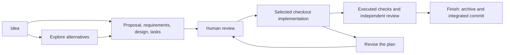

# Projector

Describe a change, review its requirements and design, and let your coding agent carry it through implementation and checks. Projector keeps the plan and the code together when the work changes direction.

Implementation happens in your selected checkout. You can request an isolated worktree when useful. Finish integrates the reviewed code and accepted specifications together while preserving unrelated local work.

## Contents

- [See it in use](#see-it-in-use)
- [How the work moves](#how-the-work-moves)
- [Get started](#get-started)
- [When the plan changes](#when-the-plan-changes)
- [What Projector checks](#what-projector-checks)
- [Documentation](#documentation)
- [Related projects](#related-projects)
- [Development](#development)
- [License](#license)

## See it in use

Your application has a search results list. Mouse selection works, but people using a keyboard cannot move between results. You want arrow keys to move focus and Enter to open the selected result, without stealing keys from the search field.

This is an illustrative conversation. The agent inspects your actual application before choosing files or checks.

```text
You: $projector:propose Add keyboard navigation to search results.
     Arrow keys move between results; Enter opens the focused result.
     Typing in the search field must keep working.

Agent: The proposal, requirements, design, and tasks are ready to review.
       They cover focus movement, activation, and input-field boundaries.

You: Keep focus on the last result at the end of the list. Don't wrap.
Agent: Updated the requirement and design. The tasks now reflect that choice.

You: $projector:apply
Agent: Implementing the reviewed plan in your selected checkout.

You: $projector:finish
Agent: Ran the relevant checks, obtained independent review, and archived
       the change and integrated the result. Here is the commit and what was verified.
```

You review what the feature should do before the agent builds it. If the design changes halfway through, the agent revises the same change and accounts for useful work already present. [More practical stories](docs/examples.md).

## How the work moves



Git checkpoints preserve partial implementation when requirements change. Checks run at coherent checkpoints and cover their stated obligations; independent review examines the target and actual diff. Finish uses temporary isolation for the final commit, runs normal hooks, and preserves unrelated staging and working changes during recoverable installation. [The mental model](docs/overview.md) explains the artifacts and their owners.

## Get started

Install the Projector plugin in Codex. If you have this checkout, ask your agent:

> Install this Projector checkout as a user-level Codex plugin and verify its installed skills and tools.

The agent handles the build and local registration. This repository does not claim a public marketplace listing. [Installation details](docs/getting-started.md#install-the-plugin).

Open the Git repository you want to change. In your agent's chat, use:

```text
$projector:init
$projector:propose Add keyboard navigation to search results.
```

Read the generated plan and request any corrections. When it is ready:

```text
$projector:apply
$projector:finish
```

The agent reports the integrated commit and archive. Use `$projector:merge` for a separately selected source branch. These are skill invocations in chat; internal CLI and MCP tools are described in the [runtime reference](docs/reference/runtime.md).

To authorize planning, implementation, verification, and finish together, say:

> Use Projector to add keyboard navigation. Draft the plan, implement it, run the checks, and finish the change.

Otherwise, planning pauses for your review. Material ambiguities still need a decision. [Your first change](docs/getting-started.md) walks through the full path.

## When the plan changes

| Situation | Skill invocation |
| --- | --- |
| You need to investigate alternatives | `$projector:explore` |
| You are returning after an interruption | `$projector:continue` |
| The requested behavior or design changed | `$projector:revise` |
| You want to inspect drift | `$projector:audit` |
| Existing edits or task status need reconstruction | `$projector:reconcile` |
| A finished branch is ready to integrate | `$projector:merge` |

Projector preserves still-applicable commitments during revision. Task checkboxes describe work performed; they cannot override requirements or substitute for executed evidence. [Workflows](docs/workflows.md) explains the choices.

## What Projector checks

Finish requires current executed evidence and independent review. Revisions can invalidate affected evidence. Interrupted completion resumes from durable state; repeating a settled finish reuses its publication.

Built-in providers cover JavaScript/TypeScript, Markdown, C#, Rust, Python, HTML, CSS, and SCSS, with static Tauri and React Native relationships. Indented Sass, dynamic relationships, and unproven native wiring remain explicit unknowns. Every tracked artifact can have ownership, including binary assets. Managed current queries require enrolled, cooperating writers; OpenSpec stores remain outside this workflow. Qualification records establish their stated conditions, not complete understanding of an application. [Limits and evidence](docs/reference/runtime.md).

Projector includes its workflow skills and OpenSpec tooling. You do not need the old OpenSpec plugin alongside it. Existing project instructions can still select another workflow; [adoption guidance](docs/existing-projects.md) explains how to inspect that overlap.

## Documentation

[Documentation home](docs/README.md) routes by what you are trying to do.

- [Getting started](docs/getting-started.md): setup and the first reviewed change.
- [Examples](docs/examples.md): features, revision, existing edits, recovery, and integration.
- [Skill invocations](docs/skills.md): what each skill does and where to invoke it.
- [Reviewing a change](docs/reviewing-a-change.md): assess the plan and the implemented result.
- [Integration](docs/integration.md): integrated finish and merging another source branch.
- [Troubleshooting](docs/troubleshooting.md): failures and concrete next steps.

## Related projects

[Projector 3](https://github.com/OnePersonLabs/projector/tree/v3) centers on persistent accepted project meaning and focused context during ordinary coding. [Kerf](https://github.com/OnePersonLabs/kerf) uses a smaller Markdown concept model with bounded focus and project-defined lenses. This checkout, Projector 4, manages reviewed changes through implementation, verification, and integrated completion. Their artifact formats and workflows differ.

## Development

Use Node 24.19.0 and `npm ci`, then `npm run check`. See [development and local installation](docs/development.md) for packaging and installed-host verification. Contributors can use the [documentation guide](docs/documentation-guide.md) when updating these pages.

## License

[MIT](LICENSE).
