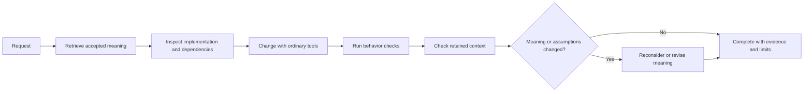

# Projector 3

Projector keeps a project's accepted meaning and the reasons behind it available across code changes and fresh sessions. It connects readable records to source queries and typed relationships, so a changed assumption or a newly relevant consumer can bring an obligation back into view.

The everyday loop is **retrieve meaning → change with Codex → check consequences**. A developer can change implementation with ordinary tools when the intended behavior stays the same. Use `$projector-change` when accepted meaning itself must change.

## Contents

- [A work story](#a-work-story)
- [How the loop works](#how-the-loop-works)
- [Install and start](#install-and-start)
- [What Projector checks](#what-projector-checks)
- [The model and data boundary](#the-model-and-data-boundary)
- [Documentation](#documentation)
- [Related projects](#related-projects)
- [Develop Projector](#develop-projector)
- [License](#license)

## A work story

Imagine a reconnect delivers the same replay event twice. In a fresh session, the developer wants to fix duplicate handling without changing the accepted replay behavior.

> **You:** Use `$projector` to trace why a replay event with the same delivery ID is ignored after reconnect, then help me fix the bug without changing that behavior.
>
> **Codex:** Projector found the replay requirement, its scenario, and the reason duplicate delivery IDs stay idempotent. Here is the retained context and the source query that selected the consumer. I will inspect the producer and persistence path, then make a code change that preserves this behavior.
>
> **You:** The patch looks right. What did you check?
>
> **Codex:** The replay behavior check now covers the reconnect and duplicate delivery. The retained context check found the same assumption and consumer set, so I left accepted meaning unchanged.

The context restores the decision and its reasoning. The behavior test supplies evidence for the changed path; neither result proves that every replay edge case has been covered.

## How the loop works

The diagram shows two different kinds of work. Ordinary implementation changes can preserve accepted meaning. A changed assumption, obligation, relationship, or intended behavior needs reconsideration; `$projector-change` handles an accepted revision. A context check reports evidence and uncertainty, while behavior checks establish only the behavior they actually exercise.

## Install and start

This checkout registers the Codex plugin as `projector-v3@projector-v3`, with the display name **Projector V3**, to distinguish it from the older `../projector` checkout. The CLI command, `$projector` skills, and `.projector/` model paths retain their existing names.

Install **Projector V3** (`projector-v3@projector-v3`) from this repository's marketplace and use Node 24 or later. The shipping plugin at `plugins/projector-v3` includes its compiled runtime; installation requires no build, `pnpm install`, or dependency download. For a local checkout, register the repository with `codex plugin marketplace add <checkout-path>`, then run `codex plugin add projector-v3@projector-v3`. The plugin's skills invoke `node <plugin>/scripts/projector.mjs`; the bare `projector` command requires the separately packaged CLI on the host `PATH`.

Contributors run `pnpm install` and `pnpm plugin:prepare-local` after runtime changes. That command stages the plugin under `.build/local-marketplace/plugins/projector-v3` and updates the shipping runtime under `plugins/projector-v3/runtime`. Include that generated runtime with the source change so GitHub installations receive the current code. `.build/` remains ignored by Git.

Ask Codex: “Use `$projector` to understand this project and help me make this change.” Installation alone does not activate a repository. Use `$projector` to retrieve context from an active `.projector/` model. Use `$projector-change` when the requested work changes intended behavior or architecture.

To activate Projector in a repository, ask Codex to use `$projector` to initialize it. Read [Getting started](docs/getting-started.md) for setup and the first complete task.

## What Projector checks

A context packet includes selected accepted meaning and reports what it omitted or could not inspect. Typed relationships and source-query membership help find consequences beyond the edited file. Reconciliation distinguishes stale assumptions, new query members, observed violations, and unavailable evidence. These outcomes require different responses.

A successful Projector operation does not establish that the design is complete or that code behaves correctly. Use `$projector-review` on a consequential candidate diff to trace producers, persistence, consumers, registrations, and tests, and to try concrete failure cases. Run the relevant application checks as well. Application-specific observations come from a host-supplied interface; a hash proves matching data, not that a claim is true.

## The model and data boundary

Start with [.projector/README.md](.projector/README.md), the index for Projector's own accepted model. Concepts, requirements, scenarios, concerns, decisions, and rationale use readable Markdown records with TOML metadata. Relations and executable policies use TOML. Each fact has one authored source, and a record's stable identity is independent of its filename.

Commit the canonical model and configuration. Runtime receipts, retained contexts, and recovery journals live under `.projector/runtime/`. Preserve unfinished recovery evidence. Projector 3 supports one artifact format; an older repository needs a checked cutover. Projector does not provide an automatic chain of format migrations.

## Documentation

Start at the [documentation home](docs/README.md). It routes readers to the first-use guide, practical examples, workflows, concepts, skill invocations, CLI reference, troubleshooting, and development guidance. The [model and context guide](docs/model-and-context.md) explains what is canonical and how retrieved context relates to it.

## Related projects

[Projector 4](https://github.com/OnePersonLabs/projector/tree/v4) manages a reviewed change from proposal through isolated implementation and integration. [Kerf](https://github.com/OnePersonLabs/kerf) provides a smaller workflow around readable project concepts, bounded focus, and evidence checks.

## Develop Projector

Use the package manager declared by the workspace for developer installs. `pnpm build` compiles the packages. `pnpm verify` runs type checks, tests, package boundary checks, and the advisory prose check. `pnpm release:check` exercises the installed distribution in a fresh repository. See [Development](docs/development.md) before changing Projector itself.

## License

See [LICENSE](LICENSE).
