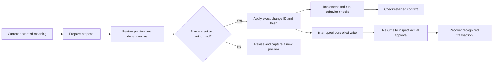

# Changing accepted meaning

Use `$projector-change` when the project intends to change a requirement, scenario, concept boundary, architectural decision, or rationale that governs future work. A code edit that preserves intended behavior does not itself require a canonical change.

## Contents

- [Resolve the owner first](#resolve-the-owner-first)
- [Prepare and review a proposal](#prepare-and-review-a-proposal)
- [Apply only the reviewed plan](#apply-only-the-reviewed-plan)
- [Realize and check the meaning](#realize-and-check-the-meaning)
- [Conditional architectural reasoning](#conditional-architectural-reasoning)
- [Interrupted writes](#interrupted-writes)

## Resolve the owner first

Retrieve the relevant current context with `$projector`. Inspect exact record IDs, related obligations, nearby concepts, and lineage where applicable. Similar wording is a candidate for reuse, not proof of semantic identity. State why an existing record owns the changed meaning or what distinct boundary a new record will own.

## Prepare and review a proposal

The change skill writes a proposal that validates against the generated `change-proposal.schema.json`. The proposal captures intended canonical mutations and any authorized implementation patch or validation definitions supported by that workflow.

For a model-only proposal, leave code edits and executable tests empty. A model acceptance establishes the obligation; it does not prove that an implementation satisfies it.

Capture a preview with `projector accept proposal.json --context <context ID> --request "reason"`. Review the before-and-after meaning, record identities, affected obligations, scope, assumptions, relationships, and blocking questions. Ask for a decision when evidence cannot settle a material choice.

## Apply only the reviewed plan



The reviewed hash binds apply to one plan. Resume only inspects; explicit recovery repairs a recognized interrupted write and does not reapply the proposal. A stale preview returns to capture and review.

When the preview is correct and authorized, apply its exact change ID and hash:

```sh
projector accept --apply <change ID> --hash <reviewed hash>
```

Projector checks live dependencies and applies the reviewed plan. If the proposal, scope, or dependencies changed, capture and review a fresh preview. Approval does not transfer to a replacement plan.

## Realize and check the meaning

After the canonical change, make the authorized implementation edits with ordinary tools. Run relevant behavior checks and check the retained context. Add a useful scenario, relationship, selector, or rationale if implementation work discovers a durable obligation.

## Conditional architectural reasoning

When a decision depends on conditions, retain the assumptions, alternatives, consequences, and the event that should trigger reconsideration. A deferral preserves the options and states what remains prohibited and when to revisit. It does not accept the deferred choice.

## Interrupted writes

Use `projector resume <approval ID>` to inspect an interrupted transaction. If the journal is recognized and recovery is authorized, use `projector recover <approval ID>`. Recovery restores consistency; it does not reapply the change. Preserve ambiguous or unrecognized journals for investigation.

Continue with [Review, reconcile, and recover](review-reconcile-recover.md) or see the [CLI reference](reference/cli.md).
