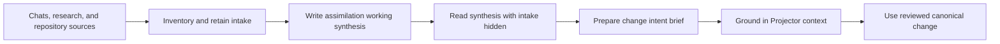

# Examples

Each example follows a task from its trigger through review and outcome. IDs and project details below are illustrative; use the IDs returned by the active repository.

## Contents

- [Return to a behavior after a fresh session](#return-to-a-behavior-after-a-fresh-session)
- [Change code while keeping accepted behavior](#change-code-while-keeping-accepted-behavior)
- [Revise an accepted requirement](#revise-an-accepted-requirement)
- [Reconcile a new consumer after a pull](#reconcile-a-new-consumer-after-a-pull)
- [Review a consequential change](#review-a-consequential-change)
- [Audit observed coverage](#audit-observed-coverage)
- [Recover an interrupted controlled write](#recover-an-interrupted-controlled-write)
- [Assimilate a large source pile](#assimilate-a-large-source-pile)

## Return to a behavior after a fresh session

A reconnect delivers the same replay event twice. In a fresh session, the developer wants to fix duplicate handling without changing the accepted idempotency behavior.

> **You:** Use `$projector` to retrieve the replay contract for duplicate delivery IDs. Help me fix the reconnect bug while preserving the contract.
>
> **Agent:** The context includes the idempotency requirement, its observable scenario, the rationale, and the query that found the event consumer. I will inspect the delivery path and persistence behavior before editing.
>
> **You:** The patch looks good. Did this change the accepted behavior?
>
> **Agent:** The replay behavior check covers the duplicate reconnect, and the context check found no changed assumption or consumer. I kept the model as it was.

The agent retains the context ID and reports its checks. The context restores prior reasoning; it does not prove every replay path is correct.

## Change code while keeping accepted behavior

A developer replaces a database adapter while keeping the accepted retry behavior. They ask `$projector` for the retry obligation, inspect the current call path, make the authorized code change, and run retry behavior checks. They then run `projector check <context ID>`; Projector preserves conclusions whose dependencies did not change and reports any changed dependencies for review. A code refactor alone does not require a model revision. If the intended retry behavior changes, use `$projector-change` first.

## Revise an accepted requirement

The accepted requirement permits one retry. Product has decided that retries may continue until a deadline, and implementation has not started.

> **You:** Use `$projector-change` to bound retries by a deadline. Keep the existing identity if it still owns this behavior.
>
> **Agent:** I found the retry requirement and its scenarios. The identity still owns this boundary. Here is a proposal that revises the requirement and updates the timeout scenario.
>
> **You:** The limit and timeout case match the decision. Apply this reviewed proposal.
>
> **Agent:** The preview is bound to change ID `<change ID>` and hash `<reviewed hash>`. I will apply those exact values, then implement the accepted behavior and run the timeout and retry checks.

The canonical change happens before implementation because intended behavior changed. A stale dependency requires a new preview; an accepted requirement alone does not prove the deadline works.

## Reconcile a new consumer after a pull

A pull adds a reporting package that reads a field previously treated as internal. The retained source query now returns a new consumer.

> **You:** Use `$projector-reconcile` against this pull. Does the new reader change the accepted stability promise?
>
> **Agent:** The consumer exists, but the current requirement does not promise this field to external clients. The pull changes the assumption about internal use; it does not by itself violate accepted meaning. I will trace the reader and report that evidence before recommending a model change.
>
> **You:** Keep the field internal for now and remove the new read.
>
> **Agent:** I will make that repair under the existing meaning, rerun the affected checks, and reconcile the retained context.

If the maintainer instead decides to promise the field to reporting consumers, use `$projector-change` to accept that intent. Observed code does not automatically become canonical intent.

## Review a consequential change

A candidate change updates persistence and a public event consumed by several packages. The maintainer asks `$projector-review` to inspect the actual diff. The reviewer reads accepted meaning and current code, follows producers through persistence and consumers, checks registrations and tests, then tries concrete counterexamples. The maintainer reviews each finding by obligation, trigger, observable consequence, and repair; demonstrated violations remain separate from changed assumptions or unavailable evidence. After an authorized repair, reconcile the affected context and rerun checks whose dependencies changed. Review confidence and self-authored tests do not establish universal conformance.

## Audit observed coverage

Before planning a broad implementation repair, a maintainer wants to see the evidence Projector can currently observe.

```text
projector audit --scope src/payments
projector audit --scope src/payments --question-offset 20
```

The report shows evidence status, open questions, unsupported or unavailable coverage, and the repair routes that are available. It leaves source and canonical records unchanged, though operational observation artifacts may be created. The maintainer uses focused context or exact record inspection to understand a question, then chooses an available route and audits again after the resulting work. The report is not a completeness percentage or a behavioral certificate.

## Recover an interrupted controlled write

An apply stops after writing part of a controlled transaction. The operation result supplies an approval ID.

> **You:** Inspect approval `<approval ID>` and tell me whether Projector recognizes the interrupted write.
>
> **Agent:** `projector resume <approval ID>` shows the retained journal and recovery state. Resume did not change the canonical model or renew approval.
>
> **You:** Recovery is authorized. Restore a consistent state, but do not reapply the proposal.
>
> **Agent:** I will run `projector recover <approval ID>` and inspect the outcome. If the change is still needed, I will capture a fresh preview for review.

Recovery repairs a recognized transaction; it does not retry the old plan. Preserve an ambiguous journal for investigation. Never guess an ID or hand-edit recovery evidence.

## Assimilate a large source pile

A long-running design effort spans branchy chats, transcripts, research, and an existing repository. The user asks `$projector-assimilate` to preserve the useful mechanisms and prepare a change brief. Assimilation inventories the sources, records inspected and unavailable material, separates shared ancestry from independent branches, and maintains an `.assimilate/` index, topic notes, intake, and frontier. The integrator reads the synthesis with intake hidden and checks it against commitments, corrections, minority ideas, and unresolved gaps. When a candidate is mature, the agent grounds the brief in current Projector meaning before entering `$projector-change`. Assimilation notes keep separate identities and authority; a readable synthesis does not prove source fidelity.



Assimilation first owns its source coverage and working synthesis. Only a mature candidate crosses into Projector, where current meaning, identity, and any canonical change are reviewed through the existing workflow.

Continue with [Workflows](workflows.md), [Changing accepted meaning](changing-accepted-meaning.md), or [Review, reconcile, and recover](review-reconcile-recover.md).
