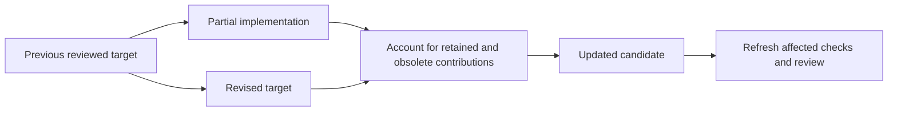

# Practical stories

These illustrative conversations show what to ask for, what to review, and where the result lives. Agent responses describe expected workflow behavior, not transcripts of measured runs. Your agent chooses checks and implementation from your actual repository.

## Contents

- [A contained feature](#a-contained-feature)
- [An uncertain idea](#an-uncertain-idea)
- [Revise after implementation starts](#revise-after-implementation-starts)
- [Capture existing edits](#capture-existing-edits)
- [Resume an interrupted finish](#resume-an-interrupted-finish)
- [Integrate with a conflict](#integrate-with-a-conflict)

## A contained feature

Your results list already supports mouse selection. You want keyboard navigation with a clear boundary rule.

```text
You: $projector:propose Add arrow-key movement and Enter activation
     to search results. Keep normal typing in the search field.
     Focus stays at the boundary instead of wrapping.

Agent: I inspected focus ownership and the current result rendering.
       The plan names the list as the navigation owner and preserves
       the search field's input behavior. Here are the artifacts.
```

Read the proposal and deltas. Check what happens for an empty list, an updated result set, and a removed focused result. Ask for the behavior that matters in your application before approving.

```text
You: If the focused result disappears, move focus to the first result.
     Update the plan, then implement it and finish.

Agent: Revised the requirements and design, implemented the candidate,
       and ran the relevant behavior checks. Independent review
       examined the diff and focus registration.
       Finish integrated the reviewed commit and archived the change; here is the report.
```

The selected branch now contains the reviewed implementation and accepted authority together. The finish report should identify actual checks and remaining limits, not merely say “all tasks complete.”

## An uncertain idea

You see focus jumping during filtering but do not know whether the cause is state ownership or rendering.

```text
You: $projector:explore Search-result focus jumps when filtering.
     Investigate result identities and compare the practical fixes.

Agent: I traced the focused identity and list update path.
       Here are the observed causes, alternatives, and consequences.

You: Use stable result identity. Propose that change.
```

Exploration can reveal that no implementation change is needed, or that a smaller fix satisfies the request. It produces a recommendation without starting an artifact or candidate lifecycle on its own. When you request the proposal, the agent carries forward those findings.

Review the resulting behavior and design, then use apply and finish as in the first story. See [workflows](workflows.md#explore-before-proposing).

## Revise after implementation starts

The first design wraps at the ends of the list. Partway through implementation, you decide this is confusing in a long results list.

```text
You: $projector:revise Remove wrapping. Keep the existing activation
     behavior and the tests for search-field typing.

Agent: I compared the revised target with the previous one.
       Activation and input boundaries remain.
       The wrapping contribution must be removed; useful focus
       ownership stays. Affected evidence needs refresh.

You: Continue implementation and finish the revised change.
```

A changed task alone would not establish the new boundary behavior. The agent revises requirements and designs first, then accounts for the actual partial implementation. Shared files can retain useful contributions while obsolete behavior is removed.



The previous target remains the comparison basis. Reconciliation uses both the new intent and the real implementation so that still-valid behavior is preserved and superseded contributions remain visible until resolved. [Revisions and recovery](revisions-and-recovery.md) explains stale evidence and interrupted work.

## Capture existing edits

You prototyped keyboard behavior before adopting Projector. Search-list edits are mixed with unrelated analytics work.

```text
You: $projector:reconcile Capture the keyboard-navigation edits.
     Include the search component, its styles, and its interaction tests.
     Leave analytics outside this change.

Agent: I inspected staged, unstaged, and untracked work.
       Here is the selected patch and reconstructed intent.
       One edit changes the behavior at the last result; is that intended?
```

Resolve genuine intent ambiguity. The agent writes a historical reconstruction of the proposal and deltas rather than assuming every observed behavior is desirable.

The selected patch stays in the enrolled checkout by default. Explicit isolated mode imports only selected paths or hunks, preserving source content and index. Checks and review cover the actual result; previous successes are reusable only when their inputs and environment match. Review the inclusion report, then request finish to integrate it.

If only task status is wrong, specify that:

```text
$projector:reconcile Correct the task list for keyboard-navigation
against the actual candidate. Do not reconstruct a new change.
```

The task-only route checks performed work, leaves unverified work unchecked, and routes changed intent through revision.

## Resume an interrupted finish

Your session ends while completion is materializing or archiving the candidate.

```text
You: $projector:continue Resume keyboard-navigation.

Agent: I recovered the original target, candidate, and completion state.
       Here are the remaining obligations and bookkeeping steps.
```

Prior authorization to finish survives interruption. The agent resumes the same prepared change instead of creating another candidate. If the exact archive and publication already exist, it completes remaining bookkeeping and checks settled finish as a no-op.

If the selected target moved or unexpected edits appeared, the agent preserves work and reports the mismatch. A request to continue does not authorize overwriting a different result or accepting an unreviewed new target.

For a proposal that was never approved, continue can advance drafting but still respects its review frontier. See [revisions and recovery](revisions-and-recovery.md#resume).

## Integrate with a conflict

The candidate uses Enter to open a focused result. While it was being built, the working branch changed the same event registration for another interaction.

```text
You: Use $projector:merge to integrate the selected feature branch
     into my current working branch.

Agent: I pinned both commits and constructed the merge separately.
       I traced the conflicting registration and both branch intents.
       The code allows two plausible behaviors. Here is the decision
       brief, including callers, checks, and the consequences of each.

You: Preserve Enter activation for results. Keep the new interaction
     restricted to its own control.
```

The agent resolves the specified ownership, checks the complete merge, and obtains independent review. If the attached target remains at the pinned commit and local edits can be preserved without overlap, recoverable publication can land the reviewed integration.

If another process moved that target during review, the agent preserves the integration and reports the drift. It does not silently repin. See [integration](integration.md#when-the-target-moves).

Choose another route through [the skill guide](skills.md), or start a first change with [getting started](getting-started.md).
