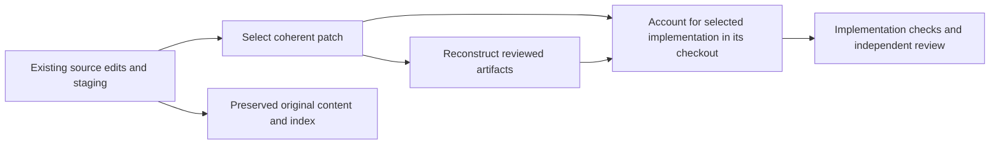

# Using Projector in an existing project

Start with one meaningful change. You do not need to document the entire application before gaining a reviewed plan and candidate.

## Already using OpenSpec

Run `$projector:init`. The agent inspects configuration, requirements, active changes, schemas, and archives. Missing scaffolding is added; exact recognized stock schemas upgrade while customizations remain protected. Conflicts are reported before replacement. New Projector changes select `schema: projector`; the existing repository default can remain unchanged.

Choose one active change to adopt. The agent preserves its requirements, nested capability paths, and intent, translates relevant decisions into separate concern design deltas, and reconciles tasks. Material differences are presented for review. Historical archives remain history.

Projector includes its workflow skills and OpenSpec tooling. You do not need `opl-openspec` enabled alongside it. Existing project-local skills and hooks may still select an old workflow. Ask the agent to inspect conflicting activation; initialization does not remove unrelated instructions or other plugins.

Cross-repository OpenSpec stores are outside the local candidate workflow. A store pointer produces an actionable error instead of being ignored or rewritten. Selecting the owning local repository or requesting a separate scoped migration is a decision about authority.

## Already have requirements or design notes

Point the agent to the existing documents and describe the change:

```text
Use $projector:propose to add keyboard navigation.
Use our accessibility notes and current search behavior as inputs.
Explain any disagreement before treating it as an accepted requirement.
```

The agent inspects current source and documents to establish what is accepted, proposed, or merely observed. It expresses the selected outcome in the owning requirement and concern design artifacts. A link to an old note cannot replace necessary meaning in the reviewed target.

Review the resulting boundaries and choices. Importing documentation does not by itself verify application behavior.

## Already wrote the code

Invoke `$projector:reconcile` and identify the edits to capture:

```text
$projector:reconcile Capture the keyboard-navigation prototype.
Include the list component and interaction tests.
Keep the unrelated analytics changes outside the candidate.
```

The agent examines staged, unstaged, and untracked work and selects one coherent patch. It reconstructs requirements and design from the observed implementation while distinguishing inferred intent from established behavior.



In default checkout mode, existing edits stay where they are; do not import the patch over itself. Explicit isolated mode imports only selected paths or hunks and preserves source files and index. Final publication includes only the selected result, preserving unrelated work. Previous test results can be reused only when their actual inputs and environment still match; a matching filename or location is insufficient.

Ask for finish after reviewing the inclusion and verification report if you want completion.

## Tasks are out of date

For a task-only request:

```text
$projector:reconcile Compare keyboard-navigation tasks with the
actual candidate. Correct status and infer missing work.
```

The agent distinguishes existing implementation, stale tasks, and missing work. It leaves unverified work unchecked. Task text proposing a behavior change must be reconciled with requirements and design through revision.

This route does not reconstruct a new patch merely because a checkbox is inaccurate.

## Next steps

[Review the plan](reviewing-a-change.md), [resume or revise](revisions-and-recovery.md), or follow the [existing-edits story](examples.md#capture-existing-edits). Runtime qualification and unsupported source behavior are in the [reference](reference/runtime.md).
