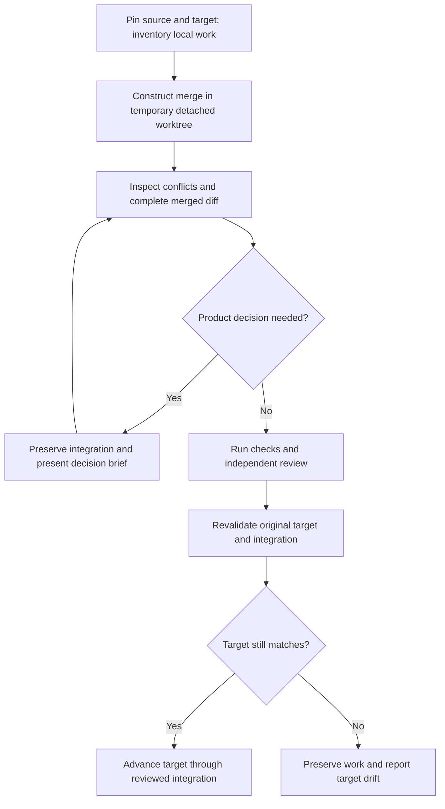

# Integrated finish and branch merges

Finish integrates the selected change into your working branch, including accepted specifications and the archive. Use `$projector:merge` when you want to bring another source branch into that branch.

## Before you start

Name the source branch you want to merge. The target must be attached and free of another Git operation. Unrelated staged, unstaged, and untracked work can remain; Projector preserves it, including disjoint edits within a shared file. Actual overlaps need reconciliation.

A typical request is:

```text
Use $projector:merge to integrate the keyboard-navigation feature
branch into my current working branch.
```

If several branches could match, identify the one you want. The agent does not select a moving remote ref or fetch a different result unless you request that update.

## What happens



The merged result stays in temporary isolation while conflicts, checks, hooks, and review are handled. Publication checks the pinned target and prepares residual staging and working changes. Target drift or actual overlap preserves the reviewed integration for scoped recovery; unrelated dirty files do not require a clean checkout.

The source commit becomes a parent of the integration merge commit. The shared publication helpers conditionally advance the target and install the prepared index and files using a recovery journal. The commit lands atomically; installation across files is recoverable rather than atomic. The [runtime reference](reference/runtime.md) and packaged merge skill contain the exact procedure.

## When a conflict needs you

Suppose your working branch changed keyboard shortcuts to use Space for activation while the candidate uses Enter. A textual conflict may have several plausible resolutions. The agent traces both branch intents, callers, tests, requirements, and designs before choosing.

When evidence supports one coherent resolution, it can resolve the conflict within the request. When behavior or ownership remains ambiguous, you receive one decision brief containing the affected behavior, both intents, available choices, consequences, and uncertainty.

Respond with the behavior you want preserved. The original target stays unchanged while that decision is unresolved. A confident guess is not a supported resolution.

## When the target moves

If another process commits on the original branch during review, the agent reports the old and current basis and preserves the temporary integration. It does not silently rebuild its authority around the new target.

Settle concurrent work and request the scoped recovery described in the report. The agent inspects retained state and determines which checks and review need refresh.

## Completion and rejection

If the source is already an ancestor of the target, the skill reports a verified no-op. After successful publication, it verifies the result, preserved local changes, and source ancestry, then removes its exact temporary detached worktree.

A deliberate rejection of the entire integration can leave the target unchanged and remove only the identified temporary integration after verifying its identity. An unresolved conflict or target drift preserves it instead.

A merge does not deploy the application or publish a release. Those need their own request.

See [the integration story](examples.md#integrate-with-a-conflict) and [troubleshooting](troubleshooting.md).
