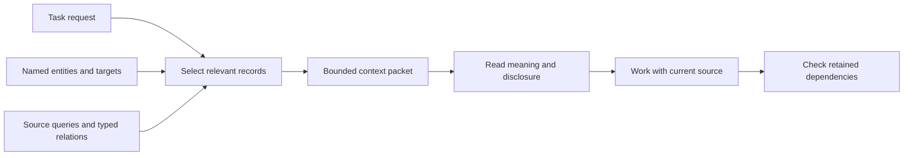

# Model and context

This guide explains where accepted meaning lives, how Projector gives records stable identities, and what a retrieved context can establish.

## Contents

- [Start from the model index](#start-from-the-model-index)
- [Authoring and identity](#authoring-and-identity)
- [How context is selected](#how-context-is-selected)
- [Checking a retained context](#checking-a-retained-context)
- [Format boundary](#format-boundary)

## Start from the model index

The target repository's `.projector/README.md` is its human entry point and record index. It links to the actual concepts, requirements, scenarios, decisions, concerns, authority records, relations, and lenses. Read the records that govern the task rather than copying their inventory into another document.

Canonical records and configuration are project data and should be reviewed and versioned with the repository. Runtime receipts, retained contexts, and recovery journals live below `.projector/runtime/`; use `projector inspect <ID>` when you need retained execution detail. Preserve unfinished recovery evidence.

## Authoring and identity

Canonical prose uses Markdown with TOML metadata. Relations and executable policies use TOML. Each fact has one authored source; hashes and projections are derived. A stable record identity lives inside its record and does not depend on its filename. Use its exact ID when referring to it in proposals and retrieval.

Do not infer equivalence from similar phrases. To revise meaning, inspect candidate records and nearby owners, then state why an existing identity owns the revised meaning or why a new identity has a distinct boundary. A split, merge, or retirement needs explicit lineage.

## How context is selected

The request, exact records, source queries, and typed relations contribute to selection. The bounded packet reports selected meaning and disclosure; the reader must inspect omissions and unknowns before relying on a conclusion.

The context request states the work outcome. Add `--entity ID` for exact known records and `--target path` for known source locations when useful. Projector uses the request, named entities and targets, source-query results, and typed relationships to select applicable meaning under a context budget.

Read the full selected sections. Pay attention to assumptions, rationale, open questions, omitted material, unavailable observations, and source-query disclosure. A retrieval candidate does not prove identity or applicability. If an obligation is omitted or a query remains open, focus the retrieval or inspect the record before relying on the packet.

The human view connects records to their selection reasons, relevance bands and
uncertainty. It combines repeated references across interpretation branches.
The compact view shows up to two selection reasons per record and reports any
additional reasons. Its `projector inspect` route opens the exact retained
evidence, including the full selection paths. A required expansion names a
focused context command; that command observes current state and produces a new
context. `context --full` exposes the full current response within transport
limits. Neither route changes accepted meaning.

## Checking a retained context

After implementation and behavior checks, use `projector check <context ID>`. Projector rechecks retained dependencies and query membership. A report may preserve unaffected conclusions while identifying a changed assumption, newly discovered consumer, observed violation, or unavailable evidence.

Treat these as distinct findings. A changed hash may reflect a harmless edit. A new consumer may warrant impact analysis without violating an existing requirement. An unavailable source leaves a gap; it is not evidence of absence. A successful operation does not prove completeness or correct behavior.

## Persistent observation reuse

Completed observations, query results and disposable contexts use a cache outside
the checkout, keyed by its physical identity. Git remains the source for
committed trees, index membership, history and ignore rules. An existing
Watchman daemon can supply a complete change feed across processes. Configure
both `PROJECTOR_WATCHMAN_EXECUTABLE` with its absolute executable path and
`PROJECTOR_WATCHMAN_SOCKET` with the existing daemon's socket or Windows pipe.
Projector starts bounded clients. It does not install or start the daemon.

The first observation performs complete enrollment. Supported subsequent changes
update addressed source, graph, membership and dependency records. Scoped context
workers receive a generation-bound descriptor and read the required records.
Complete empty query results remain dependencies. Ordinary context reconciliation
reports changes to retained scope; it does not invent a prior planning prediction.

Fresh clocks, changed configuration, changed hosts, incomplete feed coverage or
watch warnings require explicit discovery. Unsupported structural or global
analysis changes also rebuild. Changes during collection reject the state proof;
cancellation and admission failure preserve the last completed generation. With
neither host variable set, the full observation path applies. A partially
configured or unavailable host produces an actionable error.

Cache state is disposable. Accepted meaning, approvals, lifecycle journals and
durable execution evidence keep their own owners. See
[local verification](local-verification.md) for cache locations and the supported
delta/rebuild boundary. Tested scoped reuse does not prove locality for every
repository shape or every rebuild.

## Format boundary

Projector 3 supports one authored artifact format. An older project requires an explicitly checked cutover to this format. The current release does not automatically migrate a chain of older formats. Keep the old data intact until the target format and its meaning have been reviewed; use the format decision linked from the model index for the exact migration boundary.

Continue with [Concepts](concepts.md), [Changing accepted meaning](changing-accepted-meaning.md), or the [CLI reference](reference/cli.md).
