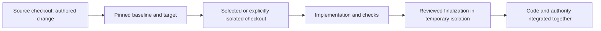

# How Projector fits together

Projector gives a change two things that chat alone loses easily: a durable statement of the intended result, and a recoverable path from that statement to checked code. The agent interprets your request; the deterministic runtime keeps the selected target, candidate, and evidence tied to one another.

## Contents

- [Requirements describe behavior](#requirements-describe-behavior)
- [Designs explain ownership and choices](#designs-explain-ownership-and-choices)
- [A change proposes a new target](#a-change-proposes-a-new-target)
- [The candidate holds implementation](#the-candidate-holds-implementation)
- [Evidence belongs to a particular result](#evidence-belongs-to-a-particular-result)
- [Finish and integration](#finish-and-integration)
- [What this costs](#what-this-costs)

## Requirements describe behavior

Accepted requirements live under `openspec/specs/`, organized by capability. They state observable behavior and scenarios. A search-navigation requirement might say that Arrow Down moves to the next result and Enter activates the focused result. It should also describe what happens at the end of the list.

A change contains requirement deltas: additions, modifications, removals, or renames. The agent carries forward every surviving scenario when it modifies a requirement. You review the intended behavior; you do not fill in templates.

## Designs explain ownership and choices

Accepted concern designs live separately under `openspec/designs/`. They explain which implementation owns a responsibility, why a decision was chosen, and which alternative was considered. Nested concerns can describe smaller responsibilities inside a larger design.

A design links a requirement to the actual responsible code through applicability selectors and realization bindings. For search navigation, the results list might own focus movement while the search field keeps text-input keys. That boundary belongs in the design because a later refactor needs to preserve it.

A prose note saying “test keyboard navigation” is an intention to gather evidence. It is not an executed test result.

## A change proposes a new target

A change has a named directory under `openspec/changes/`. Its proposal states the outcome and impact; nested requirement and design deltas define the target; tasks describe the work needed to reach it.

```text
openspec/
  specs/                         accepted requirements
  designs/                       accepted concern designs
  changes/
    keyboard-navigation/
      .openspec.yaml             selects the projector schema
      proposal.md
      specs/search/spec.md       requirement delta
      designs/search/design.md   design delta
      tasks.md
```

This is an illustrative layout. Capability and concern paths follow your project. The agent authors the exact schema fields and references from the installed templates.

Tasks name concrete work for this change, including specific verification outcomes where useful. Shared procedure belongs in skills, not a mandatory rubric in every task list. Tasks can be reordered or clarified without silently changing a requirement or decision. Use `$projector:revise` when behavior or architecture changes. Legitimate refactors can retain existing authority without fabricating new specification or design deltas.

## The candidate holds implementation

Preparing a change pins its Git baseline and proposed target and enrolls the selected checkout. Optional isolated mode allocates a separate worktree; an already selected worktree does not require another one.



The active change owns proposed artifacts. Implementation normally stays in the same selected checkout. In isolated mode, reconcile divergent artifact edits before either copy overwrites the other. Git checkpoints preserve partial work across requirement revisions. Finish integrates the reviewed code and accepted authority into the selected branch.

Managed source observation requires cooperating edits through acknowledged batches. When an unobserved write occurs, currentness becomes unavailable until an independent checkpoint establishes the new boundary. Exact historical revision reads remain a separate operation. The [runtime reference](reference/runtime.md) describes this protocol.

## Evidence belongs to a particular result

Executed checks have an input basis and an explicit scope. Independent review examines the actual diff, current requirements and design, retained contributions, and a credible simpler alternative.

A revision can change check inputs. Refresh affected successes when those inputs change; checkbox and result-bookkeeping edits do not automatically rerun application checks. Plan/review identity remains separate. Failed, intended-red, diagnostic, and superseded results stay in history without authorizing completion. A checkbox, passing build, or positive review sentence alone does not establish behavior.

Projector reports unknowns when supported observation cannot establish a relationship. An empty query still depends on the population it searched; a newly added consumer can change the result.

## Finish and integration

Finish assembles selected implementation, accepted authority, and archive in a temporary detached worktree. It creates the commit through normal hooks and checks the actual result. The code and specifications land in one commit; journaled checkout/index installation preserves unrelated changes and can recover after interruption. Repeated settled finish reuses that publication.

Use the merge skill for another selected source branch. It constructs and reviews the integration in temporary isolation and uses the same recoverable publication path. Actual overlapping edits and target movement need reconciliation; unrelated dirty files do not require a clean-checkout ceremony.

[Reviewing a change](reviewing-a-change.md) explains your review points. [Integration](integration.md) covers conflicts and target movement.

## What this costs

There are artifacts to maintain, a candidate to inspect, and checks to run. That cost pays off when the request has meaningful behavior, architecture choices, or a likelihood of revision. A tiny edit may have little to gain from the full lifecycle.

Built-in providers add C#, Rust, Python, HTML, CSS, SCSS, and static Tauri/React Native relationships to the existing JavaScript/TypeScript and Markdown behavior. Dynamic cases, indented Sass semantics, and unproven native wiring remain explicit limits. See [runtime limits](reference/runtime.md), then try the [first-change guide](getting-started.md) or a [worked story](examples.md).
