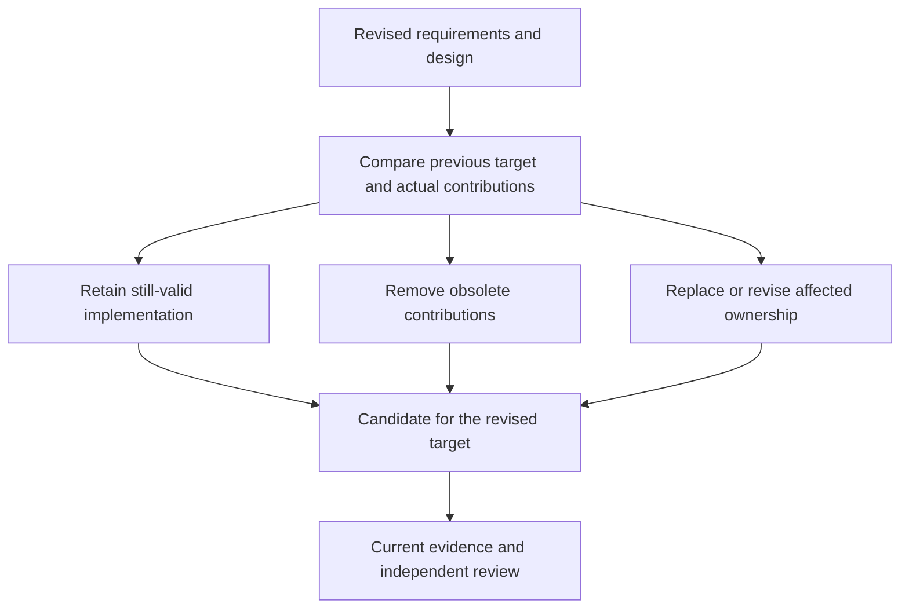
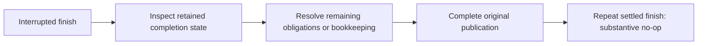

# Revisions and recovery

A change can outlive its first design and its first chat session. Projector retains the target and implementation accounting so the agent can resume the same work with the current intent.

## Contents

- [Change direction](#change-direction)
- [Account for partial implementation](#account-for-partial-implementation)
- [Refresh evidence](#refresh-evidence)
- [Resume](#resume)
- [Recover interrupted completion](#recover-interrupted-completion)
- [When references moved](#when-references-moved)

## Change direction

Use `$projector:revise` with the new behavior and any commitments that must survive:

```text
$projector:revise Keep focus at the search-list boundary instead of
wrapping. Preserve Enter activation and normal search-field typing.
```

The agent compares the revised plan with the previous one, updates requirements and design, and adjusts tasks. A scheduling edit can reorder work. A behavioral edit needs an amendment to its owning artifacts.

Valid work remains available. A revision does not imply that every previous choice or completed task should be discarded.

## Account for partial implementation

The agent examines what exists before selecting retain, remove, replace, or revise dispositions. A shared file may contain both useful ownership and an obsolete strategy. File-level deletion alone would lose the useful part.



Contribution accounting makes the effect of revision explicit. It preserves justified implementation while leaving obsolete routes as obligations until they are resolved.

In isolated mode, conflicting source and candidate artifact edits must be reconciled before either copy overwrites the other. Checkout mode has one artifact source. The agent preserves both requests and classifies their meaning rather than silently choosing the last edited file.

## Refresh evidence

Changed requirements, design, source, tests, or relevant configuration can invalidate affected checks. Task completion markers and recorded results do not automatically rerun application tests; substantive task edits need reconciliation. Check-input identity is separate from plan/review identity. The agent refreshes assurance whose inputs changed and preserves historical failures and successes without treating them as current.

A prior success remains evidence about its prior inputs. It cannot authorize finish for a different result. Failed checks need a causal repair or a precise blocker.

## Resume

Use `$projector:continue`, naming the change when several could match:

```text
$projector:continue Resume keyboard-navigation.
```

The agent reads artifacts and durable state, discovers the original candidate, and identifies the next authorized action. That may be drafting, review, implementation, evidence, or completion recovery.

Existing authorization survives interruption. Time elapsed does not approve an unreviewed proposal or new scope. If the work was planning-only, continue respects that frontier.

## Recover interrupted completion

Projector recognizes the existing archive and publication and resumes journaled bookkeeping or checkout/index installation. Its private Git-directory state and active artifact mirror preserve recovery identity. Unexpected edits remain visible; recovery does not overwrite them or allocate a replacement checkout merely because the session ended.



The state inspection determines what remains. The diagram describes recovery of the same target; it does not grant permission to overwrite a moved branch.

If hooks changed the finalized tree or its checks failed, the agent can explicitly reconcile the retained implementation delta back into the selected checkout. Recovery reopens implementation and clears finalization seals and review while retaining history. Repair and refresh affected checks and independent review before finishing again. Unexpected user edits and real conflicts remain visible.

The finish report includes the integrated commit, archive, actual results, and preserved local work. Repeating settled finish reuses the publication without a substantive document or code change.

## When references moved

A moved target, unexpected edit, or mismatched authority is reported and preserved. Ask the agent to explain the precise drift, retained work, and scoped recovery before continuing.

Integration has its own retained state and target checks. If the working branch moves during merge review, follow [integration recovery](integration.md#when-the-target-moves).

Use [troubleshooting](troubleshooting.md) for a reported error, or [the revision story](examples.md#revise-after-implementation-starts) to see the path in conversation.
