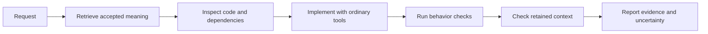

# Workflows

Choose the workflow by the kind of work. The first path is the normal one; the others handle a change to meaning, a consequential review, an external change, or a large evidence set.

## Contents

- [Routine implementation](#routine-implementation)
- [Change accepted meaning](#change-accepted-meaning)
- [Review a consequential diff](#review-a-consequential-diff)
- [Reconcile outside changes](#reconcile-outside-changes)
- [Assimilate source material](#assimilate-source-material)
- [When the tool is unavailable](#when-the-tool-is-unavailable)

## Routine implementation

The loop keeps meaning retrieval, implementation, behavioral evidence, and currentness review as separate steps. A changed assumption or new consumer leads to investigation; it does not automatically mean the code violates an obligation.

1. Use `$projector` to retrieve meaning for the requested outcome. Include known entity IDs or source paths when helpful.
2. Read the selected records, rationale, typed relationships, evidence, disclosure, and open questions. Retrieve focused context or inspect exact IDs when an item is missing or ambiguous.
3. Inspect implementation and consumers. Make the authorized change with ordinary tools.
4. Run relevant behavior checks.
5. Run `projector check <context ID>` and review changed assumptions, new query members, violations, and unavailable observations.
6. Report the obligations checked, the concrete behavior evidence, and remaining uncertainty.

Keep the context ID. After a session reset, use `projector resume <actual context ID>` to inspect whether its retained conclusions still apply.

## Change accepted meaning

Use `$projector-change` when intended behavior, a governing constraint, an architectural boundary, or an accepted rationale changes. Retrieve current identities first. Prepare a proposal with the current schema, capture a preview, review the exact changed meaning and impact, and apply only the reviewed change ID and hash. Then realize the intent in code and run behavior checks.

See [Changing accepted meaning](changing-accepted-meaning.md) for identity, preview, and stale-plan handling.

## Review a consequential diff

Use `$projector-review` when a change crosses important boundaries or a user asks for a project-aware review. The reviewer needs the actual candidate diff. Trace affected responsibilities through producer, persistence, consumers, registrations, and tests. Try concrete counterexamples and report demonstrated violations separately from changed assumptions and missing evidence.

## Reconcile outside changes

Use `$projector-reconcile` after a pull, direct edit, changed assumption, or other change outside an existing Projector plan. Set the comparison basis to the named commit range, actual diff, or retained context. Without an anchor, inspect the current diff and retrieve fresh context rather than inventing prior intent.

## Assimilate source material

Use `$projector-assimilate` for large, branching, or long-running source intake. Keep intake and synthesis in a distinct `.assimilate/` workspace. When a mature idea crosses into canonical project meaning, ground it in current Projector context and hand it through `$projector-change`.

## When the tool is unavailable

Read the canonical Markdown under `.projector/` directly and state which assurance is unavailable. Do not treat a direct read as a completed context retrieval or currentness check. Continue only within the user's authorization and available evidence.

Continue with [Skills](skills.md), [Examples](examples.md), or [Review, reconcile, and recover](review-reconcile-recover.md).
