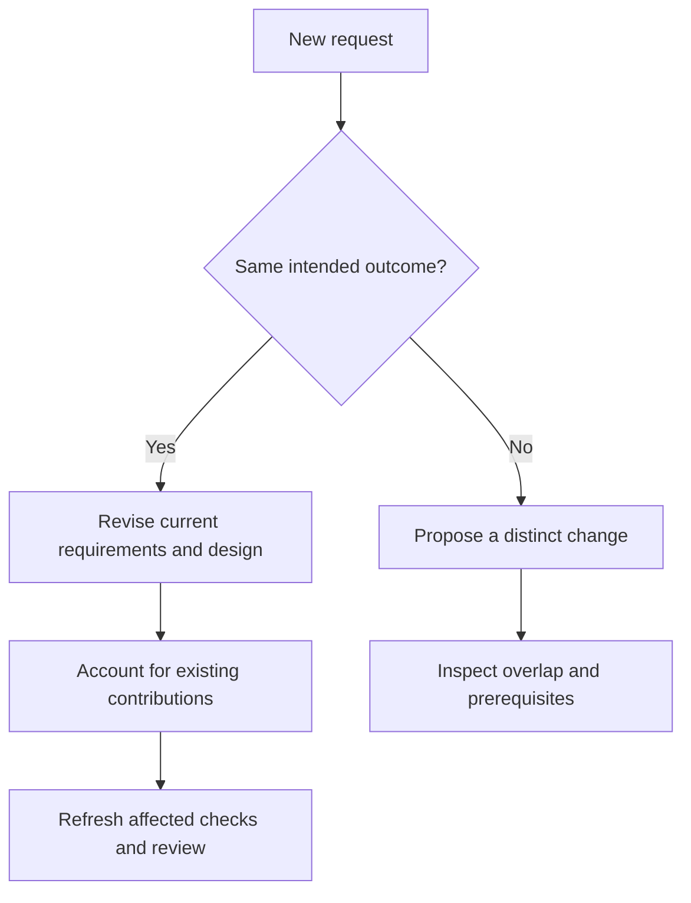

# Choosing a workflow

Start with the outcome you need. Skill invocations are actions requested in chat; the agent handles their artifacts and runtime operations.

## Contents

- [Choose the next action](#choose-the-next-action)
- [Explore before proposing](#explore-before-proposing)
- [Review incrementally](#review-incrementally)
- [Authorize the whole run](#authorize-the-whole-run)
- [Revise or start another change](#revise-or-start-another-change)
- [Sync without finishing](#sync-without-finishing)
- [Finish several changes](#finish-several-changes)
- [Audit or reconcile](#audit-or-reconcile)
- [Integrate a finished branch](#integrate-a-finished-branch)

## Choose the next action

| Situation | Use |
| --- | --- |
| Set up or adopt a repository | `$projector:init` |
| Investigate an idea or problem | `$projector:explore` |
| Draft a plan | `$projector:propose` |
| Advance incomplete drafting or resume work | `$projector:continue` |
| Change intended behavior or design | `$projector:revise` |
| Implement reviewed work | `$projector:apply` |
| Gather current evidence and independent review | `$projector:verify` |
| Materialize the target in the implementation checkout | `$projector:sync` |
| Verify, archive, and integrate the selected change | `$projector:finish` |
| Assess drift | `$projector:audit` |
| Reconstruct edits or correct task accounting | `$projector:reconcile` |
| Integrate a selected branch | `$projector:merge` |

The [skill guide](skills.md) defines each result and its boundary.

## Explore before proposing

Use exploration when the problem is clear but the solution is not. The agent reads relevant code and accepted artifacts, compares alternatives, and explains consequences.

```text
$projector:explore Focus jumps after filtering search results.
Investigate the cause and compare the smallest practical fixes.
```

Exploration does not author artifacts or implement on its own. Request a proposal when you have chosen the direction.

## Review incrementally

```text
$projector:propose Add keyboard navigation.
Draft one artifact layer at a time for review.
```

The agent authors the next requested planning layer and leaves later layers absent. Continue can advance that frontier. Asking for all remaining planning layers completes the proposal; it does not bypass human review or checks.

This path is useful when a design boundary needs discussion before detailed tasks are written.

## Authorize the whole run

```text
Use Projector to fix duplicate replay. Draft the plan, implement it,
run the checks, and finish the change.
```

This authorizes those stages together. The agent still needs a decision when material intent cannot be inferred. Otherwise, proposal normally ends at review.

Prior authorization survives interruption. Continuing does not infer new scope, integration, deployment, or approval for a proposal that was never accepted.

## Revise or start another change

Revise when the same requested outcome is being refined. For keyboard navigation, changing the boundary from wrapping to staying put revises the current change and its implementation accounting.

Use a separate change for a distinct outcome that deserves its own review and integration. An urgent authentication fix does not need to become another task inside search navigation.



The question is about the outcome and ownership, not how many files changed. Separate changes can still overlap accepted artifacts or depend on one another; inspect those relationships before implementing or finishing them.

## Sync without finishing

Sync makes the exact target requirements and design visible inside the implementation checkout. It does not advance the branch, archive the change, or establish verification.

Use it when you need to inspect candidate authority before completion. After a revision, sync and evidence must refer to the revised target. The agent uses the runtime synchronization owner rather than a separate generic OpenSpec operation.

## Finish several changes

Name the changes, or explicitly request all eligible changes. The agent inspects prerequisites and overlapping requirements or designs, then reports completed and blocked changes individually.

A dependent change needs a baseline that contains its prerequisite result. A published sibling candidate is not automatically part of that baseline. Bulk finish cannot silently merge branches or repin a prepared dependent candidate.

If completion is blocked, identify the required integration or revision from the report. Preserve prepared work instead of treating “finish all” as permission to rewrite its basis.

## Audit or reconcile

Audit assesses a fixed revision, selected change, or candidate for mismatches between requirements, design, tasks, code, and evidence. It reports confirmed findings separately from unverified claims. Fixes require the scope that authorizes them.

Reconcile has two uses: correct task accounting from actual work, or reconstruct a selected existing patch into a coherent change. Task checkboxes never substitute for evidence or amend a requirement. [Existing projects](existing-projects.md) explains the patch route.

## Integrate a finished branch

Use merge for another selected source branch. The original target must be attached and free of another Git operation; unrelated dirty work is preserved. The agent pins both commits, constructs an isolated merge, runs checks, and obtains independent adversarial review.

Supported conflicts can be resolved from repository evidence. A remaining product choice comes back as a self-contained brief. Target movement preserves the integration rather than silently changing the reviewed basis.

Continue with [integration](integration.md), [revisions and recovery](revisions-and-recovery.md), or a [practical story](examples.md).
