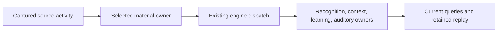

# Applying Projector to a change

Projector preserves what a system must do, why it matters, and where implementation and evidence bear on that meaning. Use it to make the next decision without reconstructing the full history. The working loop is: recover relevant meaning, predict consequences, implement, compare actual effects, reconcile, and retain useful learning. Code remains revisable; an implementation discovery can justify an explicit meaning decision.

This procedure belongs to the selected workflow skill. Use existing plans and checkpoints for task-specific decisions. Do not copy the procedure into each task or require a new artifact for routine work. Helpers are optional; their [request contracts](guide.md) define what they can establish.

## Recover the governing meaning

Start with the requested observable outcome. Read applicable Concept sections, conditions, reasons, exceptions, decisions, and assumptions that would reopen those decisions. Requirements in the body remain authoritative without frontmatter condition IDs. A summary points to that authority; it cannot discard a condition because a shorter packet is convenient.

Use each artifact for its actual purpose:

| Artifact | What it contributes | What it does not establish |
| --- | --- | --- |
| Concept | Accepted meaning, reasons, conditions, examples, exceptions | That current code satisfies the meaning |
| Typed Relation | Why another subject may constrain or depend on this one | That an observed connection is an accepted obligation |
| Projection Unit | A current implementation location selected by a Lens | That every symbol in the file realizes the Concept |
| Lens | An intended population and optional condition-specific observations/checks | Complete discovery or whole-application correctness |
| Pattern Candidate | A reusable explanation, alternatives, counterexamples, and applicability | Authority from repetition or from its own generated repairs |
| Checkpoint | Active decisions, ownership, evidence pointers, and recovery state | Replacement authority or permission to replay uncertain mutations |

Follow relevant upstream constraints and downstream consequences. `focus.related` offers pointers, including outgoing Relation endpoints from selected records. It does not collect records solely because their Relations target a selected Concept, and it is not a transitive impact closure.

When incoming constraints or dependents matter, search authored meaning for the exact selected identity. For example, from the project root:

```text
rg -n -F -g '*.md' -g '!**/archive/**' 'clip' .projector/meaning
```

Read the matched records' frontmatter. Keep only relevant Relations whose `target` is the selected ID; other mentions are leads, not edges. Read each Relation's `type`, `status`, source record, and governing prose. Preserve `observed` versus `accepted`. Follow another endpoint only when it can change the current decision. Native search is discovery, not proof that all semantic relationships are modeled.

## Connect the changed rule to its consumers

Use the current Lens population as a starting map. Check whether the change affects identity, ownership, lifetime, state transitions, shared contracts, storage/replay, eligibility, concurrency, or a public interaction. If it does, trace the affected rule from its source of truth through actual dispatch and relevant consumers. Include unchanged consumers when their assumptions change.

Before accepting that design, make these answers inspectable in the existing plan or checkpoint when the work needs retained reasoning:

- Which condition or authoritative prose governs the changed rule, and why?
- Which owner produces the relevant state? Which consumers rely on it?
- Which normal, correction/removal, failure, or reconstruction transition can invalidate the design?
- What must change, what must remain, and what evidence supports those boundaries?
- Which evidence is still applicable? Which uncertainty must be resolved before dependent work?

Use a small table when it helps explain the relationships. A file list alone cannot answer them. Do not inventory every cache or failure mode in the repository; inspect state and transitions affected by this rule. A consumer excluded from changes needs a reason grounded in its contract, not merely an unchanged filename.

Choose discovery for a concrete question. Direct source, imports, registrations, dispatches, and native checks often suffice. Use a configured semantic provider when aliases, indirect calls, or repeated textual search leave consequential uncertainty. Trace explicit messages and composition across language or platform seams that the provider cannot resolve. An LSP reference gives scoped navigation; it does not infer lifecycle meaning. The current LSP adapter supports symbols, definitions, references, and diagnostics, not call hierarchy.

Name the observation boundary and expand it only when a returned participant or concrete gap requires it. Keep incomplete provider coverage and currentness explicit while retaining independent source and Git findings. Do not install providers or request an implicit global index to satisfy this procedure.

Stop discovery when current evidence explains the proposed behavior, relevant transitions, and affected consumer obligations well enough for the next commitment. This does not certify exhaustive discovery. Resolve or withhold an action whose consequential premise remains unknown; continue independent safe work. A navigation-only Lens or an unrelated unknown does not automatically block implementation.

### Choose deterministic discovery for the missing fact

| Question | Useful route | Remaining limit and cost |
| --- | --- | --- |
| Where is this exact protocol name, selector, or registration mentioned? | Native text search or V5 inventory within explicit paths | Cheap leads, including non-code seams; aliases and same-name symbols require further inspection |
| Does this candidate call or callback value refer to the changed owner? | Configured LSP definition at that usage, or the project's compatible language service | Can resolve identity through imports and aliases; requires the actual project configuration |
| Which other usages should I inspect? | Scoped imports, re-exports, registrations, and reference queries | Reference results can stop at renamed bindings; they are leads, not a complete consumer list |
| Where are calls, imports, or registrations with a known syntax shape? | An available language AST or Tree-sitter query | Removes text noise; syntax alone does not resolve cross-file symbol identity or dynamic targets |
| Which callable contains these references? | Inspect returned locations; use a host's call hierarchy when available and applicable | V5's current adapter does not expose call hierarchy; a call graph still does not specify lifetime duties |
| What must a subscriber withdraw after retirement or requalification? | Read its registration, owned state, output queries, and existing behavioral checks | Requires contract reasoning; none of these discovery tools supplies that meaning |

Python, Rust, and TypeScript are peer languages in this procedure. Use compatible native tools for the actual language and project; do not infer equivalent coverage from an LSP connection. [Tree-sitter queries](https://github.com/tree-sitter/tree-sitter/blob/master/docs/src/using-parsers/queries/2-operators.md) can select syntax in all three when suitable grammars are available. Syntax still needs semantic or source-based identity resolution. Adding a parser or provider also adds compatibility, configuration, provenance, failure-handling, and maintenance work.

Use this path for an on-demand V5 LSP observation:

1. Inspect the repository's installed tools and actual project, environment, source membership, and supported operations. Use compatible versions. Do not silently substitute another checkout's compiler, Python environment, or Rust feature/target configuration.
2. Find candidate imports, re-exports, calls, and registrations in the affected scope. Follow observed aliases. Native text search is often sufficient; an available AST or Tree-sitter query can reduce syntax noise. Record exact candidate locations rather than inferring that equal spelling means equal identity.
3. At an ambiguous call or callback value, select `definitions`, its seed file, and zero-based position. Supply the native executable and separate arguments. Run the existing Node `observe` CLI. See the [peer-language setup and requests](guide.md#native-observations-for-python-rust-and-typescript). Compare the returned definition with the changed owner. Use references to discover more candidates, not to declare that no others exist.
4. Where the server requires startup readiness, use its supported configuration or explicit notification contract. The optional V5 gate uses the latest observed status within the caller's budget. A match is not a source-version acknowledgment or proof of complete project analysis. Arbitrary sleeps, successful transport, and empty queries cannot establish absence.
5. Read capabilities, locations, readiness when configured, currentness, and every gap. Trace confirmed consumers through owned state and output/recovery behavior. Follow a stored callback through its registration and dispatch owner; navigation does not determine the final runtime target of an indirect call.
6. Keep relevant project configuration and discovery assumptions with the existing evidence. V5 binds requested and returned source files, not every compiler/environment input. `scope.currentness` concerns captured inputs. Use a separate native snapshot for relevant uncaptured configuration and membership, and verify it before reuse.

V5 starts and closes a language server for each observation. Repeated questions can make startup dominate useful work. Use an existing native language-service session when it is suitable; keep its evidence and coverage explicit. Do not add a persistent service or global index merely to avoid a few focused reads. An existing source-bound index can use V5's `index` provider when its inputs and supported facts are current.

The same scoped example applies in all three languages: a producer is re-exported under one alias, imported as `receive`, then called and stored as a callback. A separate file has an unrelated local `receive`. Native text search for only the producer misses the consumer. Syntax queries find both call shapes. In exercised Python, Rust, and TypeScript examples, definitions at the candidate call, registration, and re-export reached the producer, while the decoy resolved locally. Python and Rust reference sets remained segmented across aliases; one producer-reference query did not find those consumers. The indirect invocation resolved to its stored binding, not a verified runtime callback. These examples establish candidate navigation, not complete discovery or lifecycle correctness.

Across language boundaries, retain an explicit sender, protocol identifier/schema, registration, receiver, and state owner in the existing design or evidence. For example, a TypeScript `nativeInvoke("native_apply_instrument_setup", ...)` reaches a Rust command only through the host's registered command name and receiver. Inspect that registration and receiver, then continue to the host method. Python subprocess/RPC boundaries need the same explicit trace when present. Do not invent a Python participant in a system that has none, or treat separate language-server results as a cross-language edge. No navigation route establishes removal, coverage, replay, or runtime protocol behavior by itself.

Extend a provider only when a concrete repeated question remains costly or unsupported through these routes and the extension can close that gap. Compare supported coverage and setup/maintenance cost; retain unknowns. Do not replace contract reasoning with a larger graph.

## Maintain affected Lenses

The root owns authored meaning and Lens changes unless it assigns the exact surface. Workers return new participants, changed responsibilities, proposed selector/check changes, reasons, and unresolved scope to that owner. Different Unit or Lens IDs do not establish independent ownership of one file, checkpoint, cache baseline, or Git index.

At design time and after actual changes, compare traced participants with the affected Lens population. Inspect a binding when an owner moves, appears, retires, changes responsibility, or gains a consumer. An unchanged consumer can also need inspection when its producer's contract changes.

1. Read the Lens's conditions and intended population. Verify selectors against actual paths. Include unsafe and incomplete realizations; selection must not depend on passing the property being checked.
2. Update affected selectors for the responsibility change. Keep the same Concept and Lens identities when meaning stays the same. File-based Unit bindings are derived; do not create another editable Unit inventory.
3. Review affected condition references, observation requests, check inputs, evidence kind, target, and coverage. A selected new participant cannot inherit an old check's support without evidence that the check covers it. Never use `coverage: selection` merely to silence a gap.
4. Refresh affected bindings with `revisit` when it saves work. Inspect added/removed participants and unresolved selection. A native source check can establish the needed scope without a helper call. If the population cannot be established, retain that unresolved scope and its next decision in the existing checkpoint.
5. Finish known affected Lens updates with the implementation, or state the specific remaining dependency at handoff. Do not claim synchronization from a refreshed cache when the authored selector still omits a known participant.

A correct broad selector may already cover a new realization. Keep the glob when its population is still right; assess the new participant's role and check coverage. Remove a participant because its responsibility ended, not because excluding it hides a mismatch.

Attach or revise repeatable checks when they provide useful evidence for the condition. Keep navigation-only Lenses when that is their useful role; `checks: []` supplies no behavioral support. Do not create a permanent test for every prose requirement or store transient absolute probe paths as durable checks. One-time native evidence can remain linked with its checked source, target, and limits. State which acceptance obligations remain outside helper receipts.

## Execute with shared ownership

Give a worker the governing meaning pointers, changed contract, settled shared interfaces, actual consumers, write boundary, and required evidence. Include what must remain valid. The worker returns unexpected dependencies rather than extending its write scope. The root integrates the full consumer path; separate component passes do not multiply into application acceptance.

Use the existing producer and repair paths. Do not add a second scheduler or invalidation registry merely to coordinate this work. Keep the complete intended outcome visible while finishing connected behavior. Explain its ownership, main flow, and consequential failure behavior through clear interfaces and nearby reasons, then demonstrate the affected behavior in its real consumer under existing verification rules.

## Compare results and reassess the premise

Compare actual effects with the governing meaning and pre-change account. Preserve original mismatch evidence before altering code, selection, checks, or meaning. Distinguish four causes:

| Cause | Appropriate response |
| --- | --- |
| Realization violates accepted meaning | Repair its responsible implementation and affected consumers |
| Selection or binding is incomplete/stale | Correct the affected population and inspect newly exposed obligations |
| Observation or check does not establish its claim | Repair the evidence mechanism and retain the original discrepancy |
| Accepted meaning conflicts or needs revision | Return the specific meaning decision through the authorized path |

Manual repairs can change symptoms while preserving one faulty ownership premise. When successive patches expose that pattern, pause dependent repairs and trace the connected rule before another patch. Preserve useful work and competing explanations. Change the approach at its owner. Retain the existing automatic-repair stop rules; this procedure adds no counter or guard.

Reuse evidence within its actual condition, source, membership, configuration, provider/check revision, execution target, and observation kind. Static shape does not prove runtime delivery or timing. An unavailable observation leaves its claim unresolved; it does not erase independent support.

V5 receipts bind whole relevant meaning and Lens records plus declared check inputs and execution dependencies. They can invalidate more broadly than an exact semantic dependency engine. Do not label a stale receipt current or silently backdate it. Independently recorded native evidence can still be reused when its applicability is established and disclosed separately. Do not rerun a broad suite solely to make a status table green.

## Worked connected change

A music application combines physical MPE member channels into one declared musical stream. Original per-channel facts remain authoritative. A selected occurrence supplies recognition and learning. The new selection can change membership or disappear after correction.

The useful trace is:



The planner must determine what the new ownership means at those consumers:

| Changed rule | Consequence to resolve before dependent work |
| --- | --- |
| Correction merges two four-note selections into one | Retire the removed selected owner from active outputs, reverse membership, pending work, and learned measurements; preserve all original notes and withdrawal history. Inspect each directly subscribed owner. |
| Raw sources and selected occurrences have different identities | Preserve ensemble observations owned by raw sources. A blanket purge would delete valid evidence. |
| Coverage or presentation changes qualification without changing selected notes | Preserve that invalidation path when optimizing changed-content dispatch. Equal note content does not establish equal eligibility. |
| Completed occurrences should stay stable on ordinary append | Reprocess actual changed dependencies; allow explicit correction to revisit retained material. Compare the same input and actual ingest consumer. |
| Replay reconstructs selection and interpretation | Compare the resulting current interpretations and contributions, not only raw bytes or a successful restore. |

This trace determines what a test must distinguish. It does not prescribe a new lifecycle bus or universal cache cleanup. Use existing dispatch, owner reconciliation, and publication where their contracts fit.

The same directive includes instrument settings. Governing prose says a chromatic grid defaults to 8x8 and remembered ports remain editable. Turn those into real interactions: create a grid without touching its layout, and edit or clear an offline remembered binding. Listing the settings file or reading only the Concept's frontmatter would miss the obligations.

Keep physical hardware, native lifecycle, acoustic output, and timing claims within their actual evidence. Host software checks cannot qualify them.

## Routine changes and useful reuse

For an explanatory button-label edit whose action, state, ownership, persistence, and accessibility meaning stay unchanged, inspect current context and make the edit. Use the existing appropriate rendered check when required. No new Concept, Lens, provider query, consumer inventory, checkpoint, or permanent test is needed. If the label changes the action promised to the user, inspect that interaction contract.

For a new exporter already matched by a correct `src/export/*.mjs` selector, preserve the glob. Refresh membership when using the helper and inspect whether the existing check covers the new behavior. Preserve current evidence for unaffected participants; keep uncovered behavior unresolved. No new Concept is needed merely because there is a new file.

Retain a current participant trace until relevant source, responsibilities, membership, or governing meaning changes. Do not repeat discovery solely because another prompt arrived or a different agent resumed. Read relevant fields from saved results instead of copying source inventories and hashes into every packet.

## Retain learning and hand off

When a discovery changes where future work should look, update the existing Lens, Relation, or Concept that owns it. Preserve observed-versus-accepted status. Retain a Pattern Candidate only when its explanation could guide plausible future work; include alternatives, counterexamples, and reopening assumptions. Do not promote a repaired incident into a universal rule or retain a permanent symptom catalogue.

Keep one concise active checkpoint with decisions, ownership, unresolved scope, evidence pointers, and next actions. Distill routing and completed status more freely than authority. Preserve conditions, reasons, exceptions, unresolved choices, and recovery evidence. Closing work or changing implementation history does not authorize erasing accepted meaning.

A useful handoff identifies the integrated behavior and actual diff/commit, maintained bindings, current evidence and limits, remaining decisions, and ownership. For plugin work, distinguish source changes, installed bundles, and session-loaded guidance. A source edit does not hot-reload an existing session.

Instruction delivery, link checks, and deterministic helper tests establish their stated contracts. They do not prove agent compliance, user understanding, fewer repairs, or token savings. Retain only decision-relevant friction during ordinary authorized use. Reopen this procedure when concrete experience exposes a missing decision or excessive cost; do not add a global audit or AI trial without authorization.
